

# Universidad Peruana De Ciencias Aplicadas

## Ingeniería de Software

### Informe de Trabajo Final

### Aplicaciones Web

**Sección:** 
4364

**Profesor:**  

Sánchez Ponce, Alex Humberto

**Integrantes:**

    <ul>
        <li>Peralta Chipa Ronald Joel - U202224619</li>
        <li>Bustamante Leveau Cameron Charlotte - U20231A804</li>
        <li>Lapa de la Cruz Gabriel Omar - U202216831</li>
        <li>Urrutia Peña Jasmin Adriana - U202310008</li>
        <li>otro companiero</li>
    </ul>

**2025 - 01**

---

# **Registro de Versiones del Informe**

| Versión | Fecha      | Autor                          | Descripción de modificación      |
|---------|------------|--------------------------------|----------------------------------|
| TB1     | 26/01/2025 | Ronald Joel Peralta Chipa      | (Descripción de los cambios)     |
| TB2     |            |                                |                                  |
| TB3     |            |                                |                                  |

# **Project Report Collaboration Insights**

# **Contenido**

### Tabla de contenidos

- [**Registro de Versiones del Informe**](#registro-de-versiones-del-informe)
- [**Project Report Collaboration Insights**](#project-report-collaboration-insights)
- [**Contenido**](#contenido)
  - [Tabla de contenidos](#tabla-de-contenidos)
- [**Student Outcome**](#student-outcome)
- [ **Capítulo I: Introducción** ](#-capítulo-i-introducción-)
  - [**1.1. Startup Profile**](#11-startup-profile)
    - [**1.1.1. Descripción de la Startup**](#111-descripción-de-la-startup)
    - [**1.1.2. Perfiles de integrantes del equipo**](#112-perfiles-de-integrantes-del-equipo)
  - [**1.2. Solution Profile**](#12-solution-profile)
    - [**1.2.1 Antecedentes y problemática**](#121-antecedentes-y-problemática)
    - [What (¿Qué?)](#what-qué)
    - [Who (¿Quién?)](#who-quién)
    - [Where (¿Dónde?)](#where-dónde)
    - [When (¿Cuándo?)](#when-cuándo)
    - [Why (¿Por qué?)](#why-por-qué)
    - [How (¿Cómo?)](#how-cómo)
    - [How much (¿Cuánto?)](#how-much-cuánto)
    - [**1.2.2 Lean UX Process**](#122-lean-ux-process)
    - [**1.2.2.1. Lean UX Problem Statements**](#1221-lean-ux-problem-statements)
    - [**1.2.2.2. Lean UX Assumptions**](#1222-lean-ux-assumptions)
    - [**1.2.2.3. Lean UX Hypothesis Statements**](#1223-lean-ux-hypothesis-statements)
    - [**1.2.2.4. Lean UX Canvas**](#1224-lean-ux-canvas)
  - [**1.3. Segmentos objetivo**](#13-segmentos-objetivo)
- [ **Capítulo II: Requirements Elicitation \& Analysis**](#-capítulo-ii-requirements-elicitation--analysis)
  - [**2.1. Competidores**](#21-competidores)
    - [**2.1.1. Análisis competitivo**](#211-análisis-competitivo)
    - [**2.1.2. Estrategias y tácticas frente a competidores**](#212-estrategias-y-tácticas-frente-a-competidores)
  - [**2.2. Entrevistas**](#22-entrevistas)
    - [**2.2.1. Diseño de entrevistas**](#221-diseño-de-entrevistas)
    - [**2.2.2. Registro de entrevistas**](#222-registro-de-entrevistas)
    - [**2.2.3. Análisis de entrevistas**](#223-análisis-de-entrevistas)
  - [**2.3. Needfinding**](#23-needfinding)
    - [**2.3.1. User Personas**](#231-user-personas)
    - [**2.3.2. User Task Matrix**](#232-user-task-matrix)
    - [**2.3.3. User Journey Mapping**](#233-user-journey-mapping)
    - [**2.3.4. Empathy Mapping**](#234-empathy-mapping)
    - [**2.3.5. As-is Scenario Mapping**](#235-as-is-scenario-mapping)
  - [**2.4. Ubiquitous Language**](#24-ubiquitous-language)
- [ **Capítulo III: Requirements Specification**](#-capítulo-iii-requirements-specification)
  - [**3.1. To-Be Scenario Mapping**](#31-to-be-scenario-mapping)
  - [**3.2. User Stories**](#32-user-stories)
  - [**3.3. Impact Mapping**](#33-impact-mapping)
  - [**3.4. Product Backlog**](#34-product-backlog)
- [**Capítulo IV: Product Design**](#capítulo-iv-product-design)
  - [**4.1. Style Guidelines**](#41-style-guidelines)
    - [**4.1.1. General Style Guidelines**](#411-general-style-guidelines)
    - [**4.1.2. Web Style Guidelines**](#412-web-style-guidelines)
  - [**4.2. Information Architecture**](#42-information-architecture)
    - [**4.2.1. Organization Systems**](#421-organization-systems)
    - [**4.2.2. Labeling Systems**](#422-labeling-systems)
    - [**4.2.3. SEO Tags and Meta Tags**](#423-seo-tags-and-meta-tags)
    - [**4.2.4. Searching Systems**](#424-searching-systems)
    - [**4.2.5. Navigation Systems**](#425-navigation-systems)
  - [**4.3. Landing Page UI Design**](#43-landing-page-ui-design)
    - [**4.3.1. Landing Page Wireframe**](#431-landing-page-wireframe)
    - [**4.3.2. Landing Page Mock-up**](#432-landing-page-mock-up)
  - [**4.4. Web Applications UX/UI Design**](#44-web-applications-uxui-design)
    - [**4.4.1. Web Applications Wireframes**](#441-web-applications-wireframes)
    - [**4.4.2. Web Applications Wireflow Diagrams**](#442-web-applications-wireflow-diagrams)
    - [**4.4.3. Web Applications Mock-ups**](#443-web-applications-mock-ups)
    - [**4.4.4. Web Applications User Flow Diagrams**](#444-web-applications-user-flow-diagrams)
  - [**4.5. Web Applications Prototyping**](#45-web-applications-prototyping)
  - [**4.6. Domain-Driven Software Architecture**](#46-domain-driven-software-architecture)
    - [**4.6.1. Software Architecture Context Diagram**](#461-software-architecture-context-diagram)
    - [**4.6.2. Software Architecture Container Diagrams**](#462-software-architecture-container-diagrams)
    - [**4.6.3. Software Architecture Components Diagrams**](#463-software-architecture-components-diagrams)
  - [**4.7. Software Object-Oriented Design**](#47-software-object-oriented-design)
    - [**4.7.1. Class Diagrams**](#471-class-diagrams)
    - [**4.7.2. Class Dictionary**](#472-class-dictionary)
  - [**4.8. Database Design**](#48-database-design)
    - [**4.8.1. Database Diagram**](#481-database-diagram)
- [**Capítulo V: Product Implementation, Validation & Deployment**](#capítulo-v-product-implementation-validation--deployment)
  - [**5.1. Software Configuration Management**](#51-software-configuration-management)
    - [**5.1.1. Software Development Environment Configuration**](#511-software-development-environment-configuration)
    - [**5.1.2. Source Code Management**](#512-source-code-management)
    - [**5.1.3. Source Code Style Guide & Conventions**](#513-source-code-style-guide--conventions)
    - [**5.1.4. Software Deployment Configuration**](#514-software-deployment-configuration)
  - [**5.2. Landing Page, Services & Applications Implementation**](#52-landing-page-services--applications-implementation)
    - [**5.2.1. Sprint 1**](#521-sprint-1)
      - [**5.2.1.1. Sprint Planning 1**](#5211-sprint-planning-1)
      - [**5.2.1.2. Aspect Leaders and Collaborators**](#5212-aspect-leaders-and-collaborators)
      - [**5.2.1.3. Sprint Backlog 1**](#5213-sprint-backlog-1)
      - [**5.2.1.4. Development Evidence for Sprint Review**](#5214-development-evidence-for-sprint-review)
      - [**5.2.1.5. Execution Evidence for Sprint Review**](#5215-execution-evidence-for-sprint-review)
      - [**5.2.1.6. Services Documentation Evidence for Sprint Review**](#5216-services-documentation-evidence-for-sprint-review)
      - [**5.2.1.7. Software Deployment Evidence for Sprint Review**](#5217-software-deployment-evidence-for-sprint-review)
      - [**5.2.1.8. Team Collaboration Insights during Sprint**](#5218-team-collaboration-insights-during-sprint)
    - [**5.2.2. Sprint 2**](#522-sprint-2)
      - [**5.2.2.1. Sprint Planning 2**](#5221-sprint-planning-2)
      - [**5.2.2.2. Aspect Leaders and Collaborators**](#5222-aspect-leaders-and-collaborators)
      - [**5.2.2.3. Sprint Backlog 2**](#5223-sprint-backlog-2)
      - [**5.2.2.4. Development Evidence for Sprint Review**](#5224-development-evidence-for-sprint-review)
      - [**5.2.2.5. Execution Evidence for Sprint Review**](#5225-execution-evidence-for-sprint-review)
      - [**5.2.2.6. Services Documentation Evidence for Sprint Review**](#5226-services-documentation-evidence-for-sprint-review)
      - [**5.2.2.7. Software Deployment Evidence for Sprint Review**](#5227-software-deployment-evidence-for-sprint-review)
      - [**5.2.2.8. Team Collaboration Insights during Sprint**](#5228-team-collaboration-insights-during-sprint)
  - [**5.3. Validation Interviews**](#53-validation-interviews)
    - [**5.3.1. Diseño de Entrevistas**](#531-diseño-de-entrevistas)
    - [**5.3.2. Registro de Entrevistas**](#532-registro-de-entrevistas)
    - [**5.3.3. Evaluaciones según heurísticas**](#533-evaluaciones-según-heurísticas)
   
# **Student Outcome**

#  **Capítulo I: Introducción** 

## **1.1. Startup Profile**
### **1.1.1. Descripción de la Startup**
### **1.1.2. Perfiles de integrantes del equipo**

## **1.2. Solution Profile**
### **1.2.1. Antecedentes y problemática**
### **What (¿Qué?)**
### **Who (¿Quién?)**
### **Where (¿Dónde?)**
### **When (¿Cuándo?)**
### **Why (¿Por qué?)**
### **How (¿Cómo?)**
### **How much (¿Cuánto?)**

### **1.2.2. Lean UX Process**
#### **1.2.2.1. Lean UX Problem Statements**
#### **1.2.2.2. Lean UX Assumptions**
#### **1.2.2.3. Lean UX Hypothesis Statements**
#### **1.2.2.4. Lean UX Canvas**

## **1.3. Segmentos objetivo**

#  **Capítulo II: Requirements Elicitation & Analysis**

## **2.1. Competidores**

A continuación presentamos a nuestros tres principales competidores indirectos:

- **LinkedIn:** es una red social profesional global que combina oportunidades de empleo con funciones de networking, publicaciones y aprendizaje en línea. Si bien permite aplicar a empleos y conectar con reclutadores, su enfoque está más centrado en la visibilidad profesional y no en procesos de selección personalizados o automatizados.

- **Computrabajo:** es una plataforma de búsqueda de empleo muy popular en países de habla hispana. Ofrece publicación de vacantes y filtros por criterios básicos, pero su sistema está enfocado en la gestión tradicional de CVs, sin incluir herramientas modernas como análisis predictivos o evaluaciones interactivas.

- **HireVue:** es una solución empresarial que utiliza inteligencia artificial para realizar entrevistas por video y evaluaciones automatizadas. Su tecnología está orientada a grandes organizaciones y procesos estructurados, pero con una curva de uso más compleja para medianas empresas o postulantes menos familiarizados con herramientas digitales avanzadas.

### **2.1.1. Análisis competitivo**

<TABLE BORDER style="width:100%">
    <tr>
        <th colspan="6">Competitive Analysis Landscape</th>
    </tr>
    <tr>
        <td rowspan="2">
            ¿Por qué llevar a cabo este análisis?
        </td>
        <td colspan="5"> 
        Porque nos permite identificar oportunidades de mejora e innovación frente a soluciones ya conocidas, mejorando nuestra propuesta de valor y diferenciación en el mercado de RRHH.
        </td>
    </tr>
    <tr>
        <td colspan="5">¿Qué aporte de valor podría ofrecer nuestro producto en contraste al resto de competidores?</td>
    </tr>
    <tr>
        <td colspan="2">
            (En la cabecera colocar por cada competidor nombre y logo)
        </td>
        <td>Jobsy</td>
        <td>LinkedIn</td>
        <td>Computrabajo</td>
        <td>HireVue</td>
    </tr>
    <tr>
        <th rowspan="2">Perfil</th>
        <td>Overview</td>
        <td>Plataforma de contratación inteligente que automatiza publicaciones, filtra CVs con IA, y gestiona entrevistas y evaluaciones técnicas.</td>
        <td>Red social profesional que permite publicar empleos, hacer networking y contactar talentos mediante su plataforma.</td>
        <td>Portal web de empleos popular en Latinoamérica, enfocado en la publicación de vacantes y la gestión de postulaciones.</td>
        <td>Plataforma especializada en entrevistas por video y evaluaciones con IA para el reclutamiento empresarial.</td>
    </tr>
    <tr>
        <td>Ventaja competitiva</td>
        <td>Automatización completa, IA para filtrado de CVs, gamificación de habilidades blandas y sistema de referidos.</td>
        <td>Gran red de profesionales, sistema de recomendaciones y validación social de perfiles.</td>
        <td>Alto tráfico en LATAM, facilidad de uso para empresas pequeñas y medianas.</td>
        <td>Evaluación profunda a través de entrevistas estructuradas y algoritmos de IA.</td>
    </tr>
    <tr>
        <th rowspan="2">Perfil de Marketing</th>
        <td>Mercado objetivo</td>
        <td>Empresas medianas y grandes que buscan optimizar procesos de selección. Postulantes que buscan sugerencias inteligentes.</td>
        <td>Profesionales de todas las industrias. Empresas que quieren visibilidad en una red global.</td>
        <td>Empresas en LATAM, especialmente en sectores administrativos, operativos y comerciales.</td>
        <td>Corporaciones que buscan evaluar de forma precisa y digital las habilidades de sus candidatos.</td>
    </tr>
    <tr>
        <td>Estrategias de marketing</td>
        <td>Campañas en LinkedIn y Google Ads, webinars de RRHH, casos de éxito en redes y SEO enfocado en empresas.</td>
        <td>Publicidad integrada en la red, recomendaciones automatizadas y contenido profesional en blog y newsletter.</td>
        <td>Email marketing, presencia en redes sociales y posicionamiento SEO por sectores laborales.</td>
        <td>Marketing B2B en ferias tecnológicas, campañas institucionales y whitepapers.</td>
    </tr>
    <tr>
        <th rowspan="3">Perfil de Producto</th>
        <td>Productos & Servicios</td>
        <td>Publicación automatizada, IA para CVs, entrevistas integradas, gamificación, referidos, y sistema de seguimiento.</td>
        <td>Publicación de empleos, red de contactos, mensajes directos, y validación de experiencia.</td>
        <td>Publicación de empleos, base de datos de candidatos, alertas y filtros de búsqueda.</td>
        <td>Entrevistas por video, análisis emocional, pruebas técnicas, dashboards para RRHH.</td>
    </tr>
    <tr>
        <td>Precios & Costos</td>
        <td>Para usar el servicio, la empresa compra un plan que puede ser mensual o anual.</td>
        <td>Publicación gratuita limitada, opciones de pago según alcance y número de vacantes.</td>
        <td>Planes desde gratuitos hasta paquetes premium por número de vacantes o visibilidad.</td>
        <td>Modelo SaaS por suscripción anual. Planes personalizados para empresas.</td>
    </tr>
    <tr>
        <td>Canales de distribución</td>
        <td>Web y app móvil (iOS y Android).</td>
        <td>Web, app móvil y navegador de escritorio.</td>
        <td>Principalmente web. Tiene versión responsive para móviles.</td>
        <td>Web corporativa y dashboards para empresas.</td>
    </tr>
    <tr>
        <th rowspan="5">Análisis SWOT</th>
        <td colspan="5">Se analiza fortalezas, debilidades, oportunidades y amenazas para entender el posicionamiento estratégico.</td>
    </tr>
    <tr>
        <td>Fortalezas</td>
        <td>Automatización total, análisis con IA, experiencia gamificada para postulantes, integración multiplataforma.</td>
        <td>Gran base de usuarios activos, reputación internacional, funcionalidades sociales profesionales.</td>
        <td>Reconocimiento en LATAM, interfaz sencilla y bajo costo.</td>
        <td>Análisis avanzado, entrevistas estructuradas y uso efectivo de IA.</td>
    </tr>
    <tr>
        <td>Debilidades</td>
        <td>Plataforma nueva en validación de mercado, aún sin posicionamiento fuerte.</td>
        <td>Poca personalización en procesos de selección internos, saturación de contenido.</td>
        <td>Falta de innovación en IA o seguimiento de procesos.</td>
        <td>No incluye publicación de ofertas ni red social, solo entrevistas.</td>
    </tr>
    <tr>
        <td>Oportunidades</td>
        <td>Aliarse con universidades y atraer empresas tecnológicas en crecimiento.</td>
        <td>Monetización de nuevas herramientas premium para empresas.</td>
        <td>Expansión a mercados de habla portuguesa, mejoras con IA.</td>
        <td>Incorporar más idiomas, ampliar herramientas de evaluación gamificada.</td>
    </tr>
    <tr>
        <td>Amenazas</td>
        <td>Competidores consolidados, cambios en políticas de privacidad o laborales.</td>
        <td>Apps más ágiles o disruptivas en el sector laboral.</td>
        <td>Desplazamiento por plataformas más tecnológicas o globales.</td>
        <td>Falta de diferenciación en IA frente a nuevos competidores.</td>
    </tr>
</TABLE>

### **2.1.2. Estrategias y tácticas frente a competidores**

En base al análisis competitivo realizado previamente sobre las plataformas de búsqueda de empleo y conexión laboral, identificamos las principales **fortalezas, debilidades, oportunidades y amenazas** de nuestros competidores. A partir de ello, Jobsy plantea estrategias claras y tácticas aplicables para diferenciarse y destacar en el mercado.

---

* **Afrontando las Fortalezas de los Competidores**

**Fortalezas de la competencia:**
- Amplia base de usuarios y empresas registradas.
- Integración con redes profesionales (como LinkedIn).
- Algoritmos avanzados para recomendación de empleos.

**Fortalezas de Jobsy:**
- Sistema de compatibilidad inteligente entre candidatos y empresas, enfocado en valores y cultura laboral.
- Procesos de aplicación más rápidos y simplificados.
- Comunicación directa entre candidato y reclutador mediante la plataforma.

**Estrategia:**
Ofrecer una experiencia de búsqueda laboral centrada en la compatibilidad cultural y profesional entre usuario y empresa, con procesos ágiles y acompañamiento personalizado.

**Tácticas:**
- Implementar una herramienta de "match cultural" entre empresas y postulantes.
- Permitir feedback directo post-entrevista para mejorar procesos.
- Promover perfiles de empresas con enfoque humano y responsable.

---

* **Aprovechando las Debilidades de los Competidores**

**Debilidades de la competencia:**
- Procesos de aplicación extensos y poco amigables.
- Falta de personalización en las recomendaciones de empleo.
- Escasa retroalimentación a los postulantes.

**Estrategia:**
Optimizar el proceso de búsqueda y postulación con herramientas intuitivas, automatizadas y enfocadas en el usuario.

**Tácticas:**
- Currículum inteligente que se adapta a cada postulación.
- Recomendaciones personalizadas de empleo según habilidades blandas y técnicas.
- Seguimiento automático del estado de postulación.

---

* **Aprovechando las Oportunidades del Mercado**

**Oportunidades actuales:**
- Crecimiento del empleo remoto e híbrido.
- Aumento de personas en búsqueda de su primer empleo o de un cambio laboral con propósito.
- Demanda de plataformas más humanas y transparentes.

**Oportunidades de Jobsy:**
- Posicionar a Jobsy como un puente entre empresas con valores y talentos que buscan propósito.
- Ampliar la oferta de empleos remotos e internacionales.

**Estrategia:**
Convertirse en la plataforma de referencia para empleos que se alineen con valores personales y bienestar laboral.

**Tácticas:**
- Categorías destacadas: empleo remoto, primer empleo, reconversión laboral.
- Test vocacional y de valores para mejorar la recomendación de vacantes.
- Publicidad en redes sociales destacando testimonios reales de éxito.

---

* **Enfrentando las Amenazas del Mercado**

**Amenazas actuales:**
- Plataformas establecidas con fuerte presencia (como Indeed, Computrabajo).
- Aplicaciones móviles muy posicionadas y con alta inversión en publicidad.
- Integraciones con inteligencia artificial generativa en procesos de selección.

**Estrategia:**
Aprovechar la agilidad y el enfoque innovador de Jobsy para adaptarse rápidamente, enfocándose en nichos específicos y experiencias diferenciadas.

**Tácticas:**
- Actualizaciones constantes basadas en feedback del usuario.
- Ofrecer herramientas simples y efectivas para empresas en crecimiento o startups.
- Integración con IA para mejorar el perfilamiento de candidatos y análisis de vacantes.

## **2.2. Entrevistas**
### **2.2.1. Diseño de entrevistas**

#### Entrevista General

  1. ¿Cuál es tu nombre, edad y ocupación actual?
  2. ¿Qué dispositivos usas más para trabajar o buscar empleo?
  3. ¿Qué redes sociales o plataformas usas con frecuencia para temas laborales?

#### Segmento 1: Equipos de Recursos Humanos encargados del proceso de contratación (Empresas)

  1. ¿Con qué frecuencia publican vacantes y qué pasos siguen para hacerlo?
  2. ¿Qué tan útil sería para ti una herramienta que permita publicar automáticamente en varias plataformas?
  3. ¿Cómo gestionan actualmente la recepción y filtrado de CVs, y qué tan efectivo consideras ese proceso?
  4. ¿Han evaluado el uso de inteligencia artificial para mejorar ese filtrado?
  5. ¿Qué criterios específicos te gustaría poder configurar en un sistema para automatizar la selección inicial de candidatos?
  6. ¿Cómo organizan actualmente entrevistas y evaluaciones técnicas o psicométricas?
  7. ¿Usan herramientas digitales para ese proceso o todo se maneja manualmente?
  8. ¿Qué tan importante te parece contar con una plataforma que centralice todo el proceso de contratación?

#### Segmento 2: Postulantes (Candidatos para el empleo)

  1. ¿Qué tipo de empleo estás buscando actualmente y en qué sector?
  2. ¿Qué plataformas o medios digitales utilizas con más frecuencia para encontrar oportunidades laborales?
  3. ¿Has usado alguna vez sistemas que te recomienden trabajos basándose en tu CV? ¿Te resultaron útiles?
  4. ¿Qué parte del proceso de postulación te parece más complicada o frustrante?
  5. ¿Qué tan útil sería para ti recibir sugerencias para mejorar tu CV directamente desde la plataforma?
  6. ¿Qué tan cómodo te sientes realizando entrevistas o evaluaciones técnicas de manera online?
  7. ¿Por qué medio prefieres que te contacten después de postular (correo electrónico, WhatsApp, llamada)?
  8. ¿Te gustaría tener una sección de seguimiento para ver el estado de tus postulaciones dentro de la misma plataforma?

### **2.2.2. Registro de entrevistas**
- **Segmento 1:** Equipos de Recursos Humanos encargados del proceso de contratación

| **Entrevistado 1: Jhul Flores Vayou** |
|------------------------------------------------|
|  |
| Distrito: Surco / Edad: 25 |
| **Entrevistador:** Ronald Joel Peralta Chipa |
| **Link:** [ https://drive.google.com/file/d/1h0NXuCKzm1I-W4wFFfn_yRM43buk1mUu/view?usp=sharing](https://drive.google.com/file/d/1h0NXuCKzm1I-W4wFFfn_yRM43buk1mUu/view?usp=sharing) |
|-Resumen: El entrevistado destaca la importancia de contar con una herramienta que le permita compartir sus ofertas laborales de manera rápida en todos los portales de empleo. Además, reconoce que llevar un registro manual puede resultar frustrante, complicado y riesgoso. Por ello, menciona que sería altamente beneficioso disponer de una plataforma que gestione todo el proceso de publicación y administración de ofertas laborales. Asimismo, subraya la utilidad de integrar inteligencia artificial en el proceso de contratación, específicamente para el filtrado de currículums. Esto les permitiría ahorrar tiempo y enfocarse exclusivamente en seleccionar a los candidatos más talentosos.
|

- **Segmento 2:** Postulantes o candidatos que aplican a las vacantes

| **Entrevistado 1: Jean Fabio Noriega Collado** |
|------------------------------------------------|
|  |
| Distrito: San Miguel / Edad: 18 |
| **Entrevistador:** Jasmin Adriana Urrutia Peña |
| **Link:** [https://youtu.be/dtYSbyE4bsM](https://youtu.be/dtYSbyE4bsM) |
|-Resumen: Jean Fabio es una persona que siente que el proceso de buscar empleo es cansado y frustrante. Él nos comenta que le gusta que nuestra solución automatice tareas tediosas como el filtrado de currículums y la coordinación de entrevistas, lo que le permite concentrarse en evaluar mejor a los postulantes. También resalta que la integración con plataformas como LinkedIn e InfoJobs le parece súper útil, porque le ahorra tiempo al publicar vacantes y mejora la visibilidad de las ofertas. Para él, Jobsy no solo mejora la organización del proceso de selección, sino que además reduce el estrés del equipo y genera una mejor experiencia tanto para el reclutador como para el candidato. En resumen, ve en la app una solución práctica, eficiente y bien pensada para mejorar el proceso de búsqueda de empleo.|

| **Entrevistado 2: Angela Fabiola Ushiñahua Becerra** |
|------------------------------------------------|
|  |
| Distrito: Villa el Salvador / Edad: 24 |
| **Entrevistador:** Gabriel Omar Lapa de la Cruz |
| **Link:** [https://youtu.be/pNCRk7bci4Y](https://youtu.be/pNCRk7bci4Y) |
|-Resumen: Ángela Ushiñahua es una joven marquetera digital que busca oportunidades laborales relacionadas con su carrera, especialmente en análisis de mercado y promoción de marcas. Usa principalmente Computrabajo y Facebook para buscar empleo, aunque comenta que muchas plataformas exigen experiencia laboral, lo cual le resulta frustrante como egresada. Le parece especialmente complicada la parte del CV, ya que muchas veces determina si una persona es considerada o no. Nunca ha usado plataformas que le recomienden trabajos ni que le ayuden a mejorar su currículum, pero le gustaría mucho recibir sugerencias para hacerlo más profesional. También señala que las entrevistas online pueden ser incómodas por problemas de conexión. Valora mucho que la comunicación postulación sea vía WhatsApp y considera esencial contar con un sistema de seguimiento dentro de la plataforma para evitar la incertidumbre de no saber si su postulación fue vista. En general, valora soluciones que le ahorren tiempo, le brinden orientación y le permitan tener mayor control sobre el proceso de postulación.|

| **Entrevistado 3: Alejandra Gallo** |
|------------------------------------------------|
|  |
| Distrito: Santiago de Surco/ Edad: 21 |
| **Entrevistador:** Fabricio Lopez   |
| **Link:** https://drive.google.com/file/d/1bYCCjXe5zIx2SusU0N-t04EQLEkZThsA/view?usp=sharing  |
|-Resumen: Alejandra Gallo identificó que uno de los mayores retos en su búsqueda de prácticas es la falta de una plataforma centralizada que facilite el seguimiento de postulaciones y la gestión de su perfil profesional. Actualmente, se enfrenta a la dificultad de usar varias plataformas dispersas, lo que le genera incertidumbre sobre el estado de sus aplicaciones, dificultando su organización. Además, expresó su deseo de contar con una herramienta que le ayude a mejorar su CV, ofreciendo sugerencias personalizadas para destacarse ante los reclutadores.|

### **2.2.3. Análisis de entrevistas**

## **2.3. Needfinding**
La sección de Needfinding tiene como objetivo identificar las necesidades y problemas específicos de los usuarios que SmartHire pretende resolver. A través de investigaciones y análisis cualitativos y cuantitativos, se detectan oportunidades clave para mejorar la experiencia del usuario, basándose principalmente en entrevistas. Así mismo, se definen los aspectos esenciales que deberán abordarse para lograr una solución efectiva y centrada en el usuario.  
### **2.3.1. User Personas**
A través de un perfil detallado, esta sección explora las características demográficas, necesidades, deseos, comportamientos y problemas específicos de los usuarios de los segmentos objetivos predefinidos, facilitando el diseño de soluciones que se alineen mejor con sus expectativas y desafíos.

- **Segmento 1:** Equipos de Recursos Humanos encargados del proceso de contratación

  
- **Segmento 2:** Postulantes (Candidatos para el empleo)

  
### **2.3.2. User Task Matrix**

En esta sección se detallan las tareas que realizan los usuarios clave de nuestra solución digital “SmartHire”. Se han identificado dos segmentos principales:  
- Segmento 1: Equipos de Recursos Humanos encargados del proceso de contratación

- Segmento 2: Postulantes o candidatos que aplican a las vacantes

Las tareas aquí descritas no dependen exclusivamente del uso del software, ya que representan acciones que los usuarios deben realizar en cualquier proceso de selección, sea manual o automatizado. Para cada tarea, se especifica su frecuencia y nivel de importancia, permitiendo identificar qué funciones son más críticas para cada perfil.

#### 🧑‍💼 User Task Matrix – Reclutador (Equipo de RRHH)

| Tarea                                             | Frecuencia | Importancia |
|--------------------------------------------------|------------|-------------|
| Publicar vacantes en múltiples plataformas       | Diaria     | Alta        |
| Filtrar CVs con IA                               | Diaria     | Alta        |
| Organizar entrevistas con candidatos             | Diaria     | Alta        |
| Programar pruebas técnicas o psicométricas       | Diaria     | Alta        |
| Revisar métricas de rendimiento del proceso      | Semanal    | Media       |
| Gestionar el onboarding de nuevos empleados      | Ocasional  | Alta        |

#### 🙋‍♂️ User Task Matrix – Candidato (Postulante)

| Tarea                                          | Frecuencia | Importancia |
|-----------------------------------------------|------------|-------------|
| Crear y cargar perfil (CV, habilidades)       | Diaria     | Alta        |
| Postularse a vacantes disponibles             | Diaria     | Alta        |
| Realizar pruebas técnicas o psicométricas     | Ocasional  | Alta        |
| Agendar entrevistas                           | Ocasional  | Alta        |
| Ver estado de la postulación                  | Semanal    | Media       |

En el caso del reclutador, las tareas con mayor frecuencia e importancia incluyen la publicación de vacantes, el filtrado de currículums, la organización de entrevistas y la programación de evaluaciones. Estas actividades son operativas, repetitivas y consumen gran parte del tiempo del equipo de RRHH, lo cual refuerza la necesidad de automatizarlas. También destaca la importancia del onboarding, aunque su frecuencia es menor.

En el caso del candidato, las tareas más importantes y frecuentes son la creación del perfil y la postulación a vacantes, lo que demuestra su interés en estar continuamente buscando oportunidades. Las pruebas y entrevistas son menos frecuentes, pero igualmente importantes para su proceso de selección. Consultar el estado de la postulación tiene una frecuencia alta, pero una importancia media, lo que indica que, aunque no sea esencial para avanzar en el proceso, sí influye en su percepción y experiencia.

En resumen, ambos segmentos comparten tareas importantes, como las entrevistas y evaluaciones, pero desde enfoques diferentes. SmartHire busca optimizar precisamente esas intersecciones, automatizando el trabajo operativo para el reclutador y mejorando la experiencia para el candidato.

### **2.3.3. User Journey Mapping**
En esta sección, se presenta el mapa de viaje del usuario para el sistema de selección SmartHire, destacando las interacciones clave del usuario desde la fase de concientización hasta la de recomendación. Se detallan las acciones que realiza el usuario, las experiencias emocionales asociadas en cada etapa y los puntos de contacto clave que facilitan su interacción con el sistema.

- **Segmento 1:** Equipos de Recursos Humanos encargados del proceso de contratación
  
  
- **Segmento 2:** Postulantes o candidatos que aplican a las vacantes
   
  
### **2.3.4. Empathy Mapping**
- **Segmento 1:** Equipos de Recursos Humanos encargados del proceso de contratación
  
- **Segmento 2:** Postulantes o candidatos que aplican a las vacantes
  
### **2.3.5. As-is Scenario Mapping**
El escenario “As-Is” muestra cómo viven actualmente los usuarios el proceso de reclutamiento, antes de implementar la solución digital Jobsy. Refleja los principales problemas, emociones y pensamientos que surgen en cada etapa del proceso.
- **Segmento 1:** Equipos de Recursos Humanos encargados del proceso de contratación
  
- **Segmento 2:** Postulantes o candidatos que aplican a las vacantes
  
## **2.4. Ubiquitous Language**
| Término       | Definición                                                                                                                                     |
|---------------|------------------------------------------------------------------------------------------------------------------------------------------------|
| Vacante       | Oferta laboral publicada por una empresa con los detalles del puesto a cubrir.                                                                |
| Postulante    | Persona que aplica a una vacante mediante el envío de su CV u otros requisitos.                                                              |
| CV            | Curriculum Vitae. Documento que resume la experiencia laboral y académica del postulante.                                                    |
| Contratación  | Proceso final donde se elige y se incorpora al postulante a la empresa.                                                                      |
| IA            | Tecnología integrada en la plataforma que permite automatizar procesos de selección, aplicar filtros inteligentes y mejorar la toma de decisiones con base en datos. |
| HHRR          | Departamento encargado de la gestión del talento humano dentro de una empresa. En Jobsy, son los principales usuarios del sistema para gestionar postulaciones y contrataciones. |

#  **Capítulo III: Requirements Specification**

## **3.1. To-Be Scenario Mapping**
El escenario "To-Be" describe cómo se desarrollarán las experiencias de los usuarios una vez implementada la solución digital **SmartHire**, optimizando los procesos de reclutamiento actuales.

### Segmento 1: Equipos de Recursos Humanos encargados del proceso de contratación

### Segmento 2: Postulantes o candidatos que aplican a las vacantes

## **3.2. User Stories**
| Epic / Story ID | Título | Descripción | Criterios de Aceptación | Relacionado con (Epic ID) |
|----------------|--------|-------------|--------------------------|----------------------------|
| EP001 | Gestión de Vacantes | Epic para crear, editar y cerrar vacantes laborales | | EP001 |
| US001 | Crear nueva vacante | Como reclutador, quiero registrar una nueva vacante para iniciar el proceso de contratación. | **Escenario 1: Creación de vacante desde formulario** • Dado que el reclutador ha iniciado sesión • Cuando completa el formulario de creación • Entonces la vacante se publica correctamente  **Escenario 2: Validación de campos requeridos** • Dado que el reclutador está creando una vacante • Cuando omite un campo obligatorio • Entonces el sistema muestra un mensaje de error y no permite guardar | EP001 |
| US002 | Editar vacante existente | Como reclutador, quiero editar una vacante publicada para actualizar su información. | **Escenario 1: Actualización de datos en vacante activa** • Dado que la vacante está publicada • Cuando el reclutador la edita • Entonces los cambios se guardan y se muestran correctamente  **Escenario 2: Prevención de edición en vacantes cerradas** • Dado que el reclutador accede a una vacante cerrada • Cuando intenta editarla • Entonces el sistema muestra un mensaje indicando que no se puede modificar | EP001 |
| US003 | Cerrar vacante | Como reclutador, quiero cerrar una vacante para detener nuevas postulaciones. | **Escenario 1: Finalización de proceso de selección** • Dado que una vacante está abierta • Cuando el reclutador la cierra • Entonces la vacante ya no acepta postulaciones  **Escenario 2: Confirmación previa al cierre de vacante** • Dado que el reclutador hace clic en cerrar vacante • Cuando el sistema solicita confirmación • Entonces solo se cierra si el reclutador confirma la acción | EP001 |
| EP002 | Gestión de Postulaciones | Epic para gestionar postulaciones de los candidatos | | EP002 |
| US004 | Aplicar a vacante | Como postulante, quiero postularme a una vacante para ser considerado en un proceso de selección. | **Escenario 1: Aplicación del postulante a una oferta** • Dado que el usuario está autenticado • Cuando se postula a una vacante • Entonces recibe confirmación de postulación exitosa  **Escenario 2: Impedir postulación duplicada** • Dado que el usuario ya postuló a una vacante • Cuando intenta postularse nuevamente • Entonces el sistema indica que ya está postulado | EP002 |
| US005 | Ver postulaciones recibidas | Como reclutador, quiero ver las postulaciones recibidas para conocer los candidatos interesados. | **Escenario 1: Consulta de candidatos por vacante** • Dado que el reclutador accede a una vacante • Cuando consulta las postulaciones • Entonces ve una lista con detalles de los postulantes  **Escenario 2: Ordenar postulaciones por fecha** • Dado que el reclutador ve la lista de postulaciones • Cuando selecciona el orden por fecha • Entonces se muestran desde la más reciente a la más antigua | EP002 |
| US006 | Filtrar postulaciones | Como reclutador, quiero filtrar postulaciones por estado para gestionar mejor el proceso. | **Escenario 1: Aplicación de filtro por estado en postulaciones** • Dado que hay múltiples postulaciones • Cuando aplica un filtro por estado • Entonces solo se muestran las que coinciden  **Escenario 2: Filtrado combinado por estado y fecha** • Dado que el reclutador desea refinar resultados • Cuando aplica varios filtros a la vez • Entonces solo se muestran las postulaciones que cumplen todos los filtros | EP002 |
| EP003 | Proceso de Selección | Epic para el seguimiento del proceso de entrevistas y contratación | | EP003 |
| US007 | Agendar entrevista | Como reclutador, quiero agendar entrevistas con postulantes para coordinar el proceso de selección. | **Escenario 1: Programación de entrevistas con candidatos** • Dado que el reclutador ha seleccionado un candidato • Cuando define fecha y hora • Entonces se agenda la entrevista y se notifica al postulante  **Escenario 2: Evitar cruce de entrevistas en calendario** • Dado que hay otra entrevista agendada en el mismo horario • Cuando el reclutador intenta programar una nueva • Entonces el sistema muestra una advertencia y no permite agendar | EP003 |
| US008 | Registrar resultado de entrevista | Como reclutador, quiero registrar los resultados de entrevistas para tomar decisiones basadas en el desempeño. | **Escenario 1: Carga de resultados luego de entrevista** • Dado que la entrevista se ha realizado • Cuando se registran los resultados • Entonces se actualiza el estado del candidato  **Escenario 2: Edición de resultados antes de envío final** • Dado que los resultados aún no han sido enviados al candidato • Cuando el reclutador quiere hacer cambios • Entonces puede modificar la información registrada | EP003 |
| US009 | Enviar oferta laboral | Como reclutador, quiero enviar una oferta laboral al candidato seleccionado para formalizar su contratación. | **Escenario 1: Formalización de propuesta laboral** • Dado que el candidato ha sido elegido • Cuando se completa el formulario de oferta • Entonces se envía al candidato y queda registrada  **Escenario 2: Cancelación de oferta antes del envío** • Dado que el formulario de oferta está en edición • Cuando el reclutador decide no enviarla • Entonces puede cancelar la operación sin guardar cambios | EP003 |
| EP004 | Gestión de Usuarios | Epic para la administración de usuarios en la plataforma | | EP004 |
| US010 | Registrar cuenta de postulante | Como usuario, quiero registrarme como postulante para aplicar a vacantes. | **Escenario 1: Alta de nuevo usuario postulante** • Dado que el usuario accede a la plataforma • Cuando completa el formulario de registro • Entonces se crea su cuenta de postulante  **Escenario 2: Mensaje de error por correo ya registrado** • Dado que el correo ingresado ya existe • Cuando intenta registrarse • Entonces el sistema muestra un mensaje indicando el error | EP004 |
| US011 | Registrar cuenta de reclutador | Como empresa, quiero registrarme para gestionar vacantes laborales. | **Escenario 1: Registro exitoso de empresa reclutadora** • Dado que la empresa accede al sitio • Cuando se completa el registro empresarial • Entonces se crea la cuenta de reclutador  **Escenario 2: Validación de datos de empresa incompletos** • Dado que el formulario de empresa está incompleto • Cuando intenta enviar el registro • Entonces el sistema bloquea el envío y muestra los errores | EP004 |
| US012 | Editar perfil profesional | Como postulante, quiero actualizar mi perfil con experiencia y habilidades para mejorar mis oportunidades. | **Escenario 1: Actualización de perfil profesional por el usuario** • Dado que el usuario accede a su perfil • Cuando edita información personal • Entonces los cambios se guardan correctamente  **Escenario 2: Validación de formato en campos del perfil** • Dado que el usuario ingresa datos incorrectos • Cuando intenta guardar • Entonces el sistema muestra errores de validación | EP004 |
| EP005 | IA y Recomendaciones | Epic para automatizar recomendaciones usando inteligencia artificial | | EP005 |
| US013 | Sugerencia de candidatos | Como reclutador, quiero ver candidatos sugeridos automáticamente según la vacante para encontrar mejores perfiles. | **Escenario 1: Visualización de perfiles sugeridos para vacante** • Dado que la vacante está publicada • Cuando se accede a la sección de sugerencias • Entonces se muestran candidatos recomendados  **Escenario 2: No hay coincidencias disponibles** • Dado que no hay perfiles que coincidan con la vacante • Cuando se abre la sección de sugerencias • Entonces el sistema informa que no hay coincidencias | EP005 |
| US014 | Recomendación de vacantes | Como postulante, quiero recibir sugerencias de vacantes relevantes a mi perfil para encontrar oportunidades adecuadas. | **Escenario 1: Vacantes destacadas en la vista del postulante** • Dado que el usuario tiene perfil completo • Cuando ingresa a la plataforma • Entonces se le muestran vacantes sugeridas  **Escenario 2: Sugerencias actualizadas al cambiar perfil** • Dado que el usuario modifica su perfil • Cuando vuelve a la sección de sugerencias • Entonces las recomendaciones se actualizan | EP005 |
| US015 | Puntaje automático de CVs | Como reclutador, quiero que los CVs tengan puntajes automáticos para facilitar la evaluación. | **Escenario 1: Evaluación automática de hojas de vida** • Dado que hay postulaciones registradas • Cuando se visualizan los CVs • Entonces se muestran con un puntaje evaluado por el sistema  **Escenario 2: Justificación del puntaje mostrado** • Dado que el reclutador ve un puntaje • Cuando desea más información • Entonces puede ver un desglose de los criterios usados | EP005 |
| EP006 | Gestión de Notificaciones | Epic para la administración de notificaciones a los usuarios | | EP006 |
| US016 | Recibir notificaciones de vacantes | Como postulante, quiero recibir notificaciones cuando se publiquen vacantes relevantes para postularme a tiempo. | **Escenario 1: Recepción de alertas por nuevas vacantes** • Dado que el postulante está registrado • Cuando se publica una vacante relevante • Entonces recibe una notificación  **Escenario 2: Configuración de tipo de vacantes notificadas** • Dado que el usuario accede a preferencias • Cuando selecciona áreas de interés • Entonces solo recibe notificaciones de esas áreas | EP006 |
| US017 | Recibir notificaciones de postulaciones | Como reclutador, quiero recibir notificaciones de nuevas postulaciones para estar al tanto de los candidatos interesados. | **Escenario 1: Aviso inmediato al recibir postulaciones** • Dado que el reclutador ha publicado una vacante • Cuando un candidato se postula • Entonces recibe una notificación  **Escenario 2: Configuración de frecuencia de notificaciones** • Dado que el reclutador prefiere menos alertas • Cuando ajusta la frecuencia • Entonces solo recibe notificaciones según la configuración | EP006 |
| EP007 | Gestión de Entrevistas | Epic para organizar y gestionar las entrevistas con los candidatos | | EP007 |
| US018 | Ver calendario de entrevistas | Como reclutador, quiero ver un calendario de entrevistas programadas para organizar mi agenda. | **Escenario 1: Revisión del cronograma de entrevistas** • Dado que el reclutador ha agendado entrevistas • Cuando consulta el calendario • Entonces ve las entrevistas programadas  **Escenario 2: Filtro por semana o día en el calendario** • Dado que hay muchas entrevistas • Cuando aplica un filtro • Entonces solo ve las entrevistas del rango seleccionado | EP007 |
| US019 | Reprogramar entrevista | Como reclutador, quiero reprogramar una entrevista para ajustarla a nuevas disponibilidades. | **Escenario 1: Modificación de entrevistas ya agendadas** • Dado que una entrevista está programada • Cuando el reclutador cambia la fecha o hora • Entonces la entrevista se reprograma y se notifica al postulante  **Escenario 2: Notificación de conflicto de horarios** • Dado que el nuevo horario se superpone con otra entrevista • Cuando se intenta reprogramar • Entonces el sistema alerta del conflicto | EP007 |
| EP008 | Soporte y Ayuda | Epic para gestionar la sección de soporte de la plataforma | | EP008 |
| US020 | Solicitar soporte | Como usuario, quiero solicitar soporte para resolver problemas técnicos. | **Escenario 1: Registro de incidencias técnicas** • Dado que el usuario tiene un problema técnico • Cuando solicita soporte • Entonces se crea un ticket de soporte  **Escenario 2: Confirmación de creación de ticket** • Dado que el usuario ha solicitado soporte • Cuando el ticket se crea correctamente • Entonces el sistema muestra un mensaje de confirmación con el número de ticket | EP008 |
| US021 | Responder solicitud de soporte | Como agente de soporte, quiero responder a las solicitudes de soporte de los usuarios para ayudarlos eficazmente. | **Escenario 1: Envío de respuesta por el equipo de soporte** • Dado que un usuario ha solicitado soporte • Cuando el agente de soporte responde • Entonces el usuario recibe una respuesta  **Escenario 2: Visualización del historial de soporte** • Dado que hubo intercambio de mensajes • Cuando el usuario accede al ticket • Entonces puede ver todo el historial de la conversación | EP008 |
| EP009 | Administración de Pago | Epic para la administración de pagos dentro de la plataforma | | EP009 |
| US022 | Registrar método de pago | Como usuario, quiero registrar un método de pago para realizar compras o suscripciones. | **Escenario 1: Inclusión de tarjeta o cuenta bancaria** • Dado que el usuario accede a su perfil • Cuando agrega un método de pago • Entonces se guarda correctamente el método de pago  **Escenario 2: Validación de datos del método de pago** • Dado que el usuario ingresa información de pago • Cuando algún campo es inválido • Entonces el sistema muestra errores específicos para su corrección | EP009 |
| US023 | Realizar pago | Como usuario, quiero realizar un pago para acceder a servicios premium. | **Escenario 1: Procesamiento exitoso de una transacción** • Dado que el usuario ha registrado un método de pago • Cuando realiza el pago • Entonces recibe confirmación de pago exitoso  **Escenario 2: Fallo en el intento de pago** • Dado que hay un problema con el método de pago • Cuando se intenta realizar la transacción • Entonces el sistema muestra un mensaje de error explicativo | EP009 |
| US024 | Ver historial de pagos | Como usuario, quiero ver un historial de mis pagos para tener un registro de mis transacciones. | **Escenario 1: Consulta detallada de transacciones previas** • Dado que el usuario ha realizado pagos anteriormente • Cuando consulta el historial de pagos • Entonces se muestran los detalles de los pagos previos  **Escenario 2: Filtro por fecha en historial de pagos** • Dado que el usuario accede al historial • Cuando aplica un filtro de fechas • Entonces el sistema muestra solo los pagos dentro del rango seleccionado | EP009 |
| EP010 | Configuración de Preferencias | Epic para gestionar las preferencias de los usuarios | | EP010 |
| US025 | Configurar notificaciones | Como usuario, quiero configurar mis preferencias de notificaciones para recibir solo la información relevante. | **Escenario 1: Ajustes personalizados de alertas** • Dado que el usuario accede a la configuración • Cuando configura las notificaciones • Entonces se guardan correctamente sus preferencias  **Escenario 2: Restaurar configuración por defecto** • Dado que el usuario desea restablecer la configuración • Cuando hace clic en "restaurar por defecto" • Entonces el sistema aplica la configuración inicial predeterminada | EP010 |
| US026 | Configurar perfil | Como usuario, quiero configurar mis preferencias de perfil para personalizar mi experiencia. | **Escenario 1: Personalización de datos del usuario** • Dado que el usuario accede a su perfil • Cuando edita sus preferencias • Entonces se guardan correctamente  **Escenario 2: Mostrar confirmación tras editar perfil** • Dado que el usuario guarda los cambios • Cuando se completan correctamente • Entonces el sistema muestra un mensaje confirmando la actualización del perfil | EP010 |
| EP011 | Seguridad de Cuenta | Epic para gestionar la seguridad de las cuentas de los usuarios | | EP011 |
| US027 | Cambiar contraseña | Como usuario, quiero cambiar mi contraseña para asegurar mi cuenta. | **Escenario 1: Actualización segura de credenciales** • Dado que el usuario está autenticado • Cuando solicita cambiar la contraseña • Entonces se actualiza correctamente  **Escenario 2: Validación de coincidencia en contraseñas nuevas** • Dado que el usuario ingresa una nueva contraseña dos veces • Cuando las contraseñas no coinciden • Entonces el sistema muestra un error y no permite continuar | EP011 |
| US028 | Activar autenticación de dos factores | Como usuario, quiero activar la autenticación de dos factores para mayor seguridad. | **Escenario 1: Habilitación de doble autenticación** • Dado que el usuario accede a la configuración de seguridad • Cuando habilita la autenticación de dos factores • Entonces se activa correctamente  **Escenario 2: Solicitud de código de verificación** • Dado que el usuario ha activado 2FA • Cuando intenta ingresar nuevamente • Entonces el sistema solicita un código de verificación adicional | EP011 |
| EP012 | Gestión de Roles | Epic para gestionar roles y permisos de los usuarios | | EP012 |
| US029 | Asignar rol de reclutador | Como administrador, quiero asignar el rol de reclutador a un usuario para que pueda gestionar vacantes. | **Escenario 1: Otorgamiento de permisos al rol reclutador** • Dado que el usuario está registrado • Cuando el administrador asigna el rol de reclutador • Entonces el usuario tiene acceso a las funciones de reclutador  **Escenario 2: Notificación al usuario sobre nuevo rol** • Dado que se asignó un nuevo rol • Cuando el cambio se confirma • Entonces el usuario recibe una notificación del sistema sobre sus nuevos permisos | EP012 |
| US030 | Asignar rol de postulante | Como administrador, quiero asignar el rol de postulante a un usuario para que pueda aplicar a vacantes. | **Escenario 1: Habilitación de funcionalidades para postulante** • Dado que el usuario está registrado • Cuando el administrador asigna el rol de postulante • Entonces el usuario tiene acceso a las funciones de postulante  **Escenario 2: Acceso automático a funcionalidades de postulante** • Dado que el rol ha sido asignado • Cuando el usuario accede a su cuenta • Entonces puede ver y usar opciones específicas para postulantes como aplicar a vacantes | EP012 |
| EP013 | Integración con Redes Sociales | Epic para integrar la plataforma con redes sociales | | EP013 |
| US031 | Iniciar sesión con redes sociales | Como usuario, quiero iniciar sesión utilizando mi cuenta de redes sociales para facilitar el acceso. | **Escenario 1: Acceso mediante redes sociales** • Dado que el usuario tiene una cuenta de redes sociales • Cuando elige la opción de inicio de sesión social • Entonces inicia sesión exitosamente  **Escenario 2: Manejo de error en inicio de sesión social** • Dado que el usuario elige iniciar sesión con una red social • Cuando ocurre un error de autenticación • Entonces el sistema muestra un mensaje de error claro e invita a reintentar o usar otro método | EP013 |
| US032 | Compartir vacante en redes sociales | Como reclutador, quiero compartir una vacante en redes sociales para atraer más postulantes. | **Escenario 1: Difusión de vacante en plataformas sociales** • Dado que la vacante está publicada • Cuando el reclutador elige compartir • Entonces la vacante se publica en las redes sociales seleccionadas  **Escenario 2: Confirmación de publicación exitosa** • Dado que el reclutador comparte la vacante • Cuando la publicación se realiza correctamente • Entonces el sistema muestra una confirmación y el enlace compartido | EP013 |
| US033 | Compartir perfil en redes sociales | Como postulante, quiero compartir mi perfil en redes sociales para aumentar mi visibilidad. | **Escenario 1: Promoción de perfil profesional** • Dado que el postulante tiene un perfil completo • Cuando elige compartir • Entonces el perfil se publica en las redes sociales seleccionadas  **Escenario 2: Vista previa del perfil antes de compartir** • Dado que el postulante va a compartir su perfil • Cuando accede a la opción de compartir • Entonces puede ver una vista previa del contenido que se publicará | EP013 |
| EP014 | Gestión de Comentarios | Epic para gestionar comentarios y valoraciones de los usuarios | | EP014 |
| US034 | Comentar sobre vacantes | Como postulante, quiero comentar sobre las vacantes para dar retroalimentación a los reclutadores. | **Escenario 1: Publicación de comentarios sobre vacantes** • Dado que el postulante ha postulado a una vacante • Cuando deja un comentario sobre la vacante • Entonces el comentario se guarda correctamente  **Escenario 2: Validación de contenido inapropiado** • Dado que el postulante escribe un comentario • Cuando el sistema detecta contenido inapropiado • Entonces muestra un mensaje de advertencia y no permite guardar el comentario | EP014 |
| US035 | Comentar sobre el proceso de selección | Como candidato, quiero dejar comentarios sobre el proceso de selección para mejorar la experiencia de otros postulantes. | **Escenario 1: Retroalimentación del proceso de selección** • Dado que el candidato ha sido parte del proceso de selección • Cuando deja un comentario sobre el proceso • Entonces el comentario se guarda y es visible para el reclutador  **Escenario 2: Comentarios anónimos opcionales** • Dado que el candidato desea comentar el proceso • Cuando marca la opción de anonimato • Entonces su comentario se publica sin mostrar su nombre | EP014 |

- Evidencia de los User Stories en Pivotal Tracker:

- Link de los User Stories en Pivotal Tracker: [https://www.pivotaltracker.com/projects/2740681](https://www.pivotaltracker.com/projects/2740681)

## **3.3. Impact Mapping**

### Segmento 1: Equipos de Recursos Humanos encargados del proceso de contratación

### Segmento 2: Postulantes o candidatos que aplican a las vacantes

## **3.4. Product Backlog**
|# Orden|User Story Id|Título|Descripción|Story Points (1 / 2 / 3 / 5 / 8)|
| :- | :- | :- | :- | :- |
|1|US001|Crear nueva vacante|Como reclutador, quiero registrar una nueva vacante para iniciar el proceso de contratación.|1|
|2|US002|Editar vacante existente|Como reclutador, quiero editar una vacante publicada para actualizar su información.|1|
|3|US003|Cerrar vacante|Como reclutador, quiero cerrar una vacante para detener nuevas postulaciones.|1|
|4|US004|Aplicar a vacante|Como postulante, quiero postularme a una vacante para ser considerado en un proceso de selección.|2|
|5|US005|Ver postulaciones recibidas|Como reclutador, quiero ver las postulaciones recibidas para conocer los candidatos interesados.|2|
|6|US006|Filtrar postulaciones|Como reclutador, quiero filtrar postulaciones por estado para gestionar mejor el proceso.|2|
|7|US007|Agendar entrevista|Como reclutador, quiero agendar entrevistas con postulantes para coordinar el proceso de selección.|3|
|8|US008|Registrar resultado de entrevista|Como reclutador, quiero registrar los resultados de entrevistas para tomar decisiones basadas en el desempeño.|3|
|9|US009|Enviar oferta laboral|Como reclutador, quiero enviar una oferta laboral al candidato seleccionado para formalizar su contratación.|5|
|10|US010|Registrar cuenta de postulante|Como usuario, quiero registrarme como postulante para aplicar a vacantes.|1|
|11|US011|Registrar cuenta de reclutador|Como empresa, quiero registrarme para gestionar vacantes laborales.|1|
|12|US012|Editar perfil profesional|Como postulante, quiero actualizar mi perfil con experiencia y habilidades para mejorar mis oportunidades.|2|
|13|US013|Sugerencia de candidatos|Como reclutador, quiero ver candidatos sugeridos automáticamente según la vacante para encontrar mejores perfiles.|5|
|14|US014|Recomendación de vacantes|Como postulante, quiero recibir sugerencias de vacantes relevantes a mi perfil para encontrar oportunidades adecuadas.|3|
|15|US015|Puntaje automático de CVs|Como reclutador, quiero que los CVs tengan puntajes automáticos para facilitar la evaluación.|3|
|16|US016|Recibir notificaciones de vacantes|Como postulante, quiero recibir notificaciones cuando se publiquen vacantes relevantes para postularme a tiempo.|3|
|17|US017|Recibir notificaciones de postulaciones|Como reclutador, quiero recibir notificaciones de nuevas postulaciones para estar al tanto de los candidatos interesados.|2|
|18|US018|Ver calendario de entrevistas|Como reclutador, quiero ver un calendario de entrevistas programadas para organizar mi agenda.|3|
|19|US019|Reprogramar entrevista|Como reclutador, quiero reprogramar una entrevista para ajustarla a nuevas disponibilidades.|3|
|20|US020|Solicitar soporte|Como usuario, quiero solicitar soporte para resolver problemas técnicos.|3|
|21|US021|Responder solicitud de soporte|Como agente de soporte, quiero responder a las solicitudes de soporte de los usuarios para ayudarlos eficazmente.|3|
|22|US022|Registrar método de pago|Como usuario, quiero registrar un método de pago para realizar compras o suscripciones.|3|
|23|US023|Realizar pago|Como usuario, quiero realizar un pago para acceder a servicios premium.|3|
|24|US024|Ver historial de pagos|Como usuario, quiero ver un historial de mis pagos para tener un registro de mis transacciones.|3|
|25|US025|Configurar notificaciones|Como usuario, quiero configurar mis preferencias de notificaciones para recibir solo la información relevante.|3|
|26|US026|Configurar perfil|Como usuario, quiero configurar mis preferencias de perfil para personalizar mi experiencia.|3|
|27|US027|Cambiar contraseña|Como usuario, quiero cambiar mi contraseña para asegurar mi cuenta.|5|
|28|US028|Activar autenticación de dos factores|Como usuario, quiero activar la autenticación de dos factores para mayor seguridad.|3|
|29|US029|Asignar rol de reclutador|Como administrador, quiero asignar el rol de reclutador a un usuario para que pueda gestionar vacantes.|2|
|30|US030|Asignar rol de postulante|Como administrador, quiero asignar el rol de postulante a un usuario para que pueda aplicar a vacantes.|2|
|31|US031|Iniciar sesión con redes sociales|Como usuario, quiero iniciar sesión utilizando mi cuenta de redes sociales para facilitar el acceso.|5|
|32|US032|Compartir vacante en redes sociales|Como reclutador, quiero compartir una vacante en redes sociales para atraer más postulantes.|2|
|33|US033|Compartir perfil en redes sociales|Como postulante, quiero compartir mi perfil en redes sociales para aumentar mi visibilidad.|3|
|34|US034|Comentar sobre vacantes|Como postulante, quiero comentar sobre las vacantes para dar retroalimentación a los reclutadores.|3|
|35|US035|Comentar sobre el proceso de selección|Como candidato, quiero dejar comentarios sobre el proceso de selección para mejorar la experiencia de otros postulantes.|3|

- Evidencia del Product Backlog en Trello:

- Link del Product Backlog en Trello: [https://trello.com/b/9qdSu2o9/product-backlog-smarthire](https://trello.com/b/9qdSu2o9/product-backlog-smarthire)

# **Capítulo IV: Product Design**
## **4.1. Style Guidelines**
### 4.1.1. General Style Guidelines

#### Principios de diseño

Algunos de los principios de diseño y heurísticas que hemos aplicado para nuestra plataforma **Jobsy** son:

1. **Intuición y Usabilidad**  
   La plataforma está diseñada para que cualquier usuario, sin necesidad de formación previa, pueda navegar y utilizar sus funciones con facilidad.

2. **Eficiencia**  
   Optimizamos cada interacción para reducir pasos innecesarios. Desde la creación de vacantes hasta la visualización de candidatos recomendados por la IA, todo está diseñado para ahorrar tiempo y maximizar la productividad del usuario.

3. **Diseño Responsivo**  
   Jobsy ofrece una experiencia fluida en cualquier dispositivo. Ya sea desde una computadora de escritorio en una oficina o desde un celular, el diseño se adapta para mantener la funcionalidad y legibilidad.

4. **Evitar la Sobrecarga Cognitiva**  
   Nos aseguramos de no saturar las pantallas con contenido innecesario. Las secciones están jerarquizadas visualmente, se usa el espacio en blanco de forma estratégica, y se prioriza lo esencial para no distraer al usuario.

5. **Consistencia Visual**  
   Aplicamos una línea gráfica coherente en toda la plataforma. Tipografías, colores, iconografía y componentes interactivos mantienen un estilo uniforme, lo cual fortalece la identidad de marca y mejora la comprensión de los elementos.

6. **Tamaños Adecuados y Accesibilidad**  
   Todos los elementos clicables o interactivos están diseñados con un tamaño apropiado, especialmente considerando el uso móvil. Además, se contemplan buenas prácticas de accesibilidad como el contraste de colores, texto legible y navegación con teclado.

7. **Control del Usuario y Retroalimentación**  
   El sistema informa al usuario de cada acción realizada mediante mensajes claros: confirmaciones, validaciones, cargas o errores. Se permite deshacer o modificar acciones importantes, lo cual transmite seguridad y confianza en el uso de la herramienta.

### - Colores
**Logo:**

Para los colores del logotipo, seleccionamos un tono azul oscuro con código hexadecimal (`#285A84`), que transmite profesionalismo, confianza y solidez, características clave para una plataforma orientada al sector empresarial. Complementariamente, se eligió un verde luminoso con código (`#85C872`) para el ícono del logo, con el objetivo de aportar un contraste visual atractivo que represente innovación, dinamismo y eficiencia, atributos centrales de nuestra propuesta tecnológica.  

    
<b>Color de fondo:</b>   Para el fondo de la sección principal de la plataforma se utilizó un tono verde con código (`#85C872`), el cual aporta frescura, vitalidad y una sensación de cercanía desde el primer contacto visual. Además, se incorporaron secciones con fondo blanco (`#FFFFFF`) que generan un efecto visual limpio y ordenado, mejorando la legibilidad y creando un contraste armónico con el verde predominante. Como elemento complementario, se integraron líneas decorativas en color azul oscuro (`#285A84`) en ciertas áreas del fondo, aportando profundidad, equilibrio visual y reforzando la identidad visual de la marca.  
    

 

 

    
**Colores del texto:**  
Para los títulos se utilizaron colores que aseguran buen contraste según el fondo: (`#B0E7B1`) para fondos oscuros, (`#285A84`) para fondos claros, blanco en secciones oscuras y gris claro para los placeholder de los formularios. Los subtítulos y párrafos siguen la misma lógica cromática, manteniendo legibilidad y coherencia visual en toda la plataforma.
 
 

 

#### Botones
Los botones principales utilizan un fondo azul oscuro (`#285A84`) con bordes redondeados al 40% y con una ligera sombra oscura, otorgándoles un estilo moderno. El texto interior es de color blanco, en mayúsculas o capitalizado, lo que asegura una excelente legibilidad. Además, se incluye un segundo estilo de botón con fondo verde aqua (`#B0E7B1`), bordes y texto en color (`#285A84`), ideal para acciones secundarias o enlaces menos prioritarios.

#### - Tipografía

- **ISTOK WEB (negrita):** Utilizada para los títulos principales por su fuerza visual y claridad.  
- **Inter, Pavanam, Questrial (light o regular):** Fuentes limpias y minimalistas, ideales para párrafos y textos secundarios. 
- **Patua One (negrita display):** Estilo más robusto, ideal para encabezados o elementos que necesitan destacarse. 
- **Playfair Display (cursiva serif):** Aporta elegancia y dinamismo a citas o secciones especiales. 
- **Alexandria (bold) y Markazi Text (regular):** Ofrecen una opción moderna con buena legibilidad en enlaces o descripciones. 
- **Poppins:** Fuente redondeada y versátil, útil tanto en títulos como en textos principales por su excelente legibilidad. 

#### - Iconografía

Algunos de los iconos utilizados en la interfaz representan elementos clave de la plataforma, como los servicios ofrecidos, los tipos de planes disponibles, el menú de navegación y los accesos a redes sociales. Estos iconos facilitan la comprensión visual, aportan dinamismo y mejoran la experiencia del usuario al guiarlo de forma intuitiva a través de la plataforma.  

#### - Cabecera
La cabecera cuenta con el icono, los enlaces en una esquina superior derecha y con un botón de registro que facilita el ingreso a los usuarios. 

    
#### - Pie de Página
El pie de página cuenta con tres secciones: La descripción de la startup, los enlaces puestos de manera fácil y redes sociales con los iconos de X, Linkedin y Facebook. 

#### - Logo
El diseño del logo incorpora el nombre de la startup utilizando la fuente Questrial en tamaño 30px, acompañando al texto, se incluye un icono representativo de una conexión de red, el cual simboliza la interconexión entre talento y oportunidades laborales, reforzando así la esencia tecnológica e innovadora de la plataforma. 

### 4.1.2. Web Style Guidelines
Para garantizar una experiencia clara y agradable en cualquier dispositivo, el sitio web de SmartHire se desarrollará con un diseño totalmente responsivo. Esto significa que la plataforma se adaptará automáticamente a diferentes tamaños de pantalla permitiendo que todo el contenido se visualice correctamente sin perder orden ni legibilidad.
Se usará una estructura basada en el patrón visual en forma de Z, una técnica efectiva para captar la atención del usuario. Este recorrido comienza en la parte superior izquierda, donde estará ubicado el logotipo de SmartHire, lo cual ayuda a reforzar la identidad de la plataforma desde el primer segundo.  

Se empleará una paleta de colores atractiva y armónica que motive la interacción y genere una experiencia agradable. A esto se sumarán elementos visuales, espacios bien distribuidos y transiciones suaves que ayudarán a que el contenido se entienda fácilmente, asegurando una lectura clara y sin distracciones.  

## **4.2. Information Architecture**
En esta sección se establecerá la estructura de la información para nuestra plataforma Jobsy, de acuerdo con los segmentos previamente definidos. Además, se detallarán los sistemas de organización, etiquetado, búsqueda y navegación que permiten una experiencia de usuario clara y eficiente

### **4.2.1. Organization Systems**

#### **Segmento 1: Equipos de Recursos Humanos encargados del proceso de contratación.**

##### Jerárquica
<ul>
  <li>
    
<strong>Lista de vacantes publicadas:</strong> Las ofertas de empleo se organizan por área, nivel de experiencia y urgencia de contratación.

  </li>
  <li>
    
<strong>Panel de candidatos:</strong> Muestra los candidatos postulados clasificados por etapa del proceso de selección (filtrados por IA, en entrevista, en evaluación técnica, etc.).

  </li>
  <li>
    
<strong>Perfiles de postulantes:</strong> Se muestran los datos más relevantes primero (nivel de experiencia, resultados de pruebas, match con el perfil ideal).

  </li>
</ul>

##### Secuencial
<ul>
  <li>
    
<strong>Registro e inicio de sesión:</strong>

    <ul>
      <li>
El reclutador accede a una pantalla donde puede crear una cuenta ingresando nombre, correo y contraseña.
</li>
      <li>
Posteriormente, inicia sesión y selecciona su rol (RRHH) para ser dirigido a su panel principal.
</li>
    </ul>
  </li>
  <li>
    
<strong>Publicación de vacantes:  </strong>

    <ul>
    Flujo guiado para publicar una nueva vacante:
      <li>
Selección del tipo de puesto.
</li>
      <li>
Ingreso de descripción y requisitos.
</li>
      <li>
Definición de habilidades técnicas.
</li>
      <li>
Selección de tests y evaluaciones (opcional).
</li>
      <li>
Publicación y sincronización con portales externos.
</li>
    </ul>
  </li>
  <li>
    
<strong>Gestión de publicaciones:</strong> Acceso a tabla de vacantes activas, con opción de editar, eliminar o duplicar.

  </li>
  <li>
    
<strong>Revisión y filtrado de candidatos:</strong> Visualización de los postulantes por vacante, Filtros por categoría: nivel de experiencia, calificaciones, resultados de pruebas y Acceso al perfil del candidato y contacto directo.

  </li>
  <li>
    
<strong>Análisis de datos:</strong> Visualización de estadísticas del proceso de selección mediante gráficos: tasa de conversión, tiempo promedio de respuesta, efectividad por canal. 

  </li>
  <li>
    
<strong>Asistencia con IA:</strong> Acceso a un chat con IA que guía al reclutador en dudas como: recomendaciones, sugerencias de candidatos y análisis del proceso.

  </li>
  <li>
    
<strong>Edición de perfil:</strong> Modificación de datos, logo, nombre del reclutador y contacto.

  </li>
</ul>

##### Matricial
<ul>
  <li>
    
<strong>Dashboard del Reclutador:</strong>  
     - Vista tipo panel que combina métricas clave (número de vacantes, postulaciones activas, tasa de éxito) y accesos rápidos a funcionalidades principales. 
- Se presenta como una cuadrícula de tarjetas informativas que permiten comparar distintos procesos de forma visual.

  </li>
  <li>
    
<strong>Panel de Publicaciones:</strong>  
    - Vacantes (filas) vs. estado de cada proceso (columnas: En revisión, Con entrevistas, Cerrada).
         
     - Posibilidad de mover o filtrar según área, urgencia, o desempeño.
    
  </li>
  <li>
    
<strong>Gestión de Candidatos:</strong>   
       - Vista tipo Kanban, donde cada columna representa una etapa del proceso (ej. Filtrados por IA, Entrevistas agendadas, Finalistas).
  
 - Cada candidato es una tarjeta que puede moverse entre columnas, permitiendo una gestión visual del pipeline.
    
    
  </li>
  <li>
    
<strong>Comparación de Desempeño de Vacantes:  </strong> Matriz que cruza:  
    - Vacantes publicadas (eje Y), Canales de publicación (eje X: LinkedIn, InfoJobs, CompuTrabajo) 
         
    - Resultado: número de postulantes por canal, permitiendo análisis de efectividad por medio de difusión.

        
    
  
  </li>
</ul>

#### **Segmento 2: Postulantes o Candidatos**

##### Jerárquica
<ul>
  <li>
    
<strong>Listado de ofertas laborales:</strong> Ordenadas por relevancia según el perfil del usuario.

  </li>
  <li>
    
<strong>Perfil del postulante:</strong> Se priorizan habilidades, experiencia y resultados de tests.

  </li>
  <li>
    
<strong>Historial de postulaciones:</strong> Lista ordenada cronológicamente por fecha.

  </li>
</ul>

##### Secuencial
<ul>
  <li>
    
<strong>Registro e inicio de sesión:</strong>

    <ul>
      <li>
Creación de cuenta con nombre, correo y contraseña.
</li>
      <li>
Inicio de sesión y selección de rol (Postulante) para acceder al panel principal.
</li>
    </ul>
  </li>
  <li>
    
<strong>Postulación a una vacante:</strong>

    <ul>
      <li>
Selección de vacante.
</li>
      <li>
Revisión de requisitos.
</li>
      <li>
Subida de CV.
</li>
      <li>
Realización de evaluaciones (técnicas, psicométricas, etc.).
</li>
      <li>
Confirmación y seguimiento de la postulación.
</li>
    </ul>
  </li>
  <li>
    
<strong>Seguimiento de postulaciones:</strong> Estado actualizado en cada fase: Enviado, En revisión, En entrevista, Finalizado.

  </li>
  <li>
    
<strong>Recepción de mensajes:</strong> Bandeja de entrada con invitaciones, resultados y comunicaciones de empresas.

  </li>
  <li>
    
<strong>Gestión del perfil profesional:</strong> Edición de datos, experiencia, habilidades y vista previa del perfil.

  </li>
</ul>

##### Matricial
<ul>
  <li>
    
<strong>Dashboard del Postulante:</strong> Vista integral con:

    <ul>
      <li>
Resumen de postulaciones activas.
</li>
      <li>
Recomendaciones personalizadas.
</li>
      <li>
Chatbox integrado con soporte y sugerencias automatizadas.
</li>
    </ul>
  </li>
</ul>

### **4.2.2. Labeling Systems**
En esta sección, se detalla el sistema de etiquetado propuesto para facilitar la navegación e interpretación del contenido tanto en la landing page. Se han diseñado etiquetas claras, concisas y orientadas a la acción.

#### Etiquetas para la Landing Page

La página de aterrizaje se enfoca en comunicar valor de forma directa y atractiva. Sus etiquetas están diseñadas para responder a las primeras dudas e intereses de los visitantes.

<ul>
  <li>
    
<strong>Inicio:</strong> Sección de bienvenida con un mensaje claro del propósito de la plataforma y los beneficios principales de usar SmartHire.

  </li>
  <li>
    
<strong>Sobre Nosotros:</strong> Breve descripción de la startup, incluyendo misión, visión y una introducción al equipo fundador.

  </li>
  <li>
    
<strong>Soluciones:</strong> En lugar de “Servicios”, se usa una etiqueta más orientada al problema que resuelve.

  </li>
  <li>
    
<strong>Testimonios:</strong> Se presentan opiniones de usuarios que ya han utilizado la plataforma.

  </li>
  <li>
    
<strong>Planes:</strong> Información clara sobre las distintas modalidades de uso y precios.

  </li>
  <li>
    
<strong>Contacto:</strong> Canales de comunicación disponibles (formulario y redes sociales).

  </li>
  <li>
    
<strong>Regístrate / Inicia Sesión:</strong> Botones visibles para invitar a los usuarios a crear una cuenta o acceder a su panel personalizado.

  </li>
</ul>

#### Etiquetas dentro de la Plataforma Web - Segmento: Equipos de RRHH

Estas etiquetas están diseñadas para ofrecer eficiencia y organización durante todo el flujo de contratación.

<ul>
  <li>
    
<strong>Panel Principal:</strong> Acceso al resumen general de procesos activos, métricas clave y accesos rápidos.

  </li>
  <li>
    
<strong>Vacantes:</strong> Gestión de ofertas laborales: publicar, editar, pausar o eliminar vacantes.

  </li>
  <li>
    
<strong>Candidatos:</strong> Acceso a la base de datos de postulantes con filtros inteligentes (por rol, experiencia, habilidades, etc.).

  </li>
  <li>
    
<strong>Estadísticas:</strong> Visualización de métricas clave en gráficos sobre desempeño, tasa de conversión y eficacia de vacantes.

  </li>
  <li>
    
<strong>Asistente IA:</strong> Chat con la inteligencia artificial para recibir recomendaciones, respuestas rápidas o generación de descripciones de puestos.

  </li>
  <li>
    
<strong>Mi Perfil:</strong> Edición de información de la empresa, usuarios del equipo y configuración general.

  </li>
</ul>

#### Etiquetas dentro de la Plataforma Web - Segmento: Postulantes

Diseñadas para acompañar al usuario en su camino de búsqueda laboral y gestión de postulaciones.

<ul>
  <li>
    
<strong>Inicio:</strong> Vista general del estado de sus postulaciones, novedades y sugerencias de empleos.

  </li>
  <li>
    
<strong>Mis Postulaciones:</strong> Historial de empleos aplicados, su estado actual y acciones disponibles (editar, retirar, etc.).

  </li>
  <li>
    
<strong>Bandeja de Entrada:</strong> Comunicaciones con empresas, notificaciones importantes o mensajes automatizados del sistema.

  </li>
  <li>
    
<strong>Evaluaciones:</strong> Resultados de pruebas técnicas o psicométricas, junto con sus recomendaciones.

  </li>
  <li>
    
<strong>Perfil Profesional:</strong> Información editable del candidato, como CV, experiencia, educación, y enlaces externos (LinkedIn, portafolio).

  </li>
  <li>
    
<strong>Recomendaciones:</strong> Ofertas laborales sugeridas por el sistema según su perfil e historial.

  </li>
</ul>

### **4.2.3. SEO Tags and Meta Tags**
En esta sección se definen las etiquetas meta que permitirán a los motores de búsqueda identificar, categorizar y posicionar adecuadamente nuestro sitio web, diferenciándolo dentro del ecosistema digital competitivo de plataformas de reclutamiento. 
  
**Para el sitio web estático (Landing Page):**

<li><b>Title:</b> SmartHire - Revoluciona tu proceso de contratación</li>
<li><b>Description:</b> Plataforma inteligente de reclutamiento para empresas modernas. Optimiza tus procesos de selección con ayuda de IA y análisis automatizados.</li>
<li><b>Keywords:</b> reclutamiento, selección de personal, IA en RRHH, recursos humanos, automatización, talento y vacantes.
</li>
<li><b>Authors:</b> Equipo Jobsy - SmartHire Project</li>
 
 

**Para la aplicación web (Dashboard para usuarios registrados):** 

<li><b>Title:</b> SmartHire | Plataforma de Reclutamiento Inteligente</li>
<li><b>Description:</b> Gestiona candidatos, publicaciones, entrevistas y métricas de contratación desde un panel centralizado con soporte de inteligencia artificial.</li>
<li><b>Keywords:</b> talento, RRHH, análisis de candidatos, vacantes laborales, candidatos, IA, entrevistas, proceso de selección, reclutamiento ágil</li>
<li><b>Authors:</b> Equipo SmartHire - Jobsy</li>

    
### **4.2.4. Searching Systems**
En esta sección se describen los sistemas de búsqueda que se implementarán tanto en la página de aterrizaje como en la aplicación web. Estos sistemas facilitarán a los usuarios encontrar información de forma eficiente.
   
**En el sitio web estático (Landing Page):**
 

Los visitantes podrán navegar fácilmente mediante una barra superior con anclas interactivas que los llevará a secciones como:
<li>Conócenos (Sobre Jobsy)</li>
<li>Soluciones para empresas y candidatos</li>
<li>Testimonios</li>
<li>Planes y costos</li>
<li>Planes y costos</li>
<li>Contacto directo</li>
<li>Registro / Login</li>

 

**En la aplicación web:**
#### Segmento 1: Equipos de Recursos Humanos
<li><b>Buscador de candidatos:</b> Los reclutadores podrán buscar postulantes por nombre, cargo deseado, habilidades clave o años de experiencia. El buscador incluirá autocompletado, sugerencias y filtros por área profesional, estudios, o nivel de compatibilidad (calculado por IA).
</li>
<li><b>Filtro de publicaciones activas:</b> Se podrá buscar vacantes publicadas por estado (activa, cerrada, borrador). Ideal para grandes equipos que gestionan múltiples vacantes simultáneamente.</li>

<li><b>Análisis y métricas:</b> Se contará con un panel de analíticas.</li>

#### Segmento 2: Postulantes

<li><b>Buscador de empleos: </b> Los candidatos podrán buscar vacantes según título, empresa, modalidad (remoto/presencial), ciudad o palabras clave. También podrán guardar filtros frecuentes o recibir sugerencias según su perfil.</li>
<li><b>Postulaciones previas: </b> El sistema permitirá buscar entre sus postulaciones pasadas utilizando filtros como empresa, estado del proceso (en revisión, descartado, entrevista), y fecha.</li>
<li><b>Mensajes y notificaciones: </b> En la bandeja de entrada, los postulantes podrán buscar mensajes por empresa, asunto o palabra clave, con organización por etiquetas (como "entrevista", "confirmación", "seguimiento").</li>

### **4.2.5. Navigation Systems**
A continuación, el equipo describe los sistemas de navegación que estarán presentes en Jobsy, permitiendo a los usuarios desplazarse de manera rápida, clara y eficiente por las distintas secciones tanto del sitio web como de la aplicación SmartHire.

La página de aterrizaje contará con una barra de navegación ubicada en la parte superior del sitio, donde se incluirán enlaces directos a las principales secciones: Sobre Nosotros, Servicios, Testimonios, Planes, y Contacto. Estos encabezados permitirán a los visitantes acceder directamente al contenido deseado con un solo clic, sin necesidad de desplazarse manualmente por la página. Este sistema de navegación facilita una experiencia fluida, intuitiva y centrada en la usabilidad, permitiendo que el usuario encuentre lo que busca de forma rápida.

En la plataforma web, se implementará un menú lateral dinámico, adaptable al tipo de usuario (reclutador o postulante). Este menú permitirá acceder a las distintas vistas del sistema, tales como:

 <li><b>Reclutadores:</b> Panel principal, publicaciones activas, gestión de candidatos, estadísticas del proceso de selección, asistencia por IA y perfil de empresa.</li>
<li><b>Postulantes:</b> Dashboard con postulaciones activas, historial de aplicaciones, bandeja de entrada, recomendaciones personalizadas, y perfil personal.</li>
 
Asimismo, en secciones como las tablas de candidatos, publicaciones o postulaciones, se integrarán sistemas de búsqueda y filtros por categoría, estado, fecha u otros criterios relevantes. Esto optimiza la navegación dentro de listas extensas, haciendo que la experiencia del usuario sea mucho más eficiente y personalizada.

## **4.3. Landing Page UI Design**
### **4.3.1. Landing Page Wireframe**
Se diseñó el wireframe aplicando los principios visuales, la arquitectura de información y el enfoque inclusivo definidos anteriormente.
| Vista Previa Desktop Web Browser | Vista Previa Mobile Web Browser | Vista Previa Pad Web Browser |
|----------------------------------|----------------------------------|-------------------------------|
|  |  |  |

-Link:
[https://www.figma.com/design/GIGB1SiI7KVd15nanLTBBt/Untitled?node-id=0-1&t=uJ6xNFzKYxW0VpQV-1](https://www.figma.com/design/GIGB1SiI7KVd15nanLTBBt/Untitled?node-id=0-1&t=uJ6xNFzKYxW0VpQV-1)

### **4.3.2. Landing Page Mock-up**
El mock-up refleja la identidad visual de la plataforma, siguiendo el estilo y estructura planteados en el wireframe.
| Vista Previa Desktop Web Browser | Vista Previa Mobile Web Browser | Vista Previa Pad Web Browser |
|----------------------------------|----------------------------------|-------------------------------|
|  |  |  |

-Link:
[https://www.figma.com/design/GIGB1SiI7KVd15nanLTBBt/Untitled?node-id=0-1&t=uJ6xNFzKYxW0VpQV-1](https://www.figma.com/design/GIGB1SiI7KVd15nanLTBBt/Untitled?node-id=0-1&t=uJ6xNFzKYxW0VpQV-1)

## **4.4. Web Applications UX/UI Design**
### **4.4.1. Web Applications Wireframes**

| Inicio Sesión |
|----------------------------------|
| Pantalla simple donde los reclutadores de R.R.H.H. pueden ingresar a Jobsy su correo y contraseña personales. |
| 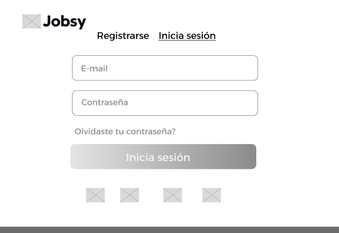 |

| Registro |
|----------------------------------|
| Formulario de registro para nuevos usuarios de Jobsy, con los campos necesarios para que los usuarios ingresen los datos requeridos.|
| 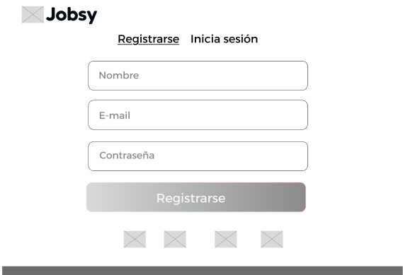 |

| Selección de perfil |
|----------------------------------|
| El usuario deberá identificarse como Postulante o Administrador|
|  |

- *Wireframes para el Segmento 1: Equipos de Recursos Humanos encargados del proceso de contratación.*
  
| Panel Principal |
|----------------------------------|
| Panel principal de Jobsy, donde los reclutadores pueden ver un resumen rápido de sus vacantes y candidatos.|
| 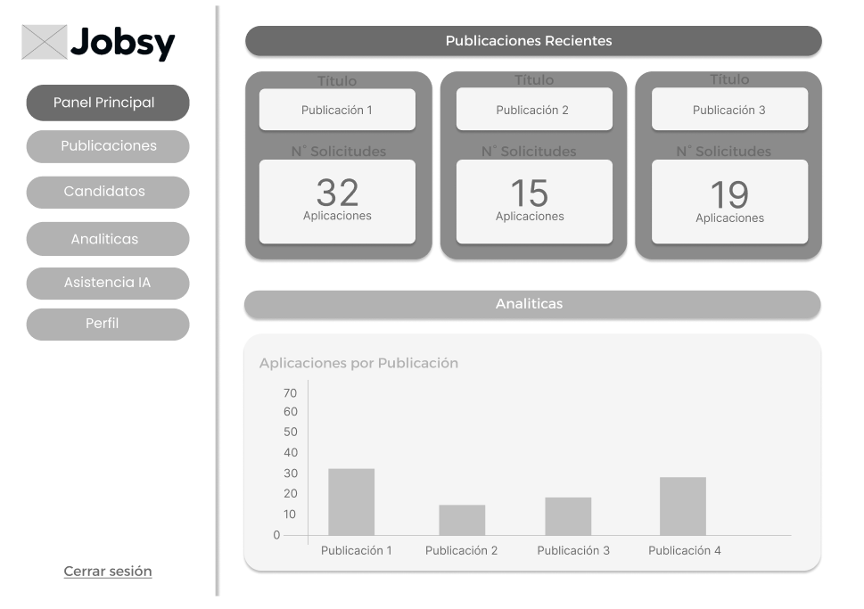 |

| Publicaciones |
|----------------------------------|
| Sección donde los reclutadores gestionan las vacantes publicadas, con una tabla que muestra cuántos candidatos aplicaron a cada una.|
| 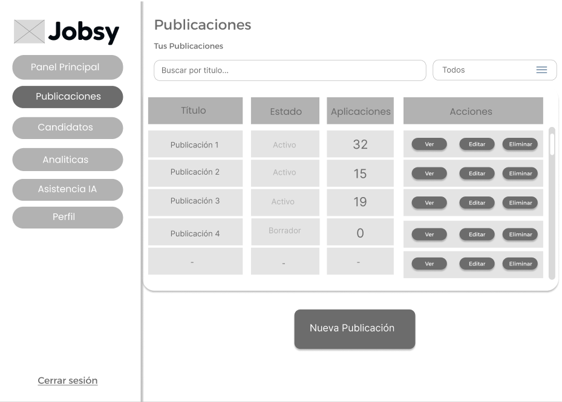 |

| Candidatos |
|----------------------------------|
| Pantalla para que los reclutadores revisen una lista de candidatos que aplicaron a las vacantes, con datos básicos para su evaluación.|
| 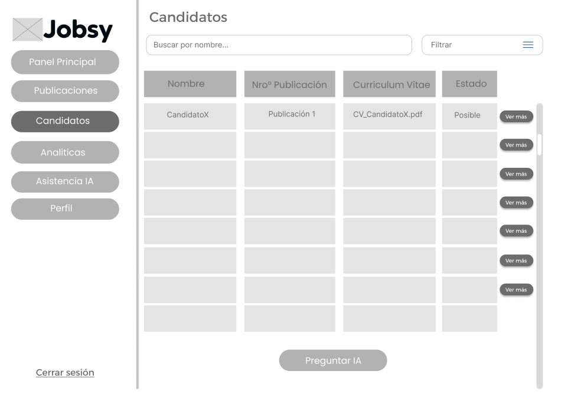 |

| Analiticas |
|----------------------------------|
| Pantalla para que los reclutadores revisen una lista de candidatos que aplicaron a las vacantes, con datos básicos para su evaluación.|
| 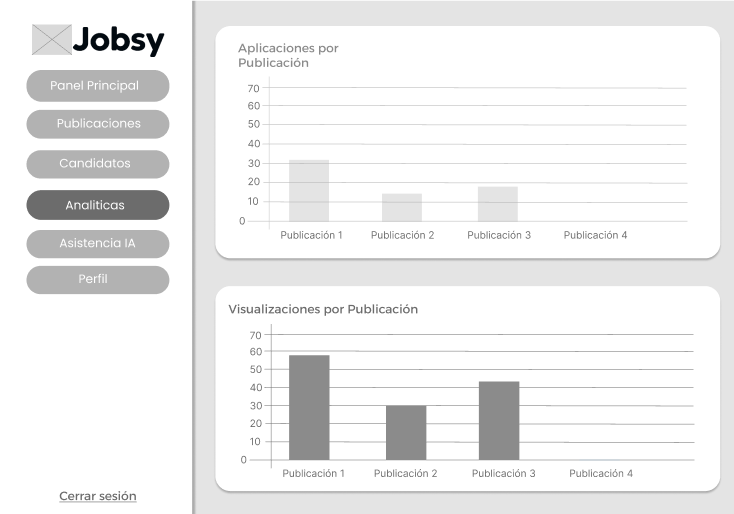 |

| Asistencia IA |
|----------------------------------|
| Pantalla para que los reclutadores revisen una lista de candidatos que aplicaron a las vacantes, con datos básicos para su evaluación.|
| 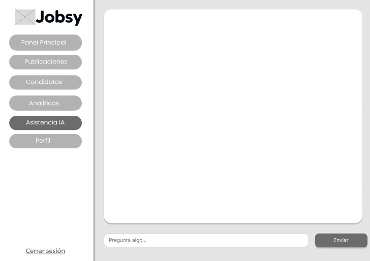 |

| Perfil |
|----------------------------------|
| Pantalla para que los reclutadores revisen una lista de candidatos que aplicaron a las vacantes, con datos básicos para su evaluación.|
| 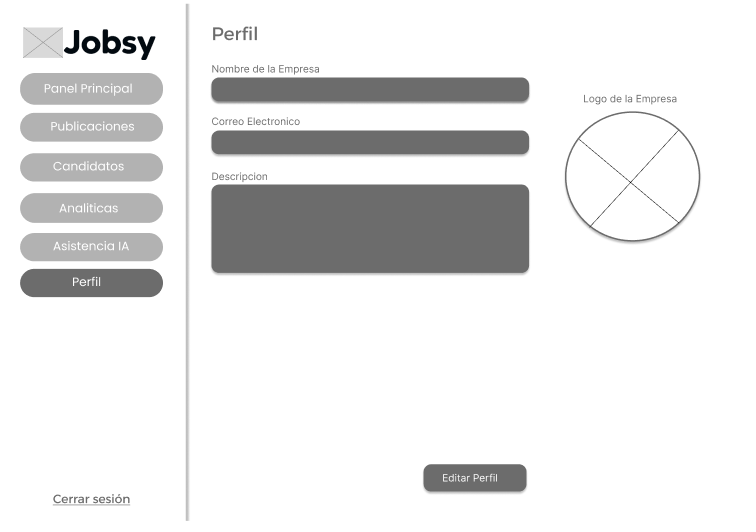 |

- *Wireframes para el Segmento 2: Postulantes o candidatos que aplican a las vacantes.*

| Panel Principal |
|----------------------------------|
| Un folleto simple del panel principal para el postulante, donde podrá visualizar los trabajos a los que ha aplicado y  la bandeja de entrada|
| 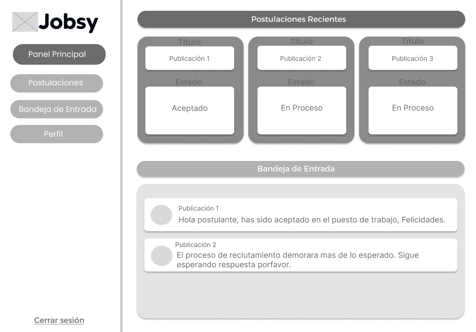 |

| Postulaciones |
|----------------------------------|
| Modelo sencillo donde el postulante podrá ver o eliminar las solicitudes a los trabajos que está postulando|
| 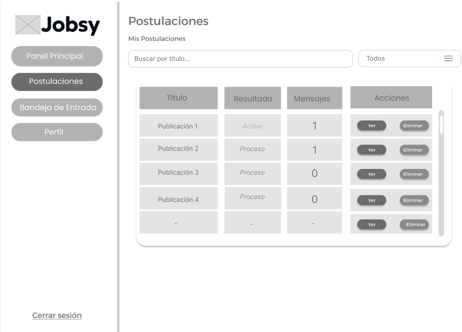 |

| Bandeja de entrada |
|----------------------------------|
| Pantalla sencilla donde el postulante visualiza sus bandejas de entrada|
| 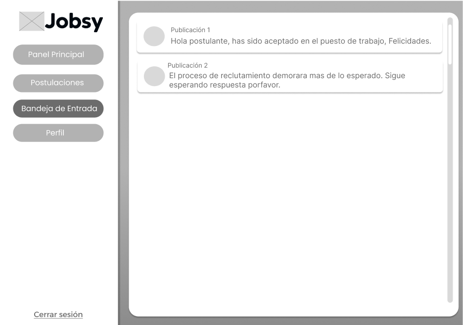 |

| Perfil |
|----------------------------------|
| Modelo del perfil de un postulante de baja fidelidad|
| 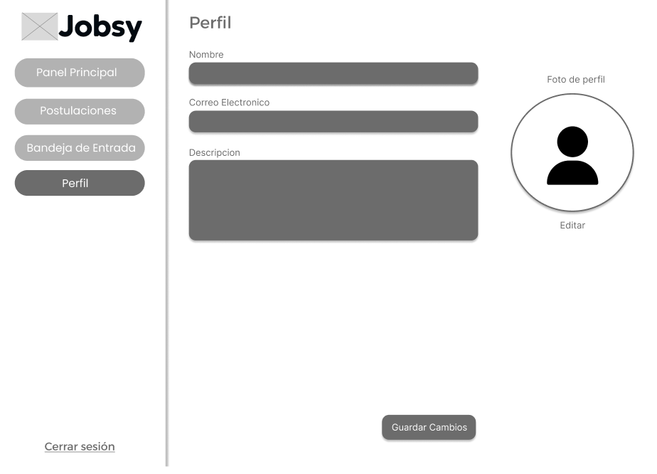 |

-Link:  [https://www.figma.com/design/GIGB1SiI7KVd15nanLTBBt/Untitled?node-id=0-1&t=uJ6xNFzKYxW0VpQV-1 ](https://www.figma.com/design/GIGB1SiI7KVd15nanLTBBt/Untitled?node-id=0-1&t=uJ6xNFzKYxW0VpQV-1)

### **4.4.2. Web Applications Wireflow Diagrams**

| User Persona: Equipos de Recursos Humanos encargados del proceso de contratación. |
|----------------------------------|
| User Goal: Como usuario, deseo poder registrarme e iniciar sesión antes de visualizar el panel principal. |
| 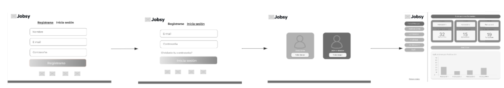 |

| User Persona: Equipos de Recursos Humanos encargados del proceso de contratación. |
|----------------------------------|
| User Goal: Como usuario, Deseo ver mis publicaciones, poder editarlas y eliminarlas cuando yo quiera. |
| 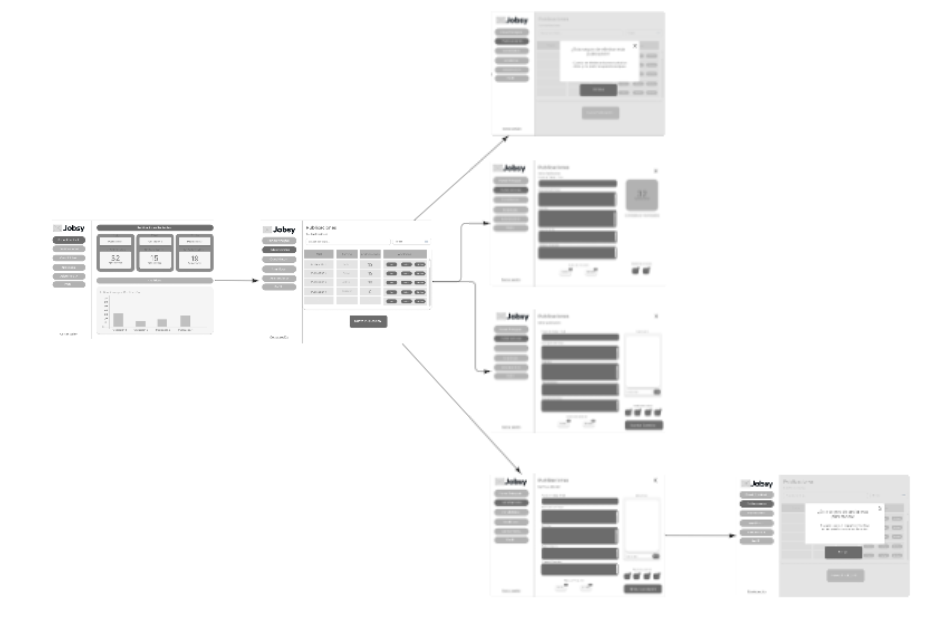 |

| User Persona: Equipos de Recursos Humanos encargados del proceso de contratación. |
|----------------------------------|
| User Goal: Como usuario, deseo ver la lista de candidatos que postulan y filtrar por categorías. |
|  |

| User Persona: Equipos de Recursos Humanos encargados del proceso de contratación. |
|----------------------------------|
| User Goal: Como usuario, deseo ver mis datos recaudados en un gráfico para ver mis estadísticas.|
| 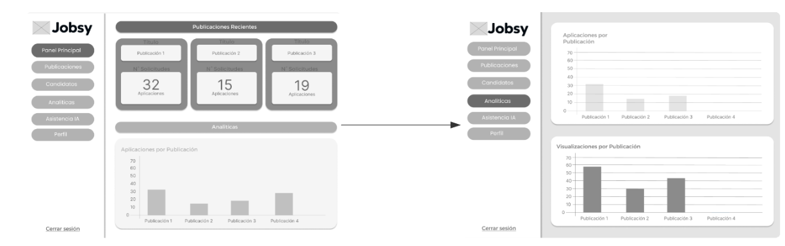 |

| User Persona: Equipos de Recursos Humanos encargados del proceso de contratación. |
|----------------------------------|
| User Goal: Como usuario, deseo tener acceso a una IA para que me ayude en el proceso de reclutamiento. |
| 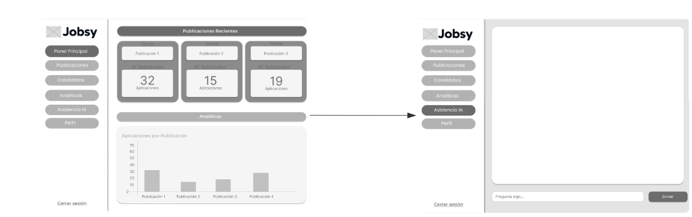 |

| User Persona: Equipos de Recursos Humanos encargados del proceso de contratación. |
|----------------------------------|
| User Goal: User Goal: Como usuario deseo tener un perfil de empresa y poder editarlo cuando quiera. |
| 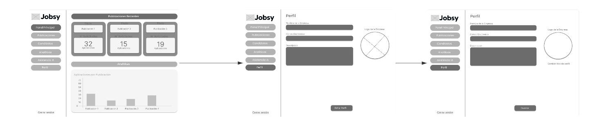 |

| User Persona:Postulantes o candidatos que aplican a las vacantes. |
|----------------------------------|
| User Goal: Como usuario, deseo poder registrarme e iniciar sesión antes de visualizar el panel principal. |
|  |

| User Persona:Postulantes o candidatos que aplican a las vacantes. |
|----------------------------------|
|  User Goal: Como usuario, deseo recibir mensajes de las empresas para saber el estado de mi postulación. |
| 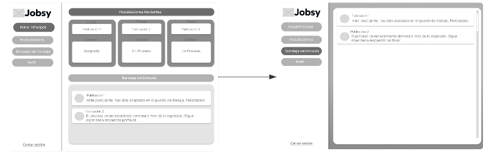 |

| User Persona:Postulantes o candidatos que aplican a las vacantes. |
|----------------------------------|
| User Goal: Como usuario, deseo ver todas las postulaciones que realice. |
| 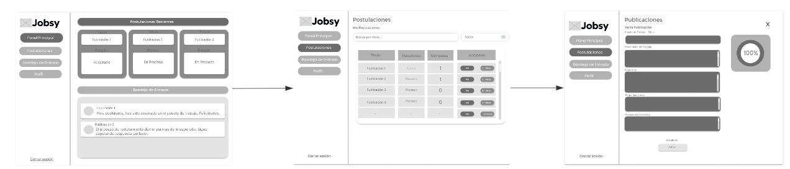 |

| User Persona:Postulantes o candidatos que aplican a las vacantes. |
|----------------------------------|
| User Goal: Como usuario, deseo tener un perfil que pueda editar cuando quiera. |
| 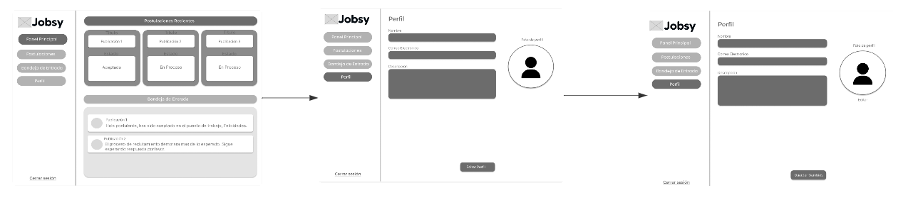 |

-Link: [https://lucid.app/lucidchart/75682ffb-8c0f-4bac-b998-0d62b3a45530/edit?viewport_loc=-2869%2C-2619%2C10744%2C5094%2C0_0&invitationId=inv_0e6877ba-572d-49ac-8c0e-753a243d3989](https://lucid.app/lucidchart/75682ffb-8c0f-4bac-b998-0d62b3a45530/edit?viewport_loc=-2869%2C-2619%2C10744%2C5094%2C0_0&invitationId=inv_0e6877ba-572d-49ac-8c0e-753a243d3989)

### **4.4.3. Web Applications Mock-ups**

| Inicio Sesión |
|----------------------------------|
| Muestra una pantalla de login para Jobsy, con campos para que los reclutadores pongan su correo y contraseña, y un botón para entrar al sistema. |
| 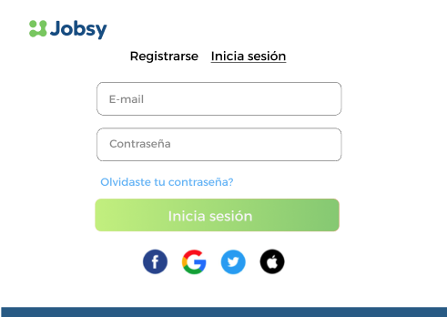 |

| Registro |
|----------------------------------|
| Tiene un diseño claro para registrarse en Jobsy, donde los reclutadores ingresan su nombre, correo y contraseña, y un botón para crear su cuenta.|
| 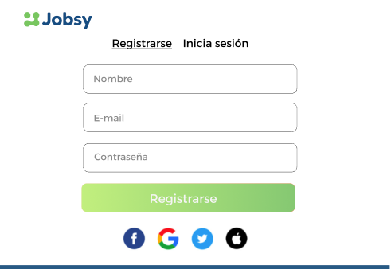 |

| Selección de perfil |
|----------------------------------|
| Muestra el tablero donde el usuario indica a que rol pertenece.|
| 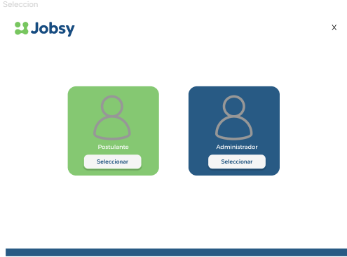 |

- *Wireframes para el Segmento 1: Equipos de Recursos Humanos encargados del proceso de contratación.*
  
| Panel Principal |
|----------------------------------|
| Muestra el tablero inicial de SmartHire, con un menú a la izquierda y un resumen de vacantes activas y datos importantes para los reclutadores.|
| 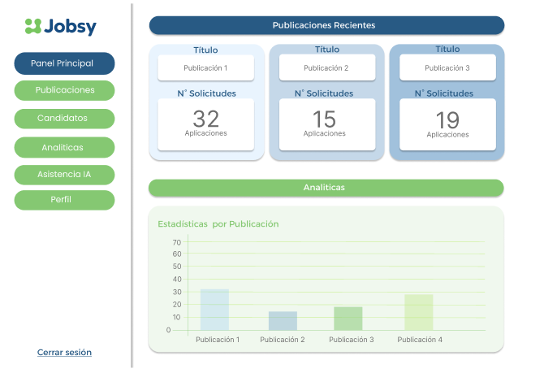 |

| Publicaciones |
|----------------------------------|
| Presenta una pantalla detallada de la tabla de vacantes, donde los reclutadores ven detalles y pueden gestionar las publicaciones fácilmente.|
| 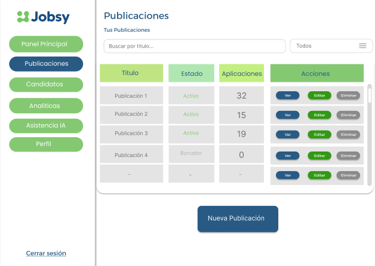 |

| Candidatos |
|----------------------------------|
| Muestra una tabla con la lista de candidatos, donde los reclutadores pueden ver su información detallada y decidir a quién contactar.|
| 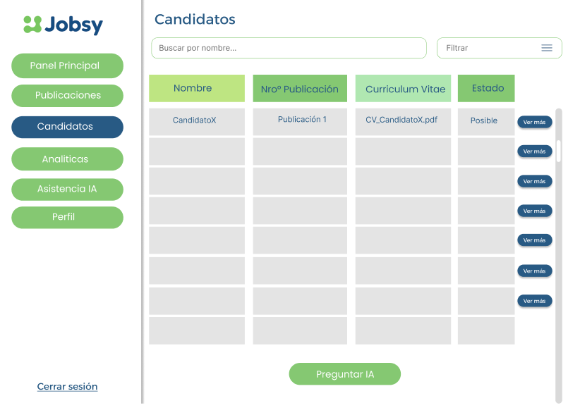 |

| Analiticas |
|----------------------------------|
| Contiene gráficos que ayudan a los reclutadores a entender cómo van sus procesos de selección y qué tan efectivas son sus vacantes.|
| 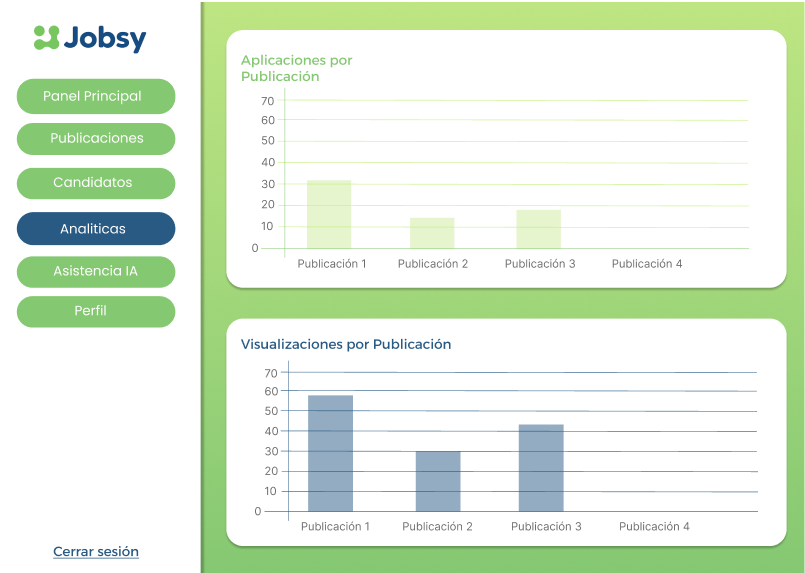 |

| Asistencia IA |
|----------------------------------|
| Muestra un chat donde los reclutadores pueden hablar con una IA para resolver dudas o recibir consejos sobre reclutamiento.|
| 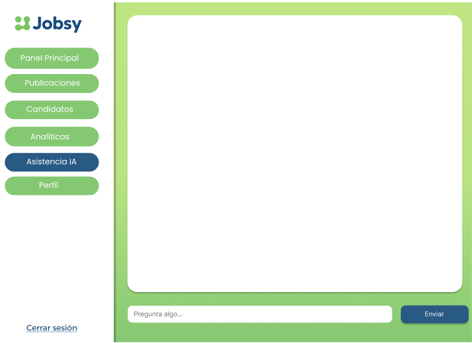 |

| Perfil |
|----------------------------------|
| Página en Jobsy donde los reclutadores pueden ver sus datos personales y editarlos si es necesario.|
| 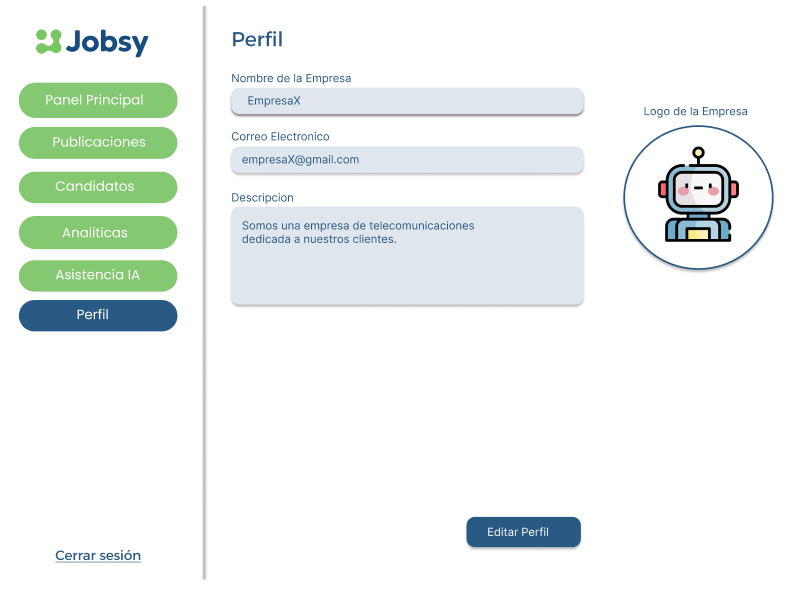 |

- *Wireframes para el Segmento 2: Postulantes o candidatos que aplican a las vacantes.*

| Panel Principal |
|----------------------------------|
| Modelo completo y avanzado del estado los últimos trabajos donde ha postulado, además de la bandeja de entrada|
| 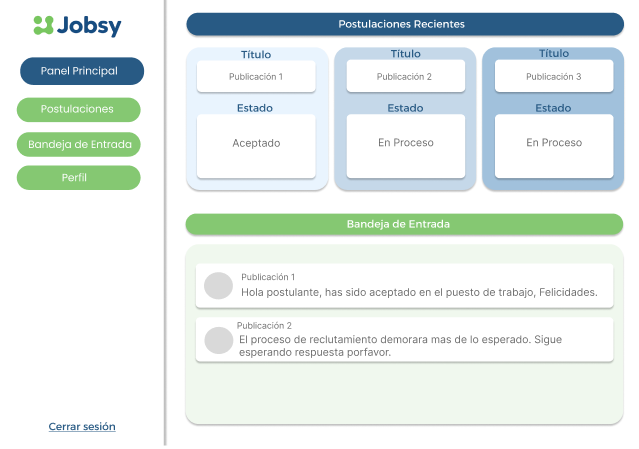 |

| Postulaciones |
|----------------------------------|
| Pantalla donde detalla los trabajos a los que ha postulado y la administración de los mismos.|
| 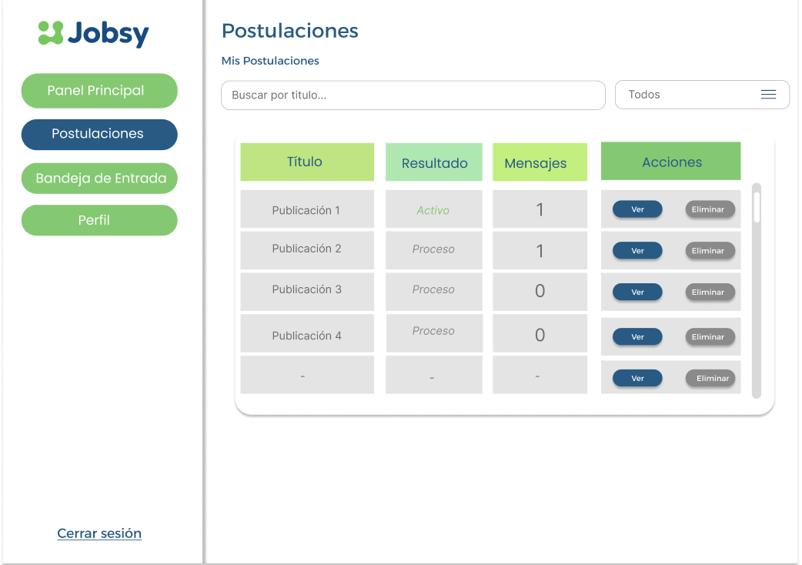 |

| Bandeja de entrada |
|----------------------------------|
| Sección donde el postulante vera su bandeja de entrada.|
| 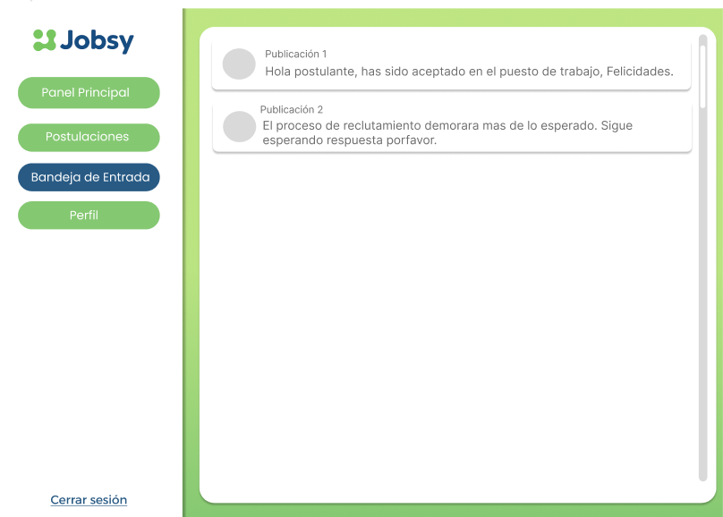 |

| Perfil |
|----------------------------------|
| Sección donde el postulante verá su perfil completo.|
| 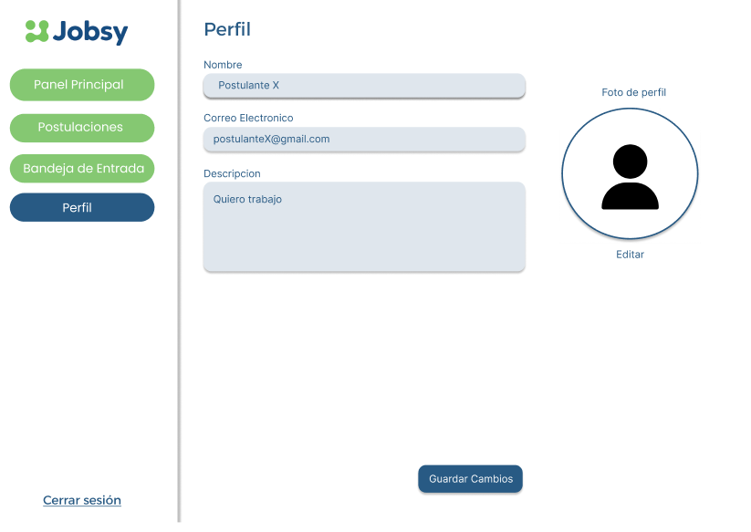 |

-Link:  [https://www.figma.com/design/GIGB1SiI7KVd15nanLTBBt/Untitled?node-id=0-1&t=uJ6xNFzKYxW0VpQV-1 ](https://www.figma.com/design/GIGB1SiI7KVd15nanLTBBt/Untitled?node-id=0-1&t=uJ6xNFzKYxW0VpQV-1)

### **4.4.4. Web Applications User Flow Diagrams**

| User Persona: Equipos de Recursos Humanos encargados del proceso de contratación. |
|----------------------------------|
| User Goal: Como usuario, deseo poder registrarme e iniciar sesión antes de visualizar el panel principal. |
| 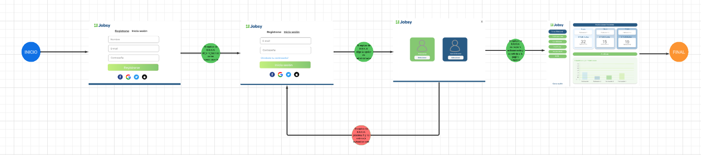 |

| User Persona: Equipos de Recursos Humanos encargados del proceso de contratación. |
|----------------------------------|
| User Goal: Como usuario, Deseo ver mis publicaciones, poder editarlas y eliminarlas cuando yo quiera. |
| 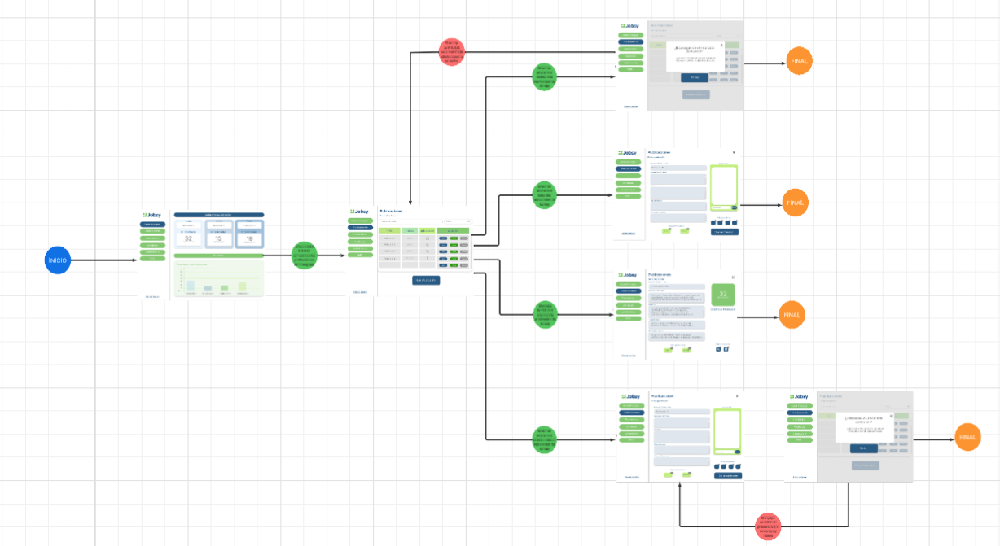 |

| User Persona: Equipos de Recursos Humanos encargados del proceso de contratación. |
|----------------------------------|
| User Goal: Como usuario, deseo ver la lista de candidatos que postulan y filtrar por categorías. |
| 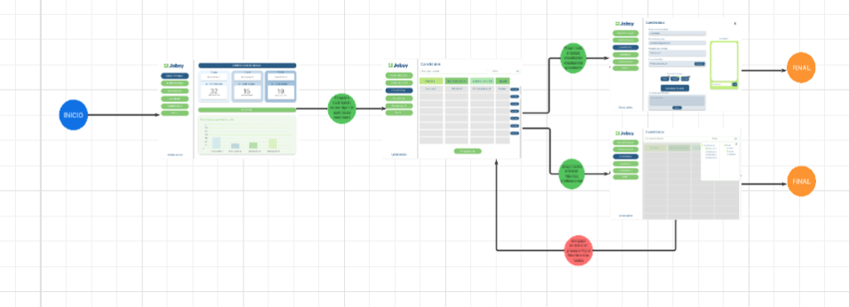 |

| User Persona: Equipos de Recursos Humanos encargados del proceso de contratación. |
|----------------------------------|
| User Goal: Como usuario, deseo ver mis datos recaudados en un gráfico para ver mis estadísticas.|
| 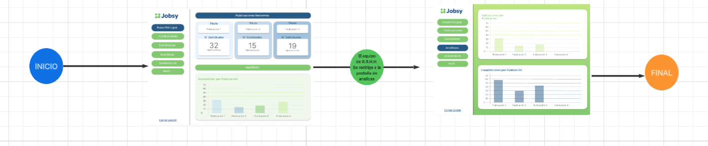 |

| User Persona: Equipos de Recursos Humanos encargados del proceso de contratación. |
|----------------------------------|
| User Goal: Como usuario, deseo tener acceso a una IA para que me ayude en el proceso de reclutamiento. |
| 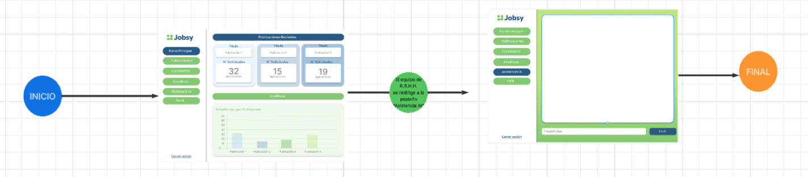 |

| User Persona: Equipos de Recursos Humanos encargados del proceso de contratación. |
|----------------------------------|
| User Goal: User Goal: Como usuario deseo tener un perfil de empresa y poder editarlo cuando quiera. |
| 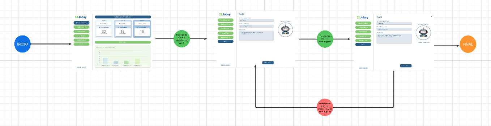 |

| User Persona:Postulantes o candidatos que aplican a las vacantes. |
|----------------------------------|
| User Goal: Como usuario, deseo poder registrarme e iniciar sesión antes de visualizar el panel principal. |
| 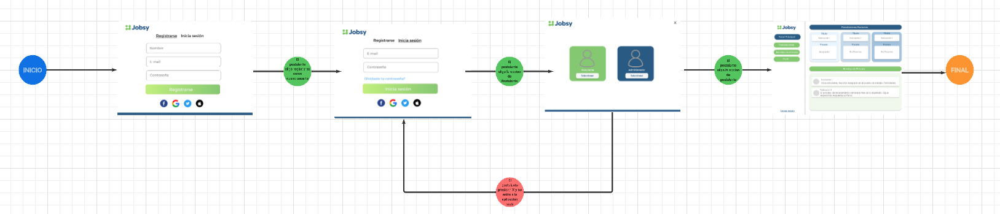 |

| User Persona:Postulantes o candidatos que aplican a las vacantes. |
|----------------------------------|
|  User Goal: Como usuario, deseo recibir mensajes de las empresas para saber el estado de mi postulación. |
| 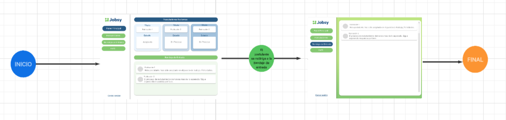 |

| User Persona:Postulantes o candidatos que aplican a las vacantes. |
|----------------------------------|
| User Goal: Como usuario, deseo ver todas las postulaciones que realice. |
| 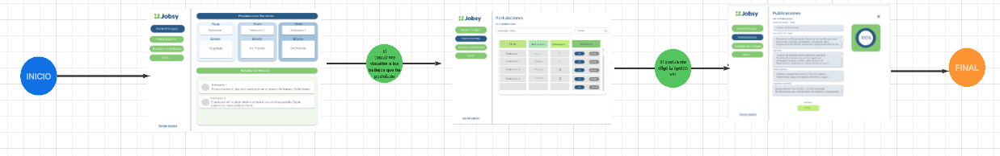 |

| User Persona:Postulantes o candidatos que aplican a las vacantes. |
|----------------------------------|
| User Goal: Como usuario, deseo tener un perfil que pueda editar cuando quiera. |
| 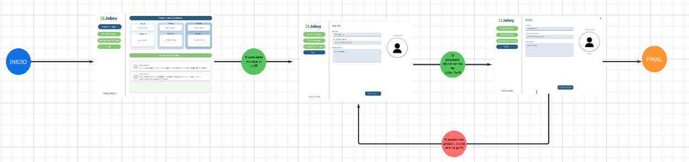 |

-Link: [https://lucid.app/lucidchart/1bd13f47-62cb-43cd-983b-a2e9d116fe4e/edit?viewport_loc=2240%2C-1780%2C6876%2C3260%2C0_0&invitationId=inv_c2834ef8-4ace-4328-a4b9-1c904e0798f0](https://lucid.app/lucidchart/1bd13f47-62cb-43cd-983b-a2e9d116fe4e/edit?viewport_loc=2240%2C-1780%2C6876%2C3260%2C0_0&invitationId=inv_c2834ef8-4ace-4328-a4b9-1c904e0798f0)

## **4.5. Web Applications Prototyping**
En esta sección presentaremos el prototipo de nuestra Aplicación Web, para la que se tomó en cuenta los Mock-ups realizados anteriormente y los user flows para la guía de los usuarios.

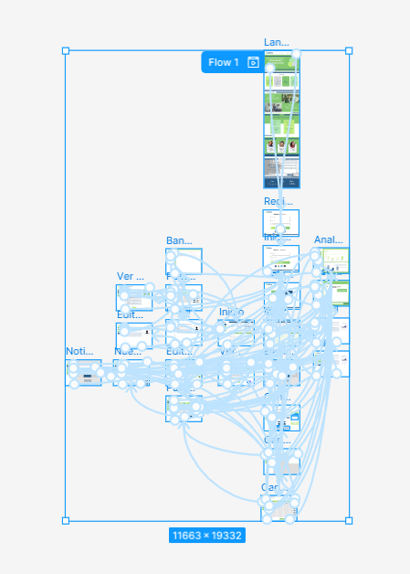

-Link del video del prototipo: [https://youtu.be/oPz7sWIkK54](https://youtu.be/oPz7sWIkK54)
-Link del prototipo realizado en figma: [https://www.figma.com/design/KTUEfi4W93Am8ExCLzuMU5/Prototype-SmartHire?node-id=0-1&t=lRdRK43RVlGPsXF8-1](https://www.figma.com/design/KTUEfi4W93Am8ExCLzuMU5/Prototype-SmartHire?node-id=0-1&t=lRdRK43RVlGPsXF8-1)

## **4.6. Domain-Driven Software Architecture**
En esta sección se presentarán los diagramas de arquitectura de software diseñados para nuestra aplicación web. Hemos aplicado patrones de diseño de alto nivel, bajo el enfoque de Domain-Driven, lo que nos permitirá comunicar la arquitectura de manera clara, eficiente y efectiva

### **4.6.1. Software Architecture Context Diagram**
A continuación, se presenta el diagrama de contexto de nuestro software, un artefacto que ilustra cómo el sistema interactúa con su entorno, destacando los aspectos clave de su arquitectura.

### **4.6.2. Software Architecture Container Diagrams**
A continuación, se presentará el diagrama de contenedores de nuestro sistema, un artefacto que expone los componentes técnicos de alto nivel, ofreciendo una visión ampliada de la arquitectura del software."

### **4.6.3. Software Architecture Components Diagrams**
En esta sección se presentará el diagrama de componentes de nuestra arquitectura de software. En él se detallan los elementos que conforman nuestros contenedores, además de especificar sus responsabilidades y los aspectos tecnológicos de su implementación.

**diagrama de componentes de Publicaciones.**

**diagrama de componentes de Candidatos.**

**diagrama de componentes de Candidatos.**

**diagrama de componentes de Analíticos.**

**diagrama de componentes de Perfil.**

## **4.7. Software Object-Oriented Design**
### **4.7.1. Class Diagrams**
Un diagrama de clases es una representación visual de la estructura estática de un sistema, mostrando las clases, sus atributos y métodos, y las relaciones entre ellas.
 

- Link: https://lucid.app/lucidchart/22f7abe1-aca2-4970-9925-f24fdd1c166f/edit?viewport_loc=-2203%2C-4641%2C7021%2C3423%2CHWEp-vi-RSFO&invitationId=inv_72f97110-024a-4131-a9e3-c460ec619fa9

### **4.7.2. Diccionario de Clases**

En esta sección se describen las clases identificadas en el **Diagrama de Clases**, detallando sus atributos, métodos y relaciones con otras clases.

#### **Rol**
Clase que representa el rol asignado a un usuario en el sistema (por ejemplo: *Postulante*, *Reclutador* o *Administrador*).

- **Atributos:**
  - `id` (Int)
  - `nombreRol` (RolEnum)

- **Métodos:**
  - `asignarRol(usuario: Usuario): void`

- **Relaciones:**
  - Asociación 1 a 1 con `Usuario`.

#### **Usuario**
Clase principal que representa a cualquier persona registrada en la plataforma (postulante, reclutador o empresa).

- **Atributos:**
  - `id` (Int)
  - `nombre` (String)
  - `correo` (String)
  - `contraseña` (String)
  - `tipoRol` (Rol)

- **Métodos:**
  - `registrar()`
  - `iniciarSesion()`
  - `getNombre()`, `setNombre(nombre)`
  - `getCorreo()`, `setCorreo(correo)`
  - `getTipoRol()`, `setTipoRol(tipoRol)`

- **Relaciones:**
  - Asociación 1 a 1 con `Rol`
  - Asociación 1 a muchos con `Dashboard`
  - Asociación 1 a muchos con `Perfil`
  - Asociación 1 a 1 con `AsistenteIA`

#### **Postulante**
Representa a un usuario que busca empleo, con experiencia y habilidades específicas.

- **Atributos:**
  - `id` (Int)
  - `nombre` (String)
  - `perfilId` (Int)
  - `experiencia` (String)
  - `habilidades` (String[])

- **Métodos:**
  - `getNombre()`, `setNombre(nombre)`
  - `filtrarPorCategoria()`
  - `verDetalles()`

- **Relaciones:**
  - Herencia de la clase `Rol`.

#### **Empresa**
Representa a una organización que publica vacantes laborales.

- **Atributos:**
  - `id` (Int)
  - `nombre` (String)
  - `ruc` (String)
  - `direccion` (String)
  - `usuarioId` (Int)

- **Métodos:**
  - `verPerfilEmpresa()`
  - `editarEmpresa(nombre, ruc, direccion)`

- **Relaciones:**
  - Herencia de `Rol`
  - Asociación 1 a muchos con `Reclutador`

#### **Dashboard**
Muestra un resumen de la actividad del usuario dentro del sistema.

- **Atributos:**
  - `id` (Int)
  - `usuarioId` (Int)
  - `tipoUsuario` (String)

- **Métodos:**
  - `mostrarResumen()`

- **Relaciones:**
  - Muchos a 1 con `Usuario`
  - Asociación 1 a 1 (composición) con `AsistenteIA`

#### **AsistenteIA**
Asistente virtual que responde consultas de los usuarios mediante inteligencia artificial.

- **Atributos:**
  - `id` (Int)
  - `usuarioId` (Int)
  - `consulta` (String)
  - `respuesta` (String)

- **Métodos:**
  - `consultarIA(pregunta: String): String`

- **Relaciones:**
  - Asociación 1 a 1 con `Usuario`

#### **Publicación/Vacante**
Representa una oferta laboral publicada por un reclutador.

- **Atributos:**
  - `id` (Int)
  - `titulo` (String)
  - `descripcion` (String)
  - `categoria` (String)
  - `estado` (String)
  - `fechaPublicacion` (Date)

- **Métodos:**
  - `getId()`, `setId(id)`
  - `getTitulo()`, `setTitulo(titulo)`
  - `getDescripcion()`, `setDescripcion(descripcion)`
  - `getCategoria()`, `setCategoria(categoria)`
  - `getEstado()`, `setEstado(estado)`
  - `getFechaPublicacion()`, `setFechaPublicacion(fecha)`
  - `getReclutador()`, `setReclutador(reclutador)`
  - `actualizarEstado(estado)`
  - `actualizarDescripcion(nuevaDescripcion)`

- **Relaciones:**
  - Muchos a 1 con `Reclutador`

#### **Reclutador**
Usuario encargado de gestionar vacantes y procesos de selección en una empresa.

- **Atributos:**
  - `id` (Int)
  - `nombre` (String)
  - `correo` (String)
  - `contraseña` (String)
  - `perfilEmpresa` (PerfilEmpresa)
  - `publicaciones` (List<PublicacionVacante>)
  - `bandejaEntrada` (BandejaEntrada)

- **Métodos:**
  - `getNombre()`, `setNombre(nombre)`
  - `getPerfilEmpresa()`, `setPerfilEmpresa(perfilEmpresa)`
  - `getPublicaciones()`, `setPublicaciones(publicaciones)`
  - `getBandejaEntrada()`, `setBandejaEntrada(bandejaEntrada)`
  - `crearPublicacion(publicacion)`
  - `editarPublicacion(vacante)`
  - `eliminarVacante(vacanteId)`

- **Relaciones:**
  - Muchos a 1 con `Empresa`
  - 1 a muchos con `Publicacion/Vacante`

#### **Perfil**
Almacena información adicional del usuario (personal o empresarial), como descripción y foto de perfil.

- **Atributos:**
  - `id` (Int)
  - `usuarioId` (Usuario)
  - `descripcion` (String)
  - `urlFoto` (String)
  - `tipoPerfil` (Rol)

- **Métodos:**
  - `editarPerfil()`
  - `getDescripcion()`, `setDescripcion(descripcion)`
  - `getUrlFoto()`, `setUrlFoto(urlFoto)`

- **Relaciones:**
  - Muchos a 1 con `Usuario`

#### **BandejaEntrada**
Administra los mensajes recibidos y enviados por un reclutador.

- **Atributos:**
  - `id` (Int)
  - `mensajes` (List<Mensaje>)

- **Métodos:**
  - `getId()`, `setId(id)`
  - `getMensajes()`, `setMensajes(mensajes)`
  - `recibirMensaje(mensaje)`
  - `eliminarMensaje(mensajeId)`
  - `leerMensaje(mensajeId)`

- **Relaciones:**
  - Composición 1 a muchos con `Mensaje`

#### **Mensaje**
Representa una comunicación individual entre usuarios (postulantes o reclutadores).

- **Atributos:**
  - `id` (Int)
  - `emisorId` (Int)
  - `receptorId` (Int)
  - `contenido` (String)
  - `fecha` (Date)

- **Métodos:**
  - `enviarMensaje()`
  - `verMensajes()`

- **Relaciones:**
  - Muchos a 1 con `BandejaEntrada` (Composición)

## **4.8. Database Design**

Implementación de la base de datos aplicado a nuestro proyecto

### **4.8.1. Database Diagram**

En este apartado se puede visualizar la estructura y las relaciones entre las tablas de la base de datos, lo que permite comprender de manera clara cómo se organiza y conecta la información. Esta representación gráfica es esencial para garantizar la integridad de los datos, ya que facilita la identificación de las claves primarias y foráneas, también se muestran las cardinalidades entre las entidades. Además se ha utilizado la normalización de tablas, esto es clave para mantener la consistencia y evitar redundancias en los datos almacenados

## 🗃️ Estructura de la Base de Datos – Jobsy

### 1. `User`
Contiene la información principal de autenticación y rol. Los usuarios pueden ser candidatos, empleadores o administradores.

- **Campos principales:** `email`, `password`, `role`

---

### 2. `CandidateProfile`
Almacena detalles adicionales del usuario con rol de candidato: información personal, habilidades, experiencia y CV.

- **Campos principales:** `full_name`, `skills`, `resume`, `experience`

---

### 3. `EmployerProfile`
Información de los usuarios empleadores, como nombre de empresa, descripción y sitio web.

- **Campos principales:** `company_name`, `description`, `logo_url`

---

### 4. `JobOffer`
Publicaciones de empleos creadas por los empleadores. Incluye título, requisitos, ubicación y rango salarial.

- **Campos principales:** `title`, `description`, `requirements`, `salary_range`

---

### 5. `Application`
Relación entre un candidato y una oferta laboral. Guarda el estado del proceso de postulación.

- **Campos principales:** `job_offer_id`, `candidate_id`, `status`

---

### 6. `Message`
Mensajes enviados entre usuarios (candidatos y empleadores) dentro de la plataforma.

- **Campos principales:** `sender_id`, `receiver_id`, `content`

---

### 7. `Interview`
Entrevistas agendadas entre empleadores y candidatos, incluyendo fecha, lugar y modalidad.

- **Campos principales:** `scheduled_date`, `interview_mode`, `status`

---

### 8. `Evaluation`
Evaluaciones realizadas por empleadores luego de las entrevistas. Permite puntuar y dejar comentarios sobre el candidato.

- **Campos principales:** `rating`, `comments`, `evaluation_date`

---

### 9. `MembershipPlan`
Planes de membresía disponibles (estándar y empresarial). Define el costo y duración.

- **Campos principales:** `name`, `price`, `duration_days`

---

### 10. `EmployerMembership`
Registro de la membresía activa de un empleador, asociada a un plan. Guarda la vigencia y estado.

- **Campos principales:** `start_date`, `end_date`, `is_active`

---

# **Capítulo V: Product Implementation, Validation & Deployment**
## **5.1. Software Configuration Management**
### **5.1.1. Software Development Environment Configuration**
### **5.1.2. Source Code Management**
### **5.1.3. Source Code Style Guide & Conventions**
### **5.1.4. Software Deployment Configuration**
## **5.2. Landing Page, Services & Applications Implementation**
### **5.2.1. Sprint 1**
#### **5.2.1.1. Sprint Planning 1**
#### **5.2.1.2. Aspect Leaders and Collaborators**
#### **5.2.1.3. Sprint Backlog 1**
#### **5.2.1.4. Development Evidence for Sprint Review**
#### **5.2.1.5. Execution Evidence for Sprint Review**
#### **5.2.1.6. Services Documentation Evidence for Sprint Review**
#### **5.2.1.7. Software Deployment Evidence for Sprint Review**
#### **5.2.1.8. Team Collaboration Insights during Sprint**
### **5.2.2. Sprint 2**
#### **5.2.2.1. Sprint Planning 2**
#### **5.2.2.2. Aspect Leaders and Collaborators**
#### **5.2.2.3. Sprint Backlog 2**
#### **5.2.2.4. Development Evidence for Sprint Review**
#### **5.2.2.5. Execution Evidence for Sprint Review**
#### **5.2.2.6. Services Documentation Evidence for Sprint Review**
#### **5.2.2.7. Software Deployment Evidence for Sprint Review**
#### **5.2.2.8. Team Collaboration Insights during Sprint**
## **5.3. Validation Interviews**
### **5.3.1. Diseño de Entrevistas**
### **5.3.2. Registro de Entrevistas**
### **5.3.3. Evaluaciones según heurísticas**
