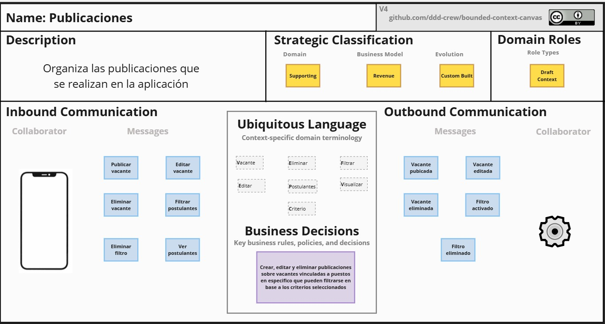
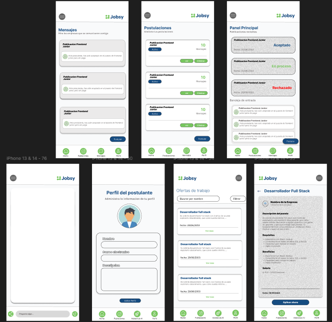
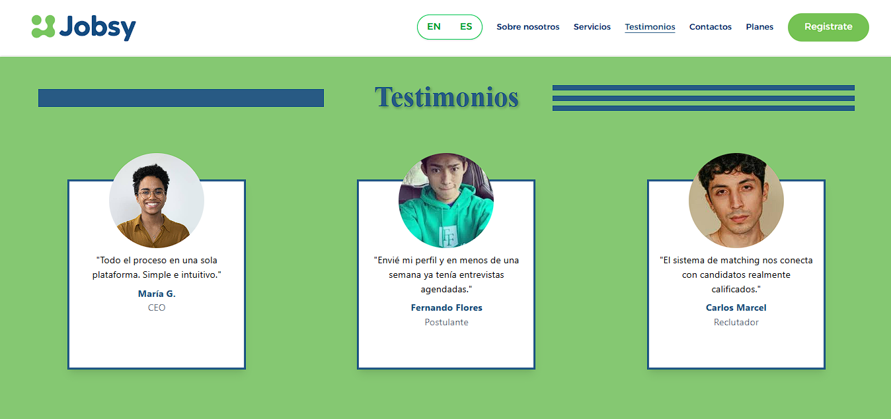

### Universidad Peruana de Ciencias Aplicadas

### Ingeniería de Software

**Periodo:** 202520

**1ACC0238 | Aplicaciones para Dispositivos Móviles**

**NRC:** 12612

**Docente:**  Quevedo Velasco, David Gerardo

---

### Informe de Trabajo Final

**Startup:** SmartHire

**Producto:** Jobsy

**Integrantes:**

    <ol style="list-style: none;">
        <li>U202125984 - Aru Acevedo, Yair Christofer</li>
        <li>U202310004 - Cardenas Minaya, Ricardo Fernando</li>    
        <li>U202224619 - Peralta Chipa, Ronald Joel</li>
        <li>U201518942 - Sanchez Cruz, Raul Roberto</li>
        <li>U202218387 - Tello Murga, Javier Oswaldo</li>
    </ol>

**Noviembre 2025**

# **Registro de Versiones del Informe**

| Versión | Fecha      | Autor                          | Descripción de modificación      |
|---------|------------|--------------------------------|----------------------------------|
| TB1     | 17/09/2025 | Ronald Joel Peralta Chipa - Ricardo Fernando Cardenas Minaya - Raul Roberto Sanchez Cruz - Javier Oswaldo Tello Murga - Yair Christofer Aru Acevedo | Capitulo 1, Capitulo 2 |
| TP     | 07/10/2025 | Ronald Joel Peralta Chipa - Ricardo Fernando Cardenas Minaya - Raul Roberto Sanchez Cruz - Javier Oswaldo Tello Murga - Yair Christofer Aru Acevedo | Capitulo 3, Capitulo 4 |
| TB2     | 08/11/2025 | Ronald Joel Peralta Chipa - Ricardo Fernando Cardenas Minaya - Raul Roberto Sanchez Cruz - Javier Oswaldo Tello Murga - Yair Christofer Aru Acevedo | Capitulo 4 |

- Commits Informe: 

# **Project Report Collaboration Insights**

Enlace de la organización para el reporte del proyecto: https://github.com/orgs/App-para-Dispositivos-Moviles-2520/repositories

**TB1**

Para el desarrollo del informe correspondiente a la entrega TB1, se estableció la implementación de secciones de la siguiente manera para cada integrante del equipo:

|Integrante|Tareas Asignadas|
|-|-|
|Ricardo Fernando Cardenas Minaya|Lean UX Process, Lean UX Problem Statements, Lean UX Assumptions, Lean UX Hypothesis Statements, Lean UX Canvas, Segmentos objetivo, Style Guide, General Style Guidelines, Web Style Guidelines, Information Architecture, Organization Systems, Labeling Systems, SEO Tags and Meta Tags, Searching Systems, Navigation Systems, Lean UX Process, Diagrama de clases, Diccionario de clases, Una entrevista del segmento 1 |
|Peralta Chipa, Ronald Joel| Startup Profile, Descripción de la Startup, Perfiles de integrantes del equipo, Solution Profile, Antecedentes y problemática, Entrevista, Domain-Driven Software Architecture, Software Architecture Context Diagram, Software Architecture Container Diagrams, Software Architecture Components Diagrams, Software Object-Oriented Design|
|Javier Oswaldo Tello Murga|Registro de 1 Entrevista, Análisis de Entrevista, Empathy Mapping, As-Is Scenario Mapping, Ubiquitous Language, Landing Page UI Design, Landing Page Wireframe, Landing Page Mock-up, Web Applications UX/UI Design, Web Applications Wireframes, Web Applications Wireflow Diagrams, Web Applications Mock-ups, Web Applications User Flow Diagrams, Web Applications Prototyping, Software Configuration Management, Software Development Environment Configuration, Source Code Management, Source Code Style Guide & Conventions, Software Deployment Configuration, sprint Planning 2, Execution Evidence for Sprint Review|
|Raul Roberto Sanchez Cruz| Registro de entrevista (segmento objetivo Postulantes), User Stories, Impact Mapping, Product Backlog, Aspect Leaders and Collaborators, Sprint Backlog 1, Development Evidence for Sprint Review, Execution Evidence for Sprint Review, Software Deployment Evidence for Sprint Review|
|Yair Christofer Aru Acevedo| User storys, Desarrollo de entrevista y análisis general, Emphaty map, To be scenario mapa, User personas Code: Planes y servicios, Needfinding, Database diagram|

# **Contenido**

### Tabla de contenidos

- [**Registro de Versiones del Informe**](#registro-de-versiones-del-informe)
- [**Project Report Collaboration Insights**](#project-report-collaboration-insights)
- [**Contenido**](#contenido)
    - [Tabla de contenidos](#tabla-de-contenidos)
- [**Student Outcome**](#student-outcome)
- [ **Capítulo I: Introducción** ](#-capítulo-i-introducción-)
  - [**1.1. Startup Profile**](#11-startup-profile)
    - [**1.1.1. Descripción de la Startup**](#111-descripción-de-la-startup)
    - [**1.1.2. Perfiles de integrantes del equipo**](#112-perfiles-de-integrantes-del-equipo)
  - [**1.2. Solution Profile**](#12-solution-profile)
      - [Product Name.](#product-name)
      - [Product Description.](#product-description)
      - [Monetization.](#monetization)
    - [**1.2.1. Antecedentes y problemática**](#121-antecedentes-y-problemática)
    - [**What (¿Qué?)**](#what-qué)
    - [**Who (¿Quién?)**](#who-quién)
    - [**Where (¿Dónde?)**](#where-dónde)
    - [**When (¿Cuándo?)**](#when-cuándo)
    - [**Why (¿Por qué?)**](#why-por-qué)
    - [**How (¿Cómo?)**](#how-cómo)
    - [**How much (¿Cuánto?)**](#how-much-cuánto)
    - [**1.2.2. Lean UX Process**](#122-lean-ux-process)
      - [**1.2.2.1. Lean UX Problem Statement**](#1221-lean-ux-problem-statement)
      - [**1.2.2.2. Lean UX Assumptions**](#1222-lean-ux-assumptions)
      - [**1.2.2.3. Lean UX Hypothesis Statements**](#1223-lean-ux-hypothesis-statements)
      - [**1.2.2.4. Lean UX Canvas**](#1224-lean-ux-canvas)
  - [**1.3. Segmentos objetivo**](#13-segmentos-objetivo)
- [ **Capítulo II: Requirements Elicitation \& Analysis**](#-capítulo-ii-requirements-elicitation--analysis)
  - [**2.1. Competidores**](#21-competidores)
    - [**2.1.1. Análisis competitivo**](#211-análisis-competitivo)
    - [**2.1.2. Estrategias y tácticas frente a competidores**](#212-estrategias-y-tácticas-frente-a-competidores)
  - [**2.2. Entrevistas**](#22-entrevistas)
    - [**2.2.1. Diseño de entrevistas**](#221-diseño-de-entrevistas)
      - [Entrevista General](#entrevista-general)
      - [Segmento 1: Equipos de Recursos Humanos encargados del proceso de contratación (Empresas)](#segmento-1-equipos-de-recursos-humanos-encargados-del-proceso-de-contratación-empresas)
      - [Segmento 2: Postulantes (Candidatos para el empleo)](#segmento-2-postulantes-candidatos-para-el-empleo)
    - [**2.2.2. Registro de entrevistas**](#222-registro-de-entrevistas)
    - [**2.2.3. Análisis de entrevistas**](#223-análisis-de-entrevistas)
  - [**2.3. Needfinding**](#23-needfinding)
    - [**2.3.1. User Personas**](#231-user-personas)
    - [**2.3.2. User Task Matrix**](#232-user-task-matrix)
      - [🧑‍💼 User Task Matrix – Reclutador (Equipo de RRHH)](#-user-task-matrix--reclutador-equipo-de-rrhh)
      - [🙋‍♂️ User Task Matrix – Candidato (Postulante)](#️-user-task-matrix--candidato-postulante)
    - [**2.3.3. User Journey Mapping**](#233-user-journey-mapping)
    - [**2.3.4. Empathy Mapping**](#234-empathy-mapping)
  - [**2.3.5. Ubiquitous Language**](#235-ubiquitous-language)
  - [**2.4. Requirements specification**](#24-requirements-specification)
    - [**2.4.1. User Stories**](#241-user-stories)
  - [**2.4.2. Impact Mapping**](#242-impact-mapping)
    - [Segmento 1: Equipos de Recursos Humanos encargados del proceso de contratación](#segmento-1-equipos-de-recursos-humanos-encargados-del-proceso-de-contratación)
    - [Segmento 2: Postulantes o candidatos que aplican a las vacantes](#segmento-2-postulantes-o-candidatos-que-aplican-a-las-vacantes)
  - [**2.4.3. Product Backlog**](#243-product-backlog)
  - [**2.5. Strategic-Level Domain-Driven Design**](#25-strategic-level-domain-driven-design)
    - [**2.5.1. EventStorming**](#251-eventstorming)
      - [**2.5.1.1. Candidate Context Discovery**](#2511-candidate-context-discovery)
      - [**2.5.1.2. Domain Message Flows Modeling**](#2512-domain-message-flows-modeling)
      - [**2.5.1.3. Bounded Context Canvases**](#2513-bounded-context-canvases)
    - [**2.5.2. Context Mapping**](#252-context-mapping)
    - [**2.5.3. Software Architecture**](#253-software-architecture)
      - [**2.5.3.1. Software Architecture Context Level Diagrams**](#2531-software-architecture-context-level-diagrams)
      - [**2.5.3.2. Software Architecture Container Level Diagrams**](#2532-software-architecture-container-level-diagrams)
      - [**2.5.3.3. Software Architecture Deployment Diagrams**](#2533-software-architecture-deployment-diagrams)
  - [**2.6. Tactical-Level Domain-Driven Design**](#26-tactical-level-domain-driven-design)
    - [**2.6.1. Bounded Context: Analíticas**](#261-bounded-context-analíticas)
      - [**2.6.1.1. Domain Layer**](#2611-domain-layer)
      - [**2.6.1.2. Interface Layer**](#2612-interface-layer)
      - [**2.6.1.3. Application Layer**](#2613-application-layer)
      - [**2.6.1.4. Infrastructure Layer**](#2614-infrastructure-layer)
      - [**2.6.1.5. Bounded Context Software Architecture Component Level Diagrams**](#2615-bounded-context-software-architecture-component-level-diagrams)
      - [**2.6.1.6. Bounded Context Software Architecture Code Level Diagrams**](#2616-bounded-context-software-architecture-code-level-diagrams)
        - [**2.6.1.6.1. Bounded Context Domain Layer Class Diagrams**](#26161-bounded-context-domain-layer-class-diagrams)
        - [**2.6.1.6.2. Bounded Context Domain Layer Class Diagrams**](#26162-bounded-context-domain-layer-class-diagrams)
    - [**2.6.2. Bounded Context: Candidatos**](#262-bounded-context-candidatos)
      - [**2.6.2.1. Domain Layer**](#2621-domain-layer)
      - [**2.6.2.2. Interface Layer**](#2622-interface-layer)
      - [**2.6.2.3. Application Layer**](#2623-application-layer)
      - [**2.6.2.4. Infrastructure Layer**](#2624-infrastructure-layer)
      - [**2.6.2.5. Bounded Context Software Architecture Component Level Diagrams**](#2625-bounded-context-software-architecture-component-level-diagrams)
      - [**2.6.2.6. Bounded Context Software Architecture Code Level Diagrams**](#2626-bounded-context-software-architecture-code-level-diagrams)
        - [**2.6.2.6.1. Bounded Context Domain Layer Class Diagrams**](#26261-bounded-context-domain-layer-class-diagrams)
        - [**2.6.2.6.2. Bounded Context Database Design Diagram**](#26262-bounded-context-database-design-diagram)
    - [**2.6.3. Bounded Context: Publicaciones**](#263-bounded-context-publicaciones)
      - [**2.6.3.1. Domain Layer**](#2631-domain-layer)
      - [**2.6.3.2. Interface Layer**](#2632-interface-layer)
      - [**2.6.3.3. Application Layer**](#2633-application-layer)
      - [**2.6.3.4. Infrastructure Layer**](#2634-infrastructure-layer)
      - [**2.6.3.5. Bounded Context Software Architecture Component Level Diagrams**](#2635-bounded-context-software-architecture-component-level-diagrams)
      - [**2.6.3.6. Bounded Context Software Architecture Code Level Diagrams**](#2636-bounded-context-software-architecture-code-level-diagrams)
        - [**2.6.3.6.1. Bounded Context Domain Layer Class Diagrams**](#26361-bounded-context-domain-layer-class-diagrams)
        - [**2.6.3.6.2. Bounded Context Database Design Diagram**](#26362-bounded-context-database-design-diagram)
    - [**2.6.4. Bounded Context: Asistencia IA**](#264-bounded-context-asistencia-ia)
      - [**2.6.4.1. Domain Layer**](#2641-domain-layer)
      - [**2.6.4.2. Interface Layer**](#2642-interface-layer)
      - [**2.6.4.3. Application Layer**](#2643-application-layer)
      - [**2.6.4.4. Infrastructure Layer**](#2644-infrastructure-layer)
      - [**2.6.4.5. Bounded Context Software Architecture Component Level Diagrams**](#2645-bounded-context-software-architecture-component-level-diagrams)
      - [**2.6.4.6. Bounded Context Software Architecture Code Level Diagrams**](#2646-bounded-context-software-architecture-code-level-diagrams)
        - [**2.6.4.6.1. Bounded Context Domain Layer Class Diagrams**](#26461-bounded-context-domain-layer-class-diagrams)
        - [**2.6.4.6.2. Bounded Context Database Design Diagram**](#26462-bounded-context-database-design-diagram)
    - [**2.6.5. Bounded Context: Perfil**](#265-bounded-context-perfil)
      - [**2.6.5.1. Domain Layer**](#2651-domain-layer)
      - [**2.6.5.2. Interface Layer**](#2652-interface-layer)
      - [**2.6.5.3. Application Layer**](#2653-application-layer)
      - [**2.6.5.4. Infrastructure Layer**](#2654-infrastructure-layer)
      - [**2.6.5.5. Bounded Context Software Architecture Component Level Diagrams**](#2655-bounded-context-software-architecture-component-level-diagrams)
      - [**2.6.5.6. Bounded Context Software Architecture Code Level Diagrams**](#2656-bounded-context-software-architecture-code-level-diagrams)
        - [**2.6.5.6.1. Bounded Context Domain Layer Class Diagrams**](#26561-bounded-context-domain-layer-class-diagrams)
        - [**2.6.5.6.2. Bounded Context Database Design Diagram**](#26562-bounded-context-database-design-diagram)
  - [**Capítulo III: Solution UI/UX Design**](#capítulo-iii-solution-uiux-design)
  - [**3.1. Product design**](#31-product-design)
    - [**3.1.1. Style Guidelines**](#311-style-guidelines)
      - [**3.1.1.1. General Style Guidelines**](#3111-general-style-guidelines)
      - [Principios de diseño](#principios-de-diseño)
    - [- Colores](#--colores)
      - [Botones](#botones)
      - [- Tipografía](#--tipografía)
      - [- Iconografía](#--iconografía)
      - [- Cabecera](#--cabecera)
      - [- Pie de Página](#--pie-de-página)
      - [- Logo](#--logo)
    - [4.1.2. Web Style Guidelines](#412-web-style-guidelines)
    - [**3.1.2. Information Architecture**](#312-information-architecture)
      - [**3.1.2.1. Organization Systems**](#3121-organization-systems)
      - [**Segmento 1: Equipos de Recursos Humanos encargados del proceso de contratación.**](#segmento-1-equipos-de-recursos-humanos-encargados-del-proceso-de-contratación-1)
        - [Jerárquica](#jerárquica)
        - [Secuencial](#secuencial)
        - [Matricial](#matricial)
      - [**Segmento 2: Postulantes o Candidatos**](#segmento-2-postulantes-o-candidatos)
        - [Jerárquica](#jerárquica-1)
        - [Secuencial](#secuencial-1)
        - [Matricial](#matricial-1)
      - [**3.1.2.2. Labelling Systems**](#3122-labelling-systems)
      - [Etiquetas para la Landing Page](#etiquetas-para-la-landing-page)
      - [Etiquetas dentro de la Plataforma Web - Segmento: Equipos de RRHH](#etiquetas-dentro-de-la-plataforma-web---segmento-equipos-de-rrhh)
      - [Etiquetas dentro de la Plataforma Web - Segmento: Postulantes](#etiquetas-dentro-de-la-plataforma-web---segmento-postulantes)
      - [**3.1.2.3. SEO Tags and Meta Tags**](#3123-seo-tags-and-meta-tags)
      - [**3.1.2.4. Searching Systems**](#3124-searching-systems)
      - [Segmento 1: Equipos de Recursos Humanos](#segmento-1-equipos-de-recursos-humanos)
      - [Segmento 2: Postulantes](#segmento-2-postulantes)
      - [**3.1.2.5. Navigation Systems**](#3125-navigation-systems)
    - [**3.1.3. Landing Page UI Design**](#313-landing-page-ui-design)
      - [**3.1.3.1. Landing Page Wireframe**](#3131-landing-page-wireframe)
      - [**3.1.3.2. Landing Page Mock-up**](#3132-landing-page-mock-up)
    - [**3.1.4. Mobile Applications UX/UI Design**](#314-mobile-applications-uxui-design)
      - [**3.1.4.1. Mobile Applications Wireframes**](#3141-mobile-applications-wireframes)
      - [**3.1.4.2. Mobile Applications Wireflow Diagrams**](#3142-mobile-applications-wireflow-diagrams)
      - [**3.1.4.3. Mobile Applications Mock-ups**](#3143-mobile-applications-mock-ups)
  - [INICIO Y CREAR CUENTA](#inicio-y-crear-cuenta)
  - [POSTULANTE](#postulante)
  - [RECLUTADOR](#reclutador)
      - [**3.1.4.4. Mobile Applications User Flow Diagrams**](#3144-mobile-applications-user-flow-diagrams)
      - [**3.1.4.5. Mobile Applications Prototyping**](#3145-mobile-applications-prototyping)
- [**Capítulo IV: Product Implementation \& Validation**](#capítulo-iv-product-implementation--validation)
  - [**Capítulo IV: Product Implementation \& Validation**](#capítulo-iv-product-implementation--validation-1)
    - [**4. Product Implementation \& Validation**](#4-product-implementation--validation)
  - [**4.1. Software Configuration Management**](#41-software-configuration-management)
    - [**4.1.1. Software Development Environment Configuration**](#411-software-development-environment-configuration)
    - [**4.1.2. Source Code Management**](#412-source-code-management)
    - [**4.1.3. Source Code Style Guide \& Conventions**](#413-source-code-style-guide--conventions)
    - [**4.1.4. Software Deployment Configuration**](#414-software-deployment-configuration)
  - [**4.2. Landing Page \& Mobile Application Implementation**](#42-landing-page--mobile-application-implementation)
    - [**4.2.1. Sprint 1**](#421-sprint-1)
      - [**4.2.1.1. Sprint Planning 1**](#4211-sprint-planning-1)
      - [**4.2.1.2. Sprint Backlog 1**](#4212-sprint-backlog-1)
      - [**4.2.1.3. Development Evidence for Sprint Review**](#4213-development-evidence-for-sprint-review)
      - [**4.2.1.4. Testing Suite Evidence for Sprint Review**](#4214-testing-suite-evidence-for-sprint-review)
    - [Users](#users)
      - [**4.2.1.5. Execution Evidence for Sprint Review**](#4215-execution-evidence-for-sprint-review)
      - [**4.2.1.6. Services Documentation Evidence for Sprint Review**](#4216-services-documentation-evidence-for-sprint-review)
      - [**4.2.1.7. Software Deployment Evidence for Sprint Review**](#4217-software-deployment-evidence-for-sprint-review)
      - [**4.2.1.8. Team Collaboration Insights during Sprint**](#4218-team-collaboration-insights-during-sprint)
    - [**4.2.2. Sprint 2**](#422-sprint-2)
      - [**4.2.2.1. Sprint Planning 2**](#4221-sprint-planning-2)
      - [**4.2.2.2. Sprint Backlog 2**](#4222-sprint-backlog-2)
      - [**4.2.2.3. Development Evidence for Sprint Review**](#4223-development-evidence-for-sprint-review)
      - [**4.2.2.4. Testing Suite Evidence for Sprint Review**](#4224-testing-suite-evidence-for-sprint-review)
      - [**4.2.2.5. Execution Evidence for Sprint Review**](#4225-execution-evidence-for-sprint-review)
      - [**4.2.2.6. Services Documentation Evidence for Sprint Review**](#4226-services-documentation-evidence-for-sprint-review)
      - [**4.2.2.7. Software Deployment Evidence for Sprint Review**](#4227-software-deployment-evidence-for-sprint-review)
      - [**4.2.2.8. Team Collaboration Insights during Sprint**](#4228-team-collaboration-insights-during-sprint)
    - [**4.2.3. Sprint 3**](#423-sprint-3)
      - [**4.2.3.1. Sprint Planning 3**](#4231-sprint-planning-3)
      - [**4.2.3.2. Sprint Backlog 3**](#4232-sprint-backlog-3)
      - [**4.2.3.3. Development Evidence for Sprint Review**](#4233-development-evidence-for-sprint-review)
      - [**4.2.3.4. Testing Suite Evidence for Sprint Review**](#4234-testing-suite-evidence-for-sprint-review)
      - [**4.2.3.5. Execution Evidence for Sprint Review**](#4235-execution-evidence-for-sprint-review)
      - [**4.2.3.6. Services Documentation Evidence for Sprint Review**](#4236-services-documentation-evidence-for-sprint-review)
      - [**4.2.3.7. Software Deployment Evidence for Sprint Review**](#4237-software-deployment-evidence-for-sprint-review)
      - [**4.2.3.8. Team Collaboration Insights during Sprint**](#4238-team-collaboration-insights-during-sprint)
  - [**4.3. Validation Interviews**](#43-validation-interviews)
    - [**4.3.1. Diseño de Entrevistas**](#431-diseño-de-entrevistas)
      - [Introducción](#introducción)
      - [Segmento Objetivo 1: Equipos de Recursos Humanos (Reclutadores)](#segmento-objetivo-1-equipos-de-recursos-humanos-reclutadores)
        - [Perfil del Entrevistado](#perfil-del-entrevistado)
        - [Objetivos de Validación](#objetivos-de-validación)
        - [Elementos a Validar](#elementos-a-validar)
        - [User Flows a Evaluar](#user-flows-a-evaluar)
        - [Tareas Específicas para la Sesión](#tareas-específicas-para-la-sesión)
        - [Preguntas Guía](#preguntas-guía)
        - [Métricas de Éxito](#métricas-de-éxito)
      - [Segmento Objetivo 2: Postulantes (Candidatos)](#segmento-objetivo-2-postulantes-candidatos)
        - [Perfil del Entrevistado](#perfil-del-entrevistado-1)
        - [Objetivos de Validación](#objetivos-de-validación-1)
        - [Elementos a Validar](#elementos-a-validar-1)
        - [User Flows a Evaluar](#user-flows-a-evaluar-1)
        - [Tareas Específicas para la Sesión](#tareas-específicas-para-la-sesión-1)
        - [Preguntas Guía](#preguntas-guía-1)
        - [Métricas de Éxito](#métricas-de-éxito-1)
      - [Estructura General de la Sesión de Validación](#estructura-general-de-la-sesión-de-validación)
      - [Materiales y Recursos Necesarios](#materiales-y-recursos-necesarios)
      - [Protocolo de Conducción de Entrevistas](#protocolo-de-conducción-de-entrevistas)
      - [Criterios de Selección de Entrevistados](#criterios-de-selección-de-entrevistados)
    - [**4.3.2. Registro de Entrevistas**](#432-registro-de-entrevistas)
      - [**Segmento 1: Equipos de Recursos Humanos (Reclutadores)**](#segmento-1-equipos-de-recursos-humanos-reclutadores)
        - [**Entrevista 1**](#entrevista-1)
        - [**Entrevista 2**](#entrevista-2)
        - [**Entrevista 3**](#entrevista-3)
      - [**Segmento 2: Postulantes (Candidatos)**](#segmento-2-postulantes-candidatos)
        - [**Entrevista 1**](#entrevista-1-1)
        - [**Entrevista 2**](#entrevista-2-1)
        - [**Entrevista 3**](#entrevista-3-1)
    - [**4.3.3. Evaluaciones según heurísticas**](#433-evaluaciones-según-heurísticas)
      - [**UX Heuristics \& Principles Evaluation**](#ux-heuristics--principles-evaluation)
      - [**TABLA RESUMEN:**](#tabla-resumen)
      - [**DESCRIPCIÓN DE PROBLEMAS:**](#descripción-de-problemas)
        - [**PROBLEMA #1: Botón "Nueva Vacante" poco visible**](#problema-1-botón-nueva-vacante-poco-visible)
        - [**PROBLEMA #2: Estados de postulación sin explicación clara**](#problema-2-estados-de-postulación-sin-explicación-clara)
        - [**PROBLEMA #3: Íconos de filtros muy pequeños**](#problema-3-íconos-de-filtros-muy-pequeños)
  - [Conclusiones](#conclusiones)
  - [Bibliografía](#bibliografía)
  - [Anexos](#anexos)

[Conclusiones](#conclusiones)

[Bibliografía](#bibliografía)

[Anexos](#anexos)

   
# **Student Outcome**

ABET – EAC - Student Outcome 7 Criterio: La capacidad de adquirir y aplicar nuevos conocimientos según sea necesario, utilizando estrategias de aprendizaje apropiadas.

<table style="border-collapse:collapse;border-spacing:0" class="tg">
<thead>
<tr>
<th style="border-color:black;border-style:solid;border-width:1px;font-family:Arial, sans-serif;font-size:14px;font-weight:normal;overflow:hidden;padding:10px 5px;text-align:left;vertical-align:top;word-break:normal">Criterio específico</th>
<th style="border-color:black;border-style:solid;border-width:1px;font-family:Arial, sans-serif;font-size:14px;font-weight:normal;overflow:hidden;padding:10px 5px;text-align:left;vertical-align:top;word-break:normal">Acciones realizadas</th>
<th style="border-color:black;border-style:solid;border-width:1px;font-family:Arial, sans-serif;font-size:14px;font-weight:normal;overflow:hidden;padding:10px 5px;text-align:left;vertical-align:top;word-break:normal">Conclusiones</th>
</tr>
</thead>
<tbody>
<tr>
<td style="border-color:black;border-style:solid;border-width:1px;font-family:Arial, sans-serif;font-size:14px;overflow:hidden;padding:10px 5px;text-align:left;vertical-align:top;word-break:normal">Actualiza conceptos y conocimientos necesarios para su desarrollo profesional y en especial para su proyecto en soluciones de ingeniería de software</td>
<td style="border-color:black;border-style:solid;border-width:1px;font-family:Arial, sans-serif;font-size:14px;overflow:hidden;padding:10px 5px;text-align:left;vertical-align:top;word-break:normal">

**Ricardo Fernando**  
- **TB1:** Participé en la implementación de las soluciones, integrando nuevos aprendizajes para mejorar la calidad y eficiencia del proyecto.
- **TP:** Apliqué nuevos conocimientos adquiridos tras la primera entrega, mejorando la arquitectura del proyecto y optimizando la integración entre los módulos desarrollados.
- **TB2:** Actualicé mis conocimientos sobre patrones de arquitectura y los apliqué para optimizar la eficiencia del sistema.
- **TF:**   

**Ronald Joel:**  
- **TB1:** Me involucré en la resolución de problemas técnicos, aplicando conceptos actualizados para optimizar los resultados.
- **TP:** Actualicé conceptos de ingeniería de software para refinar el diseño del sistema, logrando una estructura más escalable y coherente con las buenas prácticas aprendidas. 
- **TB2:** Incorporé nuevos enfoques de diseño aprendidos recientemente para mejorar la estructura del código y su mantenibilidad.
- **TF:**   

**Raul Roberto:**  
- **TB1:** Colaboré activamente en las tareas asignadas, aplicando mis conocimientos y habilidades para cumplir con los objetivos del equipo en tiempo y forma.  
- **TP:** Profundicé en nuevas herramientas y metodologías que permitieron optimizar el flujo de trabajo del equipo y perfeccionar las funcionalidades presentadas en la primera versión.  
- **TB2:** Implementé mejoras basadas en nuevas prácticas de desarrollo, fortaleciendo la calidad del software   
- **TF:**   

**Javier Oswaldo:**  
- **TB1:** Participé en la implementación de las soluciones, integrando nuevos aprendizajes para mejorar la calidad y eficiencia del proyecto.
- **TP:** Incorporé mejoras técnicas basadas en la retroalimentación recibida, fortaleciendo la calidad del código y la eficiencia de las soluciones implementadas.  
- **TB2:** Apliqué técnicas aprendidas sobre integración continua para optimizar el flujo de desarrollo del proyecto  
- **TF:**   

**Yair Christofer:**  
- **TB1:** Contribuí al avance del proyecto aplicando metodologías actuales, lo que permitió alcanzar los objetivos propuestos con éxito.
- **TP:** Integré aprendizajes obtenidos durante el proceso de revisión, aplicando principios actualizados de desarrollo para elevar el nivel técnico del proyecto.  
- **TB2:** Integré nuevos conceptos de software que permitieron mejorar la escalabilidad de la solución
- **TF:**   
</td>
<td style="border-color:black;border-style:solid;border-width:1px;font-family:Arial, sans-serif;font-size:14px;overflow:hidden;padding:10px 5px;text-align:left;vertical-align:top;word-break:normal">

- **TB1:** Cada miembro del equipo evidenció un compromiso constante con la actualización de sus conocimientos, aplicando lo aprendido directamente en el proyecto. Esta disposición al aprendizaje continuo fortaleció la calidad de las soluciones desarrolladas, favoreció el trabajo colaborativo y aseguró un avance ordenado hacia los objetivos planteados.

- **TP:** El equipo demostró un avance significativo al incorporar nuevos conocimientos y aplicar mejoras técnicas respecto a la primera entrega. Este proceso de actualización constante permitió optimizar la calidad del proyecto, fortalecer las competencias profesionales y consolidar un enfoque más sólido en la aplicación de soluciones.  

- **TB2:** Reforzamos nuestros conocimientos de software aplicando nuevos conceptos y buenas prácticas a lo largo del proyecto. La colaboración constante nos permitió mejorar la arquitectura, optimizar los procesos de desarrollo y lograr una integración más sólida entre los módulos.

- **TF:**   
</td>
</tr>
<tr>
<td style="border-color:black;border-style:solid;border-width:1px;font-family:Arial, sans-serif;font-size:14px;overflow:hidden;padding:10px 5px;text-align:left;vertical-align:top;word-break:normal">Reconoce la necesidad del aprendizaje permanente para el desempeño profesional y el desarrollo de proyectos en soluciones de tecnologías de ingeniería de software</td>
<td style="border-color:black;border-style:solid;border-width:1px;font-family:Arial, sans-serif;font-size:14px;overflow:hidden;padding:10px 5px;text-align:left;vertical-align:top;word-break:normal">

**Ricardo Fernando:**  
- **TB1:** Entendí que el aprendizaje permanente es clave en la ingeniería de software, porque las tecnologías cambian rápidamente. Por eso busco actualizarme para poder responder mejor a los retos del proyecto.
- **TP:** Reconocí la importancia del aprendizaje continuo, integrando nuevos conocimientos técnicos que fortalecieron mi capacidad para aportar soluciones más innovadoras dentro del proyecto.  
- **TB2:** Incorporé nuevos conocimientos técnicos que me permitieron mejorar mis habilidades y aportar soluciones más eficientes.
- **TF:**  

**Ronald Joel:**  
- **TB1:** Para mí, la formación continua asegura un mejor desempeño profesional. Cada nuevo conocimiento adquirido me da más herramientas para aportar al desarrollo de soluciones efectivas.
- **TP:** Mantuve una actitud de mejora constante, revisando documentación, buenas prácticas y nuevas herramientas que contribuyeron al crecimiento profesional y al éxito del equipo.  
- **TB2:** Reconocí la importancia de seguir aprendiendo nuevas tecnologías para fortalecer mi desempeño en el desarrollo del proyecto.
- **TF:**   

**Raul Roberto:**  
- **TB1:** Organicé y estructuré mi parte del trabajo de manera clara y ordenada, compartiendo avances con el equipo y adaptando mi desarrollo a los tiempos y lineamientos definidos, lo que contribuyó al cumplimiento de los objetivos colectivos. 
- **TP:** Apliqué nuevos enfoques y metodologías adquiridos durante el proceso, reafirmando la necesidad de seguir actualizando mis habilidades para mantener un desempeño competitivo.
- **TB2:** Mantenerme en constante aprendizaje me ayudó a adaptarme mejor a los desafíos del proyecto. 
- **TF:**  

**Javier Oswaldo Aru Acevedo:**  
- **TB1:** Reconozco que no basta con lo aprendido en clases. El aprendizaje constante me permite mantenerme competitivo y aplicar ideas innovadoras en los proyectos de software. 
- **TP:** Comprendí que el aprendizaje permanente es esencial para adaptarse a los cambios tecnológicos y responder de manera efectiva a los desafíos del desarrollo de software.
- **TB2:** Apliqué nuevas herramientas aprendidas durante el proceso, reafirmando la importancia del aprendizaje continuo.
- **TF:**   

**Yair Christofer:**  
- **TB1:** Considero que el aprendizaje permanente es una actitud profesional. Mantenerla me permite crecer, adaptarme y contribuir al éxito de los proyectos de ingeniería de software.
- **TP:** Valoré la formación continua como parte del ejercicio profesional, entendiendo que cada iteración del proyecto representa una oportunidad para aprender, mejorar y perfeccionar las soluciones tecnológicas implementadas. 
- **TB2:** Comprendí que el aprendizaje permanente es clave para mejorar la calidad de las soluciones de software.  
- **TF:**   
</td>
<td style="border-color:black;border-style:solid;border-width:1px;font-family:Arial, sans-serif;font-size:14px;overflow:hidden;padding:10px 5px;text-align:left;vertical-align:top;word-break:normal">

- **TB1:** El equipo demostró una disposición constante hacia el aprendizaje permanente, incorporando nuevos conocimientos al desarrollo del proyecto. Esta actitud favoreció la innovación en las soluciones propuestas, fortaleció las competencias profesionales y aseguró un trabajo alineado con las demandas actuales de la ingeniería de software.

- **TP:** La necesidad de mantenerse actualizado frente a las constantes innovaciones tecnológicas nos permitió fortalecer nuestras competencias, adoptar nuevas metodologías y mejorar la calidad de las soluciones propuestas. Este proceso reafirmó el con la mejora continua y con la búsqueda constante de conocimiento para aportar un mayor valor en futuros proyectos.  

- **TB2:** Comprendimos la importancia del aprendizaje continuo para mantenernos actualizados en un entorno tecnológico en constante cambio. A lo largo del proyecto, cada integrante incorporó nuevos conocimientos y habilidades que fortalecieron el desarrollo de la solución.

- **TF:**   
</td>
</tr>
</tbody>
</table>

#  **Capítulo I: Introducción** 

## **1.1. Startup Profile**
A continuación, se presenta una descripción de nuestra empresa **Jobsy**, así como la presentación del equipo de desarrollo responsable del software previamente mencionado, denominado **"Smarthire"**.

### **1.1.1. Descripción de la Startup**

En la actualidad, muchas áreas de Recursos Humanos enfrentan dificultades para mantener una atención de calidad hacia los postulantes a empleos. Se ha identificado un alto nivel de estrés laboral en estos equipos, causado principalmente por la sobrecarga de tareas repetitivas como la revisión manual de currículums, la publicación de vacantes en múltiples plataformas y la coordinación de entrevistas. Esta carga operativa no solo ralentiza los procesos de selección, sino que también afecta negativamente la experiencia del candidato y la eficiencia del equipo de RRHH.

Jobsy nace como una solución tecnológica innovadora que busca transformar este panorama. A través de nuestra plataforma "Smarthire", automatizamos las tareas más operativas del proceso de selección: desde la publicación inteligente de vacantes y el filtrado de CVs mediante inteligencia artificial, hasta la organización de entrevistas y evaluaciones técnicas o psicométricas. Además, ofrecemos integración con herramientas ampliamente utilizadas como LinkedIn, InfoJobs y CompuTrabajo, lo que permite una mayor difusión de las ofertas laborales con un solo clic.

Con Jobsy, aspiramos a optimizar el proceso de trabajo a los equipos de RRHH para que puedan enfocarse en lo que realmente importa: atraer, conocer y seleccionar al mejor talento humano, dejando en manos de la tecnología las tareas repetitivas y mecánicas.

Nuestra misión es brindar a las áreas de Recursos Humanos una plataforma inteligente que simplifique, agilice y optimice los procesos de selección de personal, mediante herramientas tecnológicas que permitan reducir la carga operativa y mejorar la experiencia tanto del reclutador como del postulante.

Nuestra visión es ser la solución líder en Latinoamérica en automatización del reclutamiento, reconocida por transformar la forma en que las empresas encuentran, seleccionan y gestionan talento, impulsando procesos más humanos, eficientes y estratégicos.

### **1.1.2. Perfiles de integrantes del equipo**
| Foto                                            | Información |
|-------------------------------------------------|-------------|
|                | **Nombres y apellidos:** Ronald Joel Peralta Chipa **Código:** U202224619 **Carrera:** Ing. de Software **Descripción:** Soy una persona comprometida con el orden, con un estilo de liderazgo democrático y una gran capacidad para escuchar y comprender. Disfruto crecer en equipo y siempre estoy dispuesto a aprender de los demás. En mi faceta como desarrollador, tengo un especial interés en los lenguajes C# y JavaScript. |
|              | **Nombres y apellidos:** Ricardo Fernando Cardenas Minaya **Código:** U20231A804 **Carrera:** Ing. de Software **Descripción:** Me considero una persona creativa y versátil, con gusto por el trabajo en equipo y una fuerte motivación por aprender constantemente. Disfruto participar en proyectos diversos, enfrentar nuevos desafíos y buscar soluciones. Tengo conocimientos en C++, Python y otros lenguajes de programación, lo que me permite adaptarme con facilidad a distintos entornos tecnológicos. |
|  | **Nombres y apellidos:** Javier Oswaldo Tello Murga **Código:** U202310008 **Carrera:** Ing. de Software **Descripción:** Soy una persona responsable, creativa y empática, cualidades que me permiten establecer buenas conexiones con quienes me rodean. Valoro el trabajo en equipo porque me da la oportunidad de compartir ideas y aprender de otras perspectivas. Tengo conocimientos en lenguajes de programación como C + +, HTML, CSS , entre otros. Me gusta todo lo que es Frontend  y Diseño UX. |
|               | **Nombres y apellidos:** Yair Christofer Aru Acevedo  **Código:** U202215695 **Carrera:** Ing. de Software **Descripción:** Soy Yair Christofer Aru Acevedo, estudiante de Ingeniería de Software en la UPC. Me apasiona el desarrollo de soluciones tecnológicas innovadoras que generen impacto real. Actualmente lidero y participo en proyectos enfocados en la sostenibilidad y el análisis de datos, aplicando conocimientos en frontend, backend y arquitectura de software. Me destaco por mi responsabilidad, capacidad para trabajar en equipo y enfoque en el aprendizaje continuo. |
|                    | **Nombres y apellidos:** Raul Roberto Sanchez Cruz  **Código:** U201518942 **Carrera:** Ing. de Software **Descripción:** Soy una persona responsable, comprometida y enfocada en seguir aprendiendo constantemente. Estoy mayormente acostumbrado al trabajo individual, pero mis responsabilidades pueden ayudar al grupo en lo que sea necesario. En mi faceta de formación y desarrollo, he adquirido conocimientos técnicos como el manejo intermedio de C++, JavaScript y Python, así como nociones básicas de SQL. |

## **1.2. Solution Profile**
Los departamentos de Recursos Humanos enfrentan una creciente sobrecarga de tareas operativas, especialmente en los procesos de reclutamiento. La revisión manual de currículums, la coordinación de entrevistas y la publicación de vacantes en múltiples plataformas generan retrasos, errores y pérdida de eficiencia. Frente a este panorama, surge la necesidad de una solución tecnológica que simplifique y automatice estas labores, permitiendo a los equipos enfocarse en la toma de decisiones estratégicas y en la experiencia del candidato.  
En esta sección se detalla el funcionamiento y propuesta de valor de SmartHire, nuestro producto digital orientado a transformar el proceso de selección mediante inteligencia artificial, automatización y analítica de datos, destacando su componente innovador y su esquema de monetización sostenible.

#### Product Name.
El nombre de nuestra plataforma es “SmartHire". Se eligió este nombre por su enfoque claro en contrataciones inteligentes, eficientes y adaptadas a las necesidades del mercado moderno. La palabra "Smart" hace alusión a la inteligencia artificial y la automatización que optimizan todo el proceso de reclutamiento, mientras que "Hire" transmite de manera directa su propósito principal. Esta combinación genera confianza y comunica una propuesta clara: contrataciones más rápidas, precisas y efectivas.

#### Product Description.
Una vez publicada la oferta, la plataforma centraliza la recepción de postulaciones y aplica filtros inteligentes que clasifican automáticamente los CVs en categorías como "aptos", "en duda" y "descartados", según criterios personalizados. Desde un panel interactivo, los reclutadores pueden refinar los resultados, aplicar filtros avanzados, enviar pruebas técnicas automatizadas y agendar entrevistas directamente desde la plataforma. Además, SmartHire permite generar contratos laborales digitales y gestionar el onboarding del nuevo colaborador, incluyendo accesos, checklist de incorporación y recursos de bienvenida. Finalmente, se dispone de un dashboard con métricas de rendimiento, como tiempo promedio de contratación o eficiencia del embudo, que permiten mejorar procesos futuros con base en datos reales.

#### Monetization.
SmartHire adoptará un modelo de negocio tipo Software as a Service (SaaS), dirigido a empresas y organizaciones que deseen mejorar sus procesos de reclutamiento. Las compañías pagarán una suscripción mensual o anual para acceder a todas las funcionalidades de la plataforma, incluyendo la publicación automática de vacantes, el filtrado inteligente de CVs con IA, la programación de entrevistas, y el seguimiento completo del proceso de selección.

### **1.2.1. Antecedentes y problemática**
En el contexto actual, los procesos de reclutamiento y selección en muchas empresas siguen siendo largos, ineficientes y, en varios casos, propensos a errores humanos o sesgos. Las áreas de Recursos Humanos deben revisar manualmente cientos de currículums, coordinar entrevistas por distintos canales y hacer seguimiento de manera dispersa, lo cual genera demoras, sobrecarga operativa y una experiencia poco fluida tanto para el candidato como para la empresa.

A pesar de que existen soluciones tecnológicas que buscan optimizar estos procesos, muchas de ellas no se adaptan completamente a la realidad local o presentan costos elevados. Además, gran parte de estas plataformas están diseñadas para grandes corporaciones, dejando de lado a medianas y pequeñas empresas que también necesitan contratar talento de manera ágil y eficiente.

En ese contexto, surge la necesidad de una herramienta centralizada, intuitiva y automatizada que facilite el proceso de contratación, desde la publicación de vacantes hasta la incorporación del candidato. Una solución que ahorre tiempo, reduzca sesgos y permita a los equipos de RRHH tomar decisiones basadas en datos. SmartHire nace para atender esta problemática con un enfoque moderno, accesible y adaptable a distintos tamaños de empresa.

La metodología 5W y 2H es una herramienta práctica y eficaz para solucionar problemas relacionados a la gestión y análisis de datos. Este enfoque nos permite responder siete preguntas fundamentales que permiten abordar cualquier situación de manera estructurada. 

### **What (¿Qué?)**
Las empresas enfrentan procesos de selección lentos, poco eficientes y con alta carga operativa, lo que genera pérdida de tiempo, errores humanos y una experiencia insatisfactoria tanto para los reclutadores como para los candidatos.
### **Who (¿Quién?)**
A reclutadores, responsables de selección de personal, y en general a los equipos de Recursos Humanos que deben gestionar múltiples procesos de contratación con recursos limitados. También afecta a los postulantes, que no siempre reciben una experiencia clara ni oportuna.
### **Where (¿Dónde?)**
En los departamentos de Recursos Humanos de empresas de distintos tamaños, especialmente en aquellas que aún no cuentan con herramientas tecnológicas integradas o que usan soluciones dispersas y poco automatizadas.
### **When (¿Cuándo?)**
Durante todo el proceso de contratación, desde la creación y publicación de vacantes, hasta la recepción, filtrado de CVs, entrevistas y selección final. El problema se intensifica cuando hay muchas postulaciones o vacantes urgentes.
### **Why (¿Por qué?)**
La falta de automatización y digitalización en los procesos de reclutamiento. Muchas tareas se hacen manualmente, lo que consume tiempo, aumenta el margen de error y dificulta la organización y el seguimiento de candidatos.
### **How (¿Cómo?)**
Ocurre cuando los reclutadores deben buscar candidatos entre cientos de CVs, usar múltiples herramientas para comunicarse y evaluar, y realizar seguimiento manual de cada etapa. Todo esto provoca demoras, decisiones poco informadas y frustración en el equipo.
### **How much (¿Cuánto?)**
De acuerdo con el portal El HuffPost (2025). La digitalización se ha convertido en un pilar esencial en la gestión del talento, permitiendo a las empresas automatizar procesos críticos como la administración de nóminas y la gestión documental. Esto no solo facilita la toma de decisiones informadas y mejora la eficiencia en los departamentos de Recursos Humanos, sino que también optimiza la experiencia del empleado al proporcionar acceso rápido y seguro a su información personal y profesional. Además, la implementación de herramientas digitales reduce la carga de trabajo manual, minimiza errores y libera tiempo para que el personal de RRHH se enfoque en actividades estratégicas como el desarrollo del talento y la planificación organizacional. En el contexto de SmartHire, estas ventajas se potencian al ofrecer una plataforma integral que centraliza y automatiza todo el proceso de reclutamiento y selección, desde la publicación de vacantes hasta la incorporación de nuevos empleados, mejorando significativamente la eficiencia y efectividad del área de Recursos Humanos.
### **1.2.2. Lean UX Process**
Lean UX es una metodología ágil que pone énfasis en la colaboración constante y el aprendizaje iterativo durante el desarrollo de un producto, priorizando la acción sobre la documentación exhaustiva. Este enfoque impulsa el trabajo conjunto entre los equipos de diseño y desarrollo, quienes crean prototipos y obtienen retroalimentación valiosa mediante ciclos de mejora continua.

Su objetivo esencial es validar hipótesis de forma ágil y con el menor uso de recursos, garantizando así que el resultado final sea adaptable y responda verdaderamente a las necesidades de los usuarios (Gothelf, 2013).
#### **1.2.2.1. Lean UX Problem Statement**
Hemos observado que los equipos de Recursos Humanos enfrentan grandes desafíos en sus procesos de reclutamiento, debido a la gestión manual de postulaciones, la falta de integración entre plataformas y la limitada disponibilidad de datos para la toma de decisiones. Estas dificultades generan sobrecarga operativa y reducen la eficiencia del proceso de selección.  
Esta situación provoca demoras en las contrataciones, errores humanos y una experiencia insatisfactoria tanto para los candidatos como para los reclutadores. Además, la ausencia de herramientas automatizadas y centralizadas impide que los equipos de RRHH trabajen de manera estratégica y enfocada en atraer talento de calidad.  
Creemos que, mediante el desarrollo de una plataforma web inteligente que automatice el filtrado de CVs, centralice la gestión de vacantes y brinde métricas de desempeño, podremos mejorar la eficiencia operativa de los reclutadores, optimizar los tiempos de contratación y elevar la calidad de la experiencia de los postulantes.
#### **1.2.2.2. Lean UX Assumptions**
<b>- Business Outcomes:</b> 

Nuestra plataforma está diseñada para automatizar las tareas críticas del área de Recursos Humanos, mejorando su productividad y reduciendo los costos operativos asociados a los métodos tradicionales. Al ofrecer una solución moderna, accesible y basada en datos, aspiramos a posicionarnos como una herramienta esencial para empresas grandes, medianas y pequeñas que buscan profesionalizar su gestión de talento.
Suponemos que al ofrecer Jobsy como una solución innovadora, confiable y enfocada en optimizar el proceso de contratación, lograremos ventas directas a empresas medianas interesadas en planes mensuales o anuales. Esto nos permitirá generar ingresos sostenibles, alcanzar una rentabilidad y recuperar la inversión inicial dentro del primer año tras el despliegue de la aplicación.

<b>- User Outcomes:</b> 

Cuando los equipos de Recursos Humanos utilicen Jobsy, experimentarán una mejora significativa en la eficiencia de sus procesos de reclutamiento. Al centralizar herramientas clave como el filtrado automático de CVs y la programación de entrevistas, podrán ahorrar tiempo, tomar decisiones más informadas y reducir la carga operativa. Esto les permitirá enfocarse en tareas más estratégicas, mejorar la experiencia del candidato y aumentar la calidad general de las contrataciones, sintiéndose más satisfechos con su trabajo y sus resultados.

<b>Features y Assumptions:</b> 

<b> - Filtrado inteligente de CVs con IA:</b> Suponemos que los reclutadores confían en algoritmos para preseleccionar candidatos de forma precisa, según el cumplimiento de aptitudes registradas para el puesto.   
<b> - Panel interactivo de gestión de postulaciones:</b> El usuario desea tener control visual y rápido del estado de cada postulación.   
<b> - Envío automatizado de pruebas técnicas:</b> Suponemos que los usuarios prefieren automatizar esta etapa para reducir la carga operativa y garantizar una evaluación estandarizada de los postulantes.   
<b> - Agendamiento de entrevistas desde la plataforma:</b> Suponemos que los reclutadores valoran poder coordinar entrevistas desde un solo lugar, sin depender de herramientas externas.   
<b> - Generación de contratos digitales y gestión del onboarding:</b> Suponemos que las empresas desean digitalizar completamente el proceso de incorporación para hacerlo más ágil y ordenado.   
<b> - Publicación automatizada de vacantes:</b> Suponemos que los usuarios valoran poder publicar vacantes de manera rápida y sugerida.   
<b> - Sistema de seguimiento de candidatos:</b> Suponemos que los reclutadores necesitan una línea de tiempo clara del proceso de cada candidato para evitar confusiones.   
<b> - Gamificación para evaluar habilidades blandas:</b> Suponemos que los reclutadores estarán abiertos a utilizar dinámicas interactivas para detectar rasgos como liderazgo, comunicación o trabajo en equipo de manera más natural y divertida.   
<b> - Organizador de evaluación y entrevistas programadas:</b> Suponemos que los usuarios valorarán tener una agenda donde puedan gestionar fechas y recordatorios de todos los candidatos en un solo lugar.

#### **1.2.2.3. Lean UX Hypothesis Statements**
<ol type="a">
  <li>
    

    Creemos que se logrará una mayor eficiencia en la selección de candidatos si los reclutadores pueden 
    filtrar automáticamente los CVs con ayuda de IA con la función de filtrado inteligente por IA  
    <i>Sabremos que tuvimos éxito cuando al menos el 70% de los usuarios use el filtrado automático en lugar de la revisión manual.</i>
    

  </li>

  <li>
    

    Creemos que se logrará una difusión más amplia y rápida de las ofertas laborales
    si los reclutadores pueden publicar vacantes de manera automática en múltiples portales
    con la función de publicación automatizada de vacantes. 
    <i>Sabremos que tuvimos éxito cuando el tiempo promedio de publicación de vacantes se reduzca en un 50%.</i>
    

  </li>

  <li>
    

    Creemos que se logrará una gestión más ordenada y eficiente del proceso de selección
    si los reclutadores pueden consultar y actualizar fácilmente el estado de los candidatos
    con el sistema de seguimiento de candidatos. 
    <i>Sabremos que tuvimos éxito cuando los usuarios consulten y actualicen frecuentemente los estados dentro del sistema.</i>
    

  </li>

  <li>
    

    Creemos que se logrará un mayor engagement de los postulantes y mejor evaluación de competencias sociales
    si los candidatos pueden realizar pruebas de habilidades blandas en un formato atractivo y dinámico
    con la función de gamificación para evaluar habilidades blandas. 
    <i>Sabremos que tuvimos éxito cuando más del 50% de los candidatos completen las pruebas gamificadas y los reclutadores usen estos resultados en su decisión final.</i>
    

  </li>

  <li>
    

    Creemos que se logrará una mayor organización y control de los procesos de evaluación
    si los reclutadores pueden gestionar entrevistas y recordatorios en un solo lugar
    con la agenda integrada de gestión de candidatos. 
    <i>Sabremos que tuvimos éxito cuando al menos el 75% de los usuarios utilicen activamente la agenda para programar entrevistas y recordatorios.</i>
    

  </li>
</ol>

#### **1.2.2.4. Lean UX Canvas**

## **1.3. Segmentos objetivo**
<b>Segmento 1: Equipos de Recursos Humanos encargados del proceso de contratación</b>
<ul>
  <li>
Empresas medianas (entre 50 y 250 empleados) que no cuentan con soluciones completas de automatización.
</li>
  <li>
Equipos de Recursos Humanos conformados por 1 a 5 personas, que gestionan múltiples vacantes al mes.
</li>
  <li>
Profesionales con entre 25 y 45 años de edad, con experiencia en selección de personal, reclutamiento y gestión de talento.
</li>
  <li>
Sectores como tecnología, servicios, comercio y educación, donde la rotación de personal suele ser más alta.
</li>
  <li>
Ubicadas en contextos urbanos, con cierta familiaridad con herramientas digitales, pero que aún utilizan procesos manuales o poco integrados.
</li>
</ul>

<b>Segmento 2: Postulantes (Candidatos para el empleo)</b>
<ul>
  <li>
Jóvenes profesionales y técnicos entre 22 y 35 años, egresados de universidades o institutos técnicos.
</li>
  <li>
Personas con experiencia laboral previa de entre 1 y 5 años, principalmente en áreas como tecnología, diseño, administración, ventas o atención al cliente.
</li>
  <li>
Residentes de zonas urbanas con acceso a internet y familiarizados con el uso de plataformas digitales para postularse (como LinkedIn, Computrabajo, etc.).
</li>
  <li>
Personas que valoran una experiencia de postulación clara, ágil y moderna, con comunicación rápida y procesos más transparentes.
</li>
  <li>
Interesados en empresas que tengan procesos actualizados, con posibilidad de seguimiento de su postulación, evaluaciones claras y entrevistas organizadas.
</li>
</ul>

#  **Capítulo II: Requirements Elicitation & Analysis**

## **2.1. Competidores**

A continuación presentamos a nuestros tres principales competidores indirectos:

- **LinkedIn:** es una red social profesional global que combina oportunidades de empleo con funciones de networking, publicaciones y aprendizaje en línea. Si bien permite aplicar a empleos y conectar con reclutadores, su enfoque está más centrado en la visibilidad profesional y no en procesos de selección personalizados o automatizados.

- **Computrabajo:** es una plataforma de búsqueda de empleo muy popular en países de habla hispana. Ofrece publicación de vacantes y filtros por criterios básicos, pero su sistema está enfocado en la gestión tradicional de CVs, sin incluir herramientas modernas como análisis predictivos o evaluaciones interactivas.

- **HireVue:** es una solución empresarial que utiliza inteligencia artificial para realizar entrevistas por video y evaluaciones automatizadas. Su tecnología está orientada a grandes organizaciones y procesos estructurados, pero con una curva de uso más compleja para medianas empresas o postulantes menos familiarizados con herramientas digitales avanzadas.

### **2.1.1. Análisis competitivo**

<TABLE BORDER style="width:100%">
    <tr>
        <th colspan="6">Competitive Analysis Landscape</th>
    </tr>
    <tr>
        <td rowspan="2">
            ¿Por qué llevar a cabo este análisis?
        </td>
        <td colspan="5"> 
        Porque nos permite identificar oportunidades de mejora e innovación frente a soluciones ya conocidas, mejorando nuestra propuesta de valor y diferenciación en el mercado de RRHH.
        </td>
    </tr>
    <tr>
        <td colspan="5">¿Qué aporte de valor podría ofrecer nuestro producto en contraste al resto de competidores?</td>
    </tr>
    <tr>
        <td colspan="2">
            (En la cabecera colocar por cada competidor nombre y logo)
        </td>
        <td>Jobsy</td>
        <td>LinkedIn</td>
        <td>Computrabajo</td>
        <td>HireVue</td>
    </tr>
    <tr>
        <th rowspan="2">Perfil</th>
        <td>Overview</td>
        <td>Plataforma de contratación inteligente que automatiza publicaciones, filtra CVs con IA, y gestiona entrevistas y evaluaciones técnicas.</td>
        <td>Red social profesional que permite publicar empleos, hacer networking y contactar talentos mediante su plataforma.</td>
        <td>Portal web de empleos popular en Latinoamérica, enfocado en la publicación de vacantes y la gestión de postulaciones.</td>
        <td>Plataforma especializada en entrevistas por video y evaluaciones con IA para el reclutamiento empresarial.</td>
    </tr>
    <tr>
        <td>Ventaja competitiva</td>
        <td>Automatización completa, IA para filtrado de CVs, gamificación de habilidades blandas y sistema de referidos.</td>
        <td>Gran red de profesionales, sistema de recomendaciones y validación social de perfiles.</td>
        <td>Alto tráfico en LATAM, facilidad de uso para empresas pequeñas y medianas.</td>
        <td>Evaluación profunda a través de entrevistas estructuradas y algoritmos de IA.</td>
    </tr>
    <tr>
        <th rowspan="2">Perfil de Marketing</th>
        <td>Mercado objetivo</td>
        <td>Empresas medianas y grandes que buscan optimizar procesos de selección. Postulantes que buscan sugerencias inteligentes.</td>
        <td>Profesionales de todas las industrias. Empresas que quieren visibilidad en una red global.</td>
        <td>Empresas en LATAM, especialmente en sectores administrativos, operativos y comerciales.</td>
        <td>Corporaciones que buscan evaluar de forma precisa y digital las habilidades de sus candidatos.</td>
    </tr>
    <tr>
        <td>Estrategias de marketing</td>
        <td>Campañas en LinkedIn y Google Ads, webinars de RRHH, casos de éxito en redes y SEO enfocado en empresas.</td>
        <td>Publicidad integrada en la red, recomendaciones automatizadas y contenido profesional en blog y newsletter.</td>
        <td>Email marketing, presencia en redes sociales y posicionamiento SEO por sectores laborales.</td>
        <td>Marketing B2B en ferias tecnológicas, campañas institucionales y whitepapers.</td>
    </tr>
    <tr>
        <th rowspan="3">Perfil de Producto</th>
        <td>Productos & Servicios</td>
        <td>Publicación automatizada, IA para CVs, entrevistas integradas, gamificación, referidos, y sistema de seguimiento.</td>
        <td>Publicación de empleos, red de contactos, mensajes directos, y validación de experiencia.</td>
        <td>Publicación de empleos, base de datos de candidatos, alertas y filtros de búsqueda.</td>
        <td>Entrevistas por video, análisis emocional, pruebas técnicas, dashboards para RRHH.</td>
    </tr>
    <tr>
        <td>Precios & Costos</td>
        <td>Para usar el servicio, la empresa compra un plan que puede ser mensual o anual.</td>
        <td>Publicación gratuita limitada, opciones de pago según alcance y número de vacantes.</td>
        <td>Planes desde gratuitos hasta paquetes premium por número de vacantes o visibilidad.</td>
        <td>Modelo SaaS por suscripción anual. Planes personalizados para empresas.</td>
    </tr>
    <tr>
        <td>Canales de distribución</td>
        <td>Web y app móvil (iOS y Android).</td>
        <td>Web, app móvil y navegador de escritorio.</td>
        <td>Principalmente web. Tiene versión responsive para móviles.</td>
        <td>Web corporativa y dashboards para empresas.</td>
    </tr>
    <tr>
        <th rowspan="5">Análisis SWOT</th>
        <td colspan="5">Se analiza fortalezas, debilidades, oportunidades y amenazas para entender el posicionamiento estratégico.</td>
    </tr>
    <tr>
        <td>Fortalezas</td>
        <td>Automatización total, análisis con IA, experiencia gamificada para postulantes, integración multiplataforma.</td>
        <td>Gran base de usuarios activos, reputación internacional, funcionalidades sociales profesionales.</td>
        <td>Reconocimiento en LATAM, interfaz sencilla y bajo costo.</td>
        <td>Análisis avanzado, entrevistas estructuradas y uso efectivo de IA.</td>
    </tr>
    <tr>
        <td>Debilidades</td>
        <td>Plataforma nueva en validación de mercado, aún sin posicionamiento fuerte.</td>
        <td>Poca personalización en procesos de selección internos, saturación de contenido.</td>
        <td>Falta de innovación en IA o seguimiento de procesos.</td>
        <td>No incluye publicación de ofertas ni red social, solo entrevistas.</td>
    </tr>
    <tr>
        <td>Oportunidades</td>
        <td>Aliarse con universidades y atraer empresas tecnológicas en crecimiento.</td>
        <td>Monetización de nuevas herramientas premium para empresas.</td>
        <td>Expansión a mercados de habla portuguesa, mejoras con IA.</td>
        <td>Incorporar más idiomas, ampliar herramientas de evaluación gamificada.</td>
    </tr>
    <tr>
        <td>Amenazas</td>
        <td>Competidores consolidados, cambios en políticas de privacidad o laborales.</td>
        <td>Apps más ágiles o disruptivas en el sector laboral.</td>
        <td>Desplazamiento por plataformas más tecnológicas o globales.</td>
        <td>Falta de diferenciación en IA frente a nuevos competidores.</td>
    </tr>
</TABLE>

### **2.1.2. Estrategias y tácticas frente a competidores**

En base al análisis competitivo realizado previamente sobre las plataformas de búsqueda de empleo y conexión laboral, identificamos las principales **fortalezas, debilidades, oportunidades y amenazas** de nuestros competidores. A partir de ello, Jobsy plantea estrategias claras y tácticas aplicables para diferenciarse y destacar en el mercado.

---

* **Afrontando las Fortalezas de los Competidores**

**Fortalezas de la competencia:**
- Amplia base de usuarios y empresas registradas.
- Integración con redes profesionales (como LinkedIn).
- Algoritmos avanzados para recomendación de empleos.

**Fortalezas de Jobsy:**
- Sistema de compatibilidad inteligente entre candidatos y empresas, enfocado en valores y cultura laboral.
- Procesos de aplicación más rápidos y simplificados.
- Comunicación directa entre candidato y reclutador mediante la plataforma.

**Estrategia:**
Ofrecer una experiencia de búsqueda laboral centrada en la compatibilidad cultural y profesional entre usuario y empresa, con procesos ágiles y acompañamiento personalizado.

**Tácticas:**
- Implementar una herramienta de "match cultural" entre empresas y postulantes.
- Permitir feedback directo post-entrevista para mejorar procesos.
- Promover perfiles de empresas con enfoque humano y responsable.

---

* **Aprovechando las Debilidades de los Competidores**

**Debilidades de la competencia:**
- Procesos de aplicación extensos y poco amigables.
- Falta de personalización en las recomendaciones de empleo.
- Escasa retroalimentación a los postulantes.

**Estrategia:**
Optimizar el proceso de búsqueda y postulación con herramientas intuitivas, automatizadas y enfocadas en el usuario.

**Tácticas:**
- Currículum inteligente que se adapta a cada postulación.
- Recomendaciones personalizadas de empleo según habilidades blandas y técnicas.
- Seguimiento automático del estado de postulación.

---

* **Aprovechando las Oportunidades del Mercado**

**Oportunidades actuales:**
- Crecimiento del empleo remoto e híbrido.
- Aumento de personas en búsqueda de su primer empleo o de un cambio laboral con propósito.
- Demanda de plataformas más humanas y transparentes.

**Oportunidades de Jobsy:**
- Posicionar a Jobsy como un puente entre empresas con valores y talentos que buscan propósito.
- Ampliar la oferta de empleos remotos e internacionales.

**Estrategia:**
Convertirse en la plataforma de referencia para empleos que se alineen con valores personales y bienestar laboral.

**Tácticas:**
- Categorías destacadas: empleo remoto, primer empleo, reconversión laboral.
- Test vocacional y de valores para mejorar la recomendación de vacantes.
- Publicidad en redes sociales destacando testimonios reales de éxito.

---

* **Enfrentando las Amenazas del Mercado**

**Amenazas actuales:**
- Plataformas establecidas con fuerte presencia (como Indeed, Computrabajo).
- Aplicaciones móviles muy posicionadas y con alta inversión en publicidad.
- Integraciones con inteligencia artificial generativa en procesos de selección.

**Estrategia:**
Aprovechar la agilidad y el enfoque innovador de Jobsy para adaptarse rápidamente, enfocándose en nichos específicos y experiencias diferenciadas.

**Tácticas:**
- Actualizaciones constantes basadas en feedback del usuario.
- Ofrecer herramientas simples y efectivas para empresas en crecimiento o startups.
- Integración con IA para mejorar el perfilamiento de candidatos y análisis de vacantes.

## **2.2. Entrevistas**
### **2.2.1. Diseño de entrevistas**

#### Entrevista General

  1. ¿Cuál es tu nombre, edad y ocupación actual?
  2. ¿Qué dispositivos usas más para trabajar o buscar empleo?
  3. ¿Qué redes sociales o plataformas usas con frecuencia para temas laborales?

#### Segmento 1: Equipos de Recursos Humanos encargados del proceso de contratación (Empresas)

  1. ¿Con qué frecuencia publican vacantes y qué pasos siguen para hacerlo?
  2. ¿Qué tan útil sería para ti una herramienta que permita publicar automáticamente en varias plataformas?
  3. ¿Cómo gestionan actualmente la recepción y filtrado de CVs, y qué tan efectivo consideras ese proceso?
  4. ¿Han evaluado el uso de inteligencia artificial para mejorar ese filtrado?
  5. ¿Qué criterios específicos te gustaría poder configurar en un sistema para automatizar la selección inicial de candidatos?
  6. ¿Cómo organizan actualmente entrevistas y evaluaciones técnicas o psicométricas?
  7. ¿Usan herramientas digitales para ese proceso o todo se maneja manualmente?
  8. ¿Qué tan importante te parece contar con una plataforma que centralice todo el proceso de contratación?

#### Segmento 2: Postulantes (Candidatos para el empleo)

  1. ¿Qué tipo de empleo estás buscando actualmente y en qué sector?
  2. ¿Qué plataformas o medios digitales utilizas con más frecuencia para encontrar oportunidades laborales?
  3. ¿Has usado alguna vez sistemas que te recomienden trabajos basándose en tu CV? ¿Te resultaron útiles?
  4. ¿Qué parte del proceso de postulación te parece más complicada o frustrante?
  5. ¿Qué tan útil sería para ti recibir sugerencias para mejorar tu CV directamente desde la plataforma?
  6. ¿Qué tan cómodo te sientes realizando entrevistas o evaluaciones técnicas de manera online?
  7. ¿Por qué medio prefieres que te contacten después de postular (correo electrónico, WhatsApp, llamada)?
  8. ¿Te gustaría tener una sección de seguimiento para ver el estado de tus postulaciones dentro de la misma plataforma?

### **2.2.2. Registro de entrevistas**
- **Segmento 1:** Equipos de Recursos Humanos encargados del proceso de contratación

| **Entrevistado 1: Jhul Flores Vayou** |
|------------------------------------------------|
|  |
| Distrito: Surco / Edad: 25 |
| **Entrevistador:** Ronald Joel Peralta Chipa |
| **Link:** [ https://drive.google.com/file/d/1h0NXuCKzm1I-W4wFFfn_yRM43buk1mUu/view?usp=sharing](https://drive.google.com/file/d/1h0NXuCKzm1I-W4wFFfn_yRM43buk1mUu/view?usp=sharing) |
|-Resumen: El entrevistado destaca la importancia de contar con una herramienta que le permita compartir sus ofertas laborales de manera rápida en todos los portales de empleo. Además, reconoce que llevar un registro manual puede resultar frustrante, complicado y riesgoso. Por ello, menciona que sería altamente beneficioso disponer de una plataforma que gestione todo el proceso de publicación y administración de ofertas laborales. Asimismo, subraya la utilidad de integrar inteligencia artificial en el proceso de contratación, específicamente para el filtrado de currículums. Esto les permitiría ahorrar tiempo y enfocarse exclusivamente en seleccionar a los candidatos más talentosos.
|

| **Entrevistado 2: Marllely Arias Segil** |
|------------------------------------------------|
|  |
| Distrito: Surco / Edad: 24 |
| **Entrevistador:** Ricardo Fernando Cardenas Minaya |
| **Link:** https://drive.google.com/file/d/15o2w2b_xtysiImqKzx-gPD74JtwkbIJ4/view?usp=share_link |
|-Resumen: Marllely trabaja en el área de Recursos Humanos y utiliza frecuentemente plataformas como LinkedIn y Computrabajo para publicar ofertas laborales y gestionar candidatos. Sin embargo, muchas de sus tareas aún son manuales y consumen tiempo. Ella considera que Jobsy es una herramienta muy útil, ya que automatiza procesos como la filtración de CVs, el seguimiento de postulaciones y la comunicación con los candidatos. Gracias a estas funcionalidades, ella menciona que podría enfocarse en lo realmente importante: encontrar el talento ideal para cada puesto.

| **Entrevistado 3: Leonardo Leonsio Bravo** |
|------------------------------------------------|
|  |
| Distrito: Ate / Edad: 20 |
| **Entrevistador:** Mauro FAbricio Lopez de la Cruz |
| **Link:** [https://drive.google.com/file/d/1RbtwaYI_zCUl7_zWHR4tG8muy_Ovt-TT/view?usp=drive_link](https://drive.google.com/file/d/1RbtwaYI_zCUl7_zWHR4tG8muy_Ovt-TT/view?usp=drive_link) |
|-Resumen: La entrevista se centró en el área de Recursos Humanos y la dificultad que implica el filtrado de currículums (CVs). Se destacó que sería beneficioso contar con una aplicación web que utilice inteligencia artificial (IA) para facilitar este proceso. La IA podría ayudar a analizar grandes volúmenes de CVs de manera más eficiente, identificando candidatos que mejor se ajusten a los perfiles requeridos. Esto optimizaría el tiempo de los reclutadores y potencialmente reduciría sesgos en la selección.
|

- **Segmento 2:** Postulantes o candidatos que aplican a las vacantes

| **Entrevistado 1: Jean Fabio Noriega Collado** |
|------------------------------------------------|
|  |
| Distrito: San Miguel / Edad: 18 |
| **Entrevistador:** Javier Oswaldo Tello Murga |
| **Link:** [https://youtu.be/dtYSbyE4bsM](https://youtu.be/dtYSbyE4bsM) |
|-Resumen: Jean Fabio es una persona que siente que el proceso de buscar empleo es cansado y frustrante. Él nos comenta que le gusta que nuestra solución automatice tareas tediosas como el filtrado de currículums y la coordinación de entrevistas, lo que le permite concentrarse en evaluar mejor a los postulantes. También resalta que la integración con plataformas como LinkedIn e InfoJobs le parece súper útil, porque le ahorra tiempo al publicar vacantes y mejora la visibilidad de las ofertas. Para él, Jobsy no solo mejora la organización del proceso de selección, sino que además reduce el estrés del equipo y genera una mejor experiencia tanto para el reclutador como para el candidato. En resumen, ve en la app una solución práctica, eficiente y bien pensada para mejorar el proceso de búsqueda de empleo.|

| **Entrevistado 2: Angela Fabiola Ushiñahua Becerra** |
|------------------------------------------------|
|  |
| Distrito: Villa el Salvador / Edad: 24 |
| **Entrevistador:** Raul Roberto Sanchez Cruz |
| **Link:** [https://youtu.be/pNCRk7bci4Y](https://youtu.be/pNCRk7bci4Y) |
|-Resumen: Ángela Ushiñahua es una joven marquetera digital que busca oportunidades laborales relacionadas con su carrera, especialmente en análisis de mercado y promoción de marcas. Usa principalmente Computrabajo y Facebook para buscar empleo, aunque comenta que muchas plataformas exigen experiencia laboral, lo cual le resulta frustrante como egresada. Le parece especialmente complicada la parte del CV, ya que muchas veces determina si una persona es considerada o no. Nunca ha usado plataformas que le recomienden trabajos ni que le ayuden a mejorar su currículum, pero le gustaría mucho recibir sugerencias para hacerlo más profesional. También señala que las entrevistas online pueden ser incómodas por problemas de conexión. Valora mucho que la comunicación postulación sea vía WhatsApp y considera esencial contar con un sistema de seguimiento dentro de la plataforma para evitar la incertidumbre de no saber si su postulación fue vista. En general, valora soluciones que le ahorren tiempo, le brinden orientación y le permitan tener mayor control sobre el proceso de postulación.|

| **Entrevistado 3: Alejandra Gallo** |
|------------------------------------------------|
|  |
| Distrito: Santiago de Surco/ Edad: 21 |
| **Entrevistador:** Fabricio Lopez   |
| **Link:** https://drive.google.com/file/d/1bYCCjXe5zIx2SusU0N-t04EQLEkZThsA/view?usp=sharing  |
|-Resumen: Alejandra Gallo identificó que uno de los mayores retos en su búsqueda de prácticas es la falta de una plataforma centralizada que facilite el seguimiento de postulaciones y la gestión de su perfil profesional. Actualmente, se enfrenta a la dificultad de usar varias plataformas dispersas, lo que le genera incertidumbre sobre el estado de sus aplicaciones, dificultando su organización. Además, expresó su deseo de contar con una herramienta que le ayude a mejorar su CV, ofreciendo sugerencias personalizadas para destacarse ante los reclutadores.|

### **2.2.3. Análisis de entrevistas**
-Segmento 1: 
Los equipos de Recursos Humanos buscan herramientas que agilicen y centralicen la publicación y administración de ofertas laborales. Existe una clara necesidad de reducir el trabajo manual, minimizar riesgos de errores y optimizar el tiempo destinado a tareas operativas. Además, valoran la incorporación de tecnologías como la inteligencia artificial para automatizar el filtrado de currículums, mejorando así la calidad del proceso de selección. En resumen, requieren soluciones que les permitan trabajar de manera más eficiente, segura y estratégica.

-Segmento 2:
Los postulantes enfrentan frustraciones principalmente por la desorganización en las plataformas actuales, la falta de seguimiento en sus postulaciones y la dificultad de destacarse sin experiencia previa. Valoran mucho las soluciones que automaticen procesos tediosos, les brinden sugerencias para mejorar su perfil profesional y centralicen la búsqueda de empleo. También consideran esencial una comunicación rápida y clara, idealmente mediante canales como WhatsApp. En general, buscan plataformas que les ahorren tiempo, reduzcan el estrés del proceso de búsqueda y aumenten sus posibilidades de ser contratados.

---
| Categoría                                         | Segmento 1 (%) | Segmento 2 (%) |
|---------------------------------------------------|----------------|----------------|
| Necesita automatizar o agilizar procesos          | 100%           | 100%           |
| Desea mejorar su experiencia en el proceso        | 100%           | 100%           |
| Quiere ayuda para mejorar su CV                   | 0%             | 66%            |
| Valora el seguimiento/estado de su postulación    | 0%             | 66%            |
| Usa o valora integración con redes/plataformas    | 100%           | 33%            |
| Encuentra frustrante el proceso de búsqueda       | 100%           | 100%           |

**Insights**
- Automatización como necesidad prioritaria:   Tanto los equipos de Recursos Humanos como los postulantes coinciden en la necesidad de automatizar procesos. En el caso de RRHH, buscan reducir la carga operativa y los errores humanos; mientras que los postulantes desean simplificar y acelerar la búsqueda de empleo. Esto demuestra una oportunidad clara para desarrollar funcionalidades inteligentes que optimicen tareas repetitivas en ambos lados del proceso.
- Valor por la eficiencia y centralización:   Los equipos de RRHH requieren una plataforma que concentre en un solo lugar la publicación, gestión y seguimiento de vacantes, mientras que los postulantes buscan centralizar sus postulaciones y notificaciones. Ambos grupos asocian la eficiencia con la reducción de estrés y una mejor experiencia general.
- Importancia de la experiencia del usuario:    Los entrevistados de ambos segmentos manifestaron que la experiencia dentro de las plataformas actuales es deficiente. Los reclutadores enfrentan interfaces poco prácticas y dispersas, y los postulantes perciben falta de comunicación y seguimiento. Existe, por tanto, una oportunidad para diseñar una experiencia más intuitiva, transparente y humana.
- Valoración del apoyo personalizado y de la IA:   Los postulantes valoran especialmente recibir orientación sobre cómo mejorar su currículum o perfil profesional, lo que resalta la importancia de incorporar un asistente inteligente o módulos de recomendación.
- Comunicación ágil como factor diferenciador:   Los usuarios, especialmente los postulantes, expresaron su preferencia por canales de comunicación rápidos como WhatsApp. Esto sugiere que la integración con plataformas de mensajería podría mejorar la conexión entre reclutadores y candidatos, aumentando la satisfacción y el nivel de respuesta.

---
## **2.3. Needfinding**
La sección de Needfinding tiene como objetivo identificar las necesidades y problemas específicos de los usuarios que SmartHire pretende resolver. A través de investigaciones y análisis cualitativos y cuantitativos, se detectan oportunidades clave para mejorar la experiencia del usuario, basándose principalmente en entrevistas. Así mismo, se definen los aspectos esenciales que deberán abordarse para lograr una solución efectiva y centrada en el usuario.  
### **2.3.1. User Personas**
A través de un perfil detallado, esta sección explora las características demográficas, necesidades, deseos, comportamientos y problemas específicos de los usuarios de los segmentos objetivos predefinidos, facilitando el diseño de soluciones que se alineen mejor con sus expectativas y desafíos.

- **Segmento 1:** Equipos de Recursos Humanos encargados del proceso de contratación

  
- **Segmento 2:** Postulantes (Candidatos para el empleo)

  
### **2.3.2. User Task Matrix**

En esta sección se detallan las tareas que realizan los usuarios clave de nuestra solución digital “SmartHire”. Se han identificado dos segmentos principales:  
- Segmento 1: Equipos de Recursos Humanos encargados del proceso de contratación

- Segmento 2: Postulantes o candidatos que aplican a las vacantes

Las tareas aquí descritas no dependen exclusivamente del uso del software, ya que representan acciones que los usuarios deben realizar en cualquier proceso de selección, sea manual o automatizado. Para cada tarea, se especifica su frecuencia y nivel de importancia, permitiendo identificar qué funciones son más críticas para cada perfil.

#### 🧑‍💼 User Task Matrix – Reclutador (Equipo de RRHH)

| Tarea                                             | Frecuencia | Importancia |
|--------------------------------------------------|------------|-------------|
| Publicar vacantes en múltiples plataformas       | Diaria     | Alta        |
| Filtrar CVs con IA                               | Diaria     | Alta        |
| Organizar entrevistas con candidatos             | Diaria     | Alta        |
| Programar pruebas técnicas o psicométricas       | Diaria     | Alta        |
| Revisar métricas de rendimiento del proceso      | Semanal    | Media       |
| Gestionar el onboarding de nuevos empleados      | Ocasional  | Alta        |

#### 🙋‍♂️ User Task Matrix – Candidato (Postulante)

| Tarea                                          | Frecuencia | Importancia |
|-----------------------------------------------|------------|-------------|
| Crear y cargar perfil (CV, habilidades)       | Diaria     | Alta        |
| Postularse a vacantes disponibles             | Diaria     | Alta        |
| Realizar pruebas técnicas o psicométricas     | Ocasional  | Alta        |
| Agendar entrevistas                           | Ocasional  | Alta        |
| Ver estado de la postulación                  | Semanal    | Media       |

En el caso del reclutador, las tareas con mayor frecuencia e importancia incluyen la publicación de vacantes, el filtrado de currículums, la organización de entrevistas y la programación de evaluaciones. Estas actividades son operativas, repetitivas y consumen gran parte del tiempo del equipo de RRHH, lo cual refuerza la necesidad de automatizarlas. También destaca la importancia del onboarding, aunque su frecuencia es menor.

En el caso del candidato, las tareas más importantes y frecuentes son la creación del perfil y la postulación a vacantes, lo que demuestra su interés en estar continuamente buscando oportunidades. Las pruebas y entrevistas son menos frecuentes, pero igualmente importantes para su proceso de selección. Consultar el estado de la postulación tiene una frecuencia alta, pero una importancia media, lo que indica que, aunque no sea esencial para avanzar en el proceso, sí influye en su percepción y experiencia.

En resumen, ambos segmentos comparten tareas importantes, como las entrevistas y evaluaciones, pero desde enfoques diferentes. SmartHire busca optimizar precisamente esas intersecciones, automatizando el trabajo operativo para el reclutador y mejorando la experiencia para el candidato.

### **2.3.3. User Journey Mapping**
En esta sección, se presenta el mapa de viaje del usuario para el sistema de selección SmartHire, destacando las interacciones clave del usuario desde la fase de concientización hasta la de recomendación. Se detallan las acciones que realiza el usuario, las experiencias emocionales asociadas en cada etapa y los puntos de contacto clave que facilitan su interacción con el sistema.

- **Segmento 1:** Equipos de Recursos Humanos encargados del proceso de contratación
  
  
- **Segmento 2:** Postulantes o candidatos que aplican a las vacantes
   
  
### **2.3.4. Empathy Mapping**
- **Segmento 1:** Equipos de Recursos Humanos encargados del proceso de contratación
  
- **Segmento 2:** Postulantes o candidatos que aplican a las vacantes
  

## **2.3.5. Ubiquitous Language**
| Término       | Definición                                                                                                                                     |
|---------------|------------------------------------------------------------------------------------------------------------------------------------------------|
| Vacante       | Oferta laboral publicada por una empresa con los detalles del puesto a cubrir.                                                                |
| Postulante    | Persona que aplica a una vacante mediante el envío de su CV u otros requisitos.                                                              |
| CV            | Curriculum Vitae. Documento que resume la experiencia laboral y académica del postulante.                                                    |
| Contratación  | Proceso final donde se elige y se incorpora al postulante a la empresa.                                                                      |
| IA            | Tecnología integrada en la plataforma que permite automatizar procesos de selección, aplicar filtros inteligentes y mejorar la toma de decisiones con base en datos. |
| HHRR          | Departamento encargado de la gestión del talento humano dentro de una empresa. En Jobsy, son los principales usuarios del sistema para gestionar postulaciones y contrataciones. |

## **2.4. Requirements specification**

### **2.4.1. User Stories**

<!-- ========================================= -->
<!-- USER STORIES + TECHNICAL STORIES         -->
<!-- VERSIÓN ORDENADA Y RENUMERADA            -->
<!-- Total: 14 Epics + 50 US + 10 TS          -->
<!-- ========================================= -->

<table border="1" cellpadding="8" cellspacing="0" style="width:100%; border-collapse: collapse;">
  
  <!-- ============================================ -->
  <!-- EPIC 001 - Gestión de Vacantes              -->
  <!-- ============================================ -->
  <tr style="background-color: #e0e0e0;">
    <th>Epic ID</th>
    <th colspan="3">Epic Name</th>
  </tr>
  <tr style="background-color: #f5f5f5;">
    <td><strong>EP001</strong></td>
    <td colspan="3"><strong>Gestión de Vacantes</strong></td>
  </tr>

  <!-- US001 -->
  <tr>
    <th>Story ID</th>
    <th>User</th>
    <th>Priority</th>
    <th>Epic</th>
  </tr>
  <tr>
    <td>US001</td>
    <td>Reclutador</td>
    <td>Alta</td>
    <td>EP001</td>
  </tr>
  <tr>
    <th colspan="4">Title</th>
  </tr>
  <tr>
    <td colspan="4">Crear nueva vacante</td>
  </tr>
  <tr>
    <th colspan="4">Description</th>
  </tr>
  <tr>
    <td colspan="4">Como reclutador, deseo registrar una nueva vacante para iniciar el proceso de contratación.</td>
  </tr>
  <tr>
    <th colspan="4">Acceptance Criteria</th>
  </tr>
  <tr>
    <td colspan="4">
      <strong>Escenario 1: Creación exitosa</strong> 
      • Dado que el reclutador está autenticado 
      • Cuando completa la información solicitada de la vacante y confirma la creación 
      • Entonces la vacante queda registrada y disponible para recibir postulaciones.  
      <strong>Escenario 2: Validación de campos</strong> 
      • Dado que el reclutador no completa la información solicitada 
      • Cuando intenta guardar la vacante 
      • Entonces el sistema informa que falta completar información solicitada y no permite crear la vacante.
    </td>
  </tr>

  <!-- US002 -->
  <tr>
    <th>Story ID</th>
    <th>User</th>
    <th>Priority</th>
    <th>Epic</th>
  </tr>
  <tr>
    <td>US002</td>
    <td>Reclutador</td>
    <td>Alta</td>
    <td>EP001</td>
  </tr>
  <tr>
    <th colspan="4">Title</th>
  </tr>
  <tr>
    <td colspan="4">Editar vacante existente</td>
  </tr>
  <tr>
    <th colspan="4">Description</th>
  </tr>
  <tr>
    <td colspan="4">Como reclutador, deseo modificar una vacante publicada para actualizar su información.</td>
  </tr>
  <tr>
    <th colspan="4">Acceptance Criteria</th>
  </tr>
  <tr>
    <td colspan="4">
      <strong>Escenario 1: Actualización válida</strong> 
      • Dado que la vacante está activa 
      • Cuando el reclutador modifica la información requerida y guarda los cambios 
      • Entonces los cambios se reflejan correctamente en la vacante.  
      <strong>Escenario 2: Vacante cerrada</strong> 
      • Dado que la vacante está cerrada 
      • Cuando el reclutador intenta editarla 
      • Entonces el sistema impide la edición y muestra el motivo.
    </td>
  </tr>

  <!-- US003 -->
  <tr>
    <th>Story ID</th>
    <th>User</th>
    <th>Priority</th>
    <th>Epic</th>
  </tr>
  <tr>
    <td>US003</td>
    <td>Reclutador</td>
    <td>Alta</td>
    <td>EP001</td>
  </tr>
  <tr>
    <th colspan="4">Title</th>
  </tr>
  <tr>
    <td colspan="4">Cerrar vacante</td>
  </tr>
  <tr>
    <th colspan="4">Description</th>
  </tr>
  <tr>
    <td colspan="4">Como reclutador, deseo cerrar una vacante para detener nuevas postulaciones al finalizar el proceso.</td>
  </tr>
  <tr>
    <th colspan="4">Acceptance Criteria</th>
  </tr>
  <tr>
    <td colspan="4">
      <strong>Escenario 1: Cierre</strong> 
      • Dado que la vacante está activa 
      • Cuando el reclutador confirma el cierre 
      • Entonces la vacante se cierra y no acepta nuevas postulaciones.  
      <strong>Escenario 2: Confirmación</strong> 
      • Dado que el reclutador solicita cerrar la vacante 
      • Cuando el sistema solicita confirmación 
      • Entonces la vacante solo se cierra si el reclutador confirma.
    </td>
  </tr>

  <!-- US004 -->
  <tr>
    <th>Story ID</th>
    <th>User</th>
    <th>Priority</th>
    <th>Epic</th>
  </tr>
  <tr>
    <td>US004</td>
    <td>Postulante</td>
    <td>Alta</td>
    <td>EP001</td>
  </tr>
  <tr>
    <th colspan="4">Title</th>
  </tr>
  <tr>
    <td colspan="4">Buscar y listar vacantes disponibles</td>
  </tr>
  <tr>
    <th colspan="4">Description</th>
  </tr>
  <tr>
    <td colspan="4">Como postulante, deseo buscar y visualizar las vacantes disponibles mediante filtros para encontrar oportunidades relevantes.</td>
  </tr>
  <tr>
    <th colspan="4">Acceptance Criteria</th>
  </tr>
  <tr>
    <td colspan="4">
      <strong>Escenario 1: Listado de vacantes activas</strong> 
      • Dado que el postulante accede al módulo de vacantes 
      • Cuando carga la lista 
      • Entonces se muestran todas las vacantes activas con información básica.  
      <strong>Escenario 2: Búsqueda con filtros</strong> 
      • Dado que el postulante aplica filtros (cargo, ubicación, empresa) 
      • Cuando ejecuta la búsqueda 
      • Entonces el sistema muestra solo las vacantes que coinciden con los criterios.
    </td>
  </tr>

  <!-- US005 -->
  <tr>
    <th>Story ID</th>
    <th>User</th>
    <th>Priority</th>
    <th>Epic</th>
  </tr>
  <tr>
    <td>US005</td>
    <td>Postulante</td>
    <td>Alta</td>
    <td>EP001</td>
  </tr>
  <tr>
    <th colspan="4">Title</th>
  </tr>
  <tr>
    <td colspan="4">Ver detalle completo de una vacante</td>
  </tr>
  <tr>
    <th colspan="4">Description</th>
  </tr>
  <tr>
    <td colspan="4">Como postulante, deseo ver toda la información detallada de una vacante antes de postularme para tomar una decisión informada.</td>
  </tr>
  <tr>
    <th colspan="4">Acceptance Criteria</th>
  </tr>
  <tr>
    <td colspan="4">
      <strong>Escenario 1: Visualización completa</strong> 
      • Dado que el postulante selecciona una vacante 
      • Cuando accede al detalle 
      • Entonces se muestra descripción completa, requisitos, beneficios, salario y datos de la empresa.  
      <strong>Escenario 2: Acceso a postulación</strong> 
      • Dado que el postulante visualiza una vacante 
      • Cuando está interesado 
      • Entonces debe tener acceso directo al botón de postulación desde la vista de detalle.
    </td>
  </tr>

  <!-- ============================================ -->
  <!-- EPIC 002 - Gestión de Postulaciones         -->
  <!-- ============================================ -->
  <tr style="background-color: #e0e0e0;">
    <th>Epic ID</th>
    <th colspan="3">Epic Name</th>
  </tr>
  <tr style="background-color: #f5f5f5;">
    <td><strong>EP002</strong></td>
    <td colspan="3"><strong>Gestión de Postulaciones</strong></td>
  </tr>

  <!-- US006 -->
  <tr>
    <th>Story ID</th>
    <th>User</th>
    <th>Priority</th>
    <th>Epic</th>
  </tr>
  <tr>
    <td>US006</td>
    <td>Postulante</td>
    <td>Alta</td>
    <td>EP002</td>
  </tr>
  <tr>
    <th colspan="4">Title</th>
  </tr>
  <tr>
    <td colspan="4">Aplicar a vacante</td>
  </tr>
  <tr>
    <th colspan="4">Description</th>
  </tr>
  <tr>
    <td colspan="4">Como postulante, deseo postularme a una vacante para ser considerado en el proceso de selección.</td>
  </tr>
  <tr>
    <th colspan="4">Acceptance Criteria</th>
  </tr>
  <tr>
    <td colspan="4">
      <strong>Escenario 1: Aplicación exitosa</strong> 
      • Dado que el postulante está autenticado y la vacante está abierta 
      • Cuando el postulante envía su candidatura 
      • Entonces recibe confirmación de postulación exitosa.  
      <strong>Escenario 2: Evitar duplicados</strong> 
      • Dado que el postulante ya presentó una postulación a la misma vacante 
      • Cuando intenta postularse de nuevo 
      • Entonces el sistema rechaza la nueva postulación y notifica que ya está postulado.
    </td>
  </tr>

  <!-- US007 -->
  <tr>
    <th>Story ID</th>
    <th>User</th>
    <th>Priority</th>
    <th>Epic</th>
  </tr>
  <tr>
    <td>US007</td>
    <td>Reclutador</td>
    <td>Alta</td>
    <td>EP002</td>
  </tr>
  <tr>
    <th colspan="4">Title</th>
  </tr>
  <tr>
    <td colspan="4">Ver postulaciones recibidas</td>
  </tr>
  <tr>
    <th colspan="4">Description</th>
  </tr>
  <tr>
    <td colspan="4">Como reclutador, deseo consultar las postulaciones recibidas para evaluar candidatos interesados en cada vacante.</td>
  </tr>
  <tr>
    <th colspan="4">Acceptance Criteria</th>
  </tr>
  <tr>
    <td colspan="4">
      <strong>Escenario 1: Consulta por vacante</strong> 
      • Dado que el reclutador accede a una vacante publicada 
      • Cuando solicita ver las postulaciones 
      • Entonces se muestra la lista de postulantes con datos relevantes.  
      <strong>Escenario 2: Ordenar por fecha</strong> 
      • Dado que la lista de postulaciones está visible 
      • Cuando el reclutador ordena por fecha de postulación 
      • Entonces las postulaciones se muestran de la más reciente a la más antigua.
    </td>
  </tr>

  <!-- US008 -->
  <tr>
    <th>Story ID</th>
    <th>User</th>
    <th>Priority</th>
    <th>Epic</th>
  </tr>
  <tr>
    <td>US008</td>
    <td>Reclutador</td>
    <td>Alta</td>
    <td>EP002</td>
  </tr>
  <tr>
    <th colspan="4">Title</th>
  </tr>
  <tr>
    <td colspan="4">Filtrar postulaciones</td>
  </tr>
  <tr>
    <th colspan="4">Description</th>
  </tr>
  <tr>
    <td colspan="4">Como reclutador, deseo filtrar postulaciones por estado y otros criterios para gestionar mejor el proceso.</td>
  </tr>
  <tr>
    <th colspan="4">Acceptance Criteria</th>
  </tr>
  <tr>
    <td colspan="4">
      <strong>Escenario 1: Filtro por estado</strong> 
      • Dado que existen postulaciones con distintos estados 
      • Cuando el reclutador aplica un filtro por estado 
      • Entonces solo se muestran las postulaciones que coinciden con el estado seleccionado.  
      <strong>Escenario 2: Filtro combinado</strong> 
      • Dado que el reclutador aplica varios criterios (estado y fecha) 
      • Cuando se ejecuta la búsqueda 
      • Entonces se muestran únicamente las postulaciones que cumplen todos los filtros.
    </td>
  </tr>

  <!-- US009 -->
  <tr>
    <th>Story ID</th>
    <th>User</th>
    <th>Priority</th>
    <th>Epic</th>
  </tr>
  <tr>
    <td>US009</td>
    <td>Postulante</td>
    <td>Alta</td>
    <td>EP002</td>
  </tr>
  <tr>
    <th colspan="4">Title</th>
  </tr>
  <tr>
    <td colspan="4">Ver estado de mis postulaciones</td>
  </tr>
  <tr>
    <th colspan="4">Description</th>
  </tr>
  <tr>
    <td colspan="4">Como postulante, deseo consultar el estado actual de todas mis postulaciones para dar seguimiento a mis procesos de selección.</td>
  </tr>
  <tr>
    <th colspan="4">Acceptance Criteria</th>
  </tr>
  <tr>
    <td colspan="4">
      <strong>Escenario 1: Listado de postulaciones propias</strong> 
      • Dado que el postulante accede a "Mis Postulaciones" 
      • Cuando carga la vista 
      • Entonces se muestra una lista con todas sus postulaciones y su estado actual (En revisión, Entrevista agendada, Rechazada, Oferta enviada).  
      <strong>Escenario 2: Detalle de postulación</strong> 
      • Dado que el postulante selecciona una postulación 
      • Cuando accede al detalle 
      • Entonces puede ver historial completo (fecha de postulación, actualizaciones, entrevistas, comentarios).
    </td>
  </tr>

  <!-- ============================================ -->
  <!-- EPIC 003 - Proceso de Selección            -->
  <!-- ============================================ -->
  <tr style="background-color: #e0e0e0;">
    <th>Epic ID</th>
    <th colspan="3">Epic Name</th>
  </tr>
  <tr style="background-color: #f5f5f5;">
    <td><strong>EP003</strong></td>
    <td colspan="3"><strong>Proceso de Selección</strong></td>
  </tr>

  <!-- US010 -->
  <tr>
    <th>Story ID</th>
    <th>User</th>
    <th>Priority</th>
    <th>Epic</th>
  </tr>
  <tr>
    <td>US010</td>
    <td>Reclutador</td>
    <td>Alta</td>
    <td>EP003</td>
  </tr>
  <tr>
    <th colspan="4">Title</th>
  </tr>
  <tr>
    <td colspan="4">Agendar entrevista</td>
  </tr>
  <tr>
    <th colspan="4">Description</th>
  </tr>
  <tr>
    <td colspan="4">Como reclutador, deseo programar entrevistas con postulantes para avanzar en el proceso de selección.</td>
  </tr>
  <tr>
    <th colspan="4">Acceptance Criteria</th>
  </tr>
  <tr>
    <td colspan="4">
      <strong>Escenario 1: Programación</strong> 
      • Dado que el reclutador selecciona un candidato disponible 
      • Cuando define fecha y hora y confirma la programación 
      • Entonces la entrevista queda agendada y el candidato recibe la notificación.  
      <strong>Escenario 2: Evitar solapamientos</strong> 
      • Dado que ya existe una entrevista en el mismo horario 
      • Cuando intenta agendar otra en ese horario 
      • Entonces el sistema alerta del conflicto y no permite la programación.
    </td>
  </tr>

  <!-- US011 -->
  <tr>
    <th>Story ID</th>
    <th>User</th>
    <th>Priority</th>
    <th>Epic</th>
  </tr>
  <tr>
    <td>US011</td>
    <td>Reclutador</td>
    <td>Alta</td>
    <td>EP003</td>
  </tr>
  <tr>
    <th colspan="4">Title</th>
  </tr>
  <tr>
    <td colspan="4">Registrar resultado de entrevista</td>
  </tr>
  <tr>
    <th colspan="4">Description</th>
  </tr>
  <tr>
    <td colspan="4">Como reclutador, deseo registrar los resultados de las entrevistas para documentar el desempeño de los candidatos.</td>
  </tr>
  <tr>
    <th colspan="4">Acceptance Criteria</th>
  </tr>
  <tr>
    <td colspan="4">
      <strong>Escenario 1: Registro</strong> 
      • Dado que la entrevista se ha realizado 
      • Cuando el reclutador ingresa los resultados y guarda 
      • Entonces el estado del candidato se actualiza en el sistema.  
      <strong>Escenario 2: Edición previa</strong> 
      • Dado que los resultados aún no han sido publicados al candidato 
      • Cuando el reclutador modifica los datos ingresados 
      • Entonces los cambios se guardan correctamente.
    </td>
  </tr>

  <!-- US012 -->
  <tr>
    <th>Story ID</th>
    <th>User</th>
    <th>Priority</th>
    <th>Epic</th>
  </tr>
  <tr>
    <td>US012</td>
    <td>Reclutador</td>
    <td>Alta</td>
    <td>EP003</td>
  </tr>
  <tr>
    <th colspan="4">Title</th>
  </tr>
  <tr>
    <td colspan="4">Enviar oferta laboral</td>
  </tr>
  <tr>
    <th colspan="4">Description</th>
  </tr>
  <tr>
    <td colspan="4">Como reclutador, deseo enviar una oferta laboral formal al candidato seleccionado para cerrar el proceso de contratación.</td>
  </tr>
  <tr>
    <th colspan="4">Acceptance Criteria</th>
  </tr>
  <tr>
    <td colspan="4">
      <strong>Escenario 1: Envío</strong> 
      • Dado que el candidato ha sido seleccionado y el formulario de oferta está completo 
      • Cuando el reclutador envía la oferta 
      • Entonces la oferta queda registrada y el candidato recibe la notificación.  
      <strong>Escenario 2: Cancelación</strong> 
      • Dado que la oferta está en edición 
      • Cuando el reclutador decide no enviarla y cancela 
      • Entonces no se genera registro ni notificación.
    </td>
  </tr>

  <!-- ============================================ -->
  <!-- EPIC 004 - Gestión de Usuarios             -->
  <!-- ============================================ -->
  <tr style="background-color: #e0e0e0;">
    <th>Epic ID</th>
    <th colspan="3">Epic Name</th>
  </tr>
  <tr style="background-color: #f5f5f5;">
    <td><strong>EP004</strong></td>
    <td colspan="3"><strong>Gestión de Usuarios y Autenticación</strong></td>
  </tr>

  <!-- US013 -->
  <tr>
    <th>Story ID</th>
    <th>User</th>
    <th>Priority</th>
    <th>Epic</th>
  </tr>
  <tr>
    <td>US013</td>
    <td>Postulante</td>
    <td>Alta</td>
    <td>EP004</td>
  </tr>
  <tr>
    <th colspan="4">Title</th>
  </tr>
  <tr>
    <td colspan="4">Registrar cuenta de postulante</td>
  </tr>
  <tr>
    <th colspan="4">Description</th>
  </tr>
  <tr>
    <td colspan="4">Como usuario, deseo crear una cuenta tipo postulante para poder aplicar a vacantes.</td>
  </tr>
  <tr>
    <th colspan="4">Acceptance Criteria</th>
  </tr>
  <tr>
    <td colspan="4">
      <strong>Escenario 1: Registro exitoso</strong> 
      • Dado que el usuario completa el formulario de registro con datos válidos 
      • Cuando envía el formulario 
      • Entonces la cuenta de postulante se crea y recibe confirmación.  
      <strong>Escenario 2: Correo duplicado</strong> 
      • Dado que el correo ya está registrado 
      • Cuando intenta registrarse con ese correo 
      • Entonces el sistema informa que el correo ya está en uso.
    </td>
  </tr>

  <!-- US014 -->
  <tr>
    <th>Story ID</th>
    <th>User</th>
    <th>Priority</th>
    <th>Epic</th>
  </tr>
  <tr>
    <td>US014</td>
    <td>Empresa / Reclutador</td>
    <td>Alta</td>
    <td>EP004</td>
  </tr>
  <tr>
    <th colspan="4">Title</th>
  </tr>
  <tr>
    <td colspan="4">Registrar cuenta de reclutador</td>
  </tr>
  <tr>
    <th colspan="4">Description</th>
  </tr>
  <tr>
    <td colspan="4">Como empresa, deseo registrar una cuenta de reclutador para gestionar vacantes y postulaciones.</td>
  </tr>
  <tr>
    <th colspan="4">Acceptance Criteria</th>
  </tr>
  <tr>
    <td colspan="4">
      <strong>Escenario 1: Registro empresarial correcto</strong> 
      • Dado que el formulario empresarial está completo y validado 
      • Cuando la empresa envía los datos 
      • Entonces la cuenta de reclutador se crea y se confirma su activación.  
      <strong>Escenario 2: Datos incompletos</strong> 
      • Dado que faltan datos obligatorios del registro empresarial 
      • Cuando intenta enviar el formulario 
      • Entonces el sistema bloquea el registro e indica los errores.
    </td>
  </tr>

  <!-- US015 -->
  <tr>
    <th>Story ID</th>
    <th>User</th>
    <th>Priority</th>
    <th>Epic</th>
  </tr>
  <tr>
    <td>US015</td>
    <td>Usuario</td>
    <td>Alta</td>
    <td>EP004</td>
  </tr>
  <tr>
    <th colspan="4">Title</th>
  </tr>
  <tr>
    <td colspan="4">Iniciar sesión en la plataforma</td>
  </tr>
  <tr>
    <th colspan="4">Description</th>
  </tr>
  <tr>
    <td colspan="4">Como usuario (postulante/reclutador), deseo iniciar sesión con mi correo y contraseña para acceder a mi cuenta.</td>
  </tr>
  <tr>
    <th colspan="4">Acceptance Criteria</th>
  </tr>
  <tr>
    <td colspan="4">
      <strong>Escenario 1: Login exitoso</strong> 
      • Dado que el usuario ingresa credenciales válidas 
      • Cuando envía el formulario de inicio de sesión 
      • Entonces el sistema lo autentica y redirige al dashboard correspondiente a su rol.  
      <strong>Escenario 2: Credenciales incorrectas</strong> 
      • Dado que el usuario ingresa credenciales inválidas 
      • Cuando intenta iniciar sesión 
      • Entonces el sistema muestra un error y no permite el acceso.
    </td>
  </tr>

  <!-- US016 -->
  <tr>
    <th>Story ID</th>
    <th>User</th>
    <th>Priority</th>
    <th>Epic</th>
  </tr>
  <tr>
    <td>US016</td>
    <td>Usuario</td>
    <td>Alta</td>
    <td>EP004</td>
  </tr>
  <tr>
    <th colspan="4">Title</th>
  </tr>
  <tr>
    <td colspan="4">Cerrar sesión</td>
  </tr>
  <tr>
    <th colspan="4">Description</th>
  </tr>
  <tr>
    <td colspan="4">Como usuario autenticado, deseo cerrar mi sesión para proteger mi cuenta al terminar de usar la aplicación.</td>
  </tr>
  <tr>
    <th colspan="4">Acceptance Criteria</th>
  </tr>
  <tr>
    <td colspan="4">
      <strong>Escenario 1: Cierre exitoso</strong> 
      • Dado que el usuario está autenticado 
      • Cuando solicita cerrar sesión 
      • Entonces el sistema invalida su token y lo redirige al login.  
      <strong>Escenario 2: Confirmación de cierre</strong> 
      • Dado que el usuario solicita cerrar sesión 
      • Cuando el sistema procesa la solicitud 
      • Entonces debe mostrar confirmación del cierre exitoso.
    </td>
  </tr>

  <!-- US017 -->
  <tr>
    <th>Story ID</th>
    <th>User</th>
    <th>Priority</th>
    <th>Epic</th>
  </tr>
  <tr>
    <td>US017</td>
    <td>Postulante</td>
    <td>Media</td>
    <td>EP004</td>
  </tr>
  <tr>
    <th colspan="4">Title</th>
  </tr>
  <tr>
    <td colspan="4">Editar perfil profesional</td>
  </tr>
  <tr>
    <th colspan="4">Description</th>
  </tr>
  <tr>
    <td colspan="4">Como postulante, deseo actualizar mi perfil con experiencia y habilidades para mejorar mi visibilidad.</td>
  </tr>
  <tr>
    <th colspan="4">Acceptance Criteria</th>
  </tr>
  <tr>
    <td colspan="4">
      <strong>Escenario 1: Actualización</strong> 
      • Dado que el postulante accede a su perfil 
      • Cuando modifica campos permitidos y guarda 
      • Entonces los cambios se persisten y son visibles en su perfil.  
      <strong>Escenario 2: Validaciones</strong> 
      • Dado que el postulante ingresa datos en formato incorrecto 
      • Cuando intenta guardar 
      • Entonces el sistema informa los campos con formato inválido.
    </td>
  </tr>

  <!-- US018 -->
  <tr>
    <th>Story ID</th>
    <th>User</th>
    <th>Priority</th>
    <th>Epic</th>
  </tr>
  <tr>
    <td>US018</td>
    <td>Usuario</td>
    <td>Media</td>
    <td>EP004</td>
  </tr>
  <tr>
    <th colspan="4">Title</th>
  </tr>
  <tr>
    <td colspan="4">Validar correo electrónico al registrarse</td>
  </tr>
  <tr>
    <th colspan="4">Description</th>
  </tr>
  <tr>
    <td colspan="4">Como nuevo usuario, deseo validar mi correo electrónico después del registro para confirmar la autenticidad de mi cuenta.</td>
  </tr>
  <tr>
    <th colspan="4">Acceptance Criteria</th>
  </tr>
  <tr>
    <td colspan="4">
      <strong>Escenario 1: Envío de correo de verificación</strong> 
      • Dado que un usuario completa el registro 
      • Cuando se crea la cuenta 
      • Entonces el sistema envía un correo con enlace de verificación.  
      <strong>Escenario 2: Activación de cuenta</strong> 
      • Dado que el usuario accede al enlace de verificación 
      • Cuando el enlace es válido 
      • Entonces la cuenta se activa y se confirma al usuario.
    </td>
  </tr>

  <!-- US019 -->
  <tr>
    <th>Story ID</th>
    <th>User</th>
    <th>Priority</th>
    <th>Epic</th>
  </tr>
  <tr>
    <td>US019</td>
    <td>Usuario</td>
    <td>Media</td>
    <td>EP004</td>
  </tr>
  <tr>
    <th colspan="4">Title</th>
  </tr>
  <tr>
    <td colspan="4">Configurar perfil</td>
  </tr>
  <tr>
    <th colspan="4">Description</th>
  </tr>
  <tr>
    <td colspan="4">Como usuario, deseo personalizar mi perfil para adaptar la experiencia en la plataforma.</td>
  </tr>
  <tr>
    <th colspan="4">Acceptance Criteria</th>
  </tr>
  <tr>
    <td colspan="4">
      <strong>Escenario 1: Edición</strong> 
      • Dado que el usuario accede a su perfil 
      • Cuando actualiza campos permitidos y guarda 
      • Entonces la información se actualiza correctamente.  
      <strong>Escenario 2: Confirmación</strong> 
      • Dado que la actualización se guarda sin errores 
      • Cuando finaliza el proceso 
      • Entonces el sistema muestra confirmación de actualización.
    </td>
  </tr>

  <!-- US020 -->
  <tr>
    <th>Story ID</th>
    <th>User</th>
    <th>Priority</th>
    <th>Epic</th>
  </tr>
  <tr>
    <td>US020</td>
    <td>Usuario</td>
    <td>Baja</td>
    <td>EP004</td>
  </tr>
  <tr>
    <th colspan="4">Title</th>
  </tr>
  <tr>
    <td colspan="4">Eliminar mi cuenta permanentemente</td>
  </tr>
  <tr>
    <th colspan="4">Description</th>
  </tr>
  <tr>
    <td colspan="4">Como usuario, deseo eliminar mi cuenta y todos mis datos personales de la plataforma de forma permanente.</td>
  </tr>
  <tr>
    <th colspan="4">Acceptance Criteria</th>
  </tr>
  <tr>
    <td colspan="4">
      <strong>Escenario 1: Solicitud de eliminación</strong> 
      • Dado que el usuario solicita eliminar su cuenta 
      • Cuando confirma la acción 
      • Entonces el sistema solicita confirmación adicional por seguridad.  
      <strong>Escenario 2: Eliminación permanente</strong> 
      • Dado que el usuario confirma definitivamente la eliminación 
      • Cuando se procesa la solicitud 
      • Entonces todos sus datos se eliminan permanentemente cumpliendo con políticas de privacidad (GDPR).
    </td>
  </tr>

  <!-- ============================================ -->
  <!-- EPIC 005 - IA y Recomendaciones             -->
  <!-- ============================================ -->
  <tr style="background-color: #e0e0e0;">
    <th>Epic ID</th>
    <th colspan="3">Epic Name</th>
  </tr>
  <tr style="background-color: #f5f5f5;">
    <td><strong>EP005</strong></td>
    <td colspan="3"><strong>Inteligencia Artificial y Recomendaciones</strong></td>
  </tr>

  <!-- US021 -->
  <tr>
    <th>Story ID</th>
    <th>User</th>
    <th>Priority</th>
    <th>Epic</th>
  </tr>
  <tr>
    <td>US021</td>
    <td>Reclutador</td>
    <td>Media</td>
    <td>EP005</td>
  </tr>
  <tr>
    <th colspan="4">Title</th>
  </tr>
  <tr>
    <td colspan="4">Sugerir candidatos</td>
  </tr>
  <tr>
    <th colspan="4">Description</th>
  </tr>
  <tr>
    <td colspan="4">Como reclutador, deseo recibir candidatos sugeridos automáticamente según los requisitos de la vacante.</td>
  </tr>
  <tr>
    <th colspan="4">Acceptance Criteria</th>
  </tr>
  <tr>
    <td colspan="4">
      <strong>Escenario 1: Sugerencias disponibles</strong> 
      • Dado que la vacante tiene requisitos definidos 
      • Cuando se solicita la lista de sugeridos 
      • Entonces el sistema muestra candidatos ordenados por coincidencia de perfil.  
      <strong>Escenario 2: Sin coincidencias</strong> 
      • Dado que no existen perfiles que cumplan criterios mínimos 
      • Cuando se solicita sugerencias 
      • Entonces el sistema informa que no hay coincidencias.
    </td>
  </tr>

  <!-- US022 -->
  <tr>
    <th>Story ID</th>
    <th>User</th>
    <th>Priority</th>
    <th>Epic</th>
  </tr>
  <tr>
    <td>US022</td>
    <td>Postulante</td>
    <td>Baja</td>
    <td>EP005</td>
  </tr>
  <tr>
    <th colspan="4">Title</th>
  </tr>
  <tr>
    <td colspan="4">Recomendar vacantes</td>
  </tr>
  <tr>
    <th colspan="4">Description</th>
  </tr>
  <tr>
    <td colspan="4">Como postulante, deseo recibir vacantes recomendadas que sean relevantes a mi perfil.</td>
  </tr>
  <tr>
    <th colspan="4">Acceptance Criteria</th>
  </tr>
  <tr>
    <td colspan="4">
      <strong>Escenario 1: Vacantes recomendadas</strong> 
      • Dado que el postulante tiene perfil completo 
      • Cuando accede a la sección de recomendaciones 
      • Entonces se muestran vacantes relevantes basadas en su perfil.  
      <strong>Escenario 2: Actualización tras cambio</strong> 
      • Dado que el postulante modifica su perfil 
      • Cuando regresa a recomendaciones 
      • Entonces las sugerencias se actualizan según los nuevos datos.
    </td>
  </tr>

  <!-- US023 -->
  <tr>
    <th>Story ID</th>
    <th>User</th>
    <th>Priority</th>
    <th>Epic</th>
  </tr>
  <tr>
    <td>US023</td>
    <td>Reclutador</td>
    <td>Baja</td>
    <td>EP005</td>
  </tr>
  <tr>
    <th colspan="4">Title</th>
  </tr>
  <tr>
    <td colspan="4">Puntuar CVs automáticamente</td>
  </tr>
  <tr>
    <th colspan="4">Description</th>
  </tr>
  <tr>
    <td colspan="4">Como reclutador, deseo que los CVs recibidos se puntúen automáticamente para facilitar la evaluación inicial.</td>
  </tr>
  <tr>
    <th colspan="4">Acceptance Criteria</th>
  </tr>
  <tr>
    <td colspan="4">
      <strong>Escenario 1: Puntaje visible</strong> 
      • Dado que existen postulaciones con CVs 
      • Cuando el reclutador accede a la lista de CVs 
      • Entonces cada CV muestra un puntaje calculado por el sistema.  
      <strong>Escenario 2: Desglose de criterios</strong> 
      • Dado que el reclutador solicita detalles del puntaje 
      • Cuando solicita el desglose 
      • Entonces el sistema muestra los criterios y su aporte al puntaje.
    </td>
  </tr>

  <!-- ============================================ -->
  <!-- EPIC 006 - Gestión de Notificaciones        -->
  <!-- ============================================ -->
  <tr style="background-color: #e0e0e0;">
    <th>Epic ID</th>
    <th colspan="3">Epic Name</th>
  </tr>
  <tr style="background-color: #f5f5f5;">
    <td><strong>EP006</strong></td>
    <td colspan="3"><strong>Gestión de Notificaciones</strong></td>
  </tr>

  <!-- US024 -->
  <tr>
    <th>Story ID</th>
    <th>User</th>
    <th>Priority</th>
    <th>Epic</th>
  </tr>
  <tr>
    <td>US024</td>
    <td>Postulante</td>
    <td>Baja</td>
    <td>EP006</td>
  </tr>
  <tr>
    <th colspan="4">Title</th>
  </tr>
  <tr>
    <td colspan="4">Recibir notificaciones de vacantes</td>
  </tr>
  <tr>
    <th colspan="4">Description</th>
  </tr>
  <tr>
    <td colspan="4">Como postulante, deseo recibir notificaciones sobre vacantes relevantes según mis preferencias.</td>
  </tr>
  <tr>
    <th colspan="4">Acceptance Criteria</th>
  </tr>
  <tr>
    <td colspan="4">
      <strong>Escenario 1: Notificación por nueva vacante</strong> 
      • Dado que existe una vacante que coincide con las preferencias del postulante 
      • Cuando la vacante se publica 
      • Entonces el postulante recibe una notificación.  
      <strong>Escenario 2: Configuración de preferencias</strong> 
      • Dado que el postulante ajusta sus áreas de interés 
      • Cuando guarda las preferencias 
      • Entonces solo recibe notificaciones acordes a lo seleccionado.
    </td>
  </tr>

  <!-- US025 -->
  <tr>
    <th>Story ID</th>
    <th>User</th>
    <th>Priority</th>
    <th>Epic</th>
  </tr>
  <tr>
    <td>US025</td>
    <td>Reclutador</td>
    <td>Media</td>
    <td>EP006</td>
  </tr>
  <tr>
    <th colspan="4">Title</th>
  </tr>
  <tr>
    <td colspan="4">Recibir notificaciones de postulaciones</td>
  </tr>
  <tr>
    <th colspan="4">Description</th>
  </tr>
  <tr>
    <td colspan="4">Como reclutador, deseo recibir alertas cuando nuevos candidatos se postulan a mis vacantes.</td>
  </tr>
  <tr>
    <th colspan="4">Acceptance Criteria</th>
  </tr>
  <tr>
    <td colspan="4">
      <strong>Escenario 1: Notificación inmediata</strong> 
      • Dado que la vacante está publicada 
      • Cuando un candidato se postula 
      • Entonces el reclutador recibe una notificación de nueva postulación.  
      <strong>Escenario 2: Ajuste de frecuencia</strong> 
      • Dado que el reclutador configura la frecuencia de notificaciones 
      • Cuando aplica la configuración 
      • Entonces las notificaciones se envían según la preferencia establecida.
    </td>
  </tr>

  <!-- ============================================ -->
  <!-- EPIC 007 - Gestión de Entrevistas          -->
  <!-- ============================================ -->
  <tr style="background-color: #e0e0e0;">
    <th>Epic ID</th>
    <th colspan="3">Epic Name</th>
  </tr>
  <tr style="background-color: #f5f5f5;">
    <td><strong>EP007</strong></td>
    <td colspan="3"><strong>Gestión de Entrevistas</strong></td>
  </tr>

  <!-- US026 -->
  <tr>
    <th>Story ID</th>
    <th>User</th>
    <th>Priority</th>
    <th>Epic</th>
  </tr>
  <tr>
    <td>US026</td>
    <td>Reclutador</td>
    <td>Media</td>
    <td>EP007</td>
  </tr>
  <tr>
    <th colspan="4">Title</th>
  </tr>
  <tr>
    <td colspan="4">Ver calendario de entrevistas</td>
  </tr>
  <tr>
    <th colspan="4">Description</th>
  </tr>
  <tr>
    <td colspan="4">Como reclutador, deseo visualizar el calendario de entrevistas agendadas para organizar mi agenda.</td>
  </tr>
  <tr>
    <th colspan="4">Acceptance Criteria</th>
  </tr>
  <tr>
    <td colspan="4">
      <strong>Escenario 1: Vista del cronograma</strong> 
      • Dado que el reclutador tiene entrevistas agendadas 
      • Cuando consulta el calendario 
      • Entonces se listan las entrevistas programadas en el rango solicitado.  
      <strong>Escenario 2: Filtrado</strong> 
      • Dado que existen múltiples entrevistas 
      • Cuando aplica filtro por día o semana 
      • Entonces solo se muestran las entrevistas del rango seleccionado.
    </td>
  </tr>

  <!-- US027 -->
  <tr>
    <th>Story ID</th>
    <th>User</th>
    <th>Priority</th>
    <th>Epic</th>
  </tr>
  <tr>
    <td>US027</td>
    <td>Reclutador</td>
    <td>Media</td>
    <td>EP007</td>
  </tr>
  <tr>
    <th colspan="4">Title</th>
  </tr>
  <tr>
    <td colspan="4">Reprogramar entrevista</td>
  </tr>
  <tr>
    <th colspan="4">Description</th>
  </tr>
  <tr>
    <td colspan="4">Como reclutador, deseo reprogramar entrevistas para ajustarlas a nuevas disponibilidades.</td>
  </tr>
  <tr>
    <th colspan="4">Acceptance Criteria</th>
  </tr>
  <tr>
    <td colspan="4">
      <strong>Escenario 1: Reprogramación</strong> 
      • Dado que existe una entrevista agendada 
      • Cuando el reclutador modifica fecha u hora y confirma 
      • Entonces la entrevista se reprograma y el candidato recibe aviso.  
      <strong>Escenario 2: Conflicto de horario</strong> 
      • Dado que la nueva fecha/hora coincide con otra entrevista 
      • Cuando intenta asignarla 
      • Entonces el sistema alerta del conflicto y no permite la reprogramación.
    </td>
  </tr>

  <!-- ============================================ -->
  <!-- EPIC 008 - Soporte y Ayuda                 -->
  <!-- ============================================ -->
  <tr style="background-color: #e0e0e0;">
    <th>Epic ID</th>
    <th colspan="3">Epic Name</th>
  </tr>
  <tr style="background-color: #f5f5f5;">
    <td><strong>EP008</strong></td>
    <td colspan="3"><strong>Soporte y Ayuda al Usuario</strong></td>
  </tr>

  <!-- US028 -->
  <tr>
    <th>Story ID</th>
    <th>User</th>
    <th>Priority</th>
    <th>Epic</th>
  </tr>
  <tr>
    <td>US028</td>
    <td>Usuario</td>
    <td>Media</td>
    <td>EP008</td>
  </tr>
  <tr>
    <th colspan="4">Title</th>
  </tr>
  <tr>
    <td colspan="4">Solicitar soporte</td>
  </tr>
  <tr>
    <th colspan="4">Description</th>
  </tr>
  <tr>
    <td colspan="4">Como usuario, deseo registrar incidencias técnicas para recibir asistencia del equipo de soporte.</td>
  </tr>
  <tr>
    <th colspan="4">Acceptance Criteria</th>
  </tr>
  <tr>
    <td colspan="4">
      <strong>Escenario 1: Creación de ticket</strong> 
      • Dado que el usuario identifica un problema técnico 
      • Cuando completa y envía el formulario de soporte 
      • Entonces se genera un ticket con número de referencia.  
      <strong>Escenario 2: Confirmación</strong> 
      • Dado que el ticket se ha creado 
      • Cuando el sistema procesa la solicitud 
      • Entonces muestra la confirmación con el número de ticket.
    </td>
  </tr>

  <!-- US029 -->
  <tr>
    <th>Story ID</th>
    <th>User</th>
    <th>Priority</th>
    <th>Epic</th>
  </tr>
  <tr>
    <td>US029</td>
    <td>Agente de Soporte</td>
    <td>Media</td>
    <td>EP008</td>
  </tr>
  <tr>
    <th colspan="4">Title</th>
  </tr>
  <tr>
    <td colspan="4">Responder solicitud de soporte</td>
  </tr>
  <tr>
    <th colspan="4">Description</th>
  </tr>
  <tr>
    <td colspan="4">Como agente de soporte, deseo gestionar y responder tickets para resolver incidencias de usuarios.</td>
  </tr>
  <tr>
    <th colspan="4">Acceptance Criteria</th>
  </tr>
  <tr>
    <td colspan="4">
      <strong>Escenario 1: Respuesta</strong> 
      • Dado que existe un ticket abierto 
      • Cuando el agente registra una respuesta 
      • Entonces el usuario recibe la respuesta y el historial se actualiza.  
      <strong>Escenario 2: Historial</strong> 
      • Dado que hubo intercambio de mensajes previos 
      • Cuando el usuario consulta el ticket 
      • Entonces puede ver todo el historial de comunicación.
    </td>
  </tr>

  <!-- ============================================ -->
  <!-- EPIC 009 - Administración de Pagos         -->
  <!-- ============================================ -->
  <tr style="background-color: #e0e0e0;">
    <th>Epic ID</th>
    <th colspan="3">Epic Name</th>
  </tr>
  <tr style="background-color: #f5f5f5;">
    <td><strong>EP009</strong></td>
    <td colspan="3"><strong>Administración de Pagos y Suscripciones</strong></td>
  </tr>

  <!-- US030 -->
  <tr>
    <th>Story ID</th>
    <th>User</th>
    <th>Priority</th>
    <th>Epic</th>
  </tr>
  <tr>
    <td>US030</td>
    <td>Usuario</td>
    <td>Media</td>
    <td>EP009</td>
  </tr>
  <tr>
    <th colspan="4">Title</th>
  </tr>
  <tr>
    <td colspan="4">Registrar método de pago</td>
  </tr>
  <tr>
    <th colspan="4">Description</th>
  </tr>
  <tr>
    <td colspan="4">Como usuario, deseo registrar un método de pago para suscripciones o compras en la plataforma.</td>
  </tr>
  <tr>
    <th colspan="4">Acceptance Criteria</th>
  </tr>
  <tr>
    <td colspan="4">
      <strong>Escenario 1: Registro válido</strong> 
      • Dado que el usuario ingresa datos de pago válidos 
      • Cuando guarda el método de pago 
      • Entonces el método se almacena de forma segura y se confirma.  
      <strong>Escenario 2: Validación de errores</strong> 
      • Dado que un campo del método es inválido 
      • Cuando intenta guardar 
      • Entonces el sistema muestra errores específicos para corregir.
    </td>
  </tr>

  <!-- US031 -->
  <tr>
    <th>Story ID</th>
    <th>User</th>
    <th>Priority</th>
    <th>Epic</th>
  </tr>
  <tr>
    <td>US031</td>
    <td>Usuario</td>
    <td>Alta</td>
    <td>EP009</td>
  </tr>
  <tr>
    <th colspan="4">Title</th>
  </tr>
  <tr>
    <td colspan="4">Realizar pago</td>
  </tr>
  <tr>
    <th colspan="4">Description</th>
  </tr>
  <tr>
    <td colspan="4">Como usuario, deseo realizar un pago para acceder a funcionalidades premium o servicios adicionales.</td>
  </tr>
  <tr>
    <th colspan="4">Acceptance Criteria</th>
  </tr>
  <tr>
    <td colspan="4">
      <strong>Escenario 1: Pago exitoso</strong> 
      • Dado que el usuario tiene un método de pago válido registrado 
      • Cuando inicia la transacción y el proveedor confirma autorización 
      • Entonces se registra el pago y el usuario recibe confirmación.  
      <strong>Escenario 2: Falla en transacción</strong> 
      • Dado que hay un problema con el método de pago 
      • Cuando la transacción falla 
      • Entonces el sistema informa el error y no registra el pago.
    </td>
  </tr>

  <!-- US032 -->
  <tr>
    <th>Story ID</th>
    <th>User</th>
    <th>Priority</th>
    <th>Epic</th>
  </tr>
  <tr>
    <td>US032</td>
    <td>Usuario</td>
    <td>Media</td>
    <td>EP009</td>
  </tr>
  <tr>
    <th colspan="4">Title</th>
  </tr>
  <tr>
    <td colspan="4">Ver historial de pagos</td>
  </tr>
  <tr>
    <th colspan="4">Description</th>
  </tr>
  <tr>
    <td colspan="4">Como usuario, deseo consultar el historial de mis transacciones para llevar un registro de pagos.</td>
  </tr>
  <tr>
    <th colspan="4">Acceptance Criteria</th>
  </tr>
  <tr>
    <td colspan="4">
      <strong>Escenario 1: Consulta detallada</strong> 
      • Dado que el usuario ha realizado pagos previos 
      • Cuando solicita ver el historial dentro de un rango de fechas 
      • Entonces se muestran las transacciones correspondientes con detalles.  
      <strong>Escenario 2: Filtrar por fecha</strong> 
      • Dado que el usuario aplica un filtro de fechas 
      • Cuando ejecuta la búsqueda 
      • Entonces el sistema muestra solo las transacciones del rango seleccionado.
    </td>
  </tr>

  <!-- ============================================ -->
  <!-- EPIC 010 - Configuración                   -->
  <!-- ============================================ -->
  <tr style="background-color: #e0e0e0;">
    <th>Epic ID</th>
    <th colspan="3">Epic Name</th>
  </tr>
  <tr style="background-color: #f5f5f5;">
    <td><strong>EP010</strong></td>
    <td colspan="3"><strong>Configuración de Preferencias</strong></td>
  </tr>

  <!-- US033 -->
  <tr>
    <th>Story ID</th>
    <th>User</th>
    <th>Priority</th>
    <th>Epic</th>
  </tr>
  <tr>
    <td>US033</td>
    <td>Usuario</td>
    <td>Media</td>
    <td>EP010</td>
  </tr>
  <tr>
    <th colspan="4">Title</th>
  </tr>
  <tr>
    <td colspan="4">Configurar notificaciones</td>
  </tr>
  <tr>
    <th colspan="4">Description</th>
  </tr>
  <tr>
    <td colspan="4">Como usuario, deseo ajustar mis preferencias de notificaciones para recibir solo información relevante.</td>
  </tr>
  <tr>
    <th colspan="4">Acceptance Criteria</th>
  </tr>
  <tr>
    <td colspan="4">
      <strong>Escenario 1: Guardar preferencias</strong> 
      • Dado que el usuario accede a configuración de notificaciones 
      • Cuando selecciona y guarda sus preferencias 
      • Entonces las preferencias se persisten y se aplican al envío de notificaciones.  
      <strong>Escenario 2: Restaurar por defecto</strong> 
      • Dado que el usuario elige restaurar la configuración 
      • Cuando confirma la acción 
      • Entonces se aplican las preferencias por defecto.
    </td>
  </tr>

  <!-- US034 -->
  <tr>
    <th>Story ID</th>
    <th>User</th>
    <th>Priority</th>
    <th>Epic</th>
  </tr>
  <tr>
    <td>US034</td>
    <td>Usuario</td>
    <td>Media</td>
    <td>EP010</td>
  </tr>
  <tr>
    <th colspan="4">Title</th>
  </tr>
  <tr>
    <td colspan="4">Configurar idioma y zona horaria</td>
  </tr>
  <tr>
    <th colspan="4">Description</th>
  </tr>
  <tr>
    <td colspan="4">Como usuario, deseo configurar mi idioma preferido y zona horaria para personalizar mi experiencia en la plataforma.</td>
  </tr>
  <tr>
    <th colspan="4">Acceptance Criteria</th>
  </tr>
  <tr>
    <td colspan="4">
      <strong>Escenario 1: Cambio de idioma</strong> 
      • Dado que el usuario accede a configuración 
      • Cuando selecciona un idioma disponible y guarda 
      • Entonces la interfaz se actualiza al idioma seleccionado.  
      <strong>Escenario 2: Ajuste de zona horaria</strong> 
      • Dado que el usuario configura su zona horaria 
      • Cuando guarda los cambios 
      • Entonces todas las fechas y horas se muestran según la zona horaria seleccionada.
    </td>
  </tr>

  <!-- ============================================ -->
  <!-- EPIC 011 - Seguridad de Cuenta             -->
  <!-- ============================================ -->
  <tr style="background-color: #e0e0e0;">
    <th>Epic ID</th>
    <th colspan="3">Epic Name</th>
  </tr>
  <tr style="background-color: #f5f5f5;">
    <td><strong>EP011</strong></td>
    <td colspan="3"><strong>Seguridad de Cuenta</strong></td>
  </tr>

  <!-- US035 -->
  <tr>
    <th>Story ID</th>
    <th>User</th>
    <th>Priority</th>
    <th>Epic</th>
  </tr>
  <tr>
    <td>US035</td>
    <td>Usuario</td>
    <td>Alta</td>
    <td>EP011</td>
  </tr>
  <tr>
    <th colspan="4">Title</th>
  </tr>
  <tr>
    <td colspan="4">Cambiar contraseña</td>
  </tr>
  <tr>
    <th colspan="4">Description</th>
  </tr>
  <tr>
    <td colspan="4">Como usuario, deseo cambiar mi contraseña para mantener la seguridad de mi cuenta.</td>
  </tr>
  <tr>
    <th colspan="4">Acceptance Criteria</th>
  </tr>
  <tr>
    <td colspan="4">
      <strong>Escenario 1: Cambio exitoso</strong> 
      • Dado que el usuario está autenticado y proporciona la contraseña actual 
      • Cuando introduce una nueva contraseña válida y confirma 
      • Entonces la contraseña se actualiza y se confirma el cambio.  
      <strong>Escenario 2: Coincidencia</strong> 
      • Dado que el usuario ingresa dos veces la nueva contraseña 
      • Cuando las contraseñas no coinciden 
      • Entonces el sistema muestra un error y no actualiza la contraseña.
    </td>
  </tr>

  <!-- US036 -->
  <tr>
    <th>Story ID</th>
    <th>User</th>
    <th>Priority</th>
    <th>Epic</th>
  </tr>
  <tr>
    <td>US036</td>
    <td>Usuario</td>
    <td>Alta</td>
    <td>EP011</td>
  </tr>
  <tr>
    <th colspan="4">Title</th>
  </tr>
  <tr>
    <td colspan="4">Recuperar contraseña olvidada</td>
  </tr>
  <tr>
    <th colspan="4">Description</th>
  </tr>
  <tr>
    <td colspan="4">Como usuario, deseo recuperar mi contraseña olvidada mediante un enlace enviado a mi correo electrónico.</td>
  </tr>
  <tr>
    <th colspan="4">Acceptance Criteria</th>
  </tr>
  <tr>
    <td colspan="4">
      <strong>Escenario 1: Solicitud de recuperación</strong> 
      • Dado que el usuario olvidó su contraseña 
      • Cuando ingresa su correo registrado y solicita recuperación 
      • Entonces el sistema envía un enlace de restablecimiento al correo.  
      <strong>Escenario 2: Restablecimiento exitoso</strong> 
      • Dado que el usuario accede al enlace válido 
      • Cuando ingresa y confirma una nueva contraseña 
      • Entonces el sistema actualiza la contraseña y confirma el cambio.
    </td>
  </tr>

  <!-- US037 -->
  <tr>
    <th>Story ID</th>
    <th>User</th>
    <th>Priority</th>
    <th>Epic</th>
  </tr>
  <tr>
    <td>US037</td>
    <td>Usuario</td>
    <td>Media</td>
    <td>EP011</td>
  </tr>
  <tr>
    <th colspan="4">Title</th>
  </tr>
  <tr>
    <td colspan="4">Activar autenticación de dos factores (2FA)</td>
  </tr>
  <tr>
    <th colspan="4">Description</th>
  </tr>
  <tr>
    <td colspan="4">Como usuario, deseo habilitar 2FA para aumentar la seguridad de mi inicio de sesión.</td>
  </tr>
  <tr>
    <th colspan="4">Acceptance Criteria</th>
  </tr>
  <tr>
    <td colspan="4">
      <strong>Escenario 1: Habilitación</strong> 
      • Dado que el usuario accede a opciones de seguridad 
      • Cuando activa 2FA y configura el método solicitado 
      • Entonces 2FA queda habilitada para su cuenta.  
      <strong>Escenario 2: Solicitud de código</strong> 
      • Dado que 2FA está activa 
      • Cuando el usuario intenta iniciar sesión 
      • Entonces el sistema solicita el código adicional correspondiente.
    </td>
  </tr>

  <!-- ============================================ -->
  <!-- EPIC 012 - Gestión de Roles                -->
  <!-- ============================================ -->
  <tr style="background-color: #e0e0e0;">
    <th>Epic ID</th>
    <th colspan="3">Epic Name</th>
  </tr>
  <tr style="background-color: #f5f5f5;">
    <td><strong>EP012</strong></td>
    <td colspan="3"><strong>Gestión de Roles y Permisos</strong></td>
  </tr>

  <!-- US038 -->
  <tr>
    <th>Story ID</th>
    <th>User</th>
    <th>Priority</th>
    <th>Epic</th>
  </tr>
  <tr>
    <td>US038</td>
    <td>Administrador</td>
    <td>Media</td>
    <td>EP012</td>
  </tr>
  <tr>
    <th colspan="4">Title</th>
  </tr>
  <tr>
    <td colspan="4">Asignar rol de reclutador</td>
  </tr>
  <tr>
    <th colspan="4">Description</th>
  </tr>
  <tr>
    <td colspan="4">Como administrador, deseo otorgar el rol de reclutador a un usuario para que gestione vacantes.</td>
  </tr>
  <tr>
    <th colspan="4">Acceptance Criteria</th>
  </tr>
  <tr>
    <td colspan="4">
      <strong>Escenario 1: Otorgamiento</strong> 
      • Dado que el usuario existe en el sistema 
      • Cuando el administrador asigna el rol de reclutador 
      • Entonces el usuario recibe permisos de reclutador.  
      <strong>Escenario 2: Notificación</strong> 
      • Dado que se asignó el nuevo rol 
      • Cuando la acción se confirma 
      • Entonces el usuario recibe notificación del cambio.
    </td>
  </tr>

  <!-- US039 -->
  <tr>
    <th>Story ID</th>
    <th>User</th>
    <th>Priority</th>
    <th>Epic</th>
  </tr>
  <tr>
    <td>US039</td>
    <td>Administrador</td>
    <td>Media</td>
    <td>EP012</td>
  </tr>
  <tr>
    <th colspan="4">Title</th>
  </tr>
  <tr>
    <td colspan="4">Asignar rol de postulante</td>
  </tr>
  <tr>
    <th colspan="4">Description</th>
  </tr>
  <tr>
    <td colspan="4">Como administrador, deseo asignar el rol de postulante a un usuario para habilitar sus funciones de postulación.</td>
  </tr>
  <tr>
    <th colspan="4">Acceptance Criteria</th>
  </tr>
  <tr>
    <td colspan="4">
      <strong>Escenario 1: Asignación</strong> 
      • Dado que el usuario está registrado 
      • Cuando el administrador asigna el rol postulante 
      • Entonces el usuario puede acceder a funcionalidades de postulante.  
      <strong>Escenario 2: Acceso</strong> 
      • Dado que se asignó el rol correctamente 
      • Cuando el usuario inicia sesión 
      • Entonces observa y utiliza las opciones disponibles para postulantes.
    </td>
  </tr>

  <!-- ============================================ -->
  <!-- EPIC 013 - Redes Sociales                  -->
  <!-- ============================================ -->
  <tr style="background-color: #e0e0e0;">
    <th>Epic ID</th>
    <th colspan="3">Epic Name</th>
  </tr>
  <tr style="background-color: #f5f5f5;">
    <td><strong>EP013</strong></td>
    <td colspan="3"><strong>Integración con Redes Sociales</strong></td>
  </tr>

  <!-- US040 -->
  <tr>
    <th>Story ID</th>
    <th>User</th>
    <th>Priority</th>
    <th>Epic</th>
  </tr>
  <tr>
    <td>US040</td>
    <td>Usuario</td>
    <td>Baja</td>
    <td>EP013</td>
  </tr>
  <tr>
    <th colspan="4">Title</th>
  </tr>
  <tr>
    <td colspan="4">Iniciar sesión con redes sociales</td>
  </tr>
  <tr>
    <th colspan="4">Description</th>
  </tr>
  <tr>
    <td colspan="4">Como usuario, deseo autenticarme usando mi cuenta de red social para facilitar el acceso.</td>
  </tr>
  <tr>
    <th colspan="4">Acceptance Criteria</th>
  </tr>
  <tr>
    <td colspan="4">
      <strong>Escenario 1: Inicio exitoso</strong> 
      • Dado que el usuario selecciona la opción de inicio social y la autenticación es válida 
      • Cuando se completa el proceso de autenticación externa 
      • Entonces el usuario inicia sesión en la plataforma.  
      <strong>Escenario 2: Error de autenticación</strong> 
      • Dado que ocurre un error en la autenticación social 
      • Cuando el proveedor externo devuelve fallo 
      • Entonces el sistema informa el error y ofrece alternativas de acceso.
    </td>
  </tr>

  <!-- US041 -->
  <tr>
    <th>Story ID</th>
    <th>User</th>
    <th>Priority</th>
    <th>Epic</th>
  </tr>
  <tr>
    <td>US041</td>
    <td>Reclutador</td>
    <td>Baja</td>
    <td>EP013</td>
  </tr>
  <tr>
    <th colspan="4">Title</th>
  </tr>
  <tr>
    <td colspan="4">Compartir vacante en redes sociales</td>
  </tr>
  <tr>
    <th colspan="4">Description</th>
  </tr>
  <tr>
    <td colspan="4">Como reclutador, deseo compartir una vacante en redes sociales para aumentar su difusión.</td>
  </tr>
  <tr>
    <th colspan="4">Acceptance Criteria</th>
  </tr>
  <tr>
    <td colspan="4">
      <strong>Escenario 1: Compartir exitoso</strong> 
      • Dado que la vacante está publicada 
      • Cuando el reclutador solicita compartir en una red social autorizada 
      • Entonces el sistema genera el contenido para compartir y confirma la publicación.  
      <strong>Escenario 2: Confirmación</strong> 
      • Dado que la publicación se realizó correctamente 
      • Cuando el sistema recibe confirmación del proveedor social 
      • Entonces muestra el enlace compartido al reclutador.
    </td>
  </tr>

  <!-- US042 -->
  <tr>
    <th>Story ID</th>
    <th>User</th>
    <th>Priority</th>
    <th>Epic</th>
  </tr>
  <tr>
    <td>US042</td>
    <td>Postulante</td>
    <td>Baja</td>
    <td>EP013</td>
  </tr>
  <tr>
    <th colspan="4">Title</th>
  </tr>
  <tr>
    <td colspan="4">Compartir perfil en redes sociales</td>
  </tr>
  <tr>
    <th colspan="4">Description</th>
  </tr>
  <tr>
    <td colspan="4">Como postulante, deseo compartir mi perfil profesional en redes para aumentar mi visibilidad.</td>
  </tr>
  <tr>
    <th colspan="4">Acceptance Criteria</th>
  </tr>
  <tr>
    <td colspan="4">
      <strong>Escenario 1: Vista previa</strong> 
      • Dado que el postulante solicita compartir su perfil 
      • Cuando elige redes sociales y solicita vista previa 
      • Entonces puede revisar el contenido antes de publicarlo.  
      <strong>Escenario 2: Publicación</strong> 
      • Dado que el postulante confirma la publicación 
      • Cuando el sistema procesa la solicitud 
      • Entonces el perfil se publica y se confirma la acción.
    </td>
  </tr>

  <!-- ============================================ -->
  <!-- EPIC 014 - Comentarios                     -->
  <!-- ============================================ -->
  <tr style="background-color: #e0e0e0;">
    <th>Epic ID</th>
    <th colspan="3">Epic Name</th>
  </tr>
  <tr style="background-color: #f5f5f5;">
    <td><strong>EP014</strong></td>
    <td colspan="3"><strong>Gestión de Comentarios y Feedback</strong></td>
  </tr>

  <!-- US043 -->
  <tr>
    <th>Story ID</th>
    <th>User</th>
    <th>Priority</th>
    <th>Epic</th>
  </tr>
  <tr>
    <td>US043</td>
    <td>Postulante</td>
    <td>Baja</td>
    <td>EP014</td>
  </tr>
  <tr>
    <th colspan="4">Title</th>
  </tr>
  <tr>
    <td colspan="4">Comentar sobre vacantes</td>
  </tr>
  <tr>
    <th colspan="4">Description</th>
  </tr>
  <tr>
    <td colspan="4">Como postulante, deseo dejar comentarios sobre una vacante para dar retroalimentación al reclutador.</td>
  </tr>
  <tr>
    <th colspan="4">Acceptance Criteria</th>
  </tr>
  <tr>
    <td colspan="4">
      <strong>Escenario 1: Publicación de comentario</strong> 
      • Dado que el postulante ha participado en la vacante o proceso 
      • Cuando envía un comentario válido 
      • Entonces el comentario se almacena y aparece asociado a la vacante.  
      <strong>Escenario 2: Moderación</strong> 
      • Dado que el comentario contiene contenido inapropiado 
      • Cuando el sistema identifica la violación 
      • Entonces el comentario queda bloqueado y el usuario recibe notificación.
    </td>
  </tr>

  <!-- US044 -->
  <tr>
    <th>Story ID</th>
    <th>User</th>
    <th>Priority</th>
    <th>Epic</th>
  </tr>
  <tr>
    <td>US044</td>
    <td>Postulante</td>
    <td>Baja</td>
    <td>EP014</td>
  </tr>
  <tr>
    <th colspan="4">Title</th>
  </tr>
  <tr>
    <td colspan="4">Comentar sobre el proceso de selección</td>
  </tr>
  <tr>
    <th colspan="4">Description</th>
  </tr>
  <tr>
    <td colspan="4">Como candidato, deseo dejar comentarios sobre mi experiencia en el proceso de selección para mejorar la calidad del servicio.</td>
  </tr>
  <tr>
    <th colspan="4">Acceptance Criteria</th>
  </tr>
  <tr>
    <td colspan="4">
      <strong>Escenario 1: Retroalimentación pública</strong> 
      • Dado que el candidato participó en el proceso 
      • Cuando envía su comentario sin solicitar anonimato 
      • Entonces el comentario se publica y queda visible para el reclutador.  
      <strong>Escenario 2: Comentario anónimo</strong> 
      • Dado que el candidato marca la opción de anonimato 
      • Cuando publica el comentario 
      • Entonces el comentario aparece sin datos personales asociados.
    </td>
  </tr>

  <!-- ============================================ -->
  <!-- EPIC 015 - Landing Page                    -->
  <!-- ============================================ -->
  <tr style="background-color: #e0e0e0;">
    <th>Epic ID</th>
    <th colspan="3">Epic Name</th>
  </tr>
  <tr style="background-color: #f5f5f5;">
    <td><strong>EP015</strong></td>
    <td colspan="3"><strong>Landing Page y Marketing Digital</strong></td>
  </tr>

  <!-- US045 -->
  <tr>
    <th>Story ID</th>
    <th>User</th>
    <th>Priority</th>
    <th>Epic</th>
  </tr>
  <tr>
    <td>US045</td>
    <td>Visitante</td>
    <td>Alta</td>
    <td>EP015</td>
  </tr>
  <tr>
    <th colspan="4">Title</th>
  </tr>
  <tr>
    <td colspan="4">Ver hero y propuesta de valor de la plataforma</td>
  </tr>
  <tr>
    <th colspan="4">Description</th>
  </tr>
  <tr>
    <td colspan="4">Como visitante, deseo visualizar una sección hero atractiva con la propuesta de valor principal para comprender rápidamente los beneficios de la plataforma.</td>
  </tr>
  <tr>
    <th colspan="4">Acceptance Criteria</th>
  </tr>
  <tr>
    <td colspan="4">
      <strong>Escenario 1: Visualización del hero</strong> 
      • Dado que el visitante accede al landing page 
      • Cuando la página carga completamente 
      • Entonces se muestra el hero con título, subtítulo, propuesta de valor clara y CTA principal.  
      <strong>Escenario 2: Responsive</strong> 
      • Dado que el visitante accede desde dispositivos móviles 
      • Cuando se renderiza la sección hero 
      • Entonces se adapta correctamente al tamaño de la pantalla manteniendo legibilidad.
    </td>
  </tr>

  <!-- US046 -->
  <tr>
    <th>Story ID</th>
    <th>User</th>
    <th>Priority</th>
    <th>Epic</th>
  </tr>
  <tr>
    <td>US046</td>
    <td>Visitante Empresa</td>
    <td>Media</td>
    <td>EP015</td>
  </tr>
  <tr>
    <th colspan="4">Title</th>
  </tr>
  <tr>
    <td colspan="4">Ver sección de beneficios para empresas</td>
  </tr>
  <tr>
    <th colspan="4">Description</th>
  </tr>
  <tr>
    <td colspan="4">Como visitante empresa, deseo ver una sección específica con los beneficios de usar la plataforma para contratación para evaluar si se ajusta a mis necesidades.</td>
  </tr>
  <tr>
    <th colspan="4">Acceptance Criteria</th>
  </tr>
  <tr>
    <td colspan="4">
      <strong>Escenario 1: Contenido relevante</strong> 
      • Dado que el visitante empresa navega al landing page 
      • Cuando accede a la sección de beneficios empresariales 
      • Entonces se muestran características clave: gestión de vacantes, IA para matching, reportes, integraciones.  
      <strong>Escenario 2: Call to action</strong> 
      • Dado que el visitante visualiza los beneficios 
      • Cuando revisa la información 
      • Entonces encuentra un CTA claro para registrarse como empresa o solicitar demo.
    </td>
  </tr>

  <!-- US047 -->
  <tr>
    <th>Story ID</th>
    <th>User</th>
    <th>Priority</th>
    <th>Epic</th>
  </tr>
  <tr>
    <td>US047</td>
    <td>Visitante Postulante</td>
    <td>Media</td>
    <td>EP015</td>
  </tr>
  <tr>
    <th colspan="4">Title</th>
  </tr>
  <tr>
    <td colspan="4">Ver sección de beneficios para postulantes</td>
  </tr>
  <tr>
    <th colspan="4">Description</th>
  </tr>
  <tr>
    <td colspan="4">Como visitante postulante, deseo ver una sección que explique cómo la plataforma me ayudará a encontrar empleo para decidir registrarme.</td>
  </tr>
  <tr>
    <th colspan="4">Acceptance Criteria</th>
  </tr>
  <tr>
    <td colspan="4">
      <strong>Escenario 1: Beneficios claros</strong> 
      • Dado que el visitante postulante navega al landing page 
      • Cuando accede a la sección de beneficios para postulantes 
      • Entonces se muestran ventajas clave: recomendaciones personalizadas, seguimiento de postulaciones, alertas de vacantes.  
      <strong>Escenario 2: Motivación a registro</strong> 
      • Dado que el visitante lee los beneficios 
      • Cuando finaliza la lectura 
      • Entonces encuentra un CTA claro para crear su perfil de postulante.
    </td>
  </tr>

  <!-- US048 -->
  <tr>
    <th>Story ID</th>
    <th>User</th>
    <th>Priority</th>
    <th>Epic</th>
  </tr>
  <tr>
    <td>US048</td>
    <td>Visitante</td>
    <td>Media</td>
    <td>EP015</td>
  </tr>
  <tr>
    <th colspan="4">Title</th>
  </tr>
  <tr>
    <td colspan="4">Ver testimonios y casos de éxito</td>
  </tr>
  <tr>
    <th colspan="4">Description</th>
  </tr>
  <tr>
    <td colspan="4">Como visitante, deseo ver testimonios reales de empresas y postulantes que usaron la plataforma para generar confianza en el servicio.</td>
  </tr>
  <tr>
    <th colspan="4">Acceptance Criteria</th>
  </tr>
  <tr>
    <td colspan="4">
      <strong>Escenario 1: Testimonios verificables</strong> 
      • Dado que el visitante navega a la sección de testimonios 
      • Cuando visualiza el contenido 
      • Entonces se muestran al menos 3 testimonios con nombre, cargo/empresa y experiencia positiva.  
      <strong>Escenario 2: Casos de éxito</strong> 
      • Dado que el visitante busca validación 
      • Cuando accede a casos de éxito 
      • Entonces se muestran métricas concretas (ej: "500+ contrataciones exitosas", "Tiempo de contratación reducido 40%").
    </td>
  </tr>

  <!-- US049 -->
  <tr>
    <th>Story ID</th>
    <th>User</th>
    <th>Priority</th>
    <th>Epic</th>
  </tr>
  <tr>
    <td>US049</td>
    <td>Visitante</td>
    <td>Alta</td>
    <td>EP015</td>
  </tr>
  <tr>
    <th colspan="4">Title</th>
  </tr>
  <tr>
    <td colspan="4">Ver call-to-action de registro</td>
  </tr>
  <tr>
    <th colspan="4">Description</th>
  </tr>
  <tr>
    <td colspan="4">Como visitante, deseo encontrar fácilmente botones de registro para comenzar a usar la plataforma cuando esté convencido.</td>
  </tr>
  <tr>
    <th colspan="4">Acceptance Criteria</th>
  </tr>
  <tr>
    <td colspan="4">
      <strong>Escenario 1: CTA visible</strong> 
      • Dado que el visitante navega por el landing page 
      • Cuando se desplaza por cualquier sección 
      • Entonces encuentra al menos un CTA visible para "Registrarse como Empresa" o "Registrarse como Postulante".  
      <strong>Escenario 2: Redirección correcta</strong> 
      • Dado que el visitante hace clic en un CTA de registro 
      • Cuando se procesa la acción 
      • Entonces es redirigido correctamente al formulario de registro correspondiente a su perfil.
    </td>
  </tr>

  <!-- US050 -->
  <tr>
    <th>Story ID</th>
    <th>User</th>
    <th>Priority</th>
    <th>Epic</th>
  </tr>
  <tr>
    <td>US050</td>
    <td>Visitante</td>
    <td>Media</td>
    <td>EP015</td>
  </tr>
  <tr>
    <th colspan="4">Title</th>
  </tr>
  <tr>
    <td colspan="4">Contactar al equipo mediante formulario</td>
  </tr>
  <tr>
    <th colspan="4">Description</th>
  </tr>
  <tr>
    <td colspan="4">Como visitante, deseo enviar consultas o solicitar información adicional mediante un formulario de contacto para resolver dudas antes de registrarme.</td>
  </tr>
  <tr>
    <th colspan="4">Acceptance Criteria</th>
  </tr>
  <tr>
    <td colspan="4">
      <strong>Escenario 1: Envío exitoso</strong> 
      • Dado que el visitante completa el formulario de contacto con datos válidos 
      • Cuando envía el formulario 
      • Entonces recibe confirmación de envío y el equipo recibe la consulta.  
      <strong>Escenario 2: Validación de campos</strong> 
      • Dado que el visitante omite campos obligatorios 
      • Cuando intenta enviar el formulario 
      • Entonces el sistema muestra errores específicos para cada campo faltante.
    </td>
  </tr>

  <!-- ============================================ -->
  <!-- TECHNICAL STORIES - APIs REST               -->
  <!-- ============================================ -->
  <tr style="background-color: #d0d0d0;">
    <th colspan="4" style="text-align: center;">TECHNICAL STORIES</th>
  </tr>

  <!-- TS001 -->
  <tr>
    <th>Story ID</th>
    <th>User</th>
    <th>Priority</th>
    <th>Epic</th>
  </tr>
  <tr>
    <td>TS001</td>
    <td>Developer</td>
    <td>Alta</td>
    <td>EP011</td>
  </tr>
  <tr>
    <th colspan="4">Title</th>
  </tr>
  <tr>
    <td colspan="4">API de autenticación con JWT</td>
  </tr>
  <tr>
    <th colspan="4">Description</th>
  </tr>
  <tr>
    <td colspan="4">Como developer, necesito implementar endpoints de autenticación con generación y validación de tokens JWT para gestionar sesiones seguras de usuarios.</td>
  </tr>
  <tr>
    <th colspan="4">Acceptance Criteria</th>
  </tr>
  <tr>
    <td colspan="4">
      <strong>Escenario 1: Login exitoso</strong> 
      • Dado que se envía POST /api/auth/login con credenciales válidas 
      • Cuando el servidor valida las credenciales 
      • Entonces devuelve status 200 con token JWT y datos del usuario.  
      <strong>Escenario 2: Credenciales inválidas</strong> 
      • Dado que se envía POST /api/auth/login con credenciales incorrectas 
      • Cuando el servidor valida las credenciales 
      • Entonces devuelve status 401 con mensaje de error.  
      <strong>Escenario 3: Token expirado</strong> 
      • Dado que se envía un request con token JWT expirado 
      • Cuando el middleware valida el token 
      • Entonces devuelve status 401 requiriendo nueva autenticación.
    </td>
  </tr>

  <!-- TS002 -->
  <tr>
    <th>Story ID</th>
    <th>User</th>
    <th>Priority</th>
    <th>Epic</th>
  </tr>
  <tr>
    <td>TS002</td>
    <td>Developer</td>
    <td>Alta</td>
    <td>EP001</td>
  </tr>
  <tr>
    <th colspan="4">Title</th>
  </tr>
  <tr>
    <td colspan="4">API REST para gestión completa de vacantes</td>
  </tr>
  <tr>
    <th colspan="4">Description</th>
  </tr>
  <tr>
    <td colspan="4">Como developer, necesito implementar endpoints CRUD completos para vacantes (crear, listar, obtener detalle, actualizar, eliminar) con validaciones y filtros.</td>
  </tr>
  <tr>
    <th colspan="4">Acceptance Criteria</th>
  </tr>
  <tr>
    <td colspan="4">
      <strong>Escenario 1: Crear vacante</strong> 
      • Dado que se envía POST /api/vacantes con datos válidos y token de reclutador 
      • Cuando el servidor procesa la solicitud 
      • Entonces devuelve status 201 con la vacante creada.  
      <strong>Escenario 2: Listar con filtros</strong> 
      • Dado que se envía GET /api/vacantes?estado=activa&ubicacion=Lima 
      • Cuando el servidor procesa la solicitud 
      • Entonces devuelve status 200 con array de vacantes que cumplen los filtros.  
      <strong>Escenario 3: Validación de campos</strong> 
      • Dado que se envía POST /api/vacantes con campos obligatorios faltantes 
      • Cuando el servidor valida 
      • Entonces devuelve status 400 con detalles de campos faltantes.
    </td>
  </tr>

  <!-- TS003 -->
  <tr>
    <th>Story ID</th>
    <th>User</th>
    <th>Priority</th>
    <th>Epic</th>
  </tr>
  <tr>
    <td>TS003</td>
    <td>Developer</td>
    <td>Alta</td>
    <td>EP002</td>
  </tr>
  <tr>
    <th colspan="4">Title</th>
  </tr>
  <tr>
    <td colspan="4">API REST para gestión de postulaciones</td>
  </tr>
  <tr>
    <th colspan="4">Description</th>
  </tr>
  <tr>
    <td colspan="4">Como developer, necesito implementar endpoints para crear postulaciones, listar postulaciones por vacante y por postulante, y actualizar estados.</td>
  </tr>
  <tr>
    <th colspan="4">Acceptance Criteria</th>
  </tr>
  <tr>
    <td colspan="4">
      <strong>Escenario 1: Crear postulación</strong> 
      • Dado que se envía POST /api/postulaciones con vacanteId válido y token de postulante 
      • Cuando el servidor procesa la solicitud 
      • Entonces devuelve status 201 con la postulación creada.  
      <strong>Escenario 2: Evitar duplicados</strong> 
      • Dado que se envía POST /api/postulaciones para una vacante donde el postulante ya aplicó 
      • Cuando el servidor valida 
      • Entonces devuelve status 409 con mensaje de postulación duplicada.  
      <strong>Escenario 3: Listar por vacante</strong> 
      • Dado que se envía GET /api/vacantes/{id}/postulaciones con token de reclutador 
      • Cuando el servidor procesa 
      • Entonces devuelve status 200 con array de postulaciones de esa vacante.
    </td>
  </tr>

  <!-- TS004 -->
  <tr>
    <th>Story ID</th>
    <th>User</th>
    <th>Priority</th>
    <th>Epic</th>
  </tr>
  <tr>
    <td>TS004</td>
    <td>Developer</td>
    <td>Media</td>
    <td>EP003</td>
  </tr>
  <tr>
    <th colspan="4">Title</th>
  </tr>
  <tr>
    <td colspan="4">API REST para programación de entrevistas</td>
  </tr>
  <tr>
    <th colspan="4">Description</th>
  </tr>
  <tr>
    <td colspan="4">Como developer, necesito implementar endpoints para crear, listar, actualizar y cancelar entrevistas con validación de conflictos de horario.</td>
  </tr>
  <tr>
    <th colspan="4">Acceptance Criteria</th>
  </tr>
  <tr>
    <td colspan="4">
      <strong>Escenario 1: Crear entrevista</strong> 
      • Dado que se envía POST /api/entrevistas con postulacionId, fecha, hora válidos 
      • Cuando el servidor valida que no hay conflictos 
      • Entonces devuelve status 201 con la entrevista creada.  
      <strong>Escenario 2: Conflicto de horario</strong> 
      • Dado que se envía POST /api/entrevistas con horario ocupado 
      • Cuando el servidor detecta el conflicto 
      • Entonces devuelve status 409 con mensaje de conflicto.  
      <strong>Escenario 3: Reprogramar</strong> 
      • Dado que se envía PUT /api/entrevistas/{id} con nueva fecha/hora 
      • Cuando el servidor valida disponibilidad 
      • Entonces devuelve status 200 con entrevista actualizada.
    </td>
  </tr>

  <!-- TS005 -->
  <tr>
    <th>Story ID</th>
    <th>User</th>
    <th>Priority</th>
    <th>Epic</th>
  </tr>
  <tr>
    <td>TS005</td>
    <td>Developer</td>
    <td>Media</td>
    <td>EP006</td>
  </tr>
  <tr>
    <th colspan="4">Title</th>
  </tr>
  <tr>
    <td colspan="4">API REST para notificaciones push</td>
  </tr>
  <tr>
    <th colspan="4">Description</th>
  </tr>
  <tr>
    <td colspan="4">Como developer, necesito implementar endpoints para enviar notificaciones push, registrar tokens FCM de dispositivos y gestionar preferencias de notificación.</td>
  </tr>
  <tr>
    <th colspan="4">Acceptance Criteria</th>
  </tr>
  <tr>
    <td colspan="4">
      <strong>Escenario 1: Registrar token FCM</strong> 
      • Dado que se envía POST /api/notificaciones/tokens con token FCM válido 
      • Cuando el servidor procesa 
      • Entonces devuelve status 201 y almacena el token asociado al usuario.  
      <strong>Escenario 2: Enviar notificación</strong> 
      • Dado que se invoca POST /api/notificaciones/send con userId y mensaje 
      • Cuando el servidor procesa 
      • Entonces envía la notificación push al dispositivo registrado y devuelve status 200.  
      <strong>Escenario 3: Token inválido</strong> 
      • Dado que se intenta enviar notificación a token FCM inválido o expirado 
      • Cuando el servidor detecta el error 
      • Entonces devuelve status 400 y elimina el token de la base de datos.
    </td>
  </tr>

  <!-- TS006 -->
  <tr>
    <th>Story ID</th>
    <th>User</th>
    <th>Priority</th>
    <th>Epic</th>
  </tr>
  <tr>
    <td>TS006</td>
    <td>Developer</td>
    <td>Media</td>
    <td>EP001</td>
  </tr>
  <tr>
    <th colspan="4">Title</th>
  </tr>
  <tr>
    <td colspan="4">API REST para búsqueda y filtros de vacantes</td>
  </tr>
  <tr>
    <th colspan="4">Description</th>
  </tr>
  <tr>
    <td colspan="4">Como developer, necesito implementar endpoint de búsqueda avanzada con múltiples filtros, paginación y ordenamiento para vacantes.</td>
  </tr>
  <tr>
    <th colspan="4">Acceptance Criteria</th>
  </tr>
  <tr>
    <td colspan="4">
      <strong>Escenario 1: Búsqueda con múltiples filtros</strong> 
      • Dado que se envía GET /api/vacantes/search?q=developer&ubicacion=Lima&tipo=remoto 
      • Cuando el servidor procesa 
      • Entonces devuelve status 200 con vacantes que cumplen todos los criterios.  
      <strong>Escenario 2: Paginación</strong> 
      • Dado que se envía GET /api/vacantes/search?page=2&limit=20 
      • Cuando el servidor procesa 
      • Entonces devuelve status 200 con la página 2 de resultados y metadata de paginación.  
      <strong>Escenario 3: Sin resultados</strong> 
      • Dado que se envía búsqueda sin coincidencias 
      • Cuando el servidor procesa 
      • Entonces devuelve status 200 con array vacío y mensaje informativo.
    </td>
  </tr>

  <!-- TS007 -->
  <tr>
    <th>Story ID</th>
    <th>User</th>
    <th>Priority</th>
    <th>Epic</th>
  </tr>
  <tr>
    <td>TS007</td>
    <td>Developer</td>
    <td>Media</td>
    <td>EP004</td>
  </tr>
  <tr>
    <th colspan="4">Title</th>
  </tr>
  <tr>
    <td colspan="4">API REST para gestión de perfiles de usuario</td>
  </tr>
  <tr>
    <th colspan="4">Description</th>
  </tr>
  <tr>
    <td colspan="4">Como developer, necesito implementar endpoints para crear, obtener, actualizar y eliminar perfiles de postulantes y reclutadores con validaciones apropiadas.</td>
  </tr>
  <tr>
    <th colspan="4">Acceptance Criteria</th>
  </tr>
  <tr>
    <td colspan="4">
      <strong>Escenario 1: Actualizar perfil</strong> 
      • Dado que se envía PUT /api/usuarios/{id}/perfil con datos válidos 
      • Cuando el servidor valida y procesa 
      • Entonces devuelve status 200 con perfil actualizado.  
      <strong>Escenario 2: Obtener perfil público</strong> 
      • Dado que se envía GET /api/usuarios/{id}/perfil-publico 
      • Cuando el servidor procesa 
      • Entonces devuelve status 200 con datos públicos del perfil (sin información sensible).  
      <strong>Escenario 3: Validación de datos</strong> 
      • Dado que se envía actualización con formato de email inválido 
      • Cuando el servidor valida 
      • Entonces devuelve status 400 con detalles del error de validación.
    </td>
  </tr>

  <!-- TS008 -->
  <tr>
    <th>Story ID</th>
    <th>User</th>
    <th>Priority</th>
    <th>Epic</th>
  </tr>
  <tr>
    <td>TS008</td>
    <td>Developer</td>
    <td>Alta</td>
    <td>EP009</td>
  </tr>
  <tr>
    <th colspan="4">Title</th>
  </tr>
  <tr>
    <td colspan="4">API REST para procesamiento de pagos</td>
  </tr>
  <tr>
    <th colspan="4">Description</th>
  </tr>
  <tr>
    <td colspan="4">Como developer, necesito implementar integración con pasarela de pagos (Stripe/MercadoPago) para procesar transacciones, registrar métodos de pago y consultar historial.</td>
  </tr>
  <tr>
    <th colspan="4">Acceptance Criteria</th>
  </tr>
  <tr>
    <td colspan="4">
      <strong>Escenario 1: Crear intención de pago</strong> 
      • Dado que se envía POST /api/pagos/create-intent con monto y usuarioId 
      • Cuando el servidor procesa 
      • Entonces devuelve status 200 con clientSecret de la pasarela.  
      <strong>Escenario 2: Confirmar pago</strong> 
      • Dado que se envía POST /api/pagos/confirm con paymentIntentId 
      • Cuando la pasarela confirma la transacción 
      • Entonces devuelve status 200, actualiza estado en DB y activa funcionalidad premium.  
      <strong>Escenario 3: Falla de pago</strong> 
      • Dado que la pasarela rechaza el pago 
      • Cuando el servidor recibe el webhook de rechazo 
      • Entonces devuelve status 402 con motivo del rechazo.
    </td>
  </tr>

  <!-- TS009 -->
  <tr>
    <th>Story ID</th>
    <th>User</th>
    <th>Priority</th>
    <th>Epic</th>
  </tr>
  <tr>
    <td>TS009</td>
    <td>Developer</td>
    <td>Baja</td>
    <td>EP012</td>
  </tr>
  <tr>
    <th colspan="4">Title</th>
  </tr>
  <tr>
    <td colspan="4">API REST para reportes y analytics</td>
  </tr>
  <tr>
    <th colspan="4">Description</th>
  </tr>
  <tr>
    <td colspan="4">Como developer, necesito implementar endpoints para generar reportes estadísticos de vacantes, postulaciones, entrevistas y métricas de contratación.</td>
  </tr>
  <tr>
    <th colspan="4">Acceptance Criteria</th>
  </tr>
  <tr>
    <td colspan="4">
      <strong>Escenario 1: Reporte de vacantes</strong> 
      • Dado que se envía GET /api/reportes/vacantes?fechaInicio=2025-01-01&fechaFin=2025-03-31 
      • Cuando el servidor procesa 
      • Entonces devuelve status 200 con métricas: total vacantes, activas, cerradas, tiempo promedio de cierre.  
      <strong>Escenario 2: Dashboard de reclutador</strong> 
      • Dado que se envía GET /api/reportes/dashboard con token de reclutador 
      • Cuando el servidor procesa 
      • Entonces devuelve status 200 con KPIs: postulaciones pendientes, entrevistas programadas, ofertas enviadas.  
      <strong>Escenario 3: Exportar reporte</strong> 
      • Dado que se envía GET /api/reportes/exportar?tipo=postulaciones&formato=csv 
      • Cuando el servidor genera el archivo 
      • Entonces devuelve status 200 con archivo CSV descargable.
    </td>
  </tr>

  <!-- TS010 -->
  <tr>
    <th>Story ID</th>
    <th>User</th>
    <th>Priority</th>
    <th>Epic</th>
  </tr>
  <tr>
    <td>TS010</td>
    <td>Developer</td>
    <td>Baja</td>
    <td>EP002</td>
  </tr>
  <tr>
    <th colspan="4">Title</th>
  </tr>
  <tr>
    <td colspan="4">API REST para carga de archivos (CVs y documentos)</td>
  </tr>
  <tr>
    <th colspan="4">Description</th>
  </tr>
  <tr>
    <td colspan="4">Como developer, necesito implementar endpoints para subir, almacenar, descargar y eliminar archivos de CVs y documentos con validaciones de tipo y tamaño.</td>
  </tr>
  <tr>
    <th colspan="4">Acceptance Criteria</th>
  </tr>
  <tr>
    <td colspan="4">
      <strong>Escenario 1: Subir CV</strong> 
      • Dado que se envía POST /api/archivos/upload con archivo PDF o DOCX válido 
      • Cuando el servidor valida tipo y tamaño (máx 5MB) 
      • Entonces devuelve status 201 con URL del archivo almacenado.  
      <strong>Escenario 2: Archivo no permitido</strong> 
      • Dado que se envía archivo con extensión no permitida (.exe, .bat) 
      • Cuando el servidor valida 
      • Entonces devuelve status 400 con mensaje de tipo de archivo no permitido.  
      <strong>Escenario 3: Descargar archivo</strong> 
      • Dado que se envía GET /api/archivos/{id}/download con token válido 
      • Cuando el servidor valida permisos 
      • Entonces devuelve status 200 con el archivo para descarga.
    </td>
  </tr>

</table>

<!-- ========================================= -->
<!-- SPIKE STORIES                            -->
<!-- Con numeración actualizada de US         -->
<!-- Total: 8 Spikes                          -->
<!-- ========================================= -->

<table border="1" cellpadding="8" cellspacing="0" style="width:100%; border-collapse: collapse;">

  <!-- ============ SP001 ============ -->
  <tr>
    <th>Spike ID</th>
    <td>SP001</td>
  </tr>
  <tr>
    <th>Title</th>
    <td>Integrar Inteligencia Artificial para Recomendaciones de Candidatos y Vacantes</td>
  </tr>
  <tr>
    <th>Context</th>
    <td>El sistema necesita ofrecer recomendaciones automáticas de candidatos a reclutadores y vacantes a postulantes, utilizando IA entrenada con datos de perfiles, habilidades y requisitos de vacantes.</td>
  </tr>
  <tr>
    <th>Description</th>
    <td>Como equipo de desarrollo, necesitamos investigar e implementar un modelo de IA que genere recomendaciones personalizadas basadas en matching de perfiles profesionales con requisitos de vacantes, integrándose con el backend .NET y MySQL.</td>
  </tr>
  <tr>
    <th>Acceptance Criteria</th>
    <td>
      <strong>Criterio 1 – Integración del modelo de IA</strong> 
      • Dado que se dispone de un modelo básico de IA entrenado con perfiles y vacantes 
      • Cuando el reclutador solicite candidatos sugeridos o el postulante solicite vacantes recomendadas 
      • Entonces el backend .NET debe devolver una lista ordenada por coincidencia de perfil.  
      <strong>Criterio 2 – Respuesta optimizada</strong> 
      • Dado que la app consume el endpoint de recomendaciones 
      • Cuando se realice la petición 
      • Entonces la respuesta debe procesarse en menos de 2 segundos.  
      <strong>Criterio 3 – Puntaje automático de CVs</strong> 
      • Dado que se registren nuevas postulaciones 
      • Cuando se almacenen en MySQL 
      • Entonces el sistema debe calcular y almacenar un puntaje de coincidencia automáticamente.
    </td>
  </tr>
  <tr>
    <th>Definition of Done</th>
    <td>El modelo de IA se integra correctamente al backend .NET, genera recomendaciones de candidatos (US021) y vacantes (US022), calcula puntajes de CVs (US023), se despliega en Azure App Service con endpoints documentados.</td>
  </tr>

  <!-- ============ SP002 ============ -->
  <tr>
    <th>Spike ID</th>
    <td>SP002</td>
  </tr>
  <tr>
    <th>Title</th>
    <td>Autenticar Segura con JWT y Gestión de Roles</td>
  </tr>
  <tr>
    <th>Context</th>
    <td>Se requiere implementar autenticación segura para postulantes, reclutadores y administradores, con manejo de sesiones mediante JWT y control de permisos por rol.</td>
  </tr>
  <tr>
    <th>Description</th>
    <td>Como equipo de desarrollo, necesitamos integrar autenticación JWT en el backend .NET con registro diferenciado para postulantes (US013) y reclutadores (US014), gestión de roles (US038, US039), cambio de contraseña (US035) y 2FA (US037).</td>
  </tr>
  <tr>
    <th>Acceptance Criteria</th>
    <td>
      <strong>Criterio 1 – Generación y validación de tokens con roles</strong> 
      • Dado que un usuario (postulante/reclutador/admin) inicia sesión 
      • Cuando las credenciales sean válidas 
      • Entonces el backend debe generar un JWT con el rol correspondiente y devolverlo a la app.  
      <strong>Criterio 2 – Expiración y renovación de sesión</strong> 
      • Dado que un token supera su tiempo de vida 
      • Cuando el usuario realice una solicitud 
      • Entonces el backend debe rechazarla y solicitar nueva autenticación.  
      <strong>Criterio 3 – Autenticación de dos factores</strong> 
      • Dado que un usuario activa 2FA en su cuenta 
      • Cuando intente iniciar sesión 
      • Entonces el sistema debe solicitar código adicional antes de generar el token.
    </td>
  </tr>
  <tr>
    <th>Definition of Done</th>
    <td>Backend .NET implementa autenticación JWT con roles, la app Android gestiona tokens correctamente, se soporta registro de postulantes y reclutadores, cambio de contraseña, 2FA opcional, pruebas de seguridad completadas y despliegue en Azure con HTTPS.</td>
  </tr>

  <!-- ============ SP003 ============ -->
  <tr>
    <th>Spike ID</th>
    <td>SP003</td>
  </tr>
  <tr>
    <th>Title</th>
    <td>Gestionar Estados de Postulaciones y Workflow del Proceso de Selección</td>
  </tr>
  <tr>
    <th>Context</th>
    <td>El sistema debe manejar el flujo completo de estados de postulaciones desde la aplicación hasta la oferta laboral, incluyendo programación y registro de entrevistas.</td>
  </tr>
  <tr>
    <th>Description</th>
    <td>Como equipo de desarrollo, necesitamos implementar la lógica de transición de estados de postulaciones, gestión de entrevistas (US010, US011, US026, US027) y envío de ofertas laborales (US012) con validaciones y notificaciones correspondientes.</td>
  </tr>
  <tr>
    <th>Acceptance Criteria</th>
    <td>
      <strong>Criterio 1 – Transiciones de estado validadas</strong> 
      • Dado que una postulación cambia de estado 
      • Cuando el reclutador ejecute una acción (agendar entrevista, registrar resultado, enviar oferta) 
      • Entonces el sistema debe validar la transición y actualizar el estado en MySQL.  
      <strong>Criterio 2 – Prevención de conflictos de agenda</strong> 
      • Dado que se intenta agendar una entrevista 
      • Cuando ya existe otra en el mismo horario 
      • Entonces el sistema debe alertar del conflicto y no permitir la programación.  
      <strong>Criterio 3 – Notificaciones automáticas por cambio de estado</strong> 
      • Dado que una postulación cambia de estado 
      • Cuando se complete la transición 
      • Entonces el candidato debe recibir notificación correspondiente.
    </td>
  </tr>
  <tr>
    <th>Definition of Done</th>
    <td>Backend .NET implementa workflow de postulaciones, gestión de entrevistas con validación de horarios, calendario de entrevistas, registro de resultados, envío de ofertas, notificaciones automáticas y pruebas del flujo completo en Azure.</td>
  </tr>

  <!-- ============ SP004 ============ -->
  <tr>
    <th>Spike ID</th>
    <td>SP004</td>
  </tr>
  <tr>
    <th>Title</th>
    <td>Crear Sistema de Notificaciones Push Personalizadas</td>
  </tr>
  <tr>
    <th>Context</th>
    <td>Postulantes y reclutadores necesitan recibir notificaciones en tiempo real sobre vacantes relevantes (US024) y nuevas postulaciones (US025), con configuración personalizada (US033).</td>
  </tr>
  <tr>
    <th>Description</th>
    <td>Como equipo de desarrollo, debemos integrar Firebase Cloud Messaging en la app Android, conectado con el backend .NET para enviar notificaciones personalizadas según preferencias de usuario y eventos del sistema de reclutamiento.</td>
  </tr>
  <tr>
    <th>Acceptance Criteria</th>
    <td>
      <strong>Criterio 1 – Notificaciones de vacantes relevantes</strong> 
      • Dado que se publica una vacante que coincide con preferencias del postulante 
      • Cuando la vacante se active 
      • Entonces el postulante debe recibir notificación push personalizada.  
      <strong>Criterio 2 – Alertas de postulaciones a reclutadores</strong> 
      • Dado que un candidato se postula a una vacante 
      • Cuando se complete la postulación 
      • Entonces el reclutador debe recibir notificación según frecuencia configurada.  
      <strong>Criterio 3 – Configuración de preferencias</strong> 
      • Dado que un usuario ajusta sus preferencias de notificaciones 
      • Cuando guarde la configuración 
      • Entonces solo debe recibir notificaciones según los tipos seleccionados.
    </td>
  </tr>
  <tr>
    <th>Definition of Done</th>
    <td>FCM integrado en Android, backend .NET envía notificaciones personalizadas por tipo de usuario, tokens almacenados en MySQL, configuración de preferencias funcional, validación en Azure App Service.</td>
  </tr>

  <!-- ============ SP005 ============ -->
  <tr>
    <th>Spike ID</th>
    <td>SP005</td>
  </tr>
  <tr>
    <th>Title</th>
    <td>Implementar Pagos Integrados con Pasarela</td>
  </tr>
  <tr>
    <th>Context</th>
    <td>La plataforma requiere un sistema de pagos seguro para que empresas accedan a funcionalidades premium como publicación destacada de vacantes o acceso a reportes avanzados.</td>
  </tr>
  <tr>
    <th>Description</th>
    <td>Como equipo de desarrollo, necesitamos integrar una pasarela de pago (Stripe o MercadoPago) para gestionar suscripciones y compras (US030, US031), con historial de transacciones (US032) y registro en MySQL.</td>
  </tr>
  <tr>
    <th>Acceptance Criteria</th>
    <td>
      <strong>Criterio 1 – Registro de método de pago</strong> 
      • Dado que un usuario (empresa/reclutador) desee registrar un método de pago 
      • Cuando ingrese datos válidos de tarjeta 
      • Entonces el sistema debe almacenar el método de forma segura y tokenizada en MySQL.  
      <strong>Criterio 2 – Procesamiento de pagos</strong> 
      • Dado que un usuario realice una compra o suscripción 
      • Cuando la pasarela confirme la transacción 
      • Entonces el backend debe actualizar el estado y activar la funcionalidad premium.  
      <strong>Criterio 3 – Historial y seguridad</strong> 
      • Dado que se complete una transacción 
      • Cuando el usuario consulte su historial 
      • Entonces debe visualizar todas las transacciones con detalles y el intercambio debe ser vía HTTPS.
    </td>
  </tr>
  <tr>
    <th>Definition of Done</th>
    <td>Flujo de pagos funcional entre Android, backend .NET y pasarela, registro/consulta de métodos de pago, historial de transacciones, pruebas de seguridad con HTTPS completadas, despliegue en Azure.</td>
  </tr>

  <!-- ============ SP006 ============ -->
  <tr>
    <th>Spike ID</th>
    <td>SP006</td>
  </tr>
  <tr>
    <th>Title</th>
    <td>Optimizar Consultas y Filtros de Postulaciones</td>
  </tr>
  <tr>
    <th>Context</th>
    <td>Los reclutadores necesitan consultar y filtrar grandes volúmenes de postulaciones (US007, US008) con tiempos de respuesta óptimos para mejorar la experiencia de uso.</td>
  </tr>
  <tr>
    <th>Description</th>
    <td>Como equipo de desarrollo, debemos optimizar las consultas SQL en MySQL para filtrado de postulaciones por estado, fecha y otros criterios, implementar paginación y mejorar tiempos de respuesta del backend .NET.</td>
  </tr>
  <tr>
    <th>Acceptance Criteria</th>
    <td>
      <strong>Criterio 1 – Consultas optimizadas con filtros</strong> 
      • Dado que un reclutador aplica filtros múltiples (estado, fecha, vacante) 
      • Cuando se ejecute la consulta 
      • Entonces debe responder en menos de 500ms con hasta 10,000 registros.  
      <strong>Criterio 2 – Paginación eficiente</strong> 
      • Dado que existen múltiples postulaciones para una vacante 
      • Cuando se solicite una página de resultados 
      • Entonces debe cargar solo los registros necesarios (20-50 por página).  
      <strong>Criterio 3 – Índices y vistas optimizadas</strong> 
      • Dado que se ejecutan consultas frecuentes de filtrado 
      • Cuando se analice el plan de ejecución 
      • Entonces deben existir índices apropiados y queries optimizadas.
    </td>
  </tr>
  <tr>
    <th>Definition of Done</th>
    <td>Consultas de postulaciones optimizadas con índices en MySQL, paginación implementada, filtros combinados funcionales con tiempos de respuesta verificados, monitoreo de performance en Azure.</td>
  </tr>

  <!-- ============ SP007 ============ -->
  <tr>
    <th>Spike ID</th>
    <td>SP007</td>
  </tr>
  <tr>
    <th>Title</th>
    <td>Crear Sistema de Soporte y Gestión de Tickets Centralizados</td>
  </tr>
  <tr>
    <th>Context</th>
    <td>Es necesario implementar un sistema de tickets para que usuarios registren incidencias (US028) y agentes de soporte puedan gestionarlas eficientemente (US029), con logs centralizados en Azure.</td>
  </tr>
  <tr>
    <th>Description</th>
    <td>Como equipo de desarrollo, debemos configurar un sistema de tickets integrado con logging centralizado en Azure Application Insights para monitoreo de errores del sistema y gestión de solicitudes de soporte.</td>
  </tr>
  <tr>
    <th>Acceptance Criteria</th>
    <td>
      <strong>Criterio 1 – Creación y seguimiento de tickets</strong> 
      • Dado que un usuario identifica un problema técnico 
      • Cuando complete el formulario de soporte 
      • Entonces se debe generar un ticket con número único y registrarse en MySQL y Azure Insights.  
      <strong>Criterio 2 – Gestión de respuestas por agentes</strong> 
      • Dado que un agente de soporte accede a un ticket 
      • Cuando registre una respuesta 
      • Entonces el usuario debe recibirla y el historial debe actualizarse.  
      <strong>Criterio 3 – Logs automáticos de errores críticos</strong> 
      • Dado que ocurra un error en backend .NET o app Android 
      • Cuando se capture la excepción 
      • Entonces debe registrarse automáticamente en Azure Application Insights.
    </td>
  </tr>
  <tr>
    <th>Definition of Done</th>
    <td>Sistema de tickets funcional, agentes pueden responder solicitudes, historial completo disponible, logs de Android y .NET centralizados en Azure, dashboard de monitoreo configurado, alertas automáticas activas.</td>
  </tr>

  <!-- ============ SP008 ============ -->
  <tr>
    <th>Spike ID</th>
    <td>SP008</td>
  </tr>
  <tr>
    <th>Title</th>
    <td>Implementar Control de Versiones y CI/CD Automatizado</td>
  </tr>
  <tr>
    <th>Context</th>
    <td>El equipo necesita automatizar el proceso de integración y despliegue continuo para garantizar calidad y eficiencia en las entregas del sistema de reclutamiento.</td>
  </tr>
  <tr>
    <th>Description</th>
    <td>Como equipo de desarrollo, debemos configurar un pipeline CI/CD en Azure DevOps para la app Android y backend .NET, incluyendo pruebas unitarias de user stories, build automatizado y despliegue a ambientes de desarrollo, staging y producción.</td>
  </tr>
  <tr>
    <th>Acceptance Criteria</th>
    <td>
      <strong>Criterio 1 – Integración continua con pruebas</strong> 
      • Dado que se realicen commits en el repositorio 
      • Cuando se ejecute el pipeline 
      • Entonces debe compilar el código y ejecutar pruebas unitarias de todas las user stories implementadas.  
      <strong>Criterio 2 – Despliegue automatizado por ambientes</strong> 
      • Dado que una build sea exitosa y las pruebas pasen 
      • Cuando se apruebe el release 
      • Entonces debe desplegarse automáticamente a Azure (dev → staging → prod).  
      <strong>Criterio 3 – Notificaciones y rollback</strong> 
      • Dado que el pipeline finalice 
      • Cuando se complete o falle 
      • Entonces debe notificar al equipo y permitir rollback automático en caso de errores.
    </td>
  </tr>
  <tr>
    <th>Definition of Done</th>
    <td>Pipeline CI/CD funcional en Azure DevOps, builds automáticas para Android y .NET, pruebas unitarias ejecutándose correctamente, despliegue automático a múltiples ambientes, base de datos MySQL integrada, notificaciones configuradas.</td>
  </tr>

</table>

- Evidencia de los User Stories en Trello:

- Link de los User Stories en Trello: [https://trello.com/b/vIk3JL2r/user-stories-smarthire](https://trello.com/b/vIk3JL2r/user-stories-smarthire)

## **2.4.2. Impact Mapping**

### Segmento 1: Equipos de Recursos Humanos encargados del proceso de contratación

### Segmento 2: Postulantes o candidatos que aplican a las vacantes

## **2.4.3. Product Backlog**

| Orden | User Story Id | Título                                                                  | Story Points (1/2/3/5/8) |
|-------|---------------|-------------------------------------------------------------------------|--------------------------|
| 58    | TS008         | API REST para procesamiento de pagos                                    | 8                        |
| 41    | SP006         | Optimizar del Rendimiento y Carga Inicial de la App                     | 8                        |
| 36    | SP001         | Integrar de Inteligencia Artificial para Recomendaciones Personalizadas | 5                        |
| 37    | SP002         | Autenticar Segura con JWT y Control de Sesiones                         | 5                        |
| 43    | SP008         | Implementar Control de Versiones y CI/CD Automatizado                   | 5                        |
| 51    | TS001         | API de autenticación con JWT                                            | 5                        |
| 52    | TS002         | API REST para gestión completa de vacantes                              | 5                        |
| 53    | TS003         | API REST para gestión de postulaciones                                  | 5                        |
| 54    | TS004         | API REST para programación de entrevistas                               | 5                        |
| 55    | TS005         | API REST para notificaciones push                                       | 5                        |
| 59    | TS009         | API REST para reportes y analytics                                      | 5                        |
| 40    | US040         | Iniciar sesión con redes sociales                                       | 5                        |
| 21    | US021         | Sugerir candidatos                                                      | 5                        |
| 12    | US012         | Enviar oferta laboral                                                   | 5                        |
| 10    | US010         | Agendar entrevista                                                      | 3                        |
| 11    | US011         | Registrar resultado de entrevista                                       | 3                        |
| 20    | US020         | Eliminar mi cuenta permanentemente                                      | 3                        |
| 22    | US022         | Recomendar vacantes                                                     | 3                        |
| 23    | US023         | Puntuar CVs automáticamente                                             | 3                        |
| 24    | US024         | Recibir notificaciones de vacantes                                      | 3                        |
| 26    | US026         | Ver calendario de entrevistas                                           | 3                        |
| 27    | US027         | Reprogramar entrevista                                                  | 3                        |
| 28    | US028         | Solicitar soporte                                                       | 3                        |
| 29    | US029         | Responder solicitud de soporte                                          | 3                        |
| 30    | US030         | Registrar método de pago                                                | 3                        |
| 31    | US031         | Realizar pago                                                           | 3                        |
| 35    | US035         | Cambiar contraseña                                                      | 3                        |
| 36    | US036         | Recuperar contraseña olvidada                                           | 3                        |
| 37    | US037         | Activar autenticación de dos factores (2FA)                             | 3                        |
| 56    | TS006         | API REST para búsqueda y filtros de vacantes                            | 3                        |
| 57    | TS007         | API REST para gestión de perfiles de usuario                            | 3                        |
| 60    | TS010         | API REST para carga de archivos (CVs y documentos)                      | 3                        |
| 38    | SP003         | Sincronizar Datos Offline-Online                                        | 3                        |
| 39    | SP004         | Crear Sistema de Notificaciones Push en Tiempo Real                     | 3                        |
| 40    | SP005         | Implementar Pagos Integrados con Pasarela                               | 3                        |
| 42    | SP007         | Crear Sistema de Soporte y Gestión de Tickets Centralizados             | 3                        |
| 4     | US004         | Buscar y listar vacantes disponibles                                    | 2                        |
| 6     | US006         | Aplicar a vacante                                                       | 2                        |
| 7     | US007         | Ver postulaciones recibidas                                             | 2                        |
| 8     | US008         | Filtrar postulaciones                                                   | 2                        |
| 9     | US009         | Ver estado de mis postulaciones                                         | 2                        |
| 15    | US015         | Iniciar sesión en la plataforma                                         | 2                        |
| 17    | US017         | Editar perfil profesional                                               | 2                        |
| 19    | US019         | Configurar perfil                                                       | 2                        |
| 25    | US025         | Recibir notificaciones de postulaciones                                 | 2                        |
| 32    | US032         | Ver historial de pagos                                                  | 2                        |
| 33    | US033         | Configurar notificaciones                                               | 2                        |
| 34    | US034         | Configurar idioma y zona horaria                                        | 2                        |
| 38    | US038         | Asignar rol de reclutador                                               | 2                        |
| 39    | US039         | Asignar rol de postulante                                               | 2                        |
| 41    | US041         | Compartir vacante en redes sociales                                     | 2                        |
| 42    | US042         | Compartir perfil en redes sociales                                      | 2                        |
| 43    | US043         | Comentar sobre vacantes                                                 | 2                        |
| 44    | US044         | Comentar sobre el proceso de selección                                  | 2                        |
| 45    | US045         | Ver hero y propuesta de valor de la plataforma                          | 2                        |
| 46    | US046         | Ver sección de beneficios para empresas                                 | 2                        |
| 47    | US047         | Ver sección de beneficios para postulantes                              | 2                        |
| 48    | US048         | Ver testimonios y casos de éxito                                        | 2                        |
| 50    | US050         | Contactar al equipo mediante formulario                                 | 2                        |
| 1     | US001         | Crear nueva vacante                                                     | 1                        |
| 2     | US002         | Editar vacante existente                                                | 1                        |
| 3     | US003         | Cerrar vacante                                                          | 1                        |
| 5     | US005         | Ver detalle completo de una vacante                                     | 1                        |
| 13    | US013         | Registrar cuenta de postulante                                          | 1                        |
| 14    | US014         | Registrar cuenta de reclutador                                          | 1                        |
| 16    | US016         | Cerrar sesión                                                           | 1                        |
| 49    | US049         | Ver call-to-action de registro                                          | 1                        |

- Evidencia del Product Backlog en Trello:

- Link del Product Backlog en Trello: [https://trello.com/b/T6UCC586/product-backlog-smarthire](https://trello.com/b/T6UCC586/product-backlog-smarthire)

## **2.5. Strategic-Level Domain-Driven Design**
### **2.5.1. EventStorming**
Event Storming constituye una técnica orientada a explorar y comprender el funcionamiento de un negocio. A través de ella se identifican los eventos más relevantes, los actores involucrados, así como la interacción con servicios externos y otros elementos del dominio. Para aplicar esta metodología en la presente sección, se realizaron entrevistas con los segmentos de usuarios objetivo, lo que permitió reconocer los eventos clave y construir un entendimiento compartido del sistema.

#### **2.5.1.1. Candidate Context Discovery**

Aquí mostramos los pasos respectivos para la elaboración correcta del Event Storming realizada en la herramienta Miro:

**Paso 1: Collect Domain Events**

En esta etapa se llevó a cabo una lluvia de ideas sobre los eventos relevantes dentro del dominio empresarial en análisis. Este proceso facilitó la identificación de los eventos más significativos y permitió comprender cómo se relacionan e interactúan entre sí.

**Paso 2: Timelines**

En esta etapa, los eventos previamente identificados se organizan en subgrupos, cada uno liderado por un evento principal que representa la funcionalidad central del conjunto. El agrupamiento parte del flujo que describe el escenario empresarial ideal (Happy Path), incluyendo también las variantes que contemplan rutas alternativas.

*Paso 3: Pivotal Points** 

En esta etapa, se identifican los momentos clave dentro del flujo del negocio que influyen de manera significativa en el funcionamiento del sistema y en la experiencia del usuario. Reconocer estos puntos permite establecer prioridades sobre qué aspectos requieren optimización o análisis detallado, dado que su impacto puede comprometer el éxito de los procesos empresariales más relevantes.

**Paso 4: Commands**

Los Commands representan intenciones explícitas del usuario o del sistema para ejecutar una acción que modifica el estado del dominio. No describen lo que ocurrió (como los eventos), sino lo que se desea que ocurra. Son instrucciones dirigidas a los agregados para que ejecuten una lógica de negocio específica.

**Paso 5: Find aggregates & re-sort them**

En esta fase se analizan los eventos agrupados previamente para identificar agregados, es decir, unidades lógicas que encapsulan consistencia y comportamiento dentro del dominio. Cada agregado representa un conjunto coherente de entidades y reglas de negocio que deben mantenerse consistentes.
Una vez identificados, los agregados se reordenan para reflejar mejor las dependencias, prioridades y el flujo natural del negocio, facilitando así una arquitectura más clara, modular y alineada con los escenarios clave (tanto ideales como alternativos).

#### **2.5.1.2. Domain Message Flows Modeling**

#### **2.5.1.3. Bounded Context Canvases**

Bounded Context: Asistencia IA

Bounded Context: Publicaciones

Bounded Context: Candidatos

Bounded Context: Analiticas

Bounded Context: Perfil

### **2.5.2. Context Mapping**
Como parte del modelado del dominio de Jobsy, se identificaron cinco Bounded Contexts principales: Perfil, Candidatos, Publicaciones, Analíticas y Asistencia IA. Con esta base se analizaron las interacciones y dependencias existentes, con el objetivo de comprender cómo se relacionan entre sí, qué información intercambian y qué nivel de acoplamiento mantienen. Este ejercicio permite delimitar de manera más clara los límites del sistema y establecer estrategias de integración que garanticen un funcionamiento coherente y escalable de la plataforma.

**Analisis de Contextos**
- Perfil -> Candidatos / Publicaciones
  - Relación Customer / Supplier
  - Los perfiles proveen la información base (reclutador, empresa o postulante) que es consumida por los contextos de candidatos y publicaciones.

- Publicación -> Candidatos
  - Relación Customer / Supplier
  - Las vacantes generadas en Publicaciones son insumo directo para el contexto de Candidatos, que gestiona postulaciones.
  
- Candidatos -> Asistencia IA
  - Relación de Anti-Corruption Layer
  - El módulo de IA interpreta y procesa datos de candidatos. La capa anticorrupción evitara acoplar demasiado la lógica de selección con los datos de IA.
  
- Asistencia IA -> Publicaciones
  - Relación de Conformist
  - La IA sugiere mejoras en redacción de vacantes y automatiza publicaciones.

- Analíticas -> Todos los Contextos
  - Relación de Open Host Service
  - Consume datos de todos los demás contextos para generar reportes y métricas.

**Escenarios Alternativos**
- **Separar Analíticas en Analíticas Operativas y Estratégicas**
  - Ventaja: Independencia para escalar dashboards
  - Desventaja: Más integraciones, mayor coordinación
- **Externalizar Asistencia IA como microservicio independiente**
  - Ventaja: Flexibilidad para evolucionar el motor de IA y conectarlo a otros productos futuros.
  - Desventaja: Mayor complejidad técnica y riesgo de latencia.
- **Unificar Perfil y Candidatos en un solo contexto**
  - Ventaja: Simplificación del modelo de usuarios.
  - Desventaja: Pérdida de claridad en la separación de roles (empresa y postulante).

### **2.5.3. Software Architecture**
#### **2.5.3.1. Software Architecture Context Level Diagrams**
El diagrama de contexto representa la visión general de SmartHire como sistema central dentro de su ecosistema. En este nivel se identifican los principales actores externos: reclutadores y candidatos, quienes interactúan con la plataforma para gestionar vacantes y postulaciones. Asimismo, SmartHire se integra con sistemas externos como LinkedIn, InfoJobs y CompuTrabajo para la publicación de ofertas laborales, y con un servicio de notificaciones para la comunicación vía correo electrónico. Este nivel proporciona una perspectiva de alto nivel que ayuda a entender cómo el sistema se relaciona con usuarios y servicios externos.

#### **2.5.3.2. Software Architecture Container Level Diagrams**
El diagrama a nivel de contenedores muestra los principales módulos de SmartHire y sus interacciones. Los usuarios (reclutadores y candidatos) acceden a la plataforma a través de la aplicación web desde el navegador o la aplicación móvil en Android/iOS, ambas conectadas al Backend API Service, donde se procesa la lógica de negocio. Este backend se despliega en un Azure App Service y se comunica con la Azure SQL Database para almacenar información de usuarios, vacantes, postulaciones, métricas y contratos. Asimismo, integra un módulo de IA/ML para el filtrado inteligente de CVs, un servicio de notificaciones para correos y alertas, y se conecta con APIs externas (LinkedIn, InfoJobs y CompuTrabajo) para la publicación automática de vacantes.

#### **2.5.3.3. Software Architecture Deployment Diagrams**
El diagrama de despliegue muestra cómo el sistema SmartHire opera en producción: el reclutador accede desde su navegador web (Chrome, Firefox, Edge o Safari) y también puede usar la aplicación móvil (Android/iOS), ambas interfaces consumen los servicios REST de la API Backend desplegada en un Azure App Service. Esta API se conecta con la Azure SQL Database, donde se almacenan datos de usuarios, postulaciones, ofertas laborales y métricas de reclutamiento. Asimismo, la API integra servicios externos como LinkedIn, InfoJobs y CompuTrabajo para la publicación automática de vacantes, y se conecta con módulos de IA/ML para el filtrado inteligente de CVs, así como con un servicio de notificaciones para alertas y comunicaciones hacia los candidatos y reclutadores.

## **2.6. Tactical-Level Domain-Driven Design**
### **2.6.1. Bounded Context: Analíticas**
#### **2.6.1.1. Domain Layer**
<h4>Entity: AnalyticsReport</h4>
<table>
<thead><tr><th>Nombre</th><th>Categoría</th><th>Descripción</th></tr></thead>
<tbody>
<tr><td>AnalyticsReport</td><td>Entity</td><td>Reporte de métricas y estadísticas</td></tr>
</tbody>
</table>

<h4>Attributes</h4>
<table>
<thead><tr><th>Nombre</th><th>Tipo de dato</th><th>Visibilidad</th><th>Descripción</th></tr></thead>
<tbody>
<tr><td>id</td><td>UUID</td><td>Private</td><td>Identificador</td></tr>
<tr><td>metrics</td><td>JSON</td><td>Private</td><td>Datos analíticos</td></tr>
<tr><td>createdAt</td><td>Date</td><td>Private</td><td>Fecha de generación</td></tr>
</tbody>
</table>

<h4>Methods</h4>
<table>
<thead><tr><th>Nombre</th><th>Tipo de retorno</th><th>Descripción</th></tr></thead>
<tbody>
<tr><td>generateReport()</td><td>Void</td><td>Genera reporte</td></tr>
<tr><td>getMostViewedOffers()</td><td>List</td><td>Ofertas más vistas</td></tr>
</tbody>
</table>

#### **2.6.1.2. Interface Layer**
<h4>Controller: AnalyticsController</h4>
<table>
<thead><tr><th>Ruta</th><th>Método</th><th>Descripción</th></tr></thead>
<tbody>
<tr><td>/api/analytics/offers</td><td>GET</td><td>Métricas de ofertas</td></tr>
<tr><td>/api/analytics/users</td><td>GET</td><td>Métricas de usuarios</td></tr>
</tbody>
</table>

#### **2.6.1.3. Application Layer**
<h4>Service: AnalyticsService</h4>
<table>
<thead><tr><th>Nombre</th><th>Descripción</th></tr></thead>
<tbody>
<tr><td>generateOfferStats(GenerateOfferStatsQuery)</td><td>Genera estadísticas de ofertas</td></tr>
<tr><td>generateUserStats(GenerateUserStatsQuery)</td><td>Genera estadísticas de usuarios</td></tr>
</tbody>
</table>

#### **2.6.1.4. Infrastructure Layer**
<table>
<thead><tr><th>Nombre</th><th>Categoría</th><th>Implementa</th><th>Descripción</th></tr></thead>
<tbody>
<tr><td>SqfliteAnalyticsRepository</td><td>Repository Implementation</td><td>AnalyticsRepository</td><td>Persistencia de métricas</td></tr>
</tbody>
</table>

#### **2.6.1.5. Bounded Context Software Architecture Component Level Diagrams**

#### **2.6.1.6. Bounded Context Software Architecture Code Level Diagrams**
Aquí se presenta el diagrama correspondiente, estructurado en el bounded context de Analíticas. El modelo integra tablas que representan entidades persistentes, las cuales a su vez pueden mapearse a clases de dominio en una arquitectura orientada a objetos.
##### **2.6.1.6.1. Bounded Context Domain Layer Class Diagrams**
El diagrama de clases del bounded context Analíticas describe cada clase a partir de sus atributos, así como los métodos asociados. Asimismo, se especifican los niveles de visibilidad de estos elementos (público, privado o protegido) para mantener la encapsulación y la consistencia de las reglas de negocio.

##### **2.6.1.6.2. Bounded Context Domain Layer Class Diagrams**
A continuación se expone el modelo relacional que respalda el bounded context Analíticas, el cual se encuentra conformado por las tablas que representan a las entidades del dominio. Cada tabla se detalla con sus columnas, tipos de datos, llaves primarias (PK) y llaves foráneas (FK).

### **2.6.2. Bounded Context: Candidatos**

#### **2.6.2.1. Domain Layer**
<h4>Aggregate: Candidate</h4>
<table>
<thead><tr><th>Nombre</th><th>Categoría</th><th>Descripción</th></tr></thead>
<tbody>
<tr><td>Candidate</td><td>Entity (Aggregate Root)</td><td>Representa a un postulante.</td></tr>
</tbody>
</table>

<h4>Attributes</h4>
<table>
<thead><tr><th>Nombre</th><th>Tipo de dato</th><th>Visibilidad</th><th>Descripción</th></tr></thead>
<tbody>
<tr><td>id</td><td>UUID</td><td>Private</td><td>Identificador único</td></tr>
<tr><td>name</td><td>String</td><td>Private</td><td>Nombre del candidato</td></tr>
<tr><td>email</td><td>String</td><td>Private</td><td>Correo electrónico</td></tr>
<tr><td>status</td><td>Enum</td><td>Private</td><td>Estado en proceso (Pending, Accepted, Rejected)</td></tr>
<tr><td>cvFile</td><td>String</td><td>Private</td><td>Referencia al CV</td></tr>
</tbody>
</table>

<h4>Methods</h4>
<table>
<thead><tr><th>Nombre</th><th>Tipo de retorno</th><th>Descripción</th></tr></thead>
<tbody>
<tr><td>updateStatus(newStatus)</td><td>Void</td><td>Cambia estado</td></tr>
<tr><td>attachCV(file)</td><td>Void</td><td>Adjunta CV</td></tr>
<tr><td>isEligible()</td><td>Boolean</td><td>Verifica criterios</td></tr>
</tbody>
</table>

#### **2.6.2.2. Interface Layer**
<h4>Controller: CandidateController</h4>
<table>
<thead><tr><th>Ruta</th><th>Método</th><th>Descripción</th></tr></thead>
<tbody>
<tr><td>/api/candidates</td><td>POST</td><td>Registrar candidato</td></tr>
<tr><td>/api/candidates/{id}</td><td>GET</td><td>Ver detalles</td></tr>
<tr><td>/api/candidates/{id}/status</td><td>PUT</td><td>Actualizar estado</td></tr>
<tr><td>/api/candidates/{id}/cv</td><td>GET</td><td>Descargar CV</td></tr>
</tbody>
</table>

#### **2.6.2.3. Application Layer**
<h4>Service: CandidateService</h4>
<table>
<thead><tr><th>Nombre</th><th>Descripción</th></tr></thead>
<tbody>
<tr><td>registerCandidate(RegisterCandidateCommand)</td><td>Registrar nuevo candidato</td></tr>
<tr><td>updateStatus(UpdateCandidateStatusCommand)</td><td>Cambiar estado</td></tr>
<tr><td>downloadCV(CandidateIdQuery)</td><td>Descargar CV</td></tr>
<tr><td>evaluateWithAI(EvaluateCandidateCommand)</td><td>Evaluar con IA</td></tr>
</tbody>
</table>

#### **2.6.2.4. Infrastructure Layer**
<table>
<thead><tr><th>Nombre</th><th>Categoría</th><th>Implementa</th><th>Descripción</th></tr></thead>
<tbody>
<tr><td>SqfliteCandidateRepository</td><td>Repository Implementation</td><td>CandidateRepository</td><td>Persistencia de candidatos</td></tr>
<tr><td>AIAnalyzerAdapter</td><td>Adapter</td><td>AI Service</td><td>Filtrado inteligente de CVs</td></tr>
<tr><td>FirebaseNotificationAdapter</td><td>Adapter</td><td>Messaging Service</td><td>Notificación de resultados</td></tr>
</tbody>
</table>

#### **2.6.2.5. Bounded Context Software Architecture Component Level Diagrams**

#### **2.6.2.6. Bounded Context Software Architecture Code Level Diagrams**
Aquí se presenta el diagrama correspondiente, estructurado en el bounded context de Candidatos. El modelo integra tablas que representan entidades persistentes, las cuales a su vez pueden mapearse a clases de dominio en una arquitectura orientada a objetos.
##### **2.6.2.6.1. Bounded Context Domain Layer Class Diagrams**
El diagrama de clases del bounded context Candidatos describe cada clase a partir de sus atributos, así como los métodos asociados. Asimismo, se especifican los niveles de visibilidad de estos elementos (público, privado o protegido) para mantener la encapsulación y la consistencia de las reglas de negocio.

##### **2.6.2.6.2. Bounded Context Database Design Diagram**
A continuación se expone el modelo relacional que respalda el bounded context Candidatos, el cual se encuentra conformado por las tablas que representan a las entidades del dominio. Cada tabla se detalla con sus columnas, tipos de datos, llaves primarias (PK) y llaves foráneas (FK).

### **2.6.3. Bounded Context: Publicaciones**
#### **2.6.3.1. Domain Layer**
<h4>Aggregate: JobOffer</h4>
<table>
<thead><tr><th>Nombre</th><th>Categoría</th><th>Descripción</th></tr></thead>
<tbody>
<tr><td>JobOffer</td><td>Entity (Aggregate Root)</td><td>Representa una oferta laboral publicada por un reclutador.</td></tr>
</tbody>
</table>

<h4>Attributes</h4>
<table>
<thead><tr><th>Nombre</th><th>Tipo de dato</th><th>Visibilidad</th><th>Descripción</th></tr></thead>
<tbody>
<tr><td>id</td><td>UUID</td><td>Private</td><td>Identificador único de la oferta.</td></tr>
<tr><td>title</td><td>String</td><td>Private</td><td>Título de la oferta laboral.</td></tr>
<tr><td>description</td><td>String</td><td>Private</td><td>Descripción general.</td></tr>
<tr><td>requirements</td><td>String</td><td>Private</td><td>Requisitos solicitados.</td></tr>
<tr><td>status</td><td>Enum</td><td>Private</td><td>Estado de la oferta (Draft, Published, Closed).</td></tr>
<tr><td>publishDate</td><td>Date</td><td>Private</td><td>Fecha de publicación.</td></tr>
<tr><td>closeDate</td><td>Date</td><td>Private</td><td>Fecha de cierre.</td></tr>
</tbody>
</table>

<h4>Methods</h4>
<table>
<thead><tr><th>Nombre</th><th>Tipo de retorno</th><th>Visibilidad</th><th>Descripción</th></tr></thead>
<tbody>
<tr><td>publish()</td><td>Void</td><td>Public</td><td>Publica la oferta.</td></tr>
<tr><td>close()</td><td>Void</td><td>Public</td><td>Cierra la oferta.</td></tr>
<tr><td>editOffer(data)</td><td>Void</td><td>Public</td><td>Edita la oferta.</td></tr>
<tr><td>isActive()</td><td>Boolean</td><td>Public</td><td>Verifica si sigue activa.</td></tr>
</tbody>
</table>

#### **2.6.3.2. Interface Layer**
<h4>Controller: JobOfferController</h4>
<table>
<thead><tr><th>Ruta</th><th>Método</th><th>Descripción</th></tr></thead>
<tbody>
<tr><td>/api/job-offers</td><td>POST</td><td>Crear oferta</td></tr>
<tr><td>/api/job-offers/{id}</td><td>PUT</td><td>Editar oferta</td></tr>
<tr><td>/api/job-offers/{id}</td><td>DELETE</td><td>Eliminar oferta</td></tr>
<tr><td>/api/job-offers</td><td>GET</td><td>Listar/filtrar ofertas</td></tr>
</tbody>
</table>

<h4>DTOs</h4>
<table>
<thead><tr><th>Nombre</th><th>Descripción</th></tr></thead>
<tbody>
<tr><td>JobOfferCreateDto</td><td>Datos para crear oferta</td></tr>
<tr><td>JobOfferUpdateDto</td><td>Datos para editar oferta</td></tr>
<tr><td>JobOfferResponseDto</td><td>Representación de respuesta</td></tr>
</tbody>
</table>

#### **2.6.3.3. Application Layer**
<h4>Service: JobOfferService</h4>
<table>
<thead><tr><th>Nombre</th><th>Descripción</th></tr></thead>
<tbody>
<tr><td>createOffer(CreateOfferCommand)</td><td>Crear una oferta</td></tr>
<tr><td>updateOffer(UpdateOfferCommand)</td><td>Actualizar oferta</td></tr>
<tr><td>deleteOffer(DeleteOfferCommand)</td><td>Eliminar oferta</td></tr>
<tr><td>filterOffers(FilterOffersQuery)</td><td>Filtrar ofertas</td></tr>
</tbody>
</table>

#### **2.6.3.4. Infrastructure Layer**
<table>
<thead><tr><th>Nombre</th><th>Categoría</th><th>Implementa</th><th>Descripción</th></tr></thead>
<tbody>
<tr><td>SqfliteJobOfferRepository</td><td>Repository Implementation</td><td>JobOfferRepository</td><td>Persistencia en SQLite</td></tr>
<tr><td>ExternalJobPublisherAdapter</td><td>Adapter</td><td>API externa</td><td>Publicación en LinkedIn, InfoJobs, CompuTrabajo</td></tr>
<tr><td>FirebaseNotificationAdapter</td><td>Adapter</td><td>Messaging Service</td><td>Notificaciones push</td></tr>
</tbody>
</table>

#### **2.6.3.5. Bounded Context Software Architecture Component Level Diagrams**

#### **2.6.3.6. Bounded Context Software Architecture Code Level Diagrams**
Aquí se presenta el diagrama correspondiente, estructurado en el bounded context de Publicaciones. El modelo integra tablas que representan entidades persistentes, las cuales a su vez pueden mapearse a clases de dominio en una arquitectura orientada a objetos.
##### **2.6.3.6.1. Bounded Context Domain Layer Class Diagrams**
El diagrama de clases del bounded context Publicaciones describe cada clase a partir de sus atributos, así como los métodos asociados. Asimismo, se especifican los niveles de visibilidad de estos elementos (público, privado o protegido) para mantener la encapsulación y la consistencia de las reglas de negocio.

##### **2.6.3.6.2. Bounded Context Database Design Diagram**
A continuación se expone el modelo relacional que respalda el bounded context Publicaciones, el cual se encuentra conformado por las tablas que representan a las entidades del dominio. Cada tabla se detalla con sus columnas, tipos de datos, llaves primarias (PK) y llaves foráneas (FK).

### **2.6.4. Bounded Context: Asistencia IA**

#### **2.6.4.1. Domain Layer**  
**Entity: AIRequest**

| Nombre   | Categoría | Descripción              |
|----------|-----------|--------------------------|
| AIRequest | Entity   | Solicitud de asistencia IA |

**Attributes**

| Nombre  | Tipo de dato | Visibilidad | Descripción |
|---------|--------------|-------------|-------------|
| id      | UUID         | Private     | Identificador |
| type    | Enum         | Private     | Tipo (JobOfferDraft, CandidateEvaluation) |
| prompt  | String       | Private     | Entrada de texto |
| result  | String       | Private     | Resultado |

**Methods**

| Nombre             | Tipo de retorno | Descripción         |
|--------------------|-----------------|---------------------|
| generateJobOffer() | String          | Genera oferta       |
| evaluateCandidate()| String          | Evalúa candidato    |

---

#### **2.6.4.2. Interface Layer**  
**Controller: AIController**

| Ruta                       | Método | Descripción                   |
|-----------------------------|--------|-------------------------------|
| /api/ai/generate-job-offer  | POST   | Generar propuesta de oferta   |
| /api/ai/evaluate-candidate  | POST   | Evaluar candidato con IA      |

---

#### **2.6.4.3. Application Layer**  
**Service: AIService**

| Nombre | Descripción |
|--------|-------------|
| generateJobOffer(GenerateJobOfferCommand) | Genera una propuesta de oferta laboral a partir de un prompt y parámetros de la vacante. |
| evaluateCandidate(EvaluateCandidateCommand) | Evalúa un candidato (CV/perfil) usando reglas y el modelo de IA; devuelve observaciones y score. |

---

#### **2.6.4.4. Infrastructure Layer**  

| Nombre                   | Categoría               | Implementa            | Descripción |
|---------------------------|-------------------------|-----------------------|-------------|
| RemoteAIRequestRepository | Repository Implementation | AIRequestRepository | Registra solicitudes y respuestas de IA para trazabilidad (almacenamiento local con SQLite/SQFLite). |
| AIExternalAdapter         | Adapter                 | External AI API       | Conecta con el proveedor de IA (p. ej., GPT); maneja autenticación, timeouts y reintentos. |

#### **2.6.4.5. Bounded Context Software Architecture Component Level Diagrams**

#### **2.6.4.6. Bounded Context Software Architecture Code Level Diagrams**
Aquí se presenta el diagrama correspondiente, estructurado en el bounded context de Asistencia IA. El modelo integra tablas que representan entidades persistentes, las cuales a su vez pueden mapearse a clases de dominio en una arquitectura orientada a objetos.
##### **2.6.4.6.1. Bounded Context Domain Layer Class Diagrams**
El diagrama de clases del bounded context Asistencia IA describe cada clase a partir de sus atributos, así como los métodos asociados. Asimismo, se especifican los niveles de visibilidad de estos elementos (público, privado o protegido) para mantener la encapsulación y la consistencia de las reglas de negocio.

##### **2.6.4.6.2. Bounded Context Database Design Diagram**
A continuación se expone el modelo relacional que respalda el bounded context Asistencia IA, el cual se encuentra conformado por las tablas que representan a las entidades del dominio. Cada tabla se detalla con sus columnas, tipos de datos, llaves primarias (PK) y llaves foráneas (FK).

### **2.6.5. Bounded Context: Perfil**
#### **2.6.5.1. Domain Layer**  
**Entity: UserProfile**

| Nombre      | Categoría              | Descripción                   |
|-------------|------------------------|-------------------------------|
| UserProfile | Entity (Aggregate Root)| Representa el perfil del usuario |

**Attributes**

| Nombre | Tipo de dato | Visibilidad | Descripción                  |
|--------|--------------|-------------|------------------------------|
| id     | UUID         | Private     | Identificador                |
| name   | String       | Private     | Nombre completo              |
| email  | String       | Private     | Correo electrónico           |
| phone  | String       | Private     | Teléfono                     |
| role   | Enum         | Private     | Rol (Recruiter, Candidate)   |

**Methods**

| Nombre              | Tipo de retorno | Descripción       |
|---------------------|-----------------|-------------------|
| updateContactInfo() | Void            | Actualiza datos   |
| changeRole()        | Void            | Cambia rol        |

---

#### **2.6.5.2. Interface Layer**  
**Controller: ProfileController**

| Ruta              | Método | Descripción     |
|-------------------|--------|-----------------|
| /api/profile/{id} | GET    | Obtener perfil  |
| /api/profile/{id} | PUT    | Editar perfil   |

---

#### **2.6.5.3. Application Layer**  
**Service: ProfileService**

| Nombre                             | Descripción       |
|------------------------------------|-------------------|
| updateProfile(UpdateProfileCommand)| Actualizar perfil |
| getProfile(ProfileIdQuery)         | Obtener perfil    |

---

#### **2.6.5.4. Infrastructure Layer**  

| Nombre                     | Categoría               | Implementa            | Descripción            |
|-----------------------------|-------------------------|-----------------------|------------------------|
| SqfliteUserProfileRepository | Repository Implementation | UserProfileRepository | Persistencia de perfiles |
#### **2.6.5.5. Bounded Context Software Architecture Component Level Diagrams**

#### **2.6.5.6. Bounded Context Software Architecture Code Level Diagrams**
Aquí se presenta el diagrama correspondiente, estructurado en el bounded context de Perfil. El modelo integra tablas que representan entidades persistentes, las cuales a su vez pueden mapearse a clases de dominio en una arquitectura orientada a objetos.
##### **2.6.5.6.1. Bounded Context Domain Layer Class Diagrams**
El diagrama de clases del bounded context Perfil describe cada clase a partir de sus atributos, así como los métodos asociados. Asimismo, se especifican los niveles de visibilidad de estos elementos (público, privado o protegido) para mantener la encapsulación y la consistencia de las reglas de negocio.

##### **2.6.5.6.2. Bounded Context Database Design Diagram**
A continuación se expone el modelo relacional que respalda el bounded context Perfil, el cual se encuentra conformado por las tablas que representan a las entidades del dominio. Cada tabla se detalla con sus columnas, tipos de datos, llaves primarias (PK) y llaves foráneas (FK).

## **Capítulo III: Solution UI/UX Design**

## **3.1. Product design**
### **3.1.1. Style Guidelines**
#### **3.1.1.1. General Style Guidelines**

#### Principios de diseño

Algunos de los principios de diseño y heurísticas que hemos aplicado para nuestra plataforma **Jobsy** son:

1. **Intuición y Usabilidad**  
   La plataforma está diseñada para que cualquier usuario, sin necesidad de formación previa, pueda navegar y utilizar sus funciones con facilidad.

2. **Eficiencia**  
   Optimizamos cada interacción para reducir pasos innecesarios. Desde la creación de vacantes hasta la visualización de candidatos recomendados por la IA, todo está diseñado para ahorrar tiempo y maximizar la productividad del usuario.

3. **Diseño Responsivo**  
   Jobsy ofrece una experiencia fluida en cualquier dispositivo. Ya sea desde una computadora de escritorio en una oficina o desde un celular, el diseño se adapta para mantener la funcionalidad y legibilidad.

4. **Evitar la Sobrecarga Cognitiva**  
   Nos aseguramos de no saturar las pantallas con contenido innecesario. Las secciones están jerarquizadas visualmente, se usa el espacio en blanco de forma estratégica, y se prioriza lo esencial para no distraer al usuario.

5. **Consistencia Visual**  
   Aplicamos una línea gráfica coherente en toda la plataforma. Tipografías, colores, iconografía y componentes interactivos mantienen un estilo uniforme, lo cual fortalece la identidad de marca y mejora la comprensión de los elementos.

6. **Tamaños Adecuados y Accesibilidad**  
   Todos los elementos clicables o interactivos están diseñados con un tamaño apropiado, especialmente considerando el uso móvil. Además, se contemplan buenas prácticas de accesibilidad como el contraste de colores, texto legible y navegación con teclado.

7. **Control del Usuario y Retroalimentación**  
   El sistema informa al usuario de cada acción realizada mediante mensajes claros: confirmaciones, validaciones, cargas o errores. Se permite deshacer o modificar acciones importantes, lo cual transmite seguridad y confianza en el uso de la herramienta.

### - Colores
**Logo:**

Para los colores del logotipo, seleccionamos un tono azul oscuro con código hexadecimal (`#285A84`), que transmite profesionalismo, confianza y solidez, características clave para una plataforma orientada al sector empresarial. Complementariamente, se eligió un verde luminoso con código (`#85C872`) para el ícono del logo, con el objetivo de aportar un contraste visual atractivo que represente innovación, dinamismo y eficiencia, atributos centrales de nuestra propuesta tecnológica.  

    
<b>Color de fondo:</b>   Para el fondo de la sección principal de la plataforma se utilizó un tono verde con código (`#85C872`), el cual aporta frescura, vitalidad y una sensación de cercanía desde el primer contacto visual. Además, se incorporaron secciones con fondo blanco (`#FFFFFF`) que generan un efecto visual limpio y ordenado, mejorando la legibilidad y creando un contraste armónico con el verde predominante. Como elemento complementario, se integraron líneas decorativas en color azul oscuro (`#285A84`) en ciertas áreas del fondo, aportando profundidad, equilibrio visual y reforzando la identidad visual de la marca.  
    

 

 

    
**Colores del texto:**  
Para los títulos se utilizaron colores que aseguran buen contraste según el fondo: (`#B0E7B1`) para fondos oscuros, (`#285A84`) para fondos claros, blanco en secciones oscuras y gris claro para los placeholder de los formularios. Los subtítulos y párrafos siguen la misma lógica cromática, manteniendo legibilidad y coherencia visual en toda la plataforma.
 
 

 

#### Botones
Los botones principales utilizan un fondo azul oscuro (`#285A84`) con bordes redondeados al 40% y con una ligera sombra oscura, otorgándoles un estilo moderno. El texto interior es de color blanco, en mayúsculas o capitalizado, lo que asegura una excelente legibilidad. Además, se incluye un segundo estilo de botón con fondo verde aqua (`#B0E7B1`), bordes y texto en color (`#285A84`), ideal para acciones secundarias o enlaces menos prioritarios.

#### - Tipografía

- **ISTOK WEB (negrita):** Utilizada para los títulos principales por su fuerza visual y claridad.  
- **Inter, Pavanam, Questrial (light o regular):** Fuentes limpias y minimalistas, ideales para párrafos y textos secundarios. 
- **Patua One (negrita display):** Estilo más robusto, ideal para encabezados o elementos que necesitan destacarse. 
- **Playfair Display (cursiva serif):** Aporta elegancia y dinamismo a citas o secciones especiales. 
- **Alexandria (bold) y Markazi Text (regular):** Ofrecen una opción moderna con buena legibilidad en enlaces o descripciones. 
- **Poppins:** Fuente redondeada y versátil, útil tanto en títulos como en textos principales por su excelente legibilidad. 

#### - Iconografía

Algunos de los iconos utilizados en la interfaz representan elementos clave de la plataforma, como los servicios ofrecidos, los tipos de planes disponibles, el menú de navegación y los accesos a redes sociales. Estos iconos facilitan la comprensión visual, aportan dinamismo y mejoran la experiencia del usuario al guiarlo de forma intuitiva a través de la plataforma.  

#### - Cabecera
La cabecera cuenta con el icono, los enlaces en una esquina superior derecha y con un botón de registro que facilita el ingreso a los usuarios. 

    
#### - Pie de Página
El pie de página cuenta con tres secciones: La descripción de la startup, los enlaces puestos de manera fácil y redes sociales con los iconos de X, Linkedin y Facebook. 

#### - Logo
El diseño del logo incorpora el nombre de la startup utilizando la fuente Questrial en tamaño 30px, acompañando al texto, se incluye un icono representativo de una conexión de red, el cual simboliza la interconexión entre talento y oportunidades laborales, reforzando así la esencia tecnológica e innovadora de la plataforma. 

### 4.1.2. Web Style Guidelines
Para garantizar una experiencia clara y agradable en cualquier dispositivo, el sitio web de SmartHire se desarrollará con un diseño totalmente responsivo. Esto significa que la plataforma se adaptará automáticamente a diferentes tamaños de pantalla permitiendo que todo el contenido se visualice correctamente sin perder orden ni legibilidad.
Se usará una estructura basada en el patrón visual en forma de Z, una técnica efectiva para captar la atención del usuario. Este recorrido comienza en la parte superior izquierda, donde estará ubicado el logotipo de SmartHire, lo cual ayuda a reforzar la identidad de la plataforma desde el primer segundo.  

Se empleará una paleta de colores atractiva y armónica que motive la interacción y genere una experiencia agradable. A esto se sumarán elementos visuales, espacios bien distribuidos y transiciones suaves que ayudarán a que el contenido se entienda fácilmente, asegurando una lectura clara y sin distracciones.  

### **3.1.2. Information Architecture**

En esta sección se establecerá la estructura de la información para nuestra plataforma Jobsy, de acuerdo con los segmentos previamente definidos. Además, se detallarán los sistemas de organización, etiquetado, búsqueda y navegación que permiten una experiencia de usuario clara y eficiente

#### **3.1.2.1. Organization Systems**

#### **Segmento 1: Equipos de Recursos Humanos encargados del proceso de contratación.**

##### Jerárquica
<ul>
  <li>
    
<strong>Lista de vacantes publicadas:</strong> Las ofertas de empleo se organizan por área, nivel de experiencia y urgencia de contratación.

  </li>
  <li>
    
<strong>Panel de candidatos:</strong> Muestra los candidatos postulados clasificados por etapa del proceso de selección (filtrados por IA, en entrevista, en evaluación técnica, etc.).

  </li>
  <li>
    
<strong>Perfiles de postulantes:</strong> Se muestran los datos más relevantes primero (nivel de experiencia, resultados de pruebas, match con el perfil ideal).

  </li>
</ul>

##### Secuencial
<ul>
  <li>
    
<strong>Registro e inicio de sesión:</strong>

    <ul>
      <li>
El reclutador accede a una pantalla donde puede crear una cuenta ingresando nombre, correo y contraseña.
</li>
      <li>
Posteriormente, inicia sesión y selecciona su rol (RRHH) para ser dirigido a su panel principal.
</li>
    </ul>
  </li>
  <li>
    
<strong>Publicación de vacantes:  </strong>

    <ul>
    Flujo guiado para publicar una nueva vacante:
      <li>
Selección del tipo de puesto.
</li>
      <li>
Ingreso de descripción y requisitos.
</li>
      <li>
Definición de habilidades técnicas.
</li>
      <li>
Selección de tests y evaluaciones (opcional).
</li>
      <li>
Publicación y sincronización con portales externos.
</li>
    </ul>
  </li>
  <li>
    
<strong>Gestión de publicaciones:</strong> Acceso a tabla de vacantes activas, con opción de editar, eliminar o duplicar.

  </li>
  <li>
    
<strong>Revisión y filtrado de candidatos:</strong> Visualización de los postulantes por vacante, Filtros por categoría: nivel de experiencia, calificaciones, resultados de pruebas y Acceso al perfil del candidato y contacto directo.

  </li>
  <li>
    
<strong>Análisis de datos:</strong> Visualización de estadísticas del proceso de selección mediante gráficos: tasa de conversión, tiempo promedio de respuesta, efectividad por canal. 

  </li>
  <li>
    
<strong>Asistencia con IA:</strong> Acceso a un chat con IA que guía al reclutador en dudas como: recomendaciones, sugerencias de candidatos y análisis del proceso.

  </li>
  <li>
    
<strong>Edición de perfil:</strong> Modificación de datos, logo, nombre del reclutador y contacto.

  </li>
</ul>

##### Matricial
<ul>
  <li>
    
<strong>Dashboard del Reclutador:</strong>  
     - Vista tipo panel que combina métricas clave (número de vacantes, postulaciones activas, tasa de éxito) y accesos rápidos a funcionalidades principales. 
- Se presenta como una cuadrícula de tarjetas informativas que permiten comparar distintos procesos de forma visual.

  </li>
  <li>
    
<strong>Panel de Publicaciones:</strong>  
    - Vacantes (filas) vs. estado de cada proceso (columnas: En revisión, Con entrevistas, Cerrada).
         
     - Posibilidad de mover o filtrar según área, urgencia, o desempeño.
    
  </li>
  <li>
    
<strong>Gestión de Candidatos:</strong>   
       - Vista tipo Kanban, donde cada columna representa una etapa del proceso (ej. Filtrados por IA, Entrevistas agendadas, Finalistas).
  
 - Cada candidato es una tarjeta que puede moverse entre columnas, permitiendo una gestión visual del pipeline.
    
  </li>
  <li>
    
<strong>Comparación de Desempeño de Vacantes:  </strong> Matriz que cruza:  
    - Vacantes publicadas (eje Y), Canales de publicación (eje X: LinkedIn, InfoJobs, CompuTrabajo) 
         
    - Resultado: número de postulantes por canal, permitiendo análisis de efectividad por medio de difusión.
  </li>
</ul>

#### **Segmento 2: Postulantes o Candidatos**

##### Jerárquica
<ul>
  <li>
    
<strong>Listado de ofertas laborales:</strong> Ordenadas por relevancia según el perfil del usuario.

  </li>
  <li>
    
<strong>Perfil del postulante:</strong> Se priorizan habilidades, experiencia y resultados de tests.

  </li>
  <li>
    
<strong>Historial de postulaciones:</strong> Lista ordenada cronológicamente por fecha.

  </li>
</ul>

##### Secuencial
<ul>
  <li>
    
<strong>Registro e inicio de sesión:</strong>

    <ul>
      <li>
Creación de cuenta con nombre, correo y contraseña.
</li>
      <li>
Inicio de sesión y selección de rol (Postulante) para acceder al panel principal.
</li>
    </ul>
  </li>
  <li>
    
<strong>Postulación a una vacante:</strong>

    <ul>
      <li>
Selección de vacante.
</li>
      <li>
Revisión de requisitos.
</li>
      <li>
Subida de CV.
</li>
      <li>
Realización de evaluaciones (técnicas, psicométricas, etc.).
</li>
      <li>
Confirmación y seguimiento de la postulación.
</li>
    </ul>
  </li>
  <li>
    
<strong>Seguimiento de postulaciones:</strong> Estado actualizado en cada fase: Enviado, En revisión, En entrevista, Finalizado.

  </li>
  <li>
    
<strong>Recepción de mensajes:</strong> Bandeja de entrada con invitaciones, resultados y comunicaciones de empresas.

  </li>
  <li>
    
<strong>Gestión del perfil profesional:</strong> Edición de datos, experiencia, habilidades y vista previa del perfil.

  </li>
</ul>

##### Matricial
<ul>
  <li>
    
<strong>Dashboard del Postulante:</strong> Vista integral con:

    <ul>
      <li>
Resumen de postulaciones activas.
</li>
      <li>
Recomendaciones personalizadas.
</li>
      <li>
Chatbox integrado con soporte y sugerencias automatizadas.
</li>
    </ul>
  </li>
</ul>

#### **3.1.2.2. Labelling Systems**

En esta sección, se detalla el sistema de etiquetado propuesto para facilitar la navegación e interpretación del contenido tanto en la landing page. Se han diseñado etiquetas claras, concisas y orientadas a la acción.

#### Etiquetas para la Landing Page

La página de aterrizaje se enfoca en comunicar valor de forma directa y atractiva. Sus etiquetas están diseñadas para responder a las primeras dudas e intereses de los visitantes.

<ul>
  <li>
    
<strong>Inicio:</strong> Sección de bienvenida con un mensaje claro del propósito de la plataforma y los beneficios principales de usar SmartHire.

  </li>
  <li>
    
<strong>Sobre Nosotros:</strong> Breve descripción de la startup, incluyendo misión, visión y una introducción al equipo fundador.

  </li>
  <li>
    
<strong>Soluciones:</strong> En lugar de “Servicios”, se usa una etiqueta más orientada al problema que resuelve.

  </li>
  <li>
    
<strong>Testimonios:</strong> Se presentan opiniones de usuarios que ya han utilizado la plataforma.

  </li>
  <li>
    
<strong>Planes:</strong> Información clara sobre las distintas modalidades de uso y precios.

  </li>
  <li>
    
<strong>Contacto:</strong> Canales de comunicación disponibles (formulario y redes sociales).

  </li>
  <li>
    
<strong>Regístrate / Inicia Sesión:</strong> Botones visibles para invitar a los usuarios a crear una cuenta o acceder a su panel personalizado.

  </li>
</ul>

#### Etiquetas dentro de la Plataforma Web - Segmento: Equipos de RRHH

Estas etiquetas están diseñadas para ofrecer eficiencia y organización durante todo el flujo de contratación.

<ul>
  <li>
    
<strong>Panel Principal:</strong> Acceso al resumen general de procesos activos, métricas clave y accesos rápidos.

  </li>
  <li>
    
<strong>Vacantes:</strong> Gestión de ofertas laborales: publicar, editar, pausar o eliminar vacantes.

  </li>
  <li>
    
<strong>Candidatos:</strong> Acceso a la base de datos de postulantes con filtros inteligentes (por rol, experiencia, habilidades, etc.).

  </li>
  <li>
    
<strong>Estadísticas:</strong> Visualización de métricas clave en gráficos sobre desempeño, tasa de conversión y eficacia de vacantes.

  </li>
  <li>
    
<strong>Asistente IA:</strong> Chat con la inteligencia artificial para recibir recomendaciones, respuestas rápidas o generación de descripciones de puestos.

  </li>
  <li>
    
<strong>Mi Perfil:</strong> Edición de información de la empresa, usuarios del equipo y configuración general.

  </li>
</ul>

#### Etiquetas dentro de la Plataforma Web - Segmento: Postulantes

Diseñadas para acompañar al usuario en su camino de búsqueda laboral y gestión de postulaciones.

<ul>
  <li>
    
<strong>Inicio:</strong> Vista general del estado de sus postulaciones, novedades y sugerencias de empleos.

  </li>
  <li>
    
<strong>Mis Postulaciones:</strong> Historial de empleos aplicados, su estado actual y acciones disponibles (editar, retirar, etc.).

  </li>
  <li>
    
<strong>Bandeja de Entrada:</strong> Comunicaciones con empresas, notificaciones importantes o mensajes automatizados del sistema.

  </li>
  <li>
    
<strong>Evaluaciones:</strong> Resultados de pruebas técnicas o psicométricas, junto con sus recomendaciones.

  </li>
  <li>
    
<strong>Perfil Profesional:</strong> Información editable del candidato, como CV, experiencia, educación, y enlaces externos (LinkedIn, portafolio).

  </li>
  <li>
    
<strong>Recomendaciones:</strong> Ofertas laborales sugeridas por el sistema según su perfil e historial.

  </li>
</ul>

#### **3.1.2.3. SEO Tags and Meta Tags**

En esta sección se definen las etiquetas meta que permitirán a los motores de búsqueda identificar, categorizar y posicionar adecuadamente nuestro sitio web, diferenciándolo dentro del ecosistema digital competitivo de plataformas de reclutamiento. 
  
**Para el sitio web estático (Landing Page):**

<li><b>Title:</b> SmartHire - Revoluciona tu proceso de contratación</li>
<li><b>Description:</b> Plataforma inteligente de reclutamiento para empresas modernas. Optimiza tus procesos de selección con ayuda de IA y análisis automatizados.</li>
<li><b>Keywords:</b> reclutamiento, selección de personal, IA en RRHH, recursos humanos, automatización, talento y vacantes.
</li>
<li><b>Authors:</b> Equipo Jobsy - SmartHire Project</li>
 
 

**Para la aplicación web (Dashboard para usuarios registrados):** 

<li><b>Title:</b> SmartHire | Plataforma de Reclutamiento Inteligente</li>
<li><b>Description:</b> Gestiona candidatos, publicaciones, entrevistas y métricas de contratación desde un panel centralizado con soporte de inteligencia artificial.</li>
<li><b>Keywords:</b> talento, RRHH, análisis de candidatos, vacantes laborales, candidatos, IA, entrevistas, proceso de selección, reclutamiento ágil</li>
<li><b>Authors:</b> Equipo SmartHire - Jobsy</li>

#### **3.1.2.4. Searching Systems**

En esta sección se describen los sistemas de búsqueda que se implementarán tanto en la página de aterrizaje como en la aplicación web. Estos sistemas facilitarán a los usuarios encontrar información de forma eficiente.
   
**En el sitio web estático (Landing Page):**
 

Los visitantes podrán navegar fácilmente mediante una barra superior con anclas interactivas que los llevará a secciones como:
<li>Conócenos (Sobre Jobsy)</li>
<li>Soluciones para empresas y candidatos</li>
<li>Testimonios</li>
<li>Planes y costos</li>
<li>Planes y costos</li>
<li>Contacto directo</li>
<li>Registro / Login</li>

 

**En la aplicación web:**
#### Segmento 1: Equipos de Recursos Humanos
<li><b>Buscador de candidatos:</b> Los reclutadores podrán buscar postulantes por nombre, cargo deseado, habilidades clave o años de experiencia. El buscador incluirá autocompletado, sugerencias y filtros por área profesional, estudios, o nivel de compatibilidad (calculado por IA).
</li>
<li><b>Filtro de publicaciones activas:</b> Se podrá buscar vacantes publicadas por estado (activa, cerrada, borrador). Ideal para grandes equipos que gestionan múltiples vacantes simultáneamente.</li>

<li><b>Análisis y métricas:</b> Se contará con un panel de analíticas.</li>

#### Segmento 2: Postulantes

<li><b>Buscador de empleos: </b> Los candidatos podrán buscar vacantes según título, empresa, modalidad (remoto/presencial), ciudad o palabras clave. También podrán guardar filtros frecuentes o recibir sugerencias según su perfil.</li>
<li><b>Postulaciones previas: </b> El sistema permitirá buscar entre sus postulaciones pasadas utilizando filtros como empresa, estado del proceso (en revisión, descartado, entrevista), y fecha.</li>
<li><b>Mensajes y notificaciones: </b> En la bandeja de entrada, los postulantes podrán buscar mensajes por empresa, asunto o palabra clave, con organización por etiquetas (como "entrevista", "confirmación", "seguimiento").</li>

#### **3.1.2.5. Navigation Systems**

A continuación, el equipo describe los sistemas de navegación que estarán presentes en Jobsy, permitiendo a los usuarios desplazarse de manera rápida, clara y eficiente por las distintas secciones tanto del sitio web como de la aplicación SmartHire.

La página de aterrizaje contará con una barra de navegación ubicada en la parte superior del sitio, donde se incluirán enlaces directos a las principales secciones: Sobre Nosotros, Servicios, Testimonios, Planes, y Contacto. Estos encabezados permitirán a los visitantes acceder directamente al contenido deseado con un solo clic, sin necesidad de desplazarse manualmente por la página. Este sistema de navegación facilita una experiencia fluida, intuitiva y centrada en la usabilidad, permitiendo que el usuario encuentre lo que busca de forma rápida.

En la plataforma web, se implementará un menú lateral dinámico, adaptable al tipo de usuario (reclutador o postulante). Este menú permitirá acceder a las distintas vistas del sistema, tales como:

 <li><b>Reclutadores:</b> Panel principal, publicaciones activas, gestión de candidatos, estadísticas del proceso de selección, asistencia por IA y perfil de empresa.</li>
<li><b>Postulantes:</b> Dashboard con postulaciones activas, historial de aplicaciones, bandeja de entrada, recomendaciones personalizadas, y perfil personal.</li>
 
Asimismo, en secciones como las tablas de candidatos, publicaciones o postulaciones, se integrarán sistemas de búsqueda y filtros por categoría, estado, fecha u otros criterios relevantes. Esto optimiza la navegación dentro de listas extensas, haciendo que la experiencia del usuario sea mucho más eficiente y personalizada.

### **3.1.3. Landing Page UI Design**
#### **3.1.3.1. Landing Page Wireframe**

Se diseñó el wireframe aplicando los principios visuales, la arquitectura de información y el enfoque inclusivo definidos anteriormente.
| Vista Previa Desktop Web Browser | Vista Previa Mobile Web Browser | Vista Previa Pad Web Browser |
|----------------------------------|----------------------------------|-------------------------------|
|  |  |  |

-Link:
[https://www.figma.com/design/GIGB1SiI7KVd15nanLTBBt/Untitled?node-id=0-1&t=uJ6xNFzKYxW0VpQV-1](https://www.figma.com/design/GIGB1SiI7KVd15nanLTBBt/Untitled?node-id=0-1&t=uJ6xNFzKYxW0VpQV-1)

#### **3.1.3.2. Landing Page Mock-up**

El mock-up refleja la identidad visual de la plataforma, siguiendo el estilo y estructura planteados en el wireframe.
| Vista Previa Desktop Web Browser | Vista Previa Mobile Web Browser | Vista Previa Pad Web Browser |
|----------------------------------|----------------------------------|-------------------------------|
|  |  |  |

-Link:
[https://www.figma.com/design/GIGB1SiI7KVd15nanLTBBt/Untitled?node-id=0-1&t=uJ6xNFzKYxW0VpQV-1](https://www.figma.com/design/GIGB1SiI7KVd15nanLTBBt/Untitled?node-id=0-1&t=uJ6xNFzKYxW0VpQV-1)

### **3.1.4. Mobile Applications UX/UI Design**
Este apartado aborda los principios fundamentales del diseño de experiencia de usuario (UX) y de interfaz gráfica (UI) en aplicaciones móviles. Se enfoca en la creación de interfaces intuitivas, accesibles y visualmente coherentes, optimizadas para distintos dispositivos y sistemas operativos. Se consideran aspectos como la arquitectura de navegación, la jerarquía visual, la consistencia de estilos, y la adaptación responsiva, con el objetivo de mejorar la usabilidad, la retención de usuarios y la eficiencia de las interacciones.

#### **3.1.4.1. Mobile Applications Wireframes**
Inicio de sesion segmento Reclutador o Postulante

 

Secciones de Inicio, Publicaciones, Asistencia AI y Perfil del segmento Reclutador

 

Sidebar con secciones de Ver candidato, Analisitcas, Calendario, Papelera y cierre de sesion del segmento Reclutador

 

Secciones de Home, Postulaciones, Mensajes, y Perfil del segmento Postulantes

 

Seccion de boton flotante "Postular" y su opcion de "ver mas"

 

#### **3.1.4.2. Mobile Applications Wireflow Diagrams**
User goal: Como usuario, deseo crear una cuenta para registrarme dentro de la aplicación.

User goal: Como usuario, deseo iniciar sesión con mi cuenta previamente creada para ingresar a la aplicación.

User Goal: Como usuario, Deseo ver mis publicaciones, poder editarlas y eliminarlas cuando yo quiera.

User Goal: Como usuario, deseo ver la lista de candidatos que postulan y filtrar por categorías.

User Goal: Como usuario, deseo ver mis datos recaudados en un gráfico para ver mis estadísticas.

Como usuario, deseo tener acceso a una IA para que me ayude en el proceso de reclutamiento.

User Goal: Como usuario deseo tener un perfil de empresa y poder editarlo cuando quiera.

 User Goal: Como usuario, deseo poder registrarme e iniciar sesión antes de visualizar el panel principal.

User Goal: Como usuario, deseo recibir mensajes de las empresas para saber el estado de mi postulación.

User Goal: Como usuario, deseo ver todas las postulaciones que realice.

User Goal: Como usuario, deseo tener un perfil que pueda editar cuando quiera.

#### **3.1.4.3. Mobile Applications Mock-ups**

## INICIO Y CREAR CUENTA 

## POSTULANTE

## RECLUTADOR

#### **3.1.4.4. Mobile Applications User Flow Diagrams**

| **User Goal** |
|---------------|
| Como usuario, deseo iniciar sesión con mi cuenta previamente creada para ingresar a la aplicación. |
|  |
| El usuario podrá iniciar sesión en la aplicación una vez haya creado una cuenta previamente. Al acceder, la aplicación mostrará el panel principal correspondiente, dependiendo del tipo de usuario: si es un Reclutador, verá opciones relacionadas con la gestión de ofertas de empleo, búsqueda de candidatos y otras funcionalidades específicas. |

| **User Goal** |
|---------------|
| Como usuario, deseo crear una cuenta para iniciar sesión en la aplicación. |
|  |
| El usuario entra a la aplicación. Si es nuevo, da clic en “Registrarse”, lo que lo manda a otra pantalla donde llena un formulario con sus datos. Luego confirma que se quiere registrar y será dirigido a una pantalla con la confirmación de que se registró. En caso contrario, si ya tiene cuenta, puede iniciar sesión de manera directa. |

| **User Goal** |
|---------------|
| Como Reclutador, Deseo ver mis publicaciones, poder editarlas y eliminarlas cuando yo quiera. Además, de poder ver los candidatos que postularón |
|  |
| El reclutador puede crear una nueva publicacion de trabajo y si por accidente cometió un error, tiene la facilidad de precionar los 3 botones de "ver, editar o eliminar" segun sea lo que necesite hacer. También, puede vizualizar los candidatos que postularon a dichas publicaciones filtrar por categorías.  |

| **User Goal** |
|---------------|
| Como Reclutador, deseo ver mis datos recaudados en un gráfico para ver mis estadísticas y un calendario para mejor organizacion. |
|  |
| El reclutador puede ver en graficos estadisticos las publicaciones con mayor vizualización o demanda, esto para tener un mejor control de sus publicaciones y estar al tanto de fechas, y eventos.  |

| **User Goal** |
|---------------|
| Como Reclutador, deseo tener acceso a una IA para que me ayude en el proceso de reclutamiento |
|  |
| El Reclutador tiene la opción de realizar un análisis detallado utilizando la inteligencia artificial propia de Jobsy. Gracias a esta herramienta avanzada, el reclutador puede evaluar automáticamente las candidaturas de los postulantes, lo que facilita la toma de decisiones al poder descartar o aceptar candidatos de manera más rápida y precisa. Este sistema de IA permite reducir significativamente las tareas repetitivas y manuales, como la revisión de currículums y las entrevistas preliminares, agilizando el proceso de selección y mejorando la eficiencia en la gestión de los recursos humanos.  |

| **User Goal** |
|---------------|
| Como Reclutador deseo tener un perfil de empresa y poder editarlo cuando quiera. |
|  |
| El Reclutador tiene la posibilidad de editar su información personal en cualquier momento. Para hacerlo, simplemente debe hacer clic en el ícono de perfil ubicado en la interfaz de la aplicación. Al acceder a su perfil, podrá modificar datos como nombre, correo electrónico, cargo, entre otros. |

| **User Goal** |
|---------------|
| Como Postulante, deseo ver todas las postulaciones que realice |
|   |
| El Postulante tiene la posibilidad de visualizar y realizar nuevas postulaciones directamente desde la aplicación. Al ingresar a la sección correspondiente, podrá consultar las ofertas de empleo disponibles según su perfil e intereses. Al pulsar el botón “Postular”, la aplicación mostrará las vacantes activas, permitiéndole seleccionar aquellas que desee solicitar. |

| **User Goal** |
|---------------|
| Como Postulante, deseo recibir mensajes de las empresas para saber el estado de mi postulación. |
|  |
| El Postulante puede recibir mensajes directamente dentro de la aplicación, lo que le permite mantenerse informado en todo momento sobre las novedades, instrucciones o comentarios enviados por los reclutadores. |

| **User Goal** |
|---------------|
| Como Postulante, deseo tener un perfil que pueda editar cuando quiera |
|  |
| El Postulante tiene la posibilidad de editar su información personal directamente desde la aplicación. Para hacerlo, debe pulsar el ícono de perfil, donde podrá acceder a sus datos personales y realizar las modificaciones necesarias, como actualizar su nombre, correo electrónico, experiencia laboral o cualquier otra información relevante. |

link: https://drive.google.com/file/d/10XsFh9GxYhc97sIjRhbqTRdJDshmPW3B/view?usp=drive_link

#### **3.1.4.5. Mobile Applications Prototyping**

Se realizo el prototipo de la aplicación con las pantallas en android.

Link mobile application prototype video: https://drive.google.com/file/d/1W4ka95-DvcHUAsc0Jk4nx/view?usp=drive_link

# **Capítulo IV: Product Implementation & Validation**

## **Capítulo IV: Product Implementation & Validation**

### **4. Product Implementation & Validation**

## **4.1. Software Configuration Management**

A continuación, se presentan las decisiones y convenciones que permitirán mantener la consistencia durante el ciclo de vida.

### **4.1.1. Software Development Environment Configuration**

En esta sección se incluyen los links de las aplicaciones y productos de software utilizados durante el ciclo del proyecto Jobsy, en los programas que se usaron para colaborar en el desarrollo del producto digital.
Para ello se clasifican en las siguientes secciones:

- Project Managment
- Requirements Management
- Product UX/UI Design
- Software Development
- Software Testing
- Software Deployment
- Software Documentation

1. **Project Management**  
Es la disciplina encargada de la gestión de los proyectos, la cual tiene como objetivo principal mejorar los procesos y su entorno para alcanzar los resultados esperados.  
- En el ciclo digital del proyecto se implementará un producto software con un modelo SaaS que se ejecutará a través de un navegador, sin embargo, no se creará una versión de aplicación móvil.

---

2. **Requirements Management**  
Es el proceso de garantizar que una organización documente, verifique y satisfaga las necesidades y expectativas de sus clientes con las partes interesadas internas o externas.  
- **Trello**: Se usó esta herramienta porque organiza bien las user stories y ayuda a mantener el avance del proyecto claro y ordenado.

Link: [https://www.trello.com/](https://www.trello.com/)

---

1. **Product UX/UI Design**  
Estas herramientas permiten desarrollar el modelo de nuestro producto de manera digital y de forma parte de la vida del consumidor. En este caso se realizó un modelo de sitio web.  
- **Uxpressia**: Usamos esta herramienta para elaborar los User Persona, Empathy Maps, Journey Maps e Impact Maps.  
Link: [https://uxpressia.com/](https://uxpressia.com/)

- **Miro**: Se usó esta herramienta para los As-Is y To-Be Scenario Maps.  
Link: [https://miro.com/](https://miro.com/)

- **Figma**: Se usó esta herramienta para la elaboración de Wireframes, Mock-ups y Prototypes de nuestra Landing Page y nuestra Web Application.  
Link: [https://www.figma.com/](https://www.figma.com/)

- **Lucidchart**: Se usó esta herramienta para la elaboración de Wireflows y User Flows.  
Link: [https://www.lucidchart.com/](https://www.lucidchart.com/)

4. **Software Development**  
- **GitHub**: Es la plataforma utilizada para el control de versiones, colaboración entre los integrantes del equipo y almacenamiento del código fuente del proyecto. A través de GitHub se aplicó GitFlow para mantener un flujo de trabajo ordenado y estructurado.  
Link: [https://github.com/](https://github.com/)

- **HTML**: Se utilizó para estructurar el contenido de la Landing Page y de las vistas principales de la aplicación web, permitiendo una organización semántica del contenido.  
Link: [https://developer.mozilla.org/es/docs/Web/HTML](https://developer.mozilla.org/es/docs/Web/HTML)

- **CSS**: Fue empleado para definir el diseño visual del sitio, respetando la línea estética basada en Material Design. Se aplicaron estilos personalizados para lograr una interfaz moderna y agradable al usuario.  
Link: [https://developer.mozilla.org/es/docs/Web/CSS](https://developer.mozilla.org/es/docs/Web/CSS)

- **JavaScript**: El lenguaje de programación utilizado para implementar la lógica del lado del cliente, como validaciones, interacciones dinámicas y consumo de servicios externos.  
Link: [https://developer.mozilla.org/es/docs/Web/JavaScript](https://developer.mozilla.org/es/docs/Web/JavaScript)

---

5. **Software Testing**  
- **Lenguaje Gherkins**: Se utilizó Gherkins para definir los criterios de aceptación y los escenarios de prueba en un lenguaje natural, facilitando la comprensión tanto para desarrolladores como para usuarios no técnicos.  
Link para más información: [https://profile.es/blog/que-es-gherkin/](https://profile.es/blog/que-es-gherkin/)

---

6. **Software Documentation**  
- **LucidChart**: Se usó esta herramienta para la elaboración de diagramas UML y Diagramas de Base de Datos.  
Link: [https://www.lucidchart.com/](https://www.lucidchart.com/)

- **Structurizr**: Se usó Structurizr bajo el modelo C4 para documentar la arquitectura del software, dividiendo la estructura en diferentes niveles de detalle (Context, Container, Component y Code).  
Link: [https://structurizr.com/](https://structurizr.com/)

### **4.1.2. Source Code Management**

En esta sección se establecen los medios y esquemas de organización que aplicará para el seguimiento de modificaciones. Se proporcionan los links de los repositorios en Github.

- URL de la organización: [https://github.com/App-para-Dispositivos-Moviles-2520](https://github.com/App-para-Dispositivos-Moviles-2520)
- URL del Proyect Report: [https://github.com/App-para-Dispositivos-Moviles-2520/Infrome-de-trabajo-Final](https://github.com/App-para-Dispositivos-Moviles-2520/Infrome-de-trabajo-Final)
- URL del Landing Page: [https://github.com/App-para-Dispositivos-Moviles-2520/Landing-Page](https://github.com/App-para-Dispositivos-Moviles-2520/Landing-Page)
- URL del Backend: [https://github.com/App-para-Dispositivos-Moviles-2520/backend-app](https://github.com/App-para-Dispositivos-Moviles-2520/backend-app)

Para este proyecto se utilizará Gitflow. Gitflow es un modelo de ramificación para Git que utiliza múltiples ramas de larga duración y asigna funciones muy específicas a cada una. Este modelo es especialmente adecuado para proyectos con ciclos de lanzamiento programados, donde se necesita un control estricto de las versiones, como por ejemplo, en software de escritorio o sistemas regulados. 

- Ramas principales:
  - **main**: Contiene el historial oficial de lanzamientos, con código que siempre está listo para ser desplegado en producción. Cada commit en esta rama representa una nueva versión.
  - **develop**:  Sirve como una rama de integración donde se consolidan todas las nuevas funcionalidades. A partir de esta rama se crean las ramas secundarias.

- Ramas de apoyo:
  - **feature**: Se crea a partir de develop para desarrollar una nueva característica. Cuando la funcionalidad está completa, se fusiona de nuevo en develop.
  - **release**: Se crea a partir de develop cuando se está preparando una nueva versión para producción. Se utiliza para correcciones de última hora, generación de documentación y pruebas finales.
  - **hotfix**: Se crea directamente desde main para corregir errores críticos y urgentes en producción. Una vez resuelto el problema, la rama hotfix se fusiona de nuevo en main y en develop para asegurar que el arreglo se incluya en futuras versiones. 

Para este proyecto se utilizarán Conventional Commits. Conventional Commits es una convención de especificación ligera para estructurar los mensajes de commit en Git, que los hace comprensibles tanto para humanos como para máquinas. Su principal objetivo es crear un historial de commits claro y legible. 

Los convencional commits tienen diferentes partes como:

- **type**: Dependiendo del cambio que se realicen en el proyecto, los commits pueden ser:
  - **feat**: Cuando se agrega una nueva funcionalidad
  - **docs**: Cuando se realizan cambios en la documentación del proyecto
  - **fix**: Cuando se corrige un error en el código
  - **chore**: Cuando se realizan cambios que no afectan al código
  - **refactor**: Cuando se realizan cambios en la estructura, sin afectar el comportamiento del proyecto
  - **build**: Cuando se realizan cambios en los componentes del proyecto, como dependencias externas. 
  - **perf**: Cuando se realizan cambios que mejoran el rendimiento del proyecto.
- **scope**: Campo opcional que nos permite especificar el alcance que tiene el commit
- **description**: Campo obligatorio que proporciona el contenido del commit, en minúsculas y de modo imperativo
- **body**: Campo opcional en el cual se detalla más información sobre el commit.
- **footer**: Campo opcional que se utiliza para informar al respecto de cambios importantes. 

### **4.1.3. Source Code Style Guide & Conventions**

Se adoptaron guías de estilo estándar en inglés para cada lenguaje empleado:

- **HTML/CSS**: Google HTML/CSS Style Guide
- **JavaScript**: Google JavaScript Style Guide, MDN Guidelines
- **Kotlin**: Android Style Guide

Esto asegura legibilidad, coherencia y facilidad de mantenimiento en todo el código del proyecto.

### **4.1.4. Software Deployment Configuration**

La gestión del código fuente del proyecto Jobsy se realizó utilizando GitHub. Para la publicación y despliegue de la Landing Page, se empleó **GitHub Pages**, que permite una visualización directa desde el repositorio principal.

Para el desarrollo y despliegue de la Landing Page de Jobsy se han utilizado las siguientes herramientas:

- **HTML**: Lenguaje de marcado que permitió estructurar el contenido visual y semántico de la Landing Page. Se utilizó para crear elementos como encabezados, párrafos, botones, formularios, entre otros.

- **CSS**: Lenguaje de estilos utilizado para dar formato, color, distribución y diseño gráfico a los elementos definidos en HTML. Gracias a CSS, se logró que la Landing Page sea más visualmente atractiva e interactiva.

- **JavaScript**: Utilizado para añadir interactividad y dinamismo a los componentes de la Landing Page, como validaciones en formularios, navegación fluida y respuestas a eventos del usuario.

Link para la visualización de la Landing Page: https://landing-page-jobsy.web.app

## **4.2. Landing Page & Mobile Application Implementation**
### **4.2.1. Sprint 1**
#### **4.2.1.1. Sprint Planning 1**

| **Sprint #**                           | Sprint 1                                                                                                                                                                                                                                                                                                                                                                                                                                                                                                                                          |
|----------------------------------------|---------------------------------------------------------------------------------------------------------------------------------------------------------------------------------------------------------------------------------------------------------------------------------------------------------------------------------------------------------------------------------------------------------------------------------------------------------------------------------------------------------------------------------------------------|
| **Sprint Planning Background**         |                                                                                                                                                                                                                                                                                                                                                                                                                                                                                                                                                   |
| **Date**                               | 02/10/2025                                                                                                                                                                                                                                                                                                                                                                                                                                                                                                                                        |
| **Time**                               | 7:00 pm                                                                                                                                                                                                                                                                                                                                                                                                                                                                                                                                           |
| **Location**                           | Virtual (Discord)                                                                                                                                                                                                                                                                                                                                                                                                                                                                                                                                 |
| **Prepared by**                        | Peralta Chipa Ronald Joel                                                                                                                                                                                                                                                                                                                                                                                                                                                                                                                         |
| **Attendees (to planning meeting)**    | Peralta Chipa Ronald Joel   Cardenas Minaya Ricardo Fernando   Aru Acevedo Yair Christofer   Sanchez Cruz Raul Roberto   Tello Murga Javier Oswaldo                                                                                                                                                                                                                                                                                                                                                                                   |
| **Sprint n - 1 Review Summary**        | No hubo sprint anterior                                                                                                                                                                                                                                                                                                                                                                                                                                                                                                                           |
| **Sprint n - 1 Retrospective Summary** | No hubo sprint anterior                                                                                                                                                                                                                                                                                                                                                                                                                                                                                                                           |
| **Sprint Goal & User Stories**         |                                                                                                                                                                                                                                                                                                                                                                                                                                                                                                                                                   |
| **Sprint 1 Goal**                      | Nuestro enfoque está en diseñar e implementar las pantallas principales de la aplicación Android, junto con la configuración inicial del backend y la landing page.   Creemos que esto proporciona la base visual y arquitectónica de la plataforma de reclutamiento, permitiendo integrar las funcionalidades en los próximos sprints.   Esto se confirmará cuando la app muestre las pantallas principales con un flujo de navegación coherente y una identidad visual definida, y cuando el backend y la landing page estén desplegados. |
| **Sprint 1 Velocity**                  | 25 Story Points                                                                                                                                                                                                                                                                                                                                                                                                                                                                                                                                   |
| **Sum of Story Points**                | 25                                                                                                                                                                                                                                                                                                                                                                                                                                                                                                                                                |

#### **4.2.1.2. Sprint Backlog 1**

| Sprint #       | Sprint 1                                                                   |                      |                                                        |                                                                                     |                    |             |                                                |
|----------------|----------------------------------------------------------------------------|----------------------|--------------------------------------------------------|-------------------------------------------------------------------------------------|--------------------|-------------|------------------------------------------------|
| **User Story** |                                                                            | **Work Item / Task** |                                                        |                                                                                     |                    |             |                                                |
| ID             | Title                                                                      | ID                   | Title                                                  | Description                                                                         | Estimation (Hours) | Assigned To | Status (To-do / In-Process / To-Review / Done) |
| US011          | Registrar cuenta de reclutador                                             | W001                 | Implementar endpoint para usuario (reclutador)         | Desarrollar el endpoint en el backend para poder tener la funcionalidad de registro | 2hrs               | Javier      | Done                                           |
| US010          | Registrar cuenta de postulante                                             | W002                 | Implementar endpoint para usuario (postulante)         | Desarrollar el endpoint en el backend para poder tener la funcionalidad de registro | 3hrs               | Javier      | Done                                           |
| US031          | Iniciar sesión con redes sociales                                          | W003                 | Implementar pantalla de inicio de sesión               | Elaborar un apartado visual que permita iniciar sesion.                             | 2hrs               | Ricardo     | Done                                           |
| US027          | Cambiar contraseña                                                         | W004                 | Implementar pantalla de cambio de contraseña           | Elaborar un apartado visual que permita cambiar la contraseña.                      | 2hrs               | Raul        | Done                                           |
| US026          | Configurar perfil                                                          | W005                 | Implementar pantalla de perfil                         | Elaborar un apartado visual que permita cambiar la configuración del perfil         | 2hrs               | Yair        | Done                                           |
| SP001          | Integración de Inteligencia Artificial para Recomendaciones Personalizadas | W006                 | Implementar IA para el backend                         | Elaborar el bounded context de IA en el backend.                                    | 2hrs               | Ronald      | Done                                           |
| SP002          | Autenticación Segura con JWT y Control de Sesiones                         | W007                 | Implementar JWT al apartado de usuario para el backend | Elaborar la autenticación con JWT al iniciar sesion.                                | 2hrs               | Ronald      | Done                                           |

- Evidencia del Product Backlog - Sprint 1 en Trello:

- Link del Product Backlog - Sprint 1 en Trello: [https://trello.com/b/ApUEDPir/product-backlog-smarthire-sprint-1](https://trello.com/b/ApUEDPir/product-backlog-smarthire-sprint-1)

#### **4.2.1.3. Development Evidence for Sprint Review**
Se realizaron los avances con los commits de la siguiente forma.

- Repositorio Informe:

|        Repository        | Branch  |                Commit Id                 |                        Commit Message                        | Committed on (Date) |
|:------------------------:|:-------:|:----------------------------------------:|:------------------------------------------------------------:|:-------------------:|
| Infrome-de-trabajo-Final | develop | 56b278825b519e7724d1acd901098fd54c9ecd62 |                update: changed spike stories                 |     08/10/2025      |
| Infrome-de-trabajo-Final | develop | 548ad688c931975be7654ac76be1a2f0d7ff3a77 |               update: product backlog updated                |     08/10/2025      |
| Infrome-de-trabajo-Final | develop | 6bc910900031390fd9a0f4b4442dbb08d71fe7a7 |                 update: product backlog link                 |     08/10/2025      |
| Infrome-de-trabajo-Final | develop | 2ab1eea35cfaa3a4b9c51858ef036207adac37d1 | feat(chapter-02): added bounded context canvas publicaciones |     08/10/2025      |
| Infrome-de-trabajo-Final | develop | 0f376411bb2ff27becaeee761bb001537e85684f |  feat(chapter-02): added bounded context canvas analiticas   |     08/10/2025      |
| Infrome-de-trabajo-Final | develop | 1adca2038e9f915a2b84f63612d37910b5a989c6 |  feat(chapter-02): added bounded context canvas candidatos   |     08/10/2025      |

#### **4.2.1.4. Testing Suite Evidence for Sprint Review**

En esta sección se presentan las pruebas de integración desarrolladas para los servicios principales de la API construida con .NET 9 y ASP.NET Core. Se utiliza el framework de pruebas xUnit junto con la clase WebApplicationFactory, la cual permite levantar una instancia del servidor web en memoria para simular peticiones HTTP reales hacia los endpoints de la aplicación.

### Users

Prueba unitaria para el registro y login de un usuario.

#### **4.2.1.5. Execution Evidence for Sprint Review**

Landing Page: https://landing-page-jobsy.web.app/

#### **4.2.1.6. Services Documentation Evidence for Sprint Review**

Backend: https://jobsy-b8drhwgaahcacwfc.brazilsouth-01.azurewebsites.net/swagger/index.html

#### **4.2.1.7. Software Deployment Evidence for Sprint Review**

Para el desarrollo de este sprint, se utilizaron diferentes herramientas para el desarrollo y despliegue de la Landing Page y el Backend.

Landing Page: En este caso, se utilizó Vue para el desarrollo de la Landing Page, por lo cual consideramos ideal utilizar Firebase para su despliegue, ya que nos permite realizarlo de manera rápida. Además, Firebase tiene una buena integración con Vue lo que permite que la web estática no se vea modificado y se adapte adecuadamente al despliegue para su interacción con un enlace generado.

Back-End: Por otro lado, se utilizó Azure para el despliegue del Web Services porque nos brinda muchas ventajas como la escalabilidad automática que adapta el consumo de recursos en base a la carga, tener el backend desplegado todo el tiempo lo que nos permite interactuar con ello cuando sea requerido y tener una integracion con Github lo que facilita su actualizacion constante en base a las mejoras futuras que se le puede realizar.

#### **4.2.1.8. Team Collaboration Insights during Sprint**

### **4.2.2. Sprint 2**
#### **4.2.2.1. Sprint Planning 2**

| **Sprint #**                        | Sprint 2                                                                                                                                                                                                                                                                                                                                                                                                                                                                                                                                                                               |
|-------------------------------------|----------------------------------------------------------------------------------------------------------------------------------------------------------------------------------------------------------------------------------------------------------------------------------------------------------------------------------------------------------------------------------------------------------------------------------------------------------------------------------------------------------------------------------------------------------------------------------------|
| **Sprint Planning Background**      |                                                                                                                                                                                                                                                                                                                                                                                                                                                                                                                                                                                        |
| **Date**                            | 03/11/2025                                                                                                                                                                                                                                                                                                                                                                                                                                                                                                                                                                             |
| **Time**                            | 7:00 pm                                                                                                                                                                                                                                                                                                                                                                                                                                                                                                                                                                                |
| **Location**                        | Virtual (Discord)                                                                                                                                                                                                                                                                                                                                                                                                                                                                                                                                                                      |
| **Prepared by**                     | Peralta Chipa Ronald Joel                                                                                                                                                                                                                                                                                                                                                                                                                                                                                                                                                              |
| **Attendees (to planning meeting)** | Peralta Chipa Ronald Joel   Cardenas Minaya Ricardo Fernando   Aru Acevedo Yair Christofer   Sanchez Cruz Raul Roberto   Tello Murga Javier Oswaldo                                                                                                                                                                                                                                                                                                                                                                                                                        |
| **Sprint 1 Review Summary**         | Se realizo el avance del backend y se desarrollo las pantallas en Android                                                                                                                                                                                                                                                                                                                                                                                                                                                                                                              |
| **Sprint 1 Retrospective Summary**  | Ajustamos criterios de aceptacion, product backlog, presentacion del documento                                                                                                                                                                                                                                                                                                                                                                                                                                                                                                         |
| **Sprint Goal & User Stories**      |                                                                                                                                                                                                                                                                                                                                                                                                                                                                                                                                                                                        |
| **Sprint 2 Goal**                   | Nuestro enfoque está en consolidar la conexión entre la aplicación Android y el backend, además de diseñar e implementar las pantallas principales de la aplicación Flutter aún sin conexión al backend.   Creemos que esto fortalece la base técnica y visual de la plataforma de reclutamiento, permitiendo avanzar hacia una integración completa en los próximos sprints.   Esto se confirmará cuando la aplicación Android se comunique correctamente con el backend y las pantallas de Flutter presenten un flujo de navegación coherente y una identidad visual definida. |
| **Sprint 2 Velocity**               | 53 Story Points                                                                                                                                                                                                                                                                                                                                                                                                                                                                                                                                                                        |
| **Sum of Story Points**             | 78                                                                                                                                                                                                                                                                                                                                                                                                                                                                                                                                                                                     |

#### **4.2.2.2. Sprint Backlog 2**

| Sprint #       | Sprint 2                                                    |                      |                                                 |                                                                                 |                    |             |                                                |
|----------------|-------------------------------------------------------------|----------------------|-------------------------------------------------|---------------------------------------------------------------------------------|--------------------|-------------|------------------------------------------------|
| **User Story** |                                                             | **Work Item / Task** |                                                 |                                                                                 |                    |             |                                                |
| ID             | Title                                                       | ID                   | Title                                           | Description                                                                     | Estimation (Hours) | Assigned To | Status (To-do / In-Process / To-Review / Done) |
| US013          | Registrar cuenta de postulante                              | W001                 | Implementar registro de postulante en Android   | Conectar el formulario de registro con el endpoint correspondiente del backend. | 3hrs               | Javier      | Done                                           |
| US014          | Registrar cuenta de reclutador                              | W002                 | Implementar registro de reclutador en Android   | Integrar la funcionalidad de registro con la API del backend.                   | 3hrs               | Javier      | Done                                           |
| US015          | Iniciar sesión en la plataforma                             | W003                 | Implementar inicio de sesión con JWT            | Conectar la pantalla de login de Android con la API de autenticación.           | 3hrs               | Ricardo     | Done                                           |
| US016          | Cerrar sesión                                               | W004                 | Implementar cierre de sesión                    | Añadir funcionalidad de logout y limpieza de sesión en Android.                 | 2hrs               | Ricardo     | In-Process                                     |
| US035          | Cambiar contraseña                                          | W005                 | Implementar pantalla de cambio de contraseña    | Crear la interfaz y lógica de cambio de contraseña en Android.                  | 3hrs               | Raúl        | To-Do                                          |
| US036          | Recuperar contraseña olvidada                               | W006                 | Implementar recuperación de contraseña          | Desarrollar la pantalla y flujo de recuperación de credenciales.                | 3hrs               | Raúl        | To-Do                                          |
| US020          | Eliminar mi cuenta permanentemente                          | W007                 | Implementar eliminación de cuenta               | Agregar funcionalidad en Android para eliminar cuenta de usuario vía API.       | 3hrs               | Ricardo     | To-Do                                          |
| US017          | Editar perfil profesional                                   | W008                 | Implementar pantalla de edición de perfil       | Diseñar y preparar formulario de edición de perfil en Flutter (sin conexión).   | 2hrs               | Yair        | To-Do                                          |
| US019          | Configurar perfil                                           | W009                 | Implementar pantalla de configuración           | Crear estructura visual de configuración de usuario en Flutter.                 | 2hrs               | Yair        | To-Do                                          |
| US004          | Buscar y listar vacantes disponibles                        | W010                 | Diseñar pantalla principal de vacantes          | Crear diseño y navegación para la lista de vacantes en Flutter.                 | 3hrs               | Raúl        | Done                                           |
| US005          | Ver detalle completo de una vacante                         | W011                 | Diseñar pantalla de detalle de vacante          | Implementar la vista de detalle con estructura visual en Flutter.               | 2hrs               | Raúl        | Done                                           |
| US045          | Ver hero y propuesta de valor de la plataforma              | W012                 | Diseñar sección principal (Hero)                | Crear componente visual principal de la landing en Flutter.                     | 2hrs               | Yair        | Done                                           |
| US046          | Ver sección de beneficios para empresas                     | W013                 | Diseñar pantalla de beneficios empresariales    | Desarrollar estructura visual informativa en Flutter.                           | 2hrs               | Yair        | In-Process                                     |
| US047          | Ver sección de beneficios para postulantes                  | W014                 | Diseñar pantalla de beneficios para postulantes | Implementar vista visual con navegación base.                                   | 2hrs               | Yair        | To-Do                                          |
| US048          | Ver testimonios y casos de éxito                            | W015                 | Diseñar pantalla de testimonios                 | Crear componente visual de testimonios en Flutter.                              | 2hrs               | Raúl        | Done                                           |
| US049          | Ver call-to-action de registro                              | W016                 | Diseñar botón y sección de registro             | Implementar call-to-action visual que lleve al registro.                        | 1hr                | Raúl        | Done                                           |
| US050          | Contactar al equipo mediante formulario                     | W017                 | Diseñar formulario de contacto                  | Implementar pantalla y campos del formulario sin conexión aún.                  | 2hrs               | Yair        | Done                                           |
| TS001          | API de autenticación con JWT                                | W018                 | Validar endpoints de autenticación              | Probar funcionamiento del inicio de sesión desde Android.                       | 3hrs               | Ronald      | Done                                           |
| TS002          | API REST para gestión completa de vacantes                  | W019                 | Validar endpoints de vacantes desde Android     | Confirmar la comunicación entre Android y el backend.                           | 3hrs               | Ronald      | Done                                           |
| TS007          | API REST para gestión de perfiles de usuario                | W020                 | Validar endpoints de perfil y cuentas           | Comprobar que el backend responde correctamente a solicitudes de usuario.       | 3hrs               | Ronald      | To-Review                                      |
| SP008          | Implementación de Control de Versiones y CI/CD Automatizado | W021                 | Configurar pipeline CI/CD                       | Configurar despliegue automático para backend y apps móviles.                   | 4hrs               | Ronald      | Done                                           |

- Evidencia del Product Backlog - Sprint 2 en Trello:

- Link del Product Backlog - Sprint 2 en Trello: [https://trello.com/b/rOuDgxJW/product-backlog-smarthire-sprint-2](https://trello.com/b/rOuDgxJW/product-backlog-smarthire-sprint-2)

#### **4.2.2.3. Development Evidence for Sprint Review**
Se realizaron los avances con los commits de la siguiente forma.

- Repositorio Informe:

|        Repository        | Branch  |                Commit Id                 |                        Commit Message                        | Committed on (Date) |
|:------------------------:|:-------:|:----------------------------------------:|:------------------------------------------------------------:|:-------------------:|
| Infrome-de-trabajo-Final | develop | 1e1d1d6cd5f235553682afcc2c531a393b3380cf |                 update: changed presentation                 |     29/10/2025      |
| Infrome-de-trabajo-Final | develop | be3a8bb4d170abcf136d78cae689e1446f12c099 |                 update: updated presentation                 |     07/10/2025      |
| Infrome-de-trabajo-Final | develop | 058c3d5eb997e0ea1cb614096a76471a545a4abf |                 update: updated presentation                 |     07/10/2025      |
| Infrome-de-trabajo-Final | develop | 0d16ba6933063f3ae2057e5fdd378079c4fc72c8 | docs: added sprint 2 |     12/11/2025      |
| Infrome-de-trabajo-Final | develop | 7ea371f944002b03aede8c44eb54108b48c02261 |  feat(chapter-02): update order of user stories, technical stories and spike stories in product backlog.   |     13/11/2025      |
| Infrome-de-trabajo-Final | develop | 1adca2038e9f915a2b84f63612d37910b5a989c6 |  fix(chapter-02): fixed titles in product backlog.   |     13/11/2025      |
| Infrome-de-trabajo-Final | develop | 5da1ef33958e4d08c3dd71aa9dfe5acf72fbf1df |  feat(chapter-02): update user stories, spike stories and technical stories.   |     13/11/2025      |
| Infrome-de-trabajo-Final | develop | cc9aef0d6bc6e29a122578c796590ec545e93092 |  fix(chapter-02): fix tables.   |     13/11/2025      |
| Infrome-de-trabajo-Final | develop | 7f8e7d8b231f25c511e7219e71616b53209ac26c |  arrangement of user User Flow Diagrams   |     13/11/2025      |

#### **4.2.2.4. Testing Suite Evidence for Sprint Review**

Codigo en Jetpack Compose:

#### **4.2.2.5. Execution Evidence for Sprint Review**

Aplicacion Android:

#### **4.2.2.6. Services Documentation Evidence for Sprint Review**

Backend: https://jobsy-b8drhwgaahcacwfc.brazilsouth-01.azurewebsites.net/swagger/index.html

#### **4.2.2.7. Software Deployment Evidence for Sprint Review**

Para el desarrollo de este sprint, se utilizaron herramientas para el desarrollo y despliegue del Backend.

Back-End: Por otro lado, se utilizó Azure para el despliegue del Web Services porque nos brinda muchas ventajas como la escalabilidad automática que adapta el consumo de recursos en base a la carga, tener el backend desplegado todo el tiempo lo que nos permite interactuar con ello cuando sea requerido y tener una integracion con Github lo que facilita su actualizacion constante en base a las mejoras futuras que se le puede realizar.

#### **4.2.2.8. Team Collaboration Insights during Sprint**

### **4.2.3. Sprint 3**
#### **4.2.3.1. Sprint Planning 3**

| **Sprint #**                        | Sprint 3                                                                                                                                                                                                                                                                                                                                                                                                                                                                                                                                                                               |
|-------------------------------------|----------------------------------------------------------------------------------------------------------------------------------------------------------------------------------------------------------------------------------------------------------------------------------------------------------------------------------------------------------------------------------------------------------------------------------------------------------------------------------------------------------------------------------------------------------------------------------------|
| **Sprint Planning Background**      |                                                                                                                                                                                                                                                                                                                                                                                                                                                                                                                                                                                        |
| **Date**                            | 03/11/2025                                                                                                                                                                                                                                                                                                                                                                                                                                                                                                                                                                             |
| **Time**                            | 7:00 pm                                                                                                                                                                                                                                                                                                                                                                                                                                                                                                                                                                                |
| **Location**                        | Virtual (Discord)                                                                                                                                                                                                                                                                                                                                                                                                                                                                                                                                                                      |
| **Prepared by**                     | Peralta Chipa Ronald Joel                                                                                                                                                                                                                                                                                                                                                                                                                                                                                                                                                              |
| **Attendees (to planning meeting)** | Peralta Chipa Ronald Joel   Cardenas Minaya Ricardo Fernando   Aru Acevedo Yair Christofer   Sanchez Cruz Raul Roberto   Tello Murga Javier Oswaldo                                                                                                                                                                                                                                                                                                                                                                                                                        |
| **Sprint 2 Review Summary**         | Se desarrolló la versión inicial de la aplicación en Flutter y se presentó el funcionamiento de la aplicación Android conectada al backend.                                                                                                                                                                                                                                                                                                                                                                                                                                                                          |
| **Sprint 2 Retrospective Summary**  | Se identificaron mejoras en la definición de criterios de aceptación, así como en la organización del Product Backlog y la claridad en la presentación del avance durante las reuniones.                                                                                                                                                                                                                                                                                                                                                                                                                                                                             |
| **Sprint Goal & User Stories**      |                                                                                                                                                                                                                                                                                                                                                                                                                                                                                                                                                                                        |
| **Sprint 3 Goal**                   | Nuestro enfoque está en completar el desarrollo principal de la aplicación Flutter e integrar su comunicación con el backend. Creemos que este esfuerzo consolidará la base funcional del sistema de reclutamiento. Esto se confirmará cuando la aplicación Flutter intercambie datos correctamente con el backend y las funcionalidades clave estén operativas dentro del flujo general del sistema. |
| **Sprint 3 Velocity**               | 73 Story Points                                                                                                                                                                                                                                                                                                                                                                                                                                                                                                                                                                        |
| **Sum of Story Points**             | 151                                                                                                                                                                                                                                                                                                                                                                                                                                                                                                                                                                                     |

#### **4.2.3.2. Sprint Backlog 3**

| Sprint #       | Sprint 3                                                    |                      |                                                 |                                                                                 |                    |             |                                                |
|----------------|-------------------------------------------------------------|----------------------|-------------------------------------------------|---------------------------------------------------------------------------------|--------------------|-------------|------------------------------------------------|
| **User Story** |                                                             | **Work Item / Task** |                                                 |                                                                                 |                    |             |                                                |
| ID             | Title                                                       | ID                   | Title                                           | Description                                                                     | Estimation (Hours) | Assigned To | Status (To-do / In-Process / To-Review / Done) |
| US021 | Sugerir candidatos | W101 | Implementar sugerencia de candidatos | Conectar Flutter con el endpoint para obtener candidatos sugeridos. | 3hrs | Raúl | To-Do |
| US022 | Recomendar vacantes | W102 | Integrar recomendaciones de vacantes | Implementar la llamada al backend para mostrar vacantes recomendadas. | 3hrs | Raúl | To-Do |
| US023 | Puntuar CVs automáticamente | W103 | Implementar sistema de puntuación de CVs | Conectar con API de puntuación automática y mostrar resultados en Flutter. | 3hrs | Yair | To-Do |
| US024 | Recibir notificaciones de vacantes | W104 | Integrar notificaciones de vacantes | Configurar recepción de notificaciones desde backend en Flutter. | 2hrs | Ricardo | In-Process |
| US025 | Recibir notificaciones de postulaciones | W105 | Integrar notificaciones de postulaciones | Habilitar push notifications para cambios en estado de postulaciones. | 2hrs | Ricardo | To-Do |
| US037 | Activar autenticación de dos factores (2FA)                 | W116 | Implementar 2FA                                | Añadir flujo 2FA en el login y en la gestión de cuenta, integrando backend de verificación.   | 3hrs               | Ronald      | To-Do                                          |
| US038 | Asignar rol de reclutador                                   | W117 | Implementar asignación de roles                | Interfaz y lógica para asignar/editar rol de reclutador en perfil.     | 2hrs               | Javier      | Done                                          |
| US039 | Asignar rol de postulante                                   | W118 | Implementar asignación de rol postulante       | Interfaz y lógica para asignar/editar rol de postulante en perfil.                            | 2hrs               | Javier      | Done                                          |
| US040 | Iniciar sesión con redes sociales                           | W119 | Integrar login social                          | Conectar OAuth / SDKs de redes (Google / Facebook) y testear flujo en Android/Flutter.        | 3hrs               | Ricardo     | To-Do                                          |
| US041 | Compartir vacante en redes sociales                         | W120 | Implementar compartir vacantes                 | Botón y flujo de compartir vacante con intent de sistema / redes sociales.                    | 2hrs               | Raúl        | To-Do                                          |
| US042 | Compartir perfil en redes sociales                          | W121 | Implementar compartir perfil                   | Añadir opción en perfil para compartir link/detalle en redes.                                 | 2hrs               | Yair        | To-Do                                          |
| US043 | Comentar sobre vacantes                                     | W122 | Habilitar comentarios en vacantes              | UI para agregar/mostrar comentarios en la vista de vacante y llamadas a la API.               | 2hrs               | Raúl        | Done                                          |
| US044 | Comentar sobre el proceso de selección                      | W123 | Habilitar comentarios en procesos de selección | Sección para que postulantes/reclutadores añadan comentarios en cada etapa.                   | 2hrs               | Raúl        | Done                                          |
| TS006 | API REST para búsqueda y filtros de vacantes | W106 | Validar API de filtros | Probar desde Flutter la búsqueda filtrada contra el backend. | 3hrs | Ronald | To-Review |
| TS008 | API REST para procesamiento de pagos | W107 | Probar endpoints de pagos | Verificar respuesta del backend para procesamiento y validación de pagos. | 4hrs | Ronald | To-Do |
| TS009 | API REST para reportes y analytics | W108 | Validar API de analytics | Conectar endpoints de reportes a panel de administración (testing básico). | 3hrs | Ronald | Done |
| TS010 | API REST para carga de archivos | W109 | Integrar carga de CVs y documentos | Implementar envío de archivos desde Flutter hacia backend. | 3hrs | Javier | Done |
| SP003 | Sincronizar Datos Offline-Online | W110 | Implementar almacenamiento local | Crear lógica de almacenamiento y sincronización en Flutter. | 4hrs | Yair | Done |
| SP004 | Crear Sistema de Notificaciones Push en Tiempo Real | W111 | Integración Firebase/Messaging | Configurar servicio push para Android y Flutter. | 3hrs | Ricardo | To-Do |
| SP005 | Implementar Pagos Integrados con Pasarela                   | W113 | Integrar pasarela de pagos                     | Conectar el backend con la pasarela de pago y habilitar flujo de pagos desde Flutter.         | 3hrs               | Javier      | To-Do                                          |
| SP006 | Optimizar el Rendimiento y Carga Inicial de la App          | W114 | Optimizar arranque y carga de recursos         | Mejoras en lazy-loading, reducción de tamaño de bundle y optimización de consultas iniciales. | 8hrs               | Ricardo     | Done                                     |
| SP007 | Crear Sistema de Soporte y Gestión de Tickets Centralizados | W115 | Implementar módulo de tickets                  | Diseñar API y pantalla para creación, seguimiento y respuesta de tickets.  | 3hrs               | Raúl        | To-Do                                          |

- Evidencia del Product Backlog - Sprint 3 en Trello:

- Link del Product Backlog - Sprint 3 en Trello: [https://trello.com/b/xPf9Cumk/product-backlog-smarthire-sprint-3](https://trello.com/b/xPf9Cumk/product-backlog-smarthire-sprint-3)

#### **4.2.3.3. Development Evidence for Sprint Review**
Se realizaron los avances con los commits de la siguiente forma.

- Repositorio Informe:

|        Repository        | Branch  |                Commit Id                 |                        Commit Message                        | Committed on (Date) |
|:------------------------:|:-------:|:----------------------------------------:|:------------------------------------------------------------:|:-------------------:|
| Infrome-de-trabajo-Final | develop | 5dd838cb2fcea21be248b1bf269db73956799eab |                 added: sprint 3 product backlog                 |     02/12/2025      |
| Infrome-de-trabajo-Final | develop | 9b57efde0765451c5fb462964b339aa4050ad858 |                 update: changed sum of Story Points                 |     02/12/2025      |

#### **4.2.3.4. Testing Suite Evidence for Sprint Review**

Codigo Flutter:

#### **4.2.3.5. Execution Evidence for Sprint Review**

Aplicacion Flutter:

#### **4.2.3.6. Services Documentation Evidence for Sprint Review**

Backend: https://jobsy-b8drhwgaahcacwfc.brazilsouth-01.azurewebsites.net/swagger/index.html

#### **4.2.3.7. Software Deployment Evidence for Sprint Review**

Para el desarrollo de este Sprint 3, se avanzó tanto en la construcción de la aplicación móvil como en su integración con el Backend.

En la parte Back-End, se utilizó Azure para el despliegue del servicio web, aprovechando ventajas como la escalabilidad automática, que ajusta los recursos según la carga; la disponibilidad continua del servicio, lo que facilita la interacción desde la aplicación en cualquier momento; y la integración con GitHub, que permite realizar actualizaciones rápidas y mantener un ciclo de mejora constante.

En paralelo, durante este sprint se desarrolló la aplicación móvil utilizando Flutter, implementando la lógica de comunicación con el backend previamente desplegado. Se configuraron las llamadas HTTP, el manejo de respuestas y la integración de las diferentes funcionalidades que dependen de los servicios del servidor, asegurando una conexión estable y un flujo adecuado entre la aplicación y el backend.

#### **4.2.3.8. Team Collaboration Insights during Sprint**

## **4.3. Validation Interviews**
### **4.3.1. Diseño de Entrevistas**

#### Introducción
El presente diseño de entrevistas tiene como objetivo validar la propuesta de valor, usabilidad y experiencia de usuario de la plataforma de reclutamiento tanto en su Landing Page como en la aplicación móvil Android. Se han identificado dos segmentos objetivo principales, para los cuales se diseñarán sesiones de validación específicas que permitan recoger feedback cualitativo sobre los flujos de usuario más críticos del sistema.

---

#### Segmento Objetivo 1: Equipos de Recursos Humanos (Reclutadores)

##### Perfil del Entrevistado

| Característica          | Descripción                                                                |
|:------------------------|:---------------------------------------------------------------------------|
| **Rol**                 | Reclutadores, HR Managers, Coordinadores de Talento Humano                 |
| **Experiencia**         | Personas con experiencia en procesos de contratación y gestión de vacantes |
| **Sector**              | Empresas de diversos tamaños (startups, PYMEs, corporaciones)              |
| **Rango de edad**       | 25-50 años                                                                 |
| **Competencia digital** | Intermedio a Avanzado                                                      |

##### Objetivos de Validación

1. Validar la comprensión de la propuesta de valor para empresas en el Landing Page
2. Evaluar la facilidad de uso en el flujo de creación y gestión de vacantes
3. Verificar la utilidad del sistema de gestión de postulaciones y filtros
4. Comprobar la eficiencia del proceso de programación de entrevistas
5. Identificar puntos de fricción en el workflow completo de reclutamiento

##### Elementos a Validar

**Landing Page**

| Elemento                                    | User Story |
|:--------------------------------------------|:-----------|
| Sección Hero y propuesta de valor principal | US045      |
| Sección de beneficios para empresas         | US046      |
| Testimonios y casos de éxito                | US048      |
| Call-to-action de registro empresarial      | US049      |
| Formulario de contacto                      | US050      |

**Aplicación Móvil Android**

| Elemento                           | User Stories        |
|:-----------------------------------|:--------------------|
| Registro de cuenta de reclutador   | US014               |
| Inicio de sesión                   | US015               |
| Dashboard del reclutador           | -                   |
| Módulo de gestión de vacantes      | US001, US002, US003 |
| Módulo de gestión de postulaciones | US007, US008        |
| Módulo de proceso de selección     | US010, US011, US012 |

##### User Flows a Evaluar

| # | User Flow                  | Descripción                                                                   | User Stories | Criterio de Éxito                                                      |
|:-:|:---------------------------|:------------------------------------------------------------------------------|:-------------|:-----------------------------------------------------------------------|
| 1 | Primer Contacto y Registro | Landing Page → Beneficios Empresas → CTA Registro → Formulario → Confirmación | US049        | Usuario comprende propuesta de valor y completa registro sin confusión |
| 2 | Creación de Vacante        | Login → Dashboard → Nueva Vacante → Formulario → Validación → Publicar        | US001        | Usuario crea vacante en menos de 3 minutos sin errores                 |
| 3 | Gestión de Postulaciones   | Dashboard → Mis Vacantes → Ver Postulaciones → Filtros → Detalle Candidato    | US007, US008 | Usuario encuentra candidatos específicos usando filtros rápidamente    |
| 4 | Programación de Entrevista | Ver Postulación → Agendar → Fecha/Hora → Validar Conflictos → Confirmar       | US010        | Usuario agenda entrevista sin conflictos de horario                    |
| 5 | Envío de Oferta Laboral    | Candidato Seleccionado → Enviar Oferta → Formulario → Confirmar → Enviada     | US012        | Usuario envía oferta formal sin dificultades                           |

##### Tareas Específicas para la Sesión

**Contexto:** Eres el responsable de RRHH de una empresa de tecnología que necesita contratar un desarrollador Android.

| # | Tarea                                                          | User Story | Tiempo Estimado |
|:-:|:---------------------------------------------------------------|:-----------|:----------------|
| 1 | Explora el Landing Page y describe qué te ofrece la plataforma | US046      | 2 min           |
| 2 | Regístrate como reclutador en la plataforma                    | US014      | 3 min           |
| 3 | Crea una nueva vacante para "Desarrollador Android Senior"     | US001      | 4 min           |
| 4 | Revisa las postulaciones recibidas para tu vacante             | US007      | 2 min           |
| 5 | Filtra las postulaciones para ver solo las "En revisión"       | US008      | 1 min           |
| 6 | Agenda una entrevista con uno de los candidatos                | US010      | 3 min           |
| 7 | Envía una oferta laboral al candidato seleccionado             | US012      | 3 min           |

##### Preguntas Guía

**Pre-Interacción (Landing Page)**
1. ¿Qué entiendes que ofrece esta plataforma en los primeros 5 segundos?
2. ¿Los beneficios presentados son relevantes para tu empresa?
3. ¿El proceso de registro te parece claro? ¿Qué esperarías encontrar después?

**Durante la Interacción (Aplicación)**
4. ¿Fue fácil crear una nueva vacante? ¿Faltó algún campo importante?
5. ¿La lista de postulaciones te presenta la información que necesitas?
6. ¿Los filtros te ayudaron a encontrar lo que buscabas?
7. ¿El proceso de agendamiento de entrevistas es intuitivo?
8. ¿Hubo algún momento en que no supiste qué hacer o te sentiste perdido?

**Post-Interacción**
9. Del 1 al 10, ¿qué tan probable es que uses esta plataforma para reclutar?
10. ¿Qué es lo que MÁS te gustó de la experiencia?
11. ¿Qué es lo que MENOS te gustó o cambiarías?
12. ¿Qué funcionalidad extra esperarías encontrar?

##### Métricas de Éxito

| Métrica                | Objetivo                              |
|:-----------------------|:--------------------------------------|
| Tiempo de completación | Cada tarea en tiempo estimado ±30%    |
| Tasa de éxito          | ≥ 80% de tareas completadas sin ayuda |
| Errores críticos       | Máximo 1 error por user flow          |
| Satisfacción           | Puntuación promedio ≥ 7/10            |

---

#### Segmento Objetivo 2: Postulantes (Candidatos)

##### Perfil del Entrevistado

| Característica          | Descripción                                                                                  |
|:------------------------|:---------------------------------------------------------------------------------------------|
| **Rol**                 | Profesionales en búsqueda activa de empleo, recién egresados, personas en transición laboral |
| **Experiencia**         | Usuarios que buscan oportunidades laborales en diversos sectores                             |
| **Rango de edad**       | 20-45 años                                                                                   |
| **Competencia digital** | Básico a Intermedio                                                                          |
| **Dispositivos**        | Usuarios de smartphones Android                                                              |

##### Objetivos de Validación

1. Validar la comprensión de la propuesta de valor para postulantes en el Landing Page
2. Evaluar la facilidad de búsqueda y filtrado de vacantes
3. Verificar la claridad del proceso de postulación
4. Comprobar la utilidad del seguimiento de postulaciones
5. Identificar barreras que impidan completar una postulación exitosa

##### Elementos a Validar

**Landing Page**

| Elemento                                 | User Story |
|:-----------------------------------------|:-----------|
| Sección Hero y propuesta de valor        | US045      |
| Sección de beneficios para postulantes   | US047      |
| Testimonios de postulantes exitosos      | US048      |
| Call-to-action de registro de postulante | US049      |

**Aplicación Móvil Android**

| Elemento                         | User Stories |
|:---------------------------------|:-------------|
| Registro de cuenta de postulante | US013        |
| Inicio de sesión                 | US015        |
| Búsqueda y filtrado de vacantes  | US004        |
| Detalle de vacante               | US005        |
| Proceso de postulación           | US006        |
| Seguimiento de postulaciones     | US009        |
| Edición de perfil profesional    | US017        |

##### User Flows a Evaluar

| # | User Flow                    | Descripción                                                                               | User Stories | Criterio de Éxito                                                   |
|:-:|:-----------------------------|:------------------------------------------------------------------------------------------|:-------------|:--------------------------------------------------------------------|
| 1 | Descubrimiento y Registro    | Landing Page → Beneficios Postulantes → CTA Crear Perfil → Registro → Confirmación        | US049        | Usuario comprende valor de la plataforma y se registra exitosamente |
| 2 | Búsqueda de Vacantes         | Login → Dashboard → Buscar Vacantes → Aplicar Filtros → Ver Resultados → Seleccionar      | US004        | Usuario encuentra vacantes relevantes en menos de 2 minutos         |
| 3 | Detalle de Vacante           | Lista Vacantes → Seleccionar → Ver Detalle Completo (Descripción, Requisitos, Beneficios) | US005        | Usuario accede a toda la información necesaria para decidir         |
| 4 | Postulación a Vacante        | Detalle Vacante → Postularme → Confirmar → Confirmación → Ver en Mis Postulaciones        | US006        | Usuario completa postulación en 1 clic con confirmación clara       |
| 5 | Seguimiento de Postulaciones | Dashboard → Mis Postulaciones → Ver Lista con Estados → Detalle → Ver Historial           | US009        | Usuario entiende claramente el estado de cada postulación           |
| 6 | Actualización de Perfil      | Dashboard → Perfil → Editar → Actualizar Experiencia/Habilidades → Guardar → Confirmar    | US017        | Usuario actualiza perfil sin confusión sobre campos importantes     |

##### Tareas Específicas para la Sesión

**Contexto:** Eres un profesional buscando nuevas oportunidades laborales en el área de tecnología.

| # | Tarea                                                                      | User Story | Tiempo Estimado |
|:-:|:---------------------------------------------------------------------------|:-----------|:----------------|
| 1 | Explora el Landing Page y describe qué beneficios obtienes como postulante | US047      | 2 min           |
| 2 | Regístrate como postulante en la plataforma                                | US013      | 3 min           |
| 3 | Busca vacantes relacionadas con tu perfil profesional                      | US004      | 2 min           |
| 4 | Aplica filtros para encontrar vacantes en tu ubicación preferida           | US004      | 2 min           |
| 5 | Revisa el detalle completo de una vacante que te interese                  | US005      | 2 min           |
| 6 | Postúlate a esa vacante                                                    | US006      | 1 min           |
| 7 | Verifica el estado de tu postulación                                       | US009      | 2 min           |
| 8 | Actualiza tu perfil profesional agregando una nueva habilidad              | US017      | 3 min           |

##### Preguntas Guía

**Pre-Interacción (Landing Page)**
1. ¿Qué problema resuelve esta plataforma para ti como postulante?
2. ¿Los beneficios mostrados son atractivos para tu búsqueda laboral?
3. ¿Confiarías en esta plataforma para buscar empleo? ¿Por qué?

**Durante la Interacción (Aplicación)**
4. ¿Fue fácil encontrar vacantes relevantes para ti?
5. ¿Los filtros disponibles son suficientes? ¿Qué otro filtro agregarías?
6. ¿La información de la vacante es clara y completa?
7. ¿El proceso de postulación fue simple? ¿Qué esperabas que sucediera?
8. ¿Entiendes claramente en qué estado está tu postulación?
9. ¿Fue intuitivo actualizar tu perfil?

**Post-Interacción**
10. Del 1 al 10, ¿qué tan probable es que uses esta app para buscar empleo?
11. ¿Qué es lo que MÁS te facilitó la búsqueda de empleo?
12. ¿Qué es lo que MÁS te frustró durante la experiencia?
13. Si pudieras agregar una funcionalidad, ¿cuál sería?

##### Métricas de Éxito

| Métrica                | Objetivo                              |
|:-----------------------|:--------------------------------------|
| Tiempo de completación | Cada tarea en tiempo estimado ±30%    |
| Tasa de éxito          | ≥ 85% de tareas completadas sin ayuda |
| Errores críticos       | Máximo 1 error por user flow          |
| Satisfacción           | Puntuación promedio ≥ 7/10            |
| Intención de uso       | ≥ 70% con puntuación ≥ 8/10           |

---

#### Estructura General de la Sesión de Validación

| Fase                             | Duración  | Actividades                                                               |
|:---------------------------------|:---------:|:--------------------------------------------------------------------------|
| **1. Bienvenida e Introducción** |   5 min   | Presentación del equipo, objetivo, consentimiento informado, aclaraciones |
| **2. Preguntas de Contexto**     |   5 min   | Datos demográficos, experiencia previa, expectativas                      |
| **3. Validación Landing Page**   |  10 min   | Navegación libre, primeras impresiones, preguntas guiadas                 |
| **4. Validación Aplicación**     | 25-30 min | Ejecución de tareas, "Think Aloud Protocol", registro de observaciones    |
| **5. Cierre y Feedback**         | 5-10 min  | Preguntas post-interacción, sugerencias, agradecimiento                   |

**Duración Total:** 45-60 minutos por entrevistado

---

#### Materiales y Recursos Necesarios

**Equipamiento Técnico**
- Dispositivo móvil Android con la aplicación o prototipo navegable
- Laptop/tablet para mostrar el Landing Page
- Cámara/dispositivo para grabar la sesión (video y audio)
- Consentimiento informado impreso o digital
- Conexión a internet estable

**Documentación**
- Guión de entrevista impreso
- Checklist de tareas por segmento
- Formato de registro de observaciones
- Formato de evaluación heurística

**Prototipos**
- Landing Page funcional o mockup navegable
- Prototipo de aplicación móvil Android
- Datos de prueba pre-cargados (vacantes y perfiles ejemplo)

---

#### Protocolo de Conducción de Entrevistas

**Instrucciones para el Entrevistador**

| # | Instrucción                                                          |
|:-:|:---------------------------------------------------------------------|
| 1 | Mantener neutralidad: No influenciar las respuestas del usuario      |
| 2 | Observar sin interrumpir: Dejar que el usuario explore libremente    |
| 3 | Usar "Think Aloud Protocol": Pedir verbalización de pensamientos     |
| 4 | Registrar todo: Anotar comentarios, gestos, tiempos de hesitación    |
| 5 | No ayudar inmediatamente: Esperar 10-15 segundos antes de intervenir |
| 6 | Hacer preguntas abiertas: "¿Qué piensas?" vs "¿Te gusta?"            |

**Frases Útiles Durante la Sesión**
- "Ve pensando en voz alta mientras realizas la tarea"
- "¿Qué esperabas que sucediera?"
- "¿Hay algo que te confunda en esta pantalla?"
- "Si tuvieras que buscar [X], ¿dónde lo buscarías?"
- "No te preocupes, no hay respuestas correctas o incorrectas"

---

#### Criterios de Selección de Entrevistados

**Segmento 1: Reclutadores**
- Mínimo 1 año de experiencia en procesos de contratación
- Haber publicado al menos 5 vacantes en el último año
- Experiencia usando herramientas digitales de reclutamiento
- Diversidad: Empresas de diferentes tamaños y sectores

**Segmento 2: Postulantes**
- Usuarios activamente buscando empleo o abiertos a oportunidades
- Haber postulado a al menos 3 vacantes en los últimos 6 meses
- Usuarios de smartphones Android
- Diversidad: Diferentes niveles de experiencia y sectores

---

---
### **4.3.2. Registro de Entrevistas**

---

#### **Segmento 1: Equipos de Recursos Humanos (Reclutadores)**

---

##### **Entrevista 1**

| Datos del Entrevistado | Información                   |
|:-----------------------|:------------------------------|
| **Nombres**            | Ayling                        |
| **Apellidos**          | Rocha Bobadilla               |
| **Edad**               | 32 años                       |
| **Distrito**           | San Isidro, Lima              |
| **Cargo Actual**       | Encargada de Recursos Humanos |
| **Empresa**            | AFE SERVICE SAC               |
| **Timing**             | 00:00 - 06:45                 |
| **Duración**           | 6 minutos 45 segundos         |

**Resumen de la Entrevista:**

Ayling revisó el landing page y los mockups de la aplicación. Le gustó la propuesta de valor del landing, dijo que era claro y directo. Al ver los mockups de la app comentó que la interfaz se veía limpia y fácil de entender. 

Mencionó que el formulario para crear vacantes se ve simple y que los filtros para ver postulaciones están bien organizados. Sugirió que sería útil tener plantillas de vacantes guardadas. En general, todo le pareció intuitivo y dijo que sí lo usaría.

**Puntuación: 8/10**

---

##### **Entrevista 2**

| Datos del Entrevistado | Información                           |
|:-----------------------|:--------------------------------------|
| **Nombres**            | Silvana                               |
| **Apellidos**          | Gramegna Lerzundi                     |
| **Edad**               | 28 años                               |
| **Distrito**           | Miraflores, Lima                      |
| **Cargo Actual**       | Analista de Reclutamiento y Selección |
| **Empresa**            | NOTA & PRENSA SAC                     |
| **Timing**             | 00:00 - 05:30                         |
| **Duración**           | 5 minutos 30 segundos                 |

**Resumen de la Entrevista:**

Silvana revisó el landing page y le gustaron los testimonios que aparecen. Al ver los mockups dijo que el diseño es moderno y agradable. Comentó que el botón para crear nueva vacante podría ser más grande o de otro color para que destaque más.

Le gustó cómo se ve la lista de postulaciones y que tenga filtros. Dijo que el flujo en general se ve fácil de seguir. Sugirió agregar notificaciones cuando lleguen nuevas postulaciones.

**Puntuación: 8/10**

---

##### **Entrevista 3**

| Datos del Entrevistado | Información                           |
|:-----------------------|:--------------------------------------|
| **Nombres**            | Roberto                               |
| **Apellidos**          | Sagardia Mejia                        |
| **Edad**               | 35 años                               |
| **Distrito**           | Surco, Lima                           |
| **Cargo Actual**       | Analista de Reclutamiento y Selección |
| **Empresa**            | FUTURA GROUP SAC                      |
| **Timing**             | 00:00 - 07:15                         |
| **Duración**           | 7 minutos 15 segundos                 |

**Resumen de la Entrevista:**

Roberto navegó por el landing y los mockups. Dijo que la propuesta está clara pero que le gustaría ver más estadísticas o números en el landing (como "ahorra 50% de tiempo"). 

Al revisar los mockups comentó que todo se ve bien organizado. Mencionó que sería útil poder duplicar vacantes para no tener que crear todo desde cero cada vez. En general le pareció una buena herramienta y que sí la usaría en su trabajo.

**Puntuación: 7/10**

---

#### **Segmento 2: Postulantes (Candidatos)**

---

##### **Entrevista 1**

| Datos del Entrevistado | Información           |
|:-----------------------|:----------------------|
| **Nombres**            | Darikson              |
| **Apellidos**          | Brito Enrique         |
| **Edad**               | 29 años               |
| **Distrito**           | Los Olivos, Lima      |
| **Ocupación Actual**   | Analista TI           |
| **Empresa Actual**     | AFE SERVICE SAC       |
| **Timing**             | 00:00 - 06:20         |
| **Duración**           | 6 minutos 20 segundos |

**Resumen de la Entrevista:**

Darikson revisó el landing page y dijo que se ve bien, entiende que es para buscar trabajo. Al ver los mockups de la app le gustó que la búsqueda de vacantes se ve simple y rápida. 

Comentó que los filtros están bien pero que los íconos son un poco pequeños. Le gustó que postularse sea con un solo clic. Mencionó que no queda muy claro qué significa cada estado de postulación (En revisión, Aceptado, etc.). En general todo le pareció fácil de usar.

**Puntuación: 8/10**

---

##### **Entrevista 2**

| Datos del Entrevistado | Información                  |
|:-----------------------|:-----------------------------|
| **Nombres**            | Delia                        |
| **Apellidos**          | Duran Jimenez                |
| **Edad**               | 42 años                      |
| **Distrito**           | San Juan de Lurigancho, Lima |
| **Ocupación Actual**   | Administrador                |
| **Empresa Actual**     | DR IMPOR SAC                 |
| **Timing**             | 00:00 - 07:00                |
| **Duración**           | 7 minutos                    |

**Resumen de la Entrevista:**

Delia navegó por el landing y los mockups. Dijo que el landing explica bien para qué sirve la app. Al ver los mockups comentó que todo se ve ordenado pero que los botones de filtro son pequeños y difíciles de ver.

Le gustó que muestre toda la información de la vacante (salario, beneficios). Dijo que sería bueno poder adjuntar certificados en el perfil. En general le pareció una app útil y fácil de entender.

**Puntuación: 7/10**

---

##### **Entrevista 3**

| Datos del Entrevistado | Información              |
|:-----------------------|:-------------------------|
| **Nombres**            | Victor                   |
| **Apellidos**          | Calero Ruiz              |
| **Edad**               | 26 años                  |
| **Distrito**           | Villa El Salvador, Lima  |
| **Ocupación Actual**   | Administrador            |
| **Empresa Actual**     | CONSULDIIN PERU E.I.R.L. |
| **Timing**             | 00:00 - 05:50            |
| **Duración**           | 5 minutos 50 segundos    |

**Resumen de la Entrevista:**

Victor revisó el landing y los mockups rápidamente. Dijo que el diseño es moderno y se ve bien. Le gustó la velocidad de búsqueda y que postularse sea rápido.

Comentó que falta un filtro por salario y que sería útil conectar con LinkedIn. En general todo le pareció intuitivo y fácil de usar.

**Puntuación: 8/10**

---

### **4.3.3. Evaluaciones según heurísticas**
---
#### **UX Heuristics & Principles Evaluation**
**Usability - Inclusive Design - Information Architecture**

**CARRERA:** Ingeniería de Software  
**CURSO:** Desarrollo de Aplicaciones Moviles 
**SECCIÓN:** 1ACC0238
**NRC:** 12612
**AUDITOR:** Equipo de Desarrollo  
**CLIENTES:** Ayling Rocha, Silvana Gramegna, Roberto Sagardia, Darikson Brito, Delia Duran, Victor Calero

**SITE o APP A EVALUAR:**  
Plataforma de Reclutamiento - Landing Page (Producción) y Mockups de Aplicación Móvil Android

---

#### **TABLA RESUMEN:**

| # | Problema                                     | Escala de severidad | Heurística/Principio violada(o)          |
|:--|:---------------------------------------------|:-------------------:|:-----------------------------------------|
| 1 | Botón "Nueva Vacante" poco visible           |          2          | Usability: Visibilidad y reconocimiento  |
| 2 | Estados de postulación sin explicación clara |          2          | Usability: Lenguaje claro y comprensible |
| 3 | Íconos de filtros muy pequeños               |          2          | Inclusive Design: Accesibilidad visual   |

---

#### **DESCRIPCIÓN DE PROBLEMAS:**

---

##### **PROBLEMA #1: Botón "Nueva Vacante" poco visible**

**Severidad:** 2

**Heurística violada:** Usability - Visibilidad y reconocimiento

**Problema:**

En los mockups de la aplicación, Silvana mencionó que el botón para crear una nueva vacante podría ser más visible. El botón actual tiene el mismo tamaño y color que otros elementos secundarios, lo que hace que no destaque como una acción principal.

Esto puede hacer que los reclutadores tarden más tiempo en encontrar esta función importante.

**Recomendación:**

Hacer el botón "Nueva Vacante" más grande y usar un color que destaque más (como azul o verde brillante). También se podría poner en una posición más visible en la pantalla.

---

##### **PROBLEMA #2: Estados de postulación sin explicación clara**

**Severidad:** 2

**Heurística violada:** Usability - Lenguaje claro y comprensible

**Problema:**

Darikson comentó que en los mockups no queda claro qué significa cada estado de postulación. Los estados como "En revisión" o "Aceptado" no tienen una descripción que explique qué significa para el postulante.

Esto puede generar confusión en los usuarios sobre el estado real de su postulación.

**Recomendación:**

Agregar un texto breve debajo de cada estado que explique qué significa (por ejemplo: "En revisión: La empresa está evaluando tu perfil"). También se podría agregar un ícono de información con más detalles.

---

##### **PROBLEMA #3: Íconos de filtros muy pequeños**

**Severidad:** 2

**Heurística violada:** Inclusive Design - Accesibilidad visual

**Problema:**

Tanto Darikson como Delia mencionaron que los íconos de los filtros en los mockups son pequeños y difíciles de ver. Delia específicamente comentó que por su edad le cuesta ver elementos muy pequeños en la pantalla.

Esto afecta la facilidad de uso, especialmente para usuarios mayores o con problemas de visión.

**Recomendación:**

Aumentar el tamaño de los íconos de filtros y agregar texto junto a cada ícono para que sea más fácil identificarlos. También aumentar el espacio entre cada botón de filtro.

---

## Conclusiones
- _Implementación de buenas prácticas en el desarrollo:_
    Se respetaron estándares de codificación, se utilizó Git para el control de versiones y se siguieron convenciones definidas para los mensajes de commit. Esto permitió lograr un código ordenado, modular y preparado para futuras ampliaciones. Además, se aplicó un diseño responsivo que asegura una buena experiencia en distintos dispositivos.

- _Enfoque en el usuario:_
    La estructura del contenido y el diseño visual se planificaron con base en las necesidades de los usuarios. Se priorizaron la claridad, la facilidad de uso y la accesibilidad, con el objetivo de construir una experiencia de usuario satisfactoria y fluida.

- _Lecciones aprendidas durante el proceso:_
    Durante el Sprint se identificaron áreas de mejora, principalmente en la distribución de tareas y en la gestión del tiempo. Estos aprendizajes serán aplicados en futuros ciclos de trabajo para optimizar la eficiencia y garantizar el logro de las metas propuestas.

## Bibliografía

- Gothelf, J., & Seiden, J. (2013). *Lean UX: Applying lean principles to improve user experience*. Recuperado de [https://books.google.es/books?hl=es&lr=&id=7TDQ4WZ1BHoC&oi=fnd&pg=PR9&dq=Lean+UX+2013&ots=wcoh1DeAHp&sig=BUw_djW-_fO2xALUpzNdHv3pJaA#v=onepage&q=Lean%20UX%202013&f=false](https://books.google.es/books?hl=es&lr=&id=7TDQ4WZ1BHoC&oi=fnd&pg=PR9&dq=Lean+UX+2013&ots=wcoh1DeAHp&sig=BUw_djW-_fO2xALUpzNdHv3pJaA#v=onepage&q=Lean%20UX%202013&f=false)

- El HuffPost. (2025). *Gestión de talento y digitalización: el nuevo desafío para empresas en 2025*. Recuperado de [https://www.huffingtonpost.es/economia/gestion-talento-digitalizacion-nuevo-desafio-empresas-2025.html](https://www.huffingtonpost.es/economia/gestion-talento-digitalizacion-nuevo-desafio-empresas-2025.html)

-SmartBear. (s. f.). ¿Qué es Swagger y por qué es útil? Swagger. Recuperado el 7 de julio de 2025, de https://swagger.io/docs/specification/2-0/what-is-swagger/

-SmartBear. (s. f.). Especificación OpenAPI 3.1.1. Swagger. Recuperado el 7 de julio de 2025, de https://swagger.io/specification/

## Anexos
- Landing Page: https://landing-page-jobsy.web.app/
- BackEnd: https://jobsy-b8drhwgaahcacwfc.brazilsouth-01.azurewebsites.net/swagger/index.html
- Video About the Team: https://youtu.be/of73YuU1jbY
